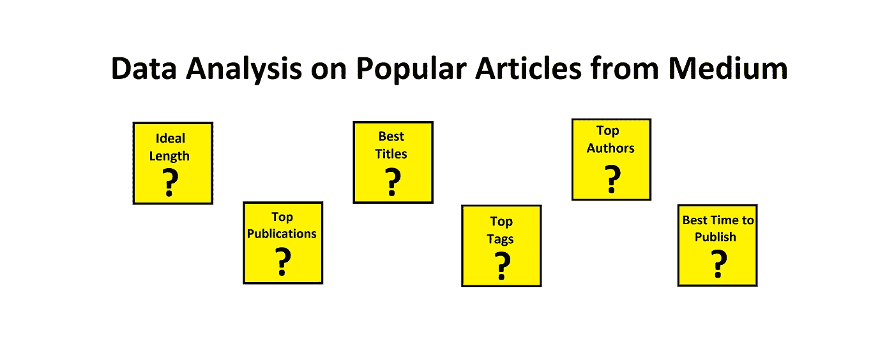
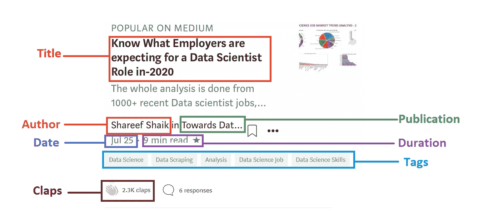
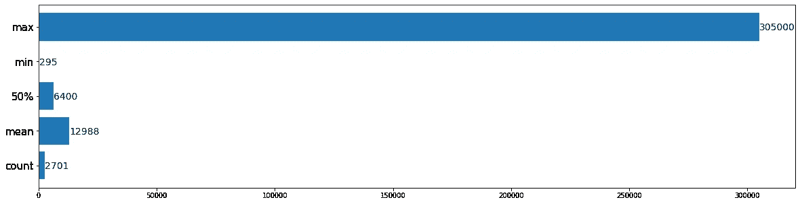
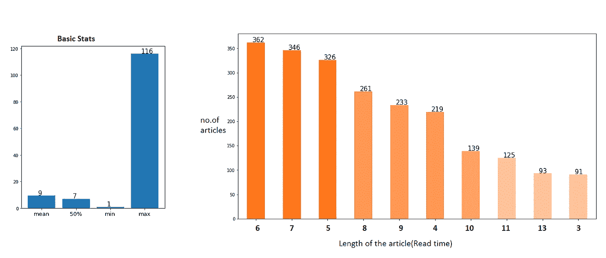
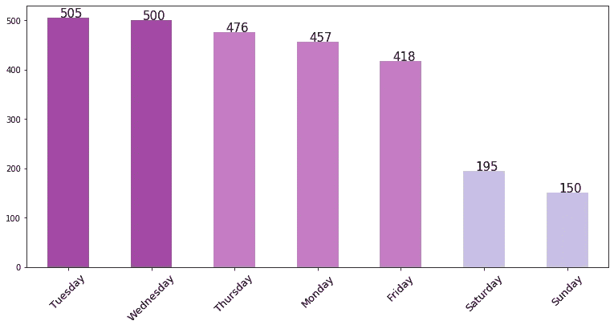
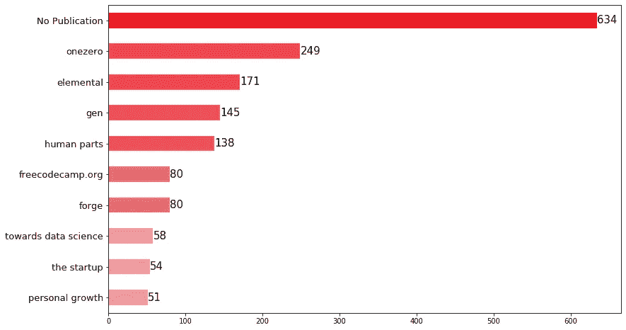
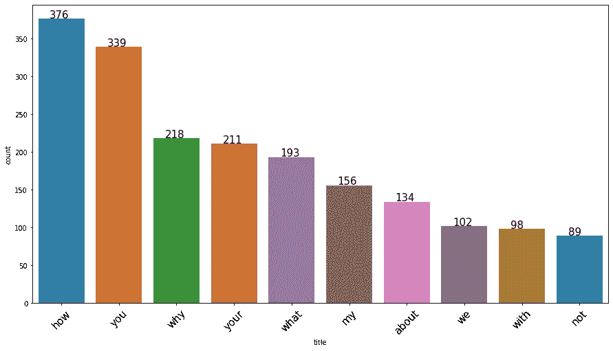
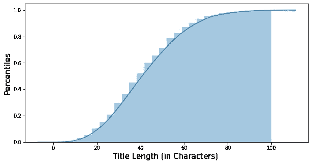
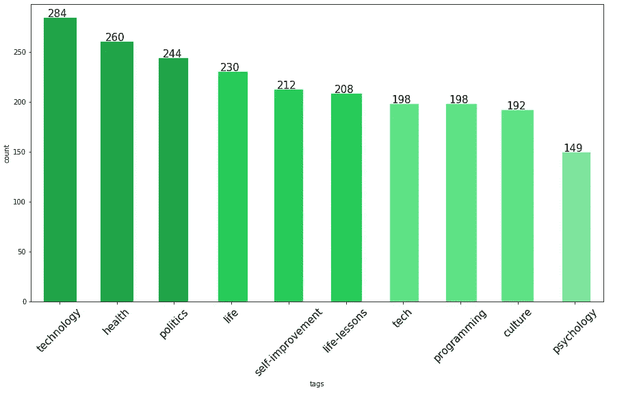

# 2500+热门文章的史料教给我们什么？

> 原文：<https://pub.towardsai.net/what-does-2500-popular-articles-historical-data-teach-us-bbc872c2e9b8?source=collection_archive---------3----------------------->

## [数据分析](https://towardsai.net/p/category/data-analysis)

## 利用 python 对媒体热门文章进行数据分析。

来源:作者

## 后退:

答几天前，当我写完第二篇关于媒介的文章时，我把它交给了朋友们审阅。其中一个马上告诉我，这个标题很有俘虏感，可以吸引读者，我没有把他的话当回事，以为他只是在鼓励我。我终于在一个周六下午发表了它。当天点击量达到了 70 次。

第二天早上，当我醒来检查我是否比我的第一个博客做得更好时，我的博客达到了 120 次浏览。我有点失望，不是因为它的观点，而是它没有得到应有的关注。我不再检查它，沉迷于我的其他作品。那天晚些时候，当我偷看了一眼，我惊呆了，这篇文章已经获得了超过 10K 50%的阅读量。我的第一篇文章在 20 天内只赚了 1k，而这篇文章已经达到了这个数字的十倍以上。

那天睡觉前，我最后一次检查了一下，它已经达到了 25K。我可以在媒体的主页上看到我的博客，它开始流行起来。那天我已经飘飘然，无法入睡。虽然对于一些人来说，这听起来不像是一个伟大的成就，但对于像我这样刚开始写作的人来说，这肯定是一个伟大的里程碑。第二天，它又设法增加了 37k，总数达到 62K。我的 LinkedIn 个人资料被无数赞赏我工作的人的信息淹没了。他们中的一些人甚至给我提供了一些自由职业的机会。这一切感觉就像一场梦，我无法相信刚刚发生的一切。这一切都发生在一瞬间。

几天后，当我恢复理智时，我开始分析这一切的原因。虽然我用同样的努力写了两篇博客，但还是有几分钟的不同，发表的内容不同，阅读时间也比我之前的少了一点。当然，主要的区别可能是我的第二篇文章是由媒体策划的。我们永远不知道我们的博客是否会被策划。有这样的例子，没有监管的博客也成功地变得流行，有监管的博客也失败了。

这时我想起了我朋友的话，也许他是对的。如果你的标题听起来不有趣，不管你写得有多好，你的博客都有可能不被人注意。不管你的文章有多好，如果没有人打开它，他们永远不会看。这并不意味着你只需要专注于标题，只是一个好的标题可以抓住你的读者的注意力，你肯定需要高质量的内容来让你的读者进一步阅读。

> 这让我意识到，抛开主要内容，还有许多其他微小的因素可能会在很大程度上影响文章，而这些因素往往被初学者所忽视。今天我们将试着关注这一领域。

当我们不知道某件事的时候，我们可以向该领域的专家寻求帮助，或者我们也可以通过自己的努力来学习。还有一个选项是我最喜欢的，那就是检查是否有现成的开源数据。如果是的话，我们要做的就是:刮擦它，清理它，直观地理解它，并从中学习。我在这里应用了同样的方法，用 python 从 Medium 上收集了大约 2700 多篇流行文章。

> **免责声明:**该刮擦仅用于教育目的，不用于任何商业用途。

在这篇文章中，我们将试图找到每个作家都会想到的几个重要问题的答案。

*   **你的博客应该有多长？什么是理想的阅读时间？**
*   **发表文章的日子有什么影响吗？**
*   通过出版物发布有帮助吗？
*   怎样才算一个好标题？
*   **“顶级作者”值得关注吗？**
*   **“热门标签”将用于文章？**

> 这篇文章的全部目的是从大众博客中找出见解，看看我们今天是否能学到新的东西，也许能帮助我们写得更好。

> ***注意*** :我没有在本文中包含任何代码，以便让非技术读者更容易阅读。如果你对代码感兴趣，你可以在结论部分找到链接。

# 分析:

## 0.在深入研究之前，让我们先了解一下我们的数据。

为此，我从媒体上刮了一些文章。对于每篇文章，我提取了 7 个元素:**标题、作者、出版、日期、阅读时间、掌声**和**标签。**

样本文章

1.  我们总共有 **2701 篇独特的文章**作为我们的数据。
2.  我们的数据中有 1597 个独立作者。
3.  总共有 **334 种独特的出版物**是我们数据的一部分。

## 让我们来详细了解一下拍手:

这些文章被认为是受欢迎的媒体，因为许多指标。一个重要的指标是**鼓掌。**

鼓掌统计

1.  我们总数据的平均掌声是 **12988** ，平均掌声是 **6400，**这仍然是一个相对较大的数字，这就清楚了为什么这些被标记为流行。
2.  根据我们的数据，单篇文章的最低**点击数**为 **295** ，而最高**点击数**约为 **305，000** 点击数。

## 1.文章的理想长度？

媒体通常用**阅读时间**测量一篇文章的**长度**。我们大多数人肯定会有这种不确定性，不知道是保持文章简短还是详细阐述。关于这个参数一直有争论，很少有人认为它应该简洁，而其他人则认为文章应该详细。让我们看看数据告诉我们什么。

读取时间(分钟)

1.  我们总共有 2701 个博客，其中 **1 分钟**最少 **116 分钟**最长。当然，这些都是离群值。
2.  **平均值**读取时间为 **8 分钟**，而**中值**为 **7 分钟**。从第二张图中，我们可以观察到大多数文章都在**10**分钟以下。这清楚地表明，理想的读取时间约为**4–10 分钟。**
3.  有时，一篇小文章可能无法证明某些主题。在这种情况下，我们可以通过删除不必要的描述来精简我们的文章，或者我们可以将文章作为一个系列来发表。

## 2.发布博客的理想时间是什么时候？

我有一个错误的想法，认为一篇文章如果在周末发表会有很大的影响力。这就是我前两篇博客在周末发表的原因。

出版日

1.  令人惊讶的是，大多数流行的博客都是在工作日发表的。**周二**最多，**周日**最少。
2.  周末****显著下降**，这是有道理的，因为大多数人会在周末放松并享受生活。**

## **3.发表有效果吗？**

****

**出版物**

1.  **我们全部数据中大约有 634 (23%) 没有通过任何出版物发布。这清楚地表明，没有任何出版物，你仍然可以成功，但这里的问题是，这种情况主要出现在已经拥有大量追随者的顶级作家中。**
2.  **如果你是一个刚刚开始在媒体上写作的人，最好的选择是通过出版物发表。这并不意味着出版物中发表的每篇文章都会成功，这只是一个额外的优势，即该出版物的追随者可能会查看您的工作。**
3.  **从上面的情节中，我们可以看到大多数出版物都是 Medium 自己的出版物。如果你设法通过他们出版，你肯定会有更好的影响力，但是让我告诉你，质量标准是相当高的。**
4.  **每个类别都有出版物，如果你想发布你的技术博客，那么最好的是 **OneZero** 和 **freeCodeCamp** 。如果你对出版任何与机器学习、人工智能/数据科学相关的东西感兴趣，那么**走向数据科学**是最好的。**
5.  **作为初学者，在这些顶级出版物中发表文章可能会很困难。你甚至可能不得不在一开始就面对这些出版物的拒绝。即使遵循了所有的指导方针，我个人的第一篇文章还是被一家顶级出版物拒绝了。我从未知道我被拒的原因。另外两家顶级出版商从未恢复，这些也可以被视为拒绝。**

> **被拒绝是过程的一部分，我的朋友。拥抱它！:)**

**我们可以随时联系其他可能认可我们工作的出版物，我们只需要找到他们。随着时间的推移，我们可以更好地写作，也可以在任何顶级出版物上发表文章。只是，第一个总是很难。**

## **4.标题:**

**有两种人，一种人打开一篇文章是因为他们觉得它与他们相关，而另一种人打开一篇文章只是因为标题听起来有趣。问问你自己，你读过多少次相关/不相关领域的文章，只是因为它的标题很好奇，你想看看里面有什么。不幸的是，这就是人类心理学的工作方式。如果你认为我建议使用点击诱饵标题，那么你还没有理解我的观点。**

## **4.1.标题中最常用的词。**

**标题是内容之后最重要的因素，因为不管你的内容有多好，如果他们不看，他们永远不会知道。标题是非常重要的，因为它们可以决定文章的成败。我怎么强调都不为过，一个好标题有多重要。让我们来看看流行博客的标题中使用频率最高的词是什么。**

****

**标题关键词**

1.  **我们可以观察到热门标题中的置顶词多是类似 **Why 这样的疑问语气。，什么？，怎么会？**。这是有道理的，因为如果读者心中有类似的问题，他们很可能会阅读它。这些类型的标题在搜索引擎优化(SEO)中也很有用。**
2.  **我们可以观察到，在大多数的标题中，他们用 **you** 和 **your** 来称呼读者。**
3.  **想法应该是**在标题**中提出一个有趣的问题，并尝试**通过你的文章来回答。****

## **4.2.标题的长度应该是？**

**标题的长度也很重要。你的标题**不应该太大**，因为它不能完全被读者看到，或者它**不应该太短**从而使它看起来模糊不清。**

****

**标题长度**

**标题的理想长度大约是 40–60 个字符。据观察，我们数据中 90%的标题在 65 个字符以下。**

## **5.最佳标签:**

****

**标签**

1.  **标签在某种程度上只是主题。人们通常会关注这些话题并阅读文章。所以用正确的标签提及你的文章也是一个重要的因素，可以影响文章的范围。**
2.  **从剧情中我们可以看到，排名前 5 的标签分别是**科技、健康、政治、生活、自强**。下次，当你写一些与这些标签相关的东西时，请随意使用它们。**

## **6.顶级作者:**

****

**作者**

1.  **根据我们的数据，我们可以看到[克里斯盖奇](https://medium.com/u/67d9cdce33af?source=post_page-----bbc872c2e9b8--------------------------------)名列榜首。实际上，这个列表可能不准确，因为即使我们的数据有一点点变化，结果也可能改变。**
2.  **找出顶级作者的原因是因为写作应该更多的是关于阅读。我们读得越多，我们写得也越好。如果我们更多地阅读写作更好的人的作品，我们可能会学到一些有助于我们写得更好的东西。尤其是在文章应该如何呈现给读者方面。**
3.  **如果我们能关注我们感兴趣领域的作者，那是最好的。这样我们就能欣赏或掌握文章，同时也能了解作者是如何呈现文章的。我们可以在写作时应用这些知识，直到创造出我们自己的写作风格。**

# **结论:**

**这篇文章中遗漏的另外两个主要内容是**图像**和**字幕**。对于图像，我们可以创建自己的图像，或者从 Unsplash、Pixabay 等免费资源中选择一个好的相关图像。对于字幕，我们可以提供更多的实际主题介绍。**

**如果我遵循所有这些建议，我的博客会受欢迎吗？**

**我们永远不知道。也许这篇自己的文章可能会惨败，但事实就是如此。这总是一种让我们成长得更好的试错方法。本文就是在这样一种尝试中写成的。归根结底，作为一名作家，最重要的是你能多自由地表达自己的想法，以及你的作品是否给读者增加了价值。所以，下次你写文章的时候，提醒自己这些事情，尝试一次。**

> **谁知道如果一切顺利，运气对你有利，我可能会看到你的帖子出现在热门页面上。继续写，继续分享知识！**

> **你可以在我的 [**GitHub**](https://github.com/Shareef-shaik/Medium-Popular-Articles-Analysis) 上找到这个分析的完整代码。你可以在我的 [**Linkedin**](https://www.linkedin.com/in/shareef-shaik-22738310b/) 上和我联系。**

****有趣的问题:当你在媒体上阅读时，在选择/打开一篇文章之前，你会检查什么，请在评论中告诉我**:)**

**回头见！编码快乐！！**

# **参考资料:**

1.  **[www.Medium.com/popular](http://www.Medium.com/popular)**
2.  **[https://towards data science . com/know-what-employees-expected-for-a-data-scientist-role-in-2020-65ad 68553 C4](https://towardsdatascience.com/know-what-employers-are-expecting-for-a-data-scientist-role-in-2020-65ad68553cc4)**