# 什么进入一个真正的从摇篮到坟墓的商业转换平台？

> 原文：<https://pub.towardsai.net/what-goes-into-a-bona-fide-cradle-to-grave-business-transformation-platform-96655ed510d7?source=collection_archive---------0----------------------->

## [技术](https://towardsai.net/p/category/technology)

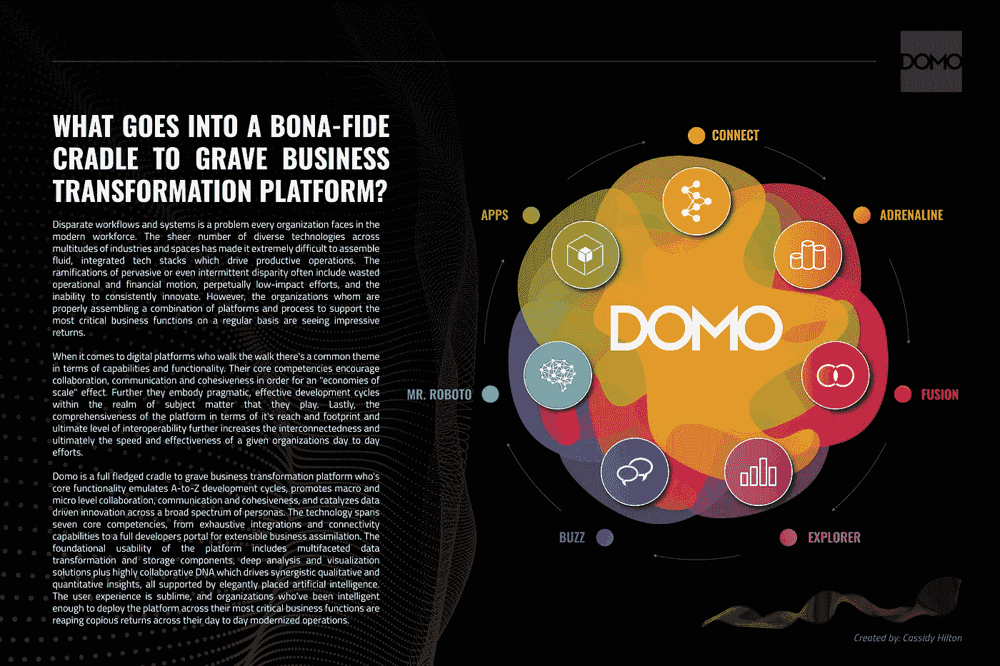

## 序

多年来，我对世界级的 SaaS 技术产生了深深的欣赏和热情。当有效地利用强调业务影响、可用性和明确的、绝对原始的效用时，正确制定的平台通常是业务平庸和大规模发展的区别。撇开营销和行业炒作不谈，这项技术是否有能力影响全面、决定性的变革？它会在特定组织不断发展的数字化和现代化追求中发挥切实的作用吗？

是的，为任何数字化转型项目制定的总体战略对任何技术都至关重要，这只是上述战略的一个组成部分，但作为总体现代化战略的一个关键组成部分，技术的全面性和可扩展性非常重要。为什么？…递增的互操作性。或者换句话说，一个集体组织在使用技术时能够以统一和一致的方式运作的程度将最终决定其整体影响。特别是对于从业者和受影响的日常用户，他们要求流程的流畅性、任务的实用性以及日常使用的信息的准确性/一致性。

更大的图景可以归结为三个核心问题，因为它与利用一个全面的、流动的平台的重要性有关:当今市场上大量的应用程序浪费了时间和资源。第二，由于开发全面的数据/数字环境的永久“循环”,阻碍了数字成熟度，这种环境允许进行全面的分析。最后，由不同系统、脱节的工作流和维护繁重的运营所驱动的低影响力日常计划导致创新不足。

## 应用程序过载

正如下面 chiefmartec.com 发布的信息图所示，每项微观任务可用的应用程序数量都创下了历史新高。根据 martech.com 的数据，自去年以来，营销技术平台的数量增长了 13.6%，总计达到 8000 个平台(应用程序)。因此，任何有更多移动部件的环境都会变得更加复杂、混乱和昂贵。就复杂性而言，将多个系统或应用程序拼凑在一起几乎是不可能的。无法有效创建灵活的解决方案工作流会导致信息受限、流程孤立和信息完整性有限。此外，部署和维护多个不同的应用程序是非常昂贵的。x 个应用程序需要 Y 个集成、维护计划、升级和个性化资源来维护。

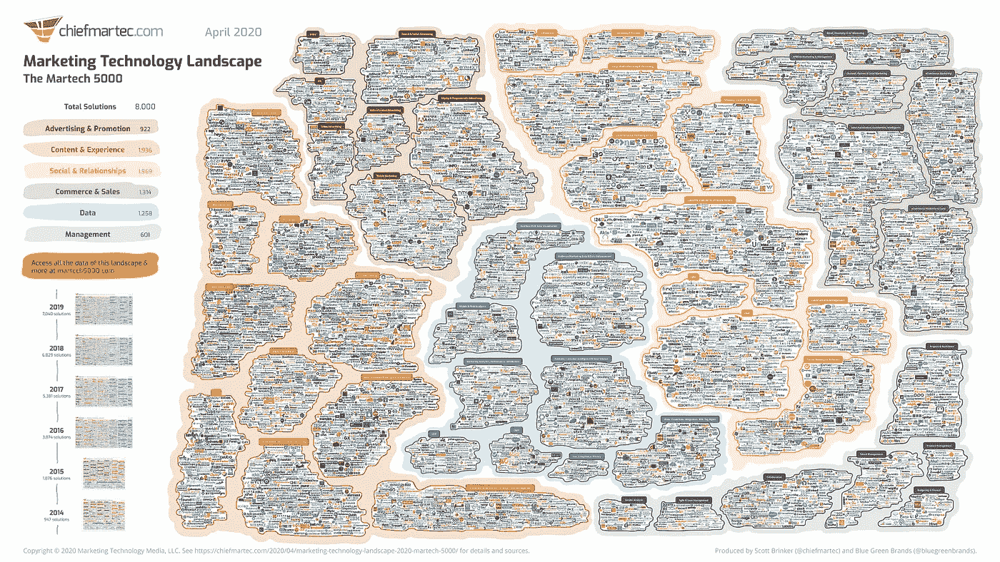

*[*9*](https://chiefmartec.com/2020/04/marketing-technology-landscape-2020-martech-5000/)*

## **有限的数字成熟度**

**不同的系统和数据环境通常会导致负面的连锁反应。还记得上面的“更多移动部件，更复杂”的评论吗？这一点很重要，因为它关系到员工日复一日以最佳方式出色完成工作的能力。当组织中存在数据差异时，多个员工和部门会重复提取相同的信息并执行相同的日常准备任务，这最终会限制他们以集体方式执行更有意义的工作的能力。Informatica 说得好；“减少重复工作的关键是找到一种方法，在下一个数据集上轻松重用您的逻辑，而不是每次都从头开始。”[ [3](https://www.aunalytics.com/4-ways-disparate-data-sets-are-holding-you-back/) ]**

> **“减少重复工作的关键是找到一种方法，在下一个数据集上轻松重用您的逻辑，而不是每次都从头开始。”信息**

**我将上述内容称为“数字规模经济”。请注意之前的一篇[文章](https://www.linkedin.com/pulse/incidental-science-organizational-growth-via-digital-cassidy-hilton/)，我曾详细讨论过这个话题。本质上，利用过去的工作来提高未来工作的质量和速度。此外，这种斗争是真实的，因为它关系到任何企业获取他们在整个组织中拥有的所有信息的能力。根据 Informatica 的数据，80%的分析计划都专注于简单地收集信息，以便为分析建立一个完整的画面[ [1](https://blogs.informatica.com/2020/07/16/3-rewarding-ways-finance-can-use-data-to-drive-success/) ]。然而，问题是，当信息被分散地分布在各个部门和子单元时，将它们整合在一起所需的努力是巨大的。加倍努力应对这一挑战，每天每分钟都会有新的、更相关的信息出现。[“数据从不睡觉”](https://www.domo.com/learn/data-never-sleeps-8)系列在阐述这一点上做了大量工作。建立一个不断变化的环境，以便定期、持续地执行完整、及时的分析，这是所有组织都在不断应对的一项长期挑战，而不同的系统只会加剧这一问题。**

**最后，基于糟糕或有限的数据做出不准确决策的风险是组织每天都面临的风险。事实是，即使保存最好的应用程序环境也仍然存在数据完整性风险，这只是以各种方式收集的结构化表格数据的本质。不幸的是，根据 Gartner 的数据质量市场调查[[2](https://www.gartner.com/smarterwithgartner/how-to-stop-data-quality-undermining-your-business/)]，2017 年，由于数据不足而做出的错误决策平均给企业造成了 1500 万美元的损失。如上所述，数据不足是由于整个组织的不同系统和流程造成的，并且在维护脱节的基础架构的长期努力方面具有复合效应。**

## **缺乏创新**

**上述平凡的、低影响力的日常工作的“停滞不前”效应的直接结果是，一个组织无法专注于更有意义的、创新的追求。本质上，由于不同的工作流和应用程序，开发全面的数据基础的长期努力阻碍了组织提升其日常工作质量的能力。**

> **66%的 IT 预算用于执行当前的现状任务，而不是专注于数字的创新。-2018 年 IDG 经济展望调查**

**根据 2018 年 IDG 经济展望调查，66%的 IT 预算被分配用于执行当前的现状任务，而不是专注于数字的创新。【 [4](https://www.idg.com/tools-for-marketers/2018-cio-tech-poll-economic-outlook/) 】系统和应用程序的差异并没有利用深度数据分析来开发日益优化的工作流程和更具创新性的宏观和微观方案，而是促进了低效、脱节的流程和低影响力、维护繁重的运营。**

**有许多利基参与者，其中一些非常有效，并在特定的能力和环境下取得了巨大的成功。然而，通过“数字规模经济”促进运营流动性并允许日常工作创新的现代技术很难获得，但实际上，这些技术改变了使用它们的组织的竞争格局。为此，SaaS 1%的人在企业空间中占有一席之地，是组织日常运营的基础和结构的重要组成部分，值得肯定。一个特别的:Domo。**

## **平台概述**

**你可能听说过也可能没有听说过这个平台。然而，更重要的是，你可能不知道这项技术的全面性。Domo 不仅仅是一个 BI 工具，它还是一个“从摇篮到坟墓”的业务转换平台。Domo 是从零开始构建的，旨在为当今大多数现代公司的数字化转型愿望提供解决方案。该平台起源于云中，以支持企业级需求和规模。此外，技术的流动性和综合性允许在多方面的产品功能中快速开发数字解决方案。**

**是的，Domo 与 Tableau、Qlik、Looker 等竞争激烈，但也与所有主要的 ETL 提供商针锋相对，流畅地融入所有主要云提供商(AWS、GCP、Azure)的工作流，并促进物联网、定制应用程序、预测分析以及原生人工智能和数据分析的可扩展性。此外，用户体验从 A 到 Z 都是完全流畅的，并促进了整个产品套件的自然、有机协作，作为平台用户体验的核心组件。*能说企业级互操作吗？***

**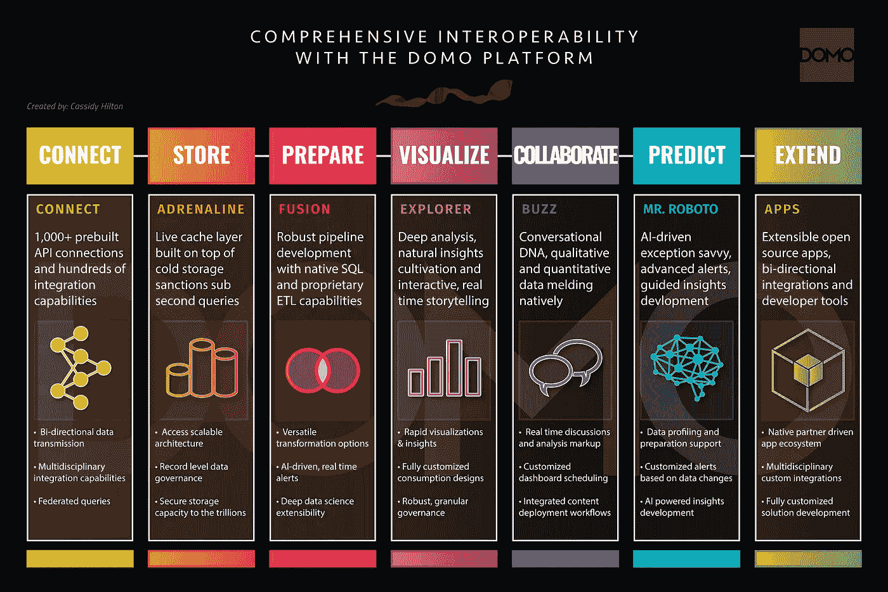**

**该平台整体上涵盖了七项核心能力，这些能力在公司的生命周期中不断发展，但其最真实的形式却保持不变。我在这里得到的是，伟大的 Josh James 对端到端企业级 SaaS 分析平台的愿景比大多数阅读本文的人在行业中的时间还要长，更不用说理解大约 2010 年的愿景了。**

**当我谈到流动性和全面性时，我不是指“成为每个人的一切”，我是指将平台的核心功能与现代组织的典型工作流或宏观和微观层面的数字化转型和现代化方法相结合。这并不容易做到，Domo 比地球上任何其他平台都做得好。**

## **连接**

**在这个领域，任何称职的人都知道产出不会奇迹般地出现。我所说的输出是指洞察力、视觉效果、预测、应用等。虽然输出是荣耀所在，但获得任何和所有数据源的访问权以获得智能输出，从而允许完整的故事和对给定主题的全面理解是至关重要的。这就是 Domo 真正领先于其他公司的地方。他们认为，无论数据位于何处，都可以通过数百个全面的即插即用连接器轻松引入数据，无论是在云中、内部还是通过其令人印象深刻的连接器库存储在文件中。由于他们对强大的数字工作流的必要上游要求的远见，影响大规模实际变化的输出仅仅是用户开发体验的自然结果。**

**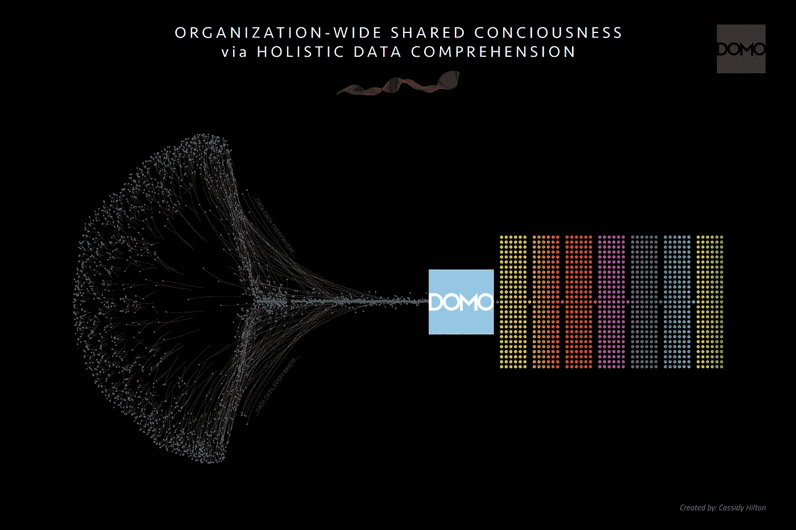**

**Domo 允许实现任何和所有的集成策略。这完全取决于什么对组织最有利。在高层次上，1000 多个预构建 API 集成的连接器库允许快速输入凭证(在大多数情况下)和将核心系统数据复制到 Domo 的云中。此外，它们的联邦集成能力允许通过 Athena、Redshift、Azure、PostgreSQL 等源系统直接呈现可视化。适用于希望保持对其数据及其所在位置的完全管辖权的组织。他们最近甚至针对云原生联邦数据仓库进行了优化开发，从雪花开始。此外，“工作台”应用程序允许通过基本的本地配置进行内部集成，以实现安全的数据传输。有了前面提到的用于开发跨多个数据源的全面、可靠集成的所有方法，利用 Domo 可以轻松实现一个全面的信息(数据)环境，该环境有助于描述全面故事和持续创新任务的分析。**

## **商店**

**除了广泛的开箱即用集成功能外，Adrenaline、Domo 的智能数据仓库也是该平台的重要组成部分，是真正的秘方。肾上腺素是推动企业级计算能力和作为交互式用户体验一部分的*文字*亚秒查询性能的引擎。Adrenaline 轻松处理由数十亿条记录支持的解决方案。你们中那些曾经损坏过 jupyter 笔记本电脑或者拥有即将起飞的机器试图处理巨大的本地平面文件的人知道，当你只是为了做你的事情而试图访问数据时，一个流畅的、高性能的开发环境是多么宝贵。**

**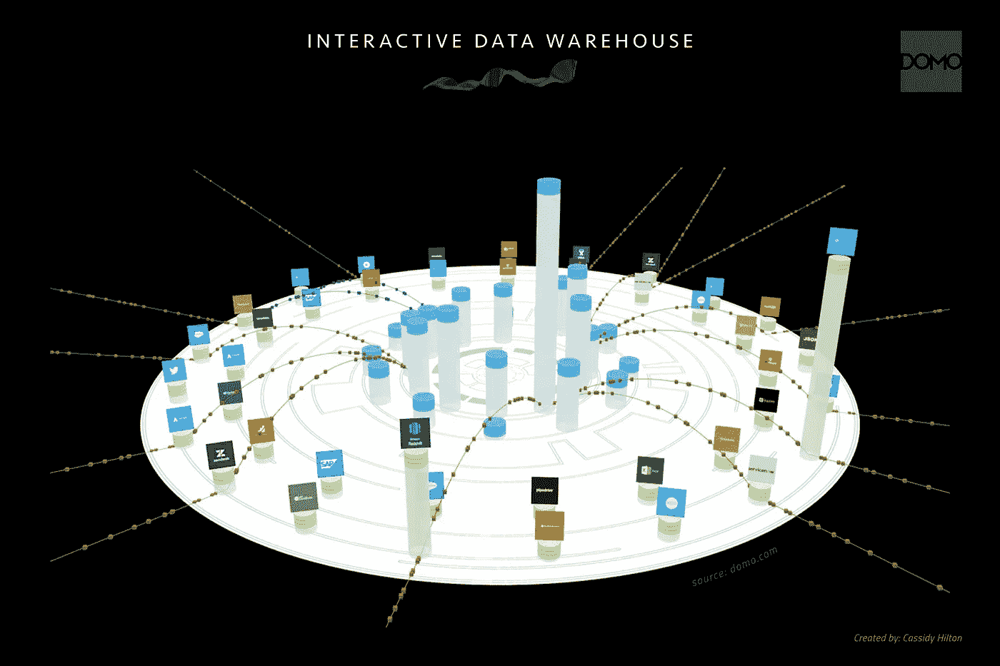**

**这里的一个关键功能是平台的双向连接/存储功能，特别是集成。最成熟的数字化组织是那些通过递归数据循环来监控结果和决策、维护数据补救和转换步骤、记录反馈以及测量长期影响的组织。他们的回写技术的双向功能有助于在任何需要的地方实现数据循环。Domo 的数据存储和可访问性能力的底线是这样的；他们将与所有主要的集成提供商正面交锋，并证明他们比你想象的更优秀。**

## **准备**

**与宣传中的流行观点相反，特别是那些渴望将人工智能作为其数字化转型战略的一部分的人(稍后将详细介绍)，数据准备是分析师、工程师和科学家花费大部分时间的地方。更重要的是，这一步骤通常是在一个竖井中执行的(提示电子表格、jupyter 笔记本、视图和一次性工具)，受影响的用户几乎看不到，并且最终几乎不可能重复这一宝贵的工作。我一直困惑于数据准备，即使我们在 2020 年坐在这里，仍然是一次又一次“从头开始”的努力。**

**根据 Anaconda 的年度调查，数据科学家大约有 45%的时间花在数据准备任务上，包括加载和清理数据。更进一步，他们额外 19%的时间花在加载数据上(ETL 中的“L”)。**

**想象一下这样一个世界:围绕一个给定数据集或多个数据集的准备步骤被保存、注释，并提供给更广泛的组织，以实现现实世界中的“规模经济”效应。它在 Domo *本地*发生。**

> **“数据科学家将大约 45%的时间用于数据准备，另外 19%的时间用于加载数据。”巨蟒[ [5](https://www.datanami.com/2020/07/06/data-prep-still-dominates-data-scientists-time-survey-finds/#:~:text=Data%20scientists%20spend%20about%2045,data%20scientists%20conducted%20by%20Anaconda.&text=In%20some%20surveys%20in%20the,of%20a%20data%20scientist's%20time.)**

**Fusion 是 Domo 的数据准备和转换引擎，它促进了一致的、多方面的数据环境，由集成到 Domo 中的大量源提供支持，以便在一个通用工作流中进行分析、描述、清理、丰富、融合和准备使用，无需任何外部提供商、技术或服务。**

**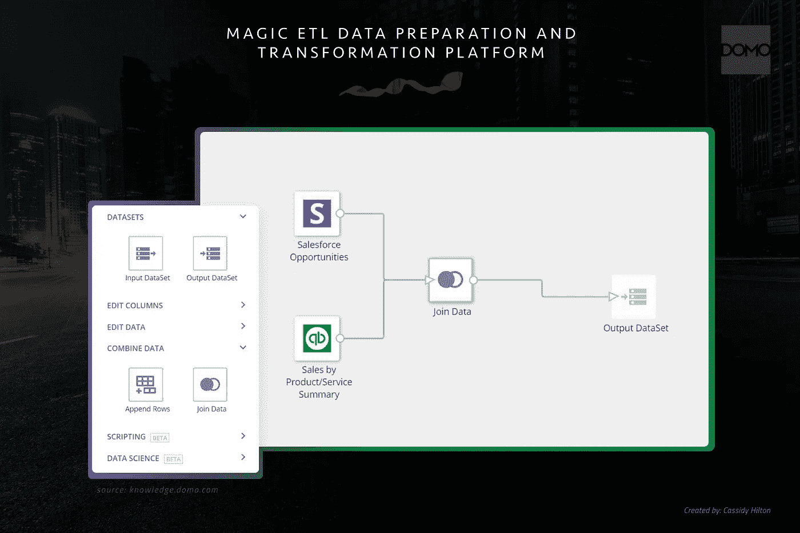**

**Domo 的神奇 ETL 使所有用户能够从任何地方清理和组合数据，而不需要编码。此外，如果选择 SQL 作为代码，更高级的开发人员可以利用原生 MySQL 甚至 Redshift。此外，还有本机 Python 和 R 功能。这一点怎么强调都不为过..所有这些模块共存于一个通用的基于云的环境中，在一个高度协作和透明的环境中，其他用户可以使用和访问这些模块。**

## **设想**

**Domo 的可视化引擎是由他们的 Explorer 技术驱动的。这是一项同类最佳的分析功能，不仅包括高度直观、华丽的可视化开发。近年来，Domo 增加了引导式讲故事、数据探索和剖析，这些都是移动友好的，自 Domo 成立以来一直如此。再加上肾上腺素带来的高性能计算能力，从开发者和消费者的角度来看，可视化体验都是无缝的、实用的，坦率地说，在许多方面都是卓越的。**

**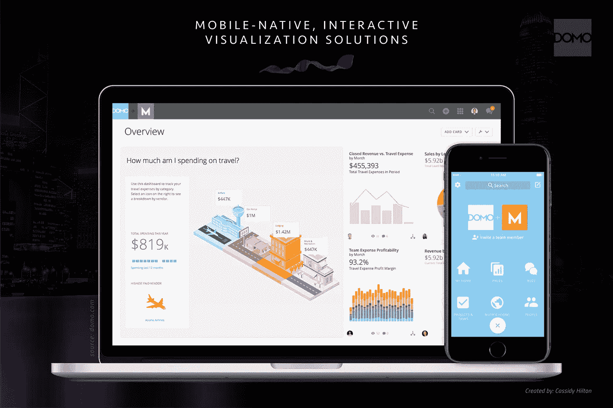**

## **合作**

**Buzz 是 Domo 的协作引擎，从第一天起就是平台的关键组成部分。Buzz 允许在单个可视化和跨集合仪表板上进行协作。更重要的是，Buzz 允许对可视化中的特定数据点进行注释和标记，这有助于提高参与度，还强调了对数据的深刻、基本理解，同时融合了定量和定性见解。**

**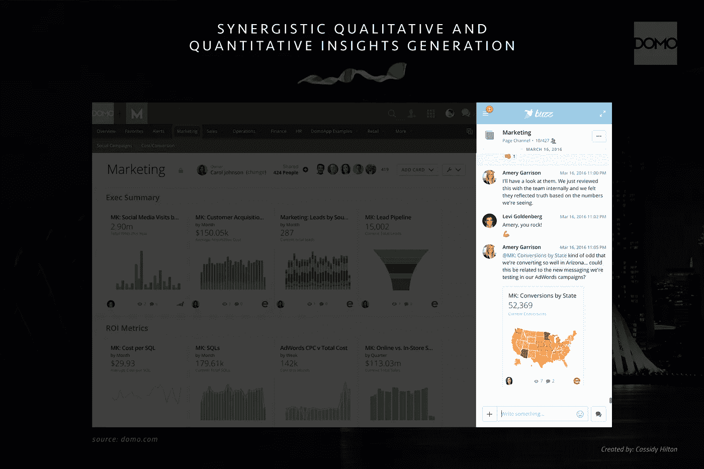**

**有没有经历过这样一个项目，你深陷其中，不知道为什么你会看到特定的行为或趋势，或者可能只是需要澄清字段名，并希望你可以简单地“@”你已经在其中运营的环境中的 SME？是的，你和数百万其他开发者。同样，Domo 不仅支持这种场景，甚至对于新手用户来说，它也很容易开发肌肉记忆。**

## ****预测****

**数字工作流程的预测阶段由 Domo 的机器人先生提供支持。Roboto 先生是该平台的人工智能驱动的智能层，它反复分析输入的数据，以检测趋势、偏差、异常、相关性，并优化查询。Roboto 先生不仅提供人工智能驱动的见解生成，而且还通过对商业智能环境的全面、宏观理解来驱动优化的业务工作流程。通过异常和相关性检测、用户消费模式和重复焦点等功能的组合，Roboto 先生智能地培养洞察力和异常，以便优化业务功能，并智能地预测可能的业务绩效缺点。**

**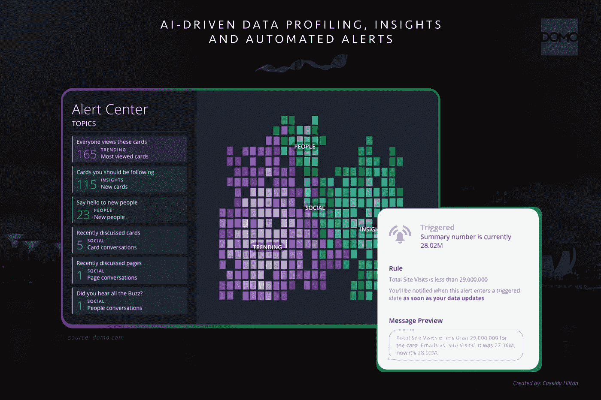**

**此外，基于数据趋势或行为变化的自动化警报，以及前面提到的人工智能驱动的见解(可以基于一些预定义的因素进行设置)，可以实现真正可实现的“数据驱动的企业”，正如他们所说的那样(没有宣传和过度承诺)。**

**房间里的人工智能从业者可能会在这一点上挠头，因为上面的人工智能驱动的分析和分析，虽然真实而令人印象深刻，但可能不是你所期望的这一部分的主题，标题是“预测”。不要担心我的书呆子伙伴(放松书呆子的描述，你在一个好公司)，Domo 也有本机机器学习能力。该功能是 magic ETL 模块中产品数据准备工作流的自然扩展。机器学习能力包括分类、聚类、预测、多元异常值、异常值检测和回归。在一系列流畅的步骤中，从几乎任何可以想象的地方获取原始数据，训练模型，对未来或未知的记录进行预测，并以企业级的生产方式部署这些输出，这种易用性是一件美好的事情。然而，需要注意的是，今天很少有组织在人工智能方面取得成功。根据 Statistica [ [6](https://www.statista.com/chart/17966/worldwide-artificial-intelligence-funding/) ]的数据，2019 年，各组织在机器学习系统开发上投资了 285 亿美元。然而，根据 IDC 的调查，只有 35%的组织报告成功地将分析模型部署到生产中[ [7](https://medium.com/r?url=https%3A%2F%2Fwww.mesaonline.org%2F2019%2F09%2F27%2Fidc-ai-can-significantly-help-organizations-with-analytics-business-intelligence%2F) ]。**

> **只有 35%的组织报告成功地将分析模型部署到生产中。-IDC**

**大多数情况下，ML 工作只是简单的科学项目，因为它们是由小团队或个人执行的，并且通常是在数据科学家和软件/技术团队之间有许多分离的地方完成的。后者是在大多数组织中成功地将模型部署到产品中所需要的。不同的流程和平台继续阻碍各地人工智能驱动的企业的抱负。**

> **“没有机器学习模型是有价值的，除非它被部署到生产中。”——路易吉·帕楚诺[ [8](https://mlinproduction.com/deploying-machine-learning-models/)**

**那么，怎样做才是正确的呢？我们对成功地将分析模型部署到生产中的 35%的组织了解多少？我在这里会很简短，因为我正在就这个主题写一篇单独的文章，我将在稍后发表，但为了让机器学习模型为组织提供最大的影响和价值，预测需要部署到组织的本地流程和工作流中。个人最不需要的就是被要求遵循日常生活之外的节奏或流程。**

**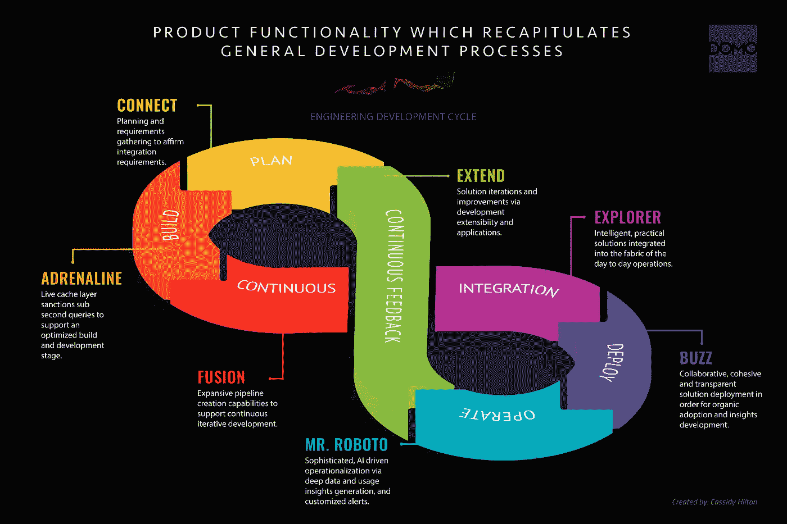**

**为了成功地实现这一点，开发人员从头到尾概括典型的软件工程开发和部署周期的程度是关键。还记得我们在连接/存储小节中讨论的集成的双向功能吗？该功能经常被忽略，但在部署模型时却至关重要。为什么？将预测写回到员工用来驱动其日常行动的源系统的能力允许将预测自然地吸收到他们预先存在的工作流中。更重要的是，从工程的角度来看，双向功能已经存在于 Domo 中，只需要工程团队付出最少的努力，这是一件大事，问问他们就知道了。**

**如上所述，即将发布的数据科学深度文章将概述 Domo 支持的不同类型的机器学习方法及其背后的技术。从这篇文章中重要的是，Domo 拥有完整的人工智能/机器学习能力，内置于平台中，作为典型分析工作流的自然组成部分。无论是人工智能驱动的数据分析和持续分析，还是现有分析解决方案的附加 ML，Domo 都以非常流畅的方式涵盖了它。**

## **扩展**

**Domo 的应用商店是典型的软件或机器学习工程师的游乐场。开发人员门户是许多组织和合作伙伴花费大部分时间来进一步开发更紧密、更协同的解决方案可用性、集成和跨各自业务的相互关系的地方。从高层次来看，app store 由 API、合作伙伴和客户开发的应用、仪表盘、连接器、算法和高级解决方案组成。有许多令人印象深刻的应用程序是通过 Domo 的 SDK 和 Design Studio 开发的。**

**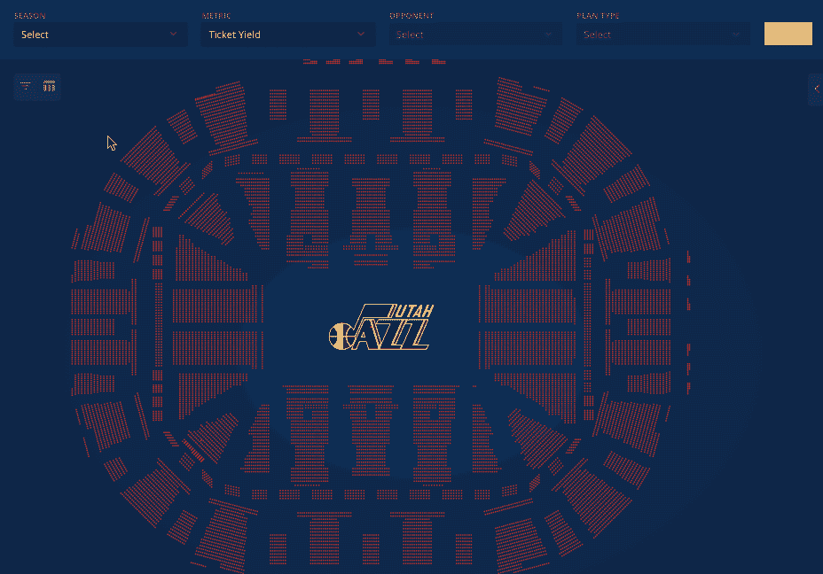**

***来源:*【https://www.domo.com/platform/build】T2**

**如果 Domo 不具备所需的原生功能(无论是自动化数据管道的 API 集成、通过 SDK 将数据呈现到移动应用程序中，还是完全定制的仪表板解决方案),那么开发人员门户是一个全面的扩展，是一个全面彻底的平台的最终完善。**

## **结果**

**2020 年，SaaS 分析提供商的数量创下历史新高。为典型分析工作流程的特定组件提供服务的提供商数量也达到了历史最高水平(例如 API 连接、ETL、可视化、AI 等)。).如此多的技术的结果通常包括不同的流程、工作流和系统或平台，以及浪费或误导的日常工作。为了优化日常流程、全面的数据管道和互联的组织沟通实践，将适当的技术和商业策略融合在一起几乎是不可能的。**

**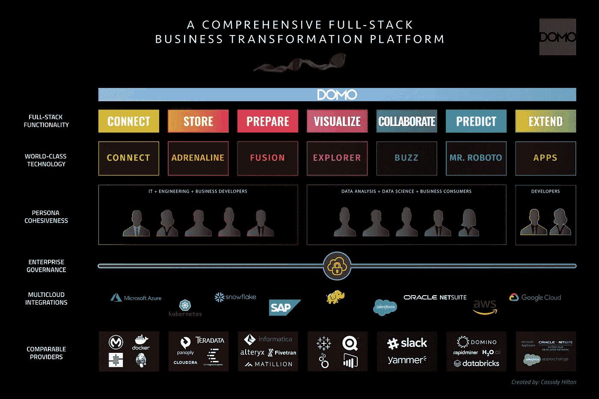**

**然而，其核心功能直接与典型的端到端数字(分析)工作流保持一致的平台，是推动整个组织不断增加的货币化影响的平台。原因是工作流在很大程度上保持不受干扰，在许多情况下，由于平台的核心功能，工作流会以更优化的方式自然地重定向。浪费精力的一个很好的例子是数据准备。你有多经常看到相同的准备步骤在不同的项目中反复执行？还是举报？你有多经常看到一位高管要求他/她自己的一次性报告，因为现有的仪表板已经过时，或者有一个后续问题，通常以几乎完全重复你已经做过的事情而告终？允许以一种简单明了的方式“从我们停下的地方开始”的平台是未来的平台，因为它涉及到下一个不可避免的请求。**

**此外，以协作和透明的方式将员工有机地聚集在一起的提供者是那些成群结队地经历采用和使用的人。您有多经常看到工程和数据科学团队聚在一起为预测模型开发部署策略，以鼓励模型透明并融入现有工作流？这种事不常发生。希望在阅读的这一点上，原因是显而易见的。然而，对于那些努力寻求更好的团队、更优化的工作流和更高影响力的日常工作的组织来说，一个剔除了细节和战术要求，只需要参与或意识的平台是一个令人耳目一新的现实。**

**SaaS 平台的核心功能在多大程度上体现了合理、有效的数字化实践和工作流程，直接影响着每个组织的日常宏观和微观工作。尤其是那些努力实现现代化、变革和创新的人。像 Domo 这样的全栈、全面和流畅互连的平台不仅从端到端模拟良好的实践，而且他们多年来一直在推动这一极具变革性的理想。为此，Domo 已经证明了它能够不断地提供所有组织都努力在他们的提供者身上找到的必要的远见，我个人也期待着 Domo 平台的未来发展。**

## **壁纸下载**

**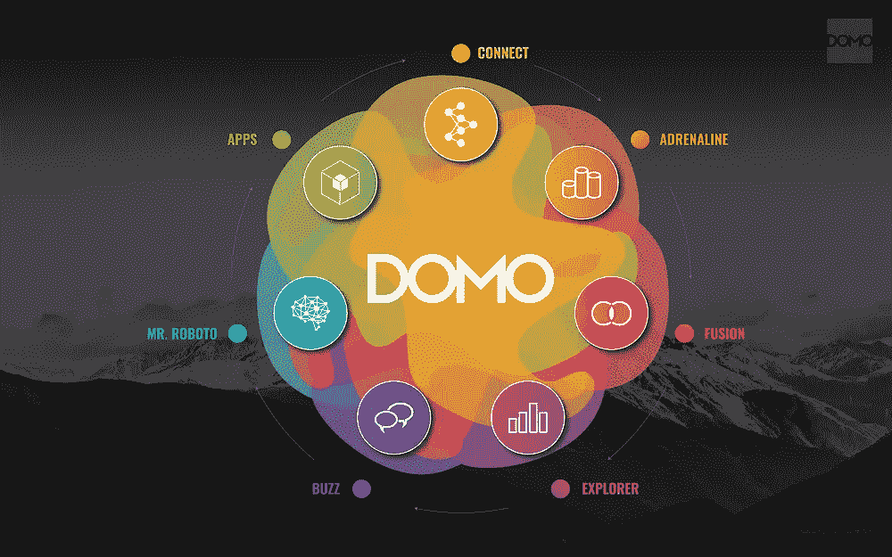****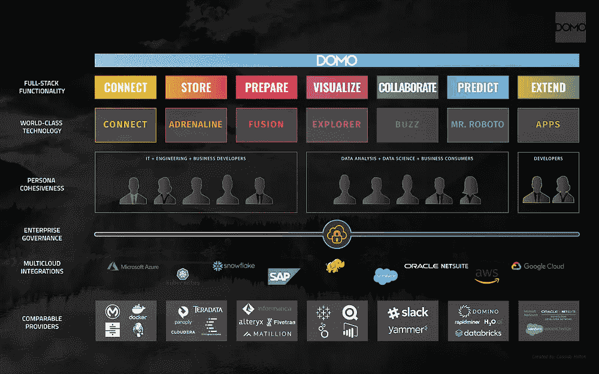**

**[https://bit.ly/3mqAse6](https://bit.ly/3mqAse6)|[https://bit.ly/35NzguD](https://bit.ly/35NzguD)**

**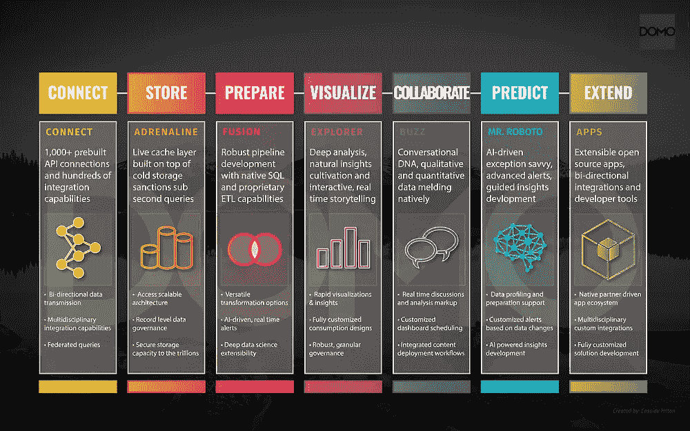****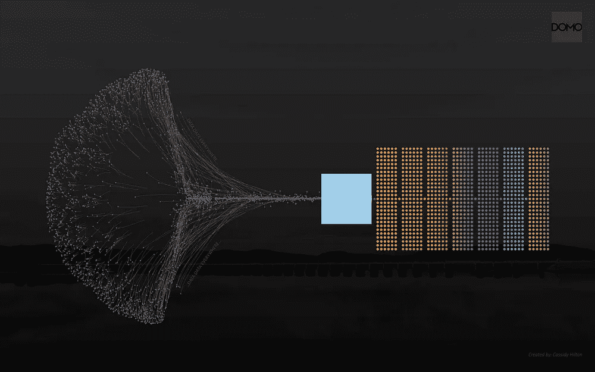**

**https://bit.ly/37PNbmn|[https://bit.ly/3mqA4fE](https://bit.ly/3mqA4fE)**

## ***来源:***

***1-*[*https://blogs . informatica . com/2020/07/16/3-奖励-途径-财务-可用-数据-驱动-成功/*](https://blogs.informatica.com/2020/07/16/3-rewarding-ways-finance-can-use-data-to-drive-success/)**

***2-*[*https://www . Gartner . com/smarterwithgartner/how-to-stop-data-quality-underbasing-your-business/*](https://www.gartner.com/smarterwithgartner/how-to-stop-data-quality-undermining-your-business/)**

***3-*[*https://www . au analytics . com/4-ways-differential-data-sets-are-holding-you-back/*](https://www.aunalytics.com/4-ways-disparate-data-sets-are-holding-you-back/)**

***4-*[*https://www . IDG . com/tools-for-markets/2018-CIO-tech-poll-economic-outlook/*](https://www.idg.com/tools-for-marketers/2018-cio-tech-poll-economic-outlook/)**

***5-*[*https://www . datanami . com/2020/07/06/Data-prep-still-domains-Data-scientists-time-survey-finds/#:~:text = Data % 20 scientists % 20 spend % 20 about % 2045，Data % 20 scientists % 20 conducted % 20 by % 20 anaconda。&text = In % 20 some % 20 surveys % 20 In % 20 th，of % 20a % 20data %科学家的% 20 time*](https://www.datanami.com/2020/07/06/data-prep-still-dominates-data-scientists-time-survey-finds/#:~:text=Data%20scientists%20spend%20about%2045,data%20scientists%20conducted%20by%20Anaconda.&text=In%20some%20surveys%20in%20the,of%20a%20data%20scientist's%20time)**

***6-*[*https://www . statista . com/chart/17966/world wide-人工智能-资助/*](https://www.statista.com/chart/17966/worldwide-artificial-intelligence-funding/)**

***7-*[*https://medium.com/r?URL = https % 3A % 2F % 2fwww . mesa online . org % 2f 2019% 2f 09% 2f 27% 2 fidc-ai-can-measurely-help-organizations-with-analytics-business-intelligence % 2F*](https://medium.com/r?url=https%3A%2F%2Fwww.mesaonline.org%2F2019%2F09%2F27%2Fidc-ai-can-significantly-help-organizations-with-analytics-business-intelligence%2F)**

***8-*[*https://mlin production . com/deploying-machine-learning-models/*](https://mlinproduction.com/deploying-machine-learning-models/)**

***9-*[*https://chief martec . com/2020/04/marketing-tech-landscape-2020-martech-5000/*](https://chiefmartec.com/2020/04/marketing-technology-landscape-2020-martech-5000/)**