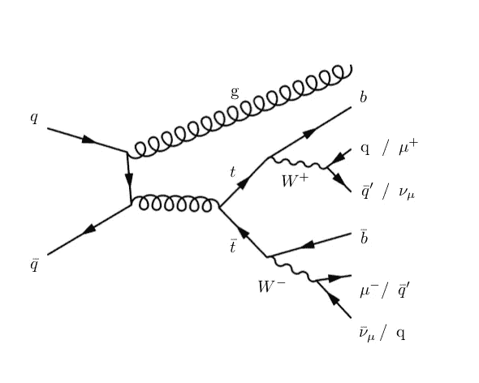
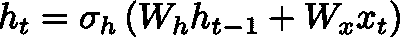
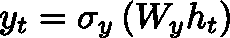
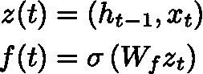
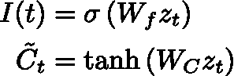
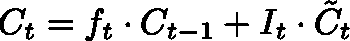
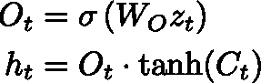

# 双向 LSTM 神经网络与顶夸克有什么关系？

> 原文：<https://pub.towardsai.net/what-have-bidirectional-lstm-neural-networks-to-do-with-top-quarks-2cbed7feda47?source=collection_archive---------1----------------------->

## 量子物理学中的 LSTM |[走向人工智能](https://towardsai.net/)

## 以及如何证明从两个相反的方向观察四维向量序列是解决一个几十年的老问题的关键

在最近的一篇论文*双向长短期记忆(BLSTM)神经网络重建顶夸克对衰变运动学*(预印本: [arXiv:1909.01144](https://arxiv.org/abs/1909.01144) )中，我的暑期学生法丁探索了许多技术来重建一种叫做[顶夸克](https://en.wikipedia.org/wiki/Top_quark)的基本粒子的衰变链，这种粒子在 LHC 大量产生。这个粒子最好衰变为一个 *W* 玻色子和一个*底*夸克( *t* → *Wb* )。反过来，W 玻色子可以在三分之二的情况下衰变为一对夸克(*W*→*QQ*’)，或者在剩余的三分之一情况下衰变为一个带电轻子和一个中微子( *W* → *lv* )。导致顶夸克产生的最常见过程是所谓的*对产生*，这意味着质子成分(价夸克和胶子)之间碰撞的结果是顶夸克的粒子-反粒子对。因此，在大约 4/9 的情况下，在衰变链的末端有两个 *b* 夸克，两个轻夸克(*u*/*c*/*s*)，一个带电轻子( *e* /μ)和一个中微子( *v* )。这个过程也被称为*顶反顶对的半轻子衰变*(*TT*→*wbwbwb*→*bqq ' blv*)。此外，夸克无法通过实验观察到，而是以术语*喷流*所称的准直粒子喷雾的形式出现在仪器中。有时，会出现额外的喷流，由胶子的发射产生(类似于强作用力的光子)。

费曼图表示顶夸克对的产生和衰变到由四个夸克、一个μ子、一个中微子和一个附加胶子组成的状态。

问题是如何把这六个物体唯一地分配给每一个顶夸克。传统上，这是通过寻找最小化目标函数χ2(“卡方”)的排列来完成的。由于神经网络是一个通用的近似器，我们认为某种深度网络可能能够完成繁重的工作。法尔丁得出结论，最佳候选人实际上是一堆具有记忆的神经网络，称为双向长短期记忆网络。

# 具有记忆的神经网络

递归神经网络(RNNs)解决了能够重新处理信息以跟踪序列的问题。事实上，它们被“展开”的维度不一定代表实际时间，但这是一种思考正在发生什么的好方法。

基本的 RNN 单元有一个输入( *x* )、一个隐藏状态( *h* )和一个输出( *y* )。隐藏状态用一个全零的向量、随机数或者另一个向量初始化(继续读)。游戏的名称是找到设置的正确参数，由矩阵 *Wx* 、 *Wh* 和 *Wy* 表示，让网络执行所需的操作。用数学术语来说，在时间步长 *t* 处，隐藏状态 *h(t)* 为:

其中，σh 是引入非线性的激活函数(通常为双曲正切值 *tanh* )。我隐含地假设偏差 b 可以加到 sigmoid(或 tanh(T21)函数的自变量上。输出将是:

其中σt 是另一个激活函数(通常同上)。网络跟踪隐藏状态[ *h* (0)、 *h* (1)、… *h* ( *t* ) ]，用户可以决定是只输出最后一个还是输出整个序列。在某些模型中，如[编码器-解码器网络](https://machinelearningmastery.com/how-to-use-an-encoder-decoder-lstm-to-echo-sequences-of-random-integers/)，一个 RNN 单元的状态可用于初始化另一个单元的隐藏状态。

在实际应用中，这种基本的 RNN 网络过于简单，难以在长序列中检索信息。为了解决梯度消失的问题，S. Hochreiter 和 J. Schmidhuber 于 1997 年提出了一种改进的 RNN，称为长短期记忆(LSTM)。解决问题的关键是通过增加一个矢量状态 *C* 和多个门*，即控制信息流的*操作，来增加 RNN 单元内部工作的复杂性。门是一个非线性函数(通常是一个 *sigmoid* )后跟一个乘法。LSTM 有三个大门:

*   **忘记门层**:应用于当前时间步 *t* 的输入与上一步隐藏状态的串接，*即**z*(t)=[*x*(*t*)， *h* ( *t* -1】)。由于每个元素的输出是一个介于 0 和 1 之间的数字，它控制着从上一时间步 *t* -1 保留的信息量

*   **输入门层**:类似于遗忘门，控制状态向量 *C* 的哪些元素必须更新

通过这些功能，状态 *C* 根据以下公式更新:

换句话说，时间步 *t* 处的状态取决于前一时间步 *t* -1 处的状态，并且取决于在时间 *t* 处呈现的“重要”信息。

*   **输出门层:**最后计算时间步 *t* 的隐藏状态，如果 *t* 也是最后一个时间步(即输入向量的最后一个元素)，则输出:

如果输入向量只有一个元素，隐藏状态 *h* 将只有一个元素。相反，如果输入有 *N 个*元素，隐藏状态将是所有 *N 个*隐藏状态的集合，输出将对应最后一个(*O*=*h*[*N*)。在常见的实现中，LSTM 单元可以将句柄返回到状态 *C* ，中间隐藏状态列表 *h* ，以及最终输出 *O* 。

在输入序列的所有时间步长都可用的问题中， [**双向 LSTMs**](https://machinelearningmastery.com/develop-bidirectional-lstm-sequence-classification-python-keras/) 训练两个而不是一个递归网络。第一个是按原样在输入序列上训练的，第二个是在输入序列的时间反转拷贝上训练的。这可以为网络提供额外的上下文，并且有希望增加网络的准确性。

回到 Fardin 的发现，我们注意到输入序列是完全已知的，不同于语音识别的例子，在语音识别中，输入随时间流动。同时从两端分析序列是很有意义的。虽然结果还只是初步的，但它展示了这种网络学习中间粒子衰变的复杂运动学的能力。这种方法可能的扩展包括[注意机制](https://towardsdatascience.com/intuitive-understanding-of-attention-mechanism-in-deep-learning-6c9482aecf4f)和[变压器网络](https://ai.googleblog.com/2017/08/transformer-novel-neural-network.html)——这将留待以后的文章讨论！