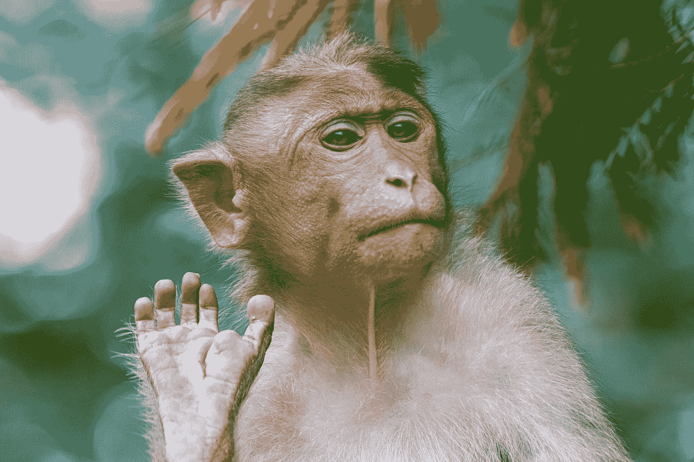
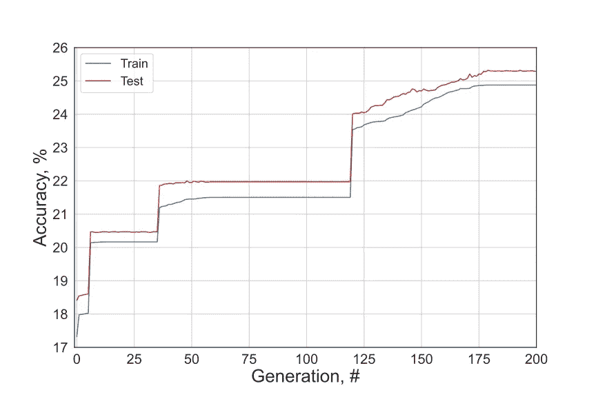

# 如果查尔斯·达尔文建立了一个神经网络会怎么样？

> 原文：<https://pub.towardsai.net/what-if-charles-darwin-built-a-neural-network-e1d0cadf032e?source=collection_archive---------0----------------------->

## 用进化“训练”神经网络的另一种方法

照片由[米赛尔·莫雷诺](https://unsplash.com/@moreno303?utm_source=medium&utm_medium=referral)在 [Unsplash](https://unsplash.com?utm_source=medium&utm_medium=referral) 上拍摄

目前，[反向传播](https://en.wikipedia.org/wiki/Backpropagation)几乎是神经网络训练的唯一方法。它计算损失函数相对于网络权重的梯度，并因此通过使用链规则在网络层之间反向传播误差来更新权重。

最近，社区一直试图超越反向传播，因为在 80 年代推广该算法的大师 Geoffrey Hinton 本人现在对 it 深感怀疑。他现在的观点是*[把这一切都扔掉，重新开始](https://www.axios.com/ai-pioneer-advocates-starting-over-2485537027.html)*。他的怀疑背后有很多原因。最主要的一点是，我们的大脑不会反向传播事物，因为没有标记数据。我们宁愿自己给东西贴标签，这是完全不同的故事。许多精彩的作品已经在 NeurIPS 上发表，展示了不同的算法，其中一些算法相当复杂。然而，我们在这里不是为了一些看起来像召唤魔鬼的古老咒语的核心算法，而是为了一些更简单的东西。简单多了。我们不是训练我们的模型，而是要进化它，就像大自然母亲所做的那样。**

**现在，是查尔斯·达尔文出场的时候了。达尔文将进化定义为“带有修饰的血统”。听起来几乎像“梯度下降”，对不对？😅自然选择是进化的关键点，意味着物种随着时间进化，产生新的物种，并拥有共同的祖先。简而言之，种群*中最适应*的*部分在*中存活下来，并产生略微改变(即*突变*)的后代。然后，这个过程一遍又一遍重复很长时间……多久？例如，以地球为例，它用了 45.43 亿年。这个概念在计算机科学中非常适用，被称为遗传或进化算法。**

**给定一个庞大的群体，从随机开始，进化可以出现令人惊讶的好结果。同样，“[无限猴子定理](https://en.wikipedia.org/wiki/Infinite_monkey_theorem)”指出，给一只猴子无限的时间，它几乎肯定会打出一些有意义的文本，比如说，威廉·莎士比亚的《哈姆雷特》。**

> **“让我们假设 100 万只猴子被训练随机打字，这些打字的猴子每天用 100 万台各种型号的打字机努力工作 10 个小时。一年后，他们的工作成果将包含世界上最丰富的图书馆中所有种类和语言的书籍的精确副本”**
> 
> **埃米尔·博雷尔，1913 年，体质杂志**

****

**由[赛义德·艾哈迈德](https://unsplash.com/@syedabsarahmad?utm_source=medium&utm_medium=referral)在 [Unsplash](https://unsplash.com?utm_source=medium&utm_medium=referral) 上拍摄的照片**

**我们如何将这种想法推广到神经网络训练中？想象一下，我们从一堆随机的网络开始。它们可以在[架构](https://arxiv.org/pdf/1810.03522.pdf)、重量或任何其他参数方面有所不同。然后我们必须检查它们是如何完成工作的，选择一个表现最好的小块，并对它们的参数做一些小的修改(这被称为“[突变](https://en.wikipedia.org/wiki/Mutation_(genetic_algorithm))”)。由于我们正在讨论反向传播替代方案，这里的目标将是在没有“传统”方法训练神经网络的情况下，找到神经网络的最佳权重和偏差。**

**没有反向传播，没有梯度下降-没有问题！**

**首先，让我们通过利用 PyTorch 库创建一个神经网络来简化我们的生活。为了简单起见，我们将采用一个具有单个隐藏层的前馈神经网络，并*将*用于一个简单的任务——手写数字识别，我们都知道这是 [MNIST](http://yann.lecun.com/exdb/mnist/) 数据集:**

**现在，为了使模型工作，我们必须初始化权重和偏差，因此让我们创建一个函数，它接受模型和可训练参数，并将它们放在一起:**

**然后，我们需要所谓的[适应函数](https://en.wikipedia.org/wiki/Fitness_function#:~:text=A%20fitness%20function%20is%20a,simulations%20towards%20optimal%20design%20solutions.)，根据老维基百科的说法，它是:**

> **一种特殊类型的[目标函数](https://en.wikipedia.org/wiki/Objective_function)，作为一个单独的[品质因数](https://en.wikipedia.org/wiki/Figure_of_merit)，用于总结给定的设计解决方案与设定目标的接近程度。**

**首先，让我们使用不带小批量的标准 PyTorch 测试函数，因为我们不再需要它们了:**

**所以我们要最大化的就是所谓的健身功能。由于它返回的准确性，最大化适应度函数听起来像一个计划！**

**然而，为了测试该模型，我们需要一些输入，这些输入将是一组随机神经网络参数。因此，首先，我们需要通过简单地生成许多特定形状的伪随机正态分布张量来创建总体，并进行一点标准化调整以避免非常大的参数，这只是将权重和偏差乘以 0.1。**

**让我们以 Python 元组列表的形式来做:**

**这里，每个元组包含以下内容:**

*   **隐藏层的权重**
*   **输出图层的权重**
*   **隐藏层的偏差**
*   **输出层的偏差**

**现在，一旦我们有了 100 个不同的解决方案，我们就可以将它们输入到模型中，对它们进行评估，并从中选择一批(比如说 10 个)最佳方案。然后我们*对解决方案*进行一点变异，这就是上面提到的变异，并创建新一代，这只是从上一代的顶部随机选取的 *N 个*新解决方案，并稍微*变异。***

**然而，这里我们对算法的原始实现做了一点修改。首先，当我们从一个 100 人的小群体开始时，让我们允许这个群体随着每一代人的增长而增长一些。这只是为了更快的收敛和更好的结果。**

**第二个技巧是，偶尔(比如所有情况的 20%)，我们允许从头开始随机初始化。因此，即使我们选择了 10 大解决方案来创造新一代，阿尔伯特·爱因斯坦仍然有机会诞生！因此，如果它们在那里，那些爱因斯坦可以被挑选出来，并进一步变异，创造出新的更好的一代。整个代码周期如下所示:**

**总之，我们稍微改进的进化算法做了以下工作:**

*   **为给定的神经网络体系结构随机生成 100 组参数**
*   **选出其中最好的 10 个**
*   **随机地*轻微地*变异前 10 个并创建一个新的，比先前的稍大的群体，有 20%的机会完全随机地初始化**
*   **重复直到它接管世界！**

**然后…瞧！我们的 DarwinNet 准备好了！当它运行 200 代时，它在测试集上对 MNIST 数据集给出了超过 25%的准确率。不是最好的性能，但是，随机猜测会给出 10%的准确性，所以它显然在做一些事情，如下图所示。完整的代码可以在[这里](https://github.com/kovalenko-alx/DarwinNet)找到。如上所述，增加 20%的随机初始化机会有助于显著提高性能，这对应于图上的特征“步骤”。**

****

**本文展示了如何使用遗传算法在一个基准数据集上“训练”模型。请记住，代码是在办公室斗剑和喝咖啡之间编写的；这里没有大的野心。然而，通过不同的权重初始化、改变变异率、每代的亲代数量、代数量等，有许多方法可以获得更高的性能。此外，我们可以使用我们先前对神经网络的理解并注入专家知识，即使用[明凯初始化](https://arxiv.org/pdf/1502.01852.pdf)来挑选模型的初始权重。这可能不会有帮助，但你已经得到了重点，对不对？😃**

**当然，使用进化算法训练神经网络的想法并不新鲜。上个世纪至少有两篇由 D. J. Montana & L. Davis 和 s . j . Marshall&r . f . Harrison 撰写的论文分享了这一观点，在这些论文中，他们展示了遗传算法的优越性。然而，该发生的还是发生了。如今，反向传播相关的属性被微调以尽最大努力，因此，它们的性能优于遗传算法和其他非反向传播竞争方法，例如 [Hebbian 学习](https://link.springer.com/referenceworkentry/10.1007%2F978-1-4614-7320-6_672-1)或[扰动学习](https://papers.nips.cc/paper/2003/file/f8b932c70d0b2e6bf071729a4fa68dfc-Paper.pdf)。**

**目前实现的另一个问题是:它需要时间…嗯，如果它运行超过 40 亿年，结果可能会更好。🙃**