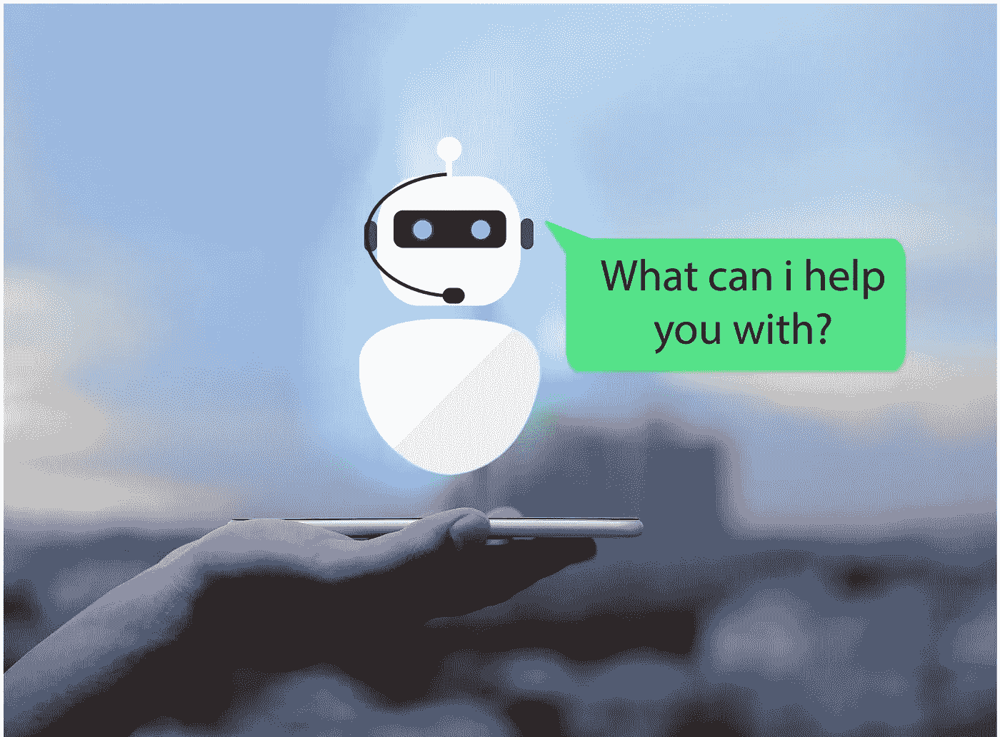
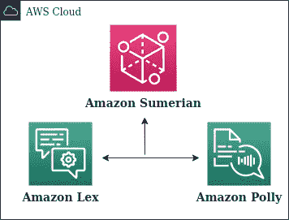
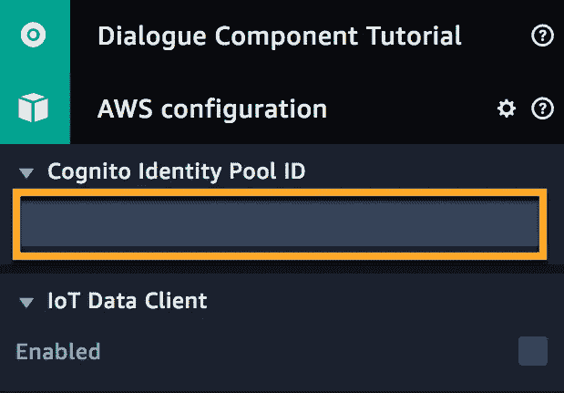
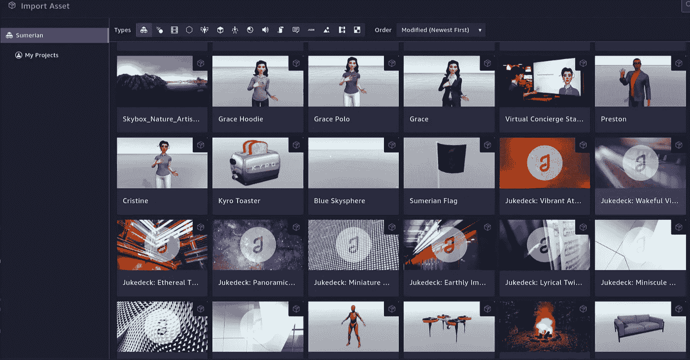
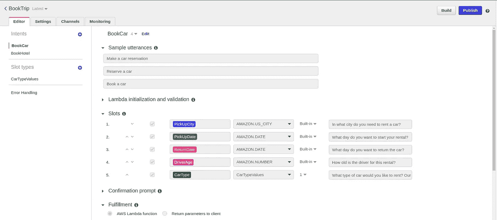
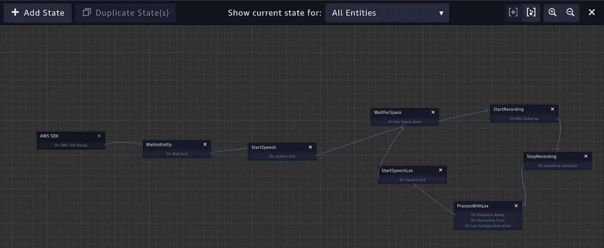

# 如果我们把人工智能和 AR/VR 融合在一起会怎么样？

> 原文：<https://pub.towardsai.net/what-if-we-integrate-artificial-intelligence-with-ar-vr-15d6725fa744?source=collection_archive---------4----------------------->

## [人工智能](https://towardsai.net/p/category/artificial-intelligence)、[云计算](https://towardsai.net/p/category/cloud-computing)、[科技](https://towardsai.net/p/category/technology)

## 使用 Amazon Sumerian 和 Lex 利用 AWS 开发智能虚拟助理概述

照片由[乌列尔·索伯兰斯](https://unsplash.com/@soberanes?utm_source=unsplash&utm_medium=referral&utm_content=creditCopyText)在 [Unsplash](https://unsplash.com/s/photos/ar-vr?utm_source=unsplash&utm_medium=referral&utm_content=creditCopyText) 上拍摄

您的客户是否厌倦了通过用户界面来解决他们的问题？如果有更好更有趣的处理方式呢？如果您可以提供一个智能的 **Live** 交互环境来解决他们的查询，而不需要人工干预，也不需要在一千行代码上投入您的宝贵时间，那会怎么样？如果你仅仅通过阅读它就感到狂喜，并强烈地感觉到你的客户可以通过专门为他们建造的生活环境为你做一些好事，那么，祝贺你！你降落在了正确的地方。

在这篇文章中，我将解释如何使用 ***亚马逊苏美尔语*** 为你的客户开发虚拟助手和有趣的应用。虚拟助手看起来就像下面的视频，当然，你可以做一点小改变。

资料来源:AWS

> AR 创造了新的数字体验，有助于将客户的旅程转变为互联的、沉浸式的、视觉互动的旅程。在客户服务领域稳步推进 AR 的深入实施是不可避免的。

# 激动人心吧？让我们开始吧。

> 亚马逊苏美尔人的目标是给你的网络和移动应用带来一个新的维度。3D 沉浸式体验为网络用户体验注入了新的活力，增加了客户对品牌的参与度，并提高了工作场所的生产率。Amazon Sumerian 可以轻松创建引人入胜的 3D 前端体验，并与 AWS 服务集成，以提供对机器学习、聊天机器人、代码执行等的轻松访问。作为一个基于网络的平台，您可以通过一个简单的浏览器 URL 访问身临其境的体验，并能够在流行的 AR/VR 硬件上运行。

我们都可以通过将人工智能集成到我们的 AR/VR 代理中来轻松完成上述任务，这些代理可以使用苏美尔语创建。

使用 Canva 设计(作者提供照片)

但在此之前，让我简单介绍一下被称为 ***Lex 的东西。*** [Lex](https://aws.amazon.com/lex/) 是亚马逊提供的聊天机器人服务，将亚马逊苏美尔语与 Lex 集成在一起，给我们带来了与类人机器人实时互动的奇妙感觉，这比无聊和传统的聊天机器人好得多。因为，嘿，我们不是已经被那些不请自来地出现在我们访问的所有其他网站上的机器人搞得焦头烂额了吗？

对你来说创作起来太难了吗？绝对不行！任何人都可以按照简单的说明去做。

# 整合亚马逊苏美尔语和 Lex

作者照片(使用 diagrams.net 设计)

你必须经历五个重要的步骤。

1.  使用 [AWS CloudFormation 堆栈模板](https://console.aws.amazon.com/cloudformation/home?region=us-east-1#/stacks/create/review?templateURL=https:%2F%2Fs3.amazonaws.com%2Fsumerian-cfn-templates%2FLexPollyExampleTemplate.yml&stackName=AmazonSumerianLexPollyTutorialStack)创建一个 Amazon Cognito 身份池 ID，并将其添加到场景的 AWS 配置中。

将认知添加到身份池 ID(作者照片)

2.导入一个苏美尔主机，为你的助手添加必要的行为和手势，并为你脑海中想象的场景添加背景。

从苏美尔人导入资产(作者提供照片)

3.使用 Lex 创建一个聊天机器人，并在 State 操作中添加聊天机器人。

使用 Lex 创建聊天机器人(作者提供图片)

4.创建一个工作流，描述虚拟代理在使用状态管理与客户交谈时的行为，如下所示。

**注:** Lex 负责使用 [*Polly*](https://aws.amazon.com/polly/) 将聊天机器人的响应转换为语音。

苏美尔人的国家管理(作者照片)

5.最后发布场景，会生成一个类似[这个](https://eu-west-1.sumerian.aws/21ddb41d1e7746209f4326836f651e9e.scene)的链接。这个特殊的链接可以用来集成到你的应用程序中(如果有的话)，或者你可以只是玩玩它，享受你的虚拟助手的时间:)。

# 应用程序

## 不用说，我们可以在

1.  客户关怀
2.  教育部门
3.  酒店管理
4.  营销

还有更多…

# 结论

最棒的是，你不需要编码或机器学习方面的知识来开发这个，这意味着即使你对编码过敏，你仍然可以享受和创造奇迹。几分钟之内就能为你的公司开发出一个虚拟助手。为此，我们为苏美尔主机创建了一个工作流(包含对话流状态管理),并向其中添加了 Lex Bot。

# 取得联系

我希望你觉得这篇文章很有见地。我很乐意听到你的反馈，以便更好地即兴发挥和回来！如果你想联系，请在 [**LinkedIn**](https://www.linkedin.com/in/findtharun/) 上**联系我。感谢阅读！**

# 资源

1.  [苏美尔人概述](https://www.youtube.com/watch?v=_Q3QKFp3zlo)
2.  [完整的苏美尔人教程](https://www.youtube.com/watch?v=J3zsG0ejgO8&list=PLhr1KZpdzukd0g3qrxrCzwfZF97Ylprpy)
3.  [亚马逊苏美尔对话组件](https://docs.sumerian.amazonaws.com/tutorials/create/beginner/dialogue-component/)

# 参考

[1 ] [AWS 文档](https://aws.amazon.com/sumerian/)