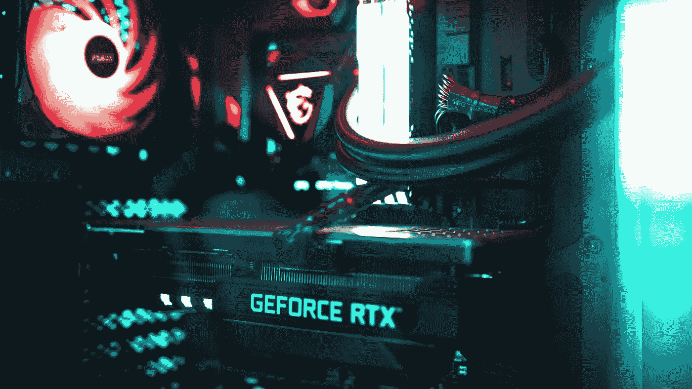
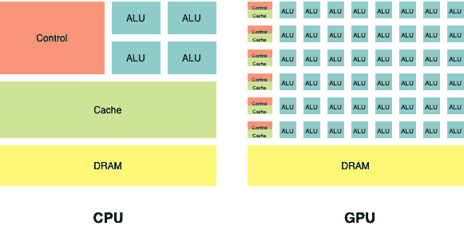
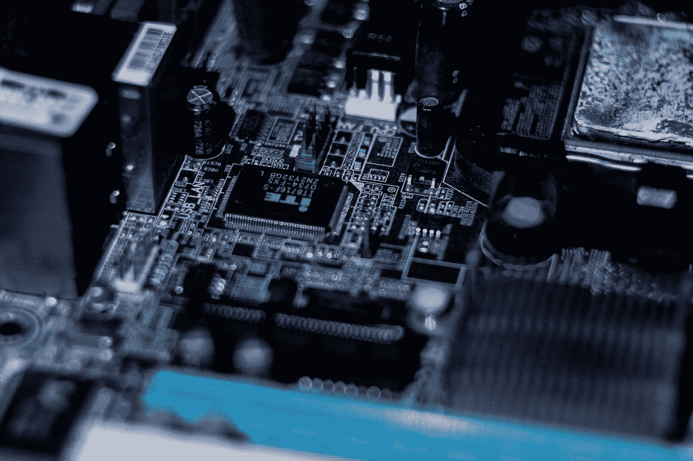
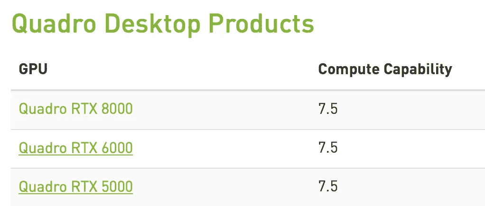
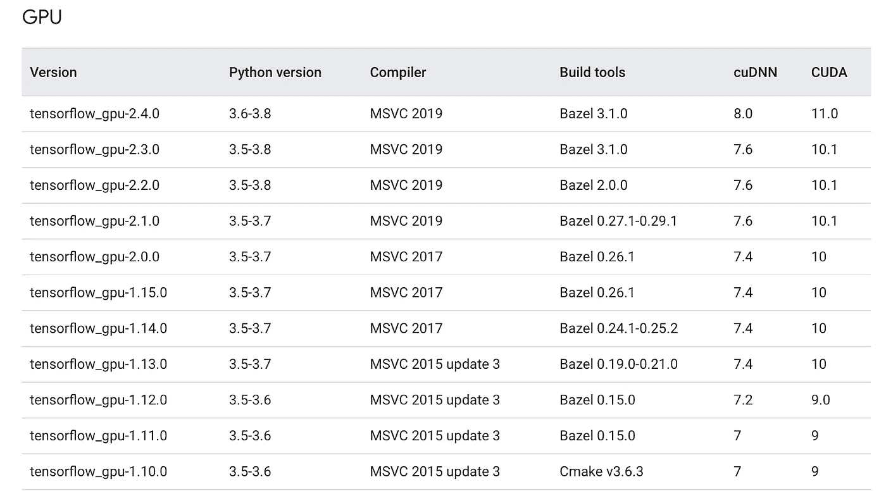
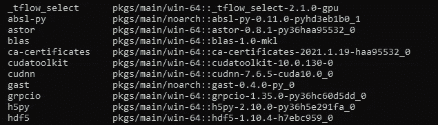
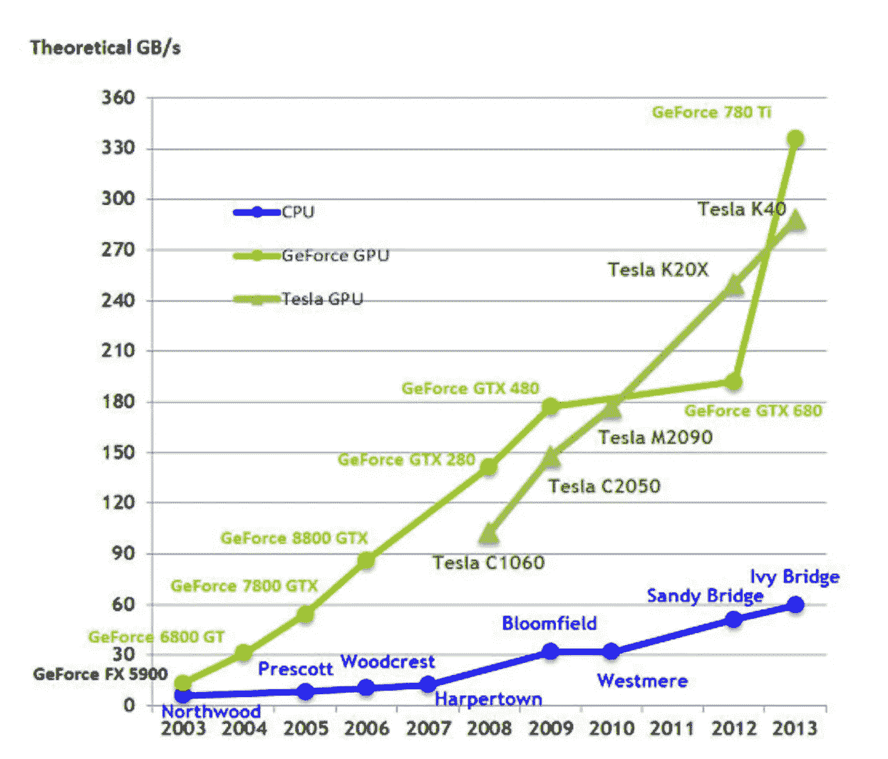

# 什么是 GPU？深度学习需要 GPU 吗？

> 原文：<https://pub.towardsai.net/what-is-a-gpu-are-gpus-needed-for-deep-learning-7b315ed80f16?source=collection_archive---------0----------------------->

[](https://news.towardsai.net/laptops)

来源:卡斯帕·卡米尔·鲁宾在 Unsplash 上的照片

## [深度学习](https://towardsai.net/p/category/machine-learning/deep-learning)、[社论](https://towardsai.net/p/category/editorial)、[技术](https://towardsai.net/p/category/technology)

## 深入了解什么是 GPU 的技术解释

**作者:**布塞·任亚·泰京，[罗伯托·伊里翁多](https://mktg.best/vguzs)

[](https://members.towardsai.net/) [## 加入我们吧↓ |面向人工智能成员|数据驱动的社区

### 向着 AI 加入。通过成为会员，你不仅将支持人工智能，但你将有机会…

members.towardsai.net](https://members.towardsai.net/) 

在智能时代，越来越多的创新概念每天都在涌现。其中一个无疑是**[**人工智能**](https://news.towardsai.net/aiml) **的领域。”**在这个案例中，具体来说，AI 的一个子分支——[](https://news.towardsai.net/dl)**深度学习，会在我们需要深入复杂问题的时候遇到我们，如今在很多领域都有使用。我们开发深度学习模型来完成特定的任务，在某些情况下，超越人类的重复能力。在本文中，我们将通过代码示例来探索 GPU 如何用于深度学习。****

****本教程的代码可以在 Github 上找到，也可以在 Google Colab 上找到。****

> ****“在人工智能和算法在我们的生活和组织中做出更多决策的时代，是时候让人们利用他们的直觉作为今天技术能力的辅助手段了。我们内在的智慧可以将经验数据嵌入人性。”****
> 
> *****——阿布舍克·拉特纳*[*12*](https://www.goodreads.com/quotes/tag/algorithms)****

# *****什么是 GPU？*****

*****图形处理单元(GPU)是一种专门的电子电路，设计用于快速操作和更改内存，以加速在帧缓冲区中创建图像，并输出到显示设备[ [1](https://en.wikipedia.org/wiki/Graphics_processing_unit) ]。*****

*****图形处理单元是一个计算机芯片，执行快速数学方程来渲染图像。专用或集成可能是图形卡的一部分。*****

*****在嵌入式系统中，在很多领域都很有可能看到 GPU，比如个人电脑或者工作站。这取决于并行处理结构。与图像和视频处理中包含的图形处理器相比，GPU 具有优势。如今，GPU 越来越受欢迎，也越来越被人工智能(AI)所需要。*****

*****[](https://news.towardsai.net/laptops)

来源:照片由[克里斯蒂安·威迪格](https://unsplash.com/@christianw)在 [Unsplash](https://unsplash.com/photos/3GUW88tRmv8) 上拍摄***** 

# *****深度学习需要 GPU 吗？*****

*****在使用深度学习方法的同时，经常被提及的 GPU 也在不断尝试后台存在的可能性。因此，这种情况不是很抽象。虽然我们在上面讨论了 GPU 的更多主题领域，但我们将讨论使用 GPU 以及它对深度学习的意义。*****

*****在深度学习领域，当涉及到训练模型时，需要更多的速度和性能。更具体地说，想想 [**人工神经网络**](https://news.towardsai.net/ivn) 的复杂结构。虽然这些神经网络主要处理大型数据集，但在训练训练集时会观察到正常运行时间的增加。此外，随着数据集的增长，训练时间有时甚至会占用很长时间。*****

*****假设我们有一个包含图像内容的样本数据集。从算法上来说，对该数据集中关于神经网络前馈和反向传播的每个数据采取行动。如果我们没有 GPU，机器将承担更多的处理负载，因此需要很长时间才能给我们处理结果。*****

*******因此，在开发深度学习模型时，我们将需要的最重要的硬件之一是 GPU。*******

# *****GPU 和 CPU 有什么区别？*****

**********

*****CPU 与 GPU 架构*****

*****中央处理单元(CPU)，也称为中央处理器、微处理器、主处理器或简称为处理器，执行包括计算机程序的指令。*****

*****传统的 CPU(中央处理器)基于一些方法，由于它们的成本和可扩展性问题，这些方法不能带来执行并行计算任务的最佳解决方案。如上图所示，CPU 执行程序指令[ [6](https://blogs.nvidia.com/blog/2009/12/16/whats-the-difference-between-a-cpu-and-a-gpu/) ]指定的基本算术、逻辑、控制和输入/输出(I / O)操作。*****

**********

*****由[奥列格·戈斯波达雷斯](https://unsplash.com/@aleshcka?utm_source=medium&utm_medium=referral)在 [Unsplash](https://unsplash.com/?utm_source=medium&utm_medium=referral) 上拍摄的照片*****

*****相比之下，GPU(图形处理单元)是一种特殊类型的微处理器，主要用于快速图像渲染。GPU 似乎对图形密集型应用程序做出了响应，这些应用程序加重了 CPU 的负担，降低了计算机性能。*****

*****CPU 和 GPU 完全可以互换(取决于手头的任务)，它们都以不同的方式完成工作。大脑和力量通常被作为这一对的例子。因为 CPU 是中央处理器，所以被称为**计算机的大脑**。当然，如果没有 CPU，GPU 就没有任何意义。由于 CPU 被认为是大脑，它处理不同类型的计算，而 GPU 必须专注于特定的任务。*****

*****而 CPU 可以解决进程，它会一个接一个地做，GPU 可以高效地同时同步解决多个任务。在某种程度上，这两者是相辅相成的。*****

*****除了切换设备，还可以同步使用多个 GPU 来提高深度学习模型的性能。这种硬件变体被称为**多 GPU** 。我们可以并行运行多个 GPU，也可以不并行继续。当 GPU 在没有并行的情况下加电时，每个 GPU 都会单独工作。因此，建议使用并行多 GPU 来提高性能。*****

*****多 GPU 的使用在 **PyTorch** 和 **TensorFlow** 框架中非常灵活，这两个框架都是流行的深度学习模型。*****

> ******PyTorch 是一个基于 Torch 库的开源机器学习库，用于计算机视觉和自然语言处理等应用，主要由脸书的 AI 研究实验室[*[*8*](https://en.wikipedia.org/wiki/PyTorch)*]开发。******

*****TensorFlow 是一个开源框架，它灵活地支持模型**并行**。*****

> ******TensorFlow 是一款* [*免费*](https://en.wikipedia.org/wiki/Free_software)*[***开源***](https://en.wikipedia.org/wiki/Open-source_software)*[***软件库***](https://en.wikipedia.org/wiki/Library_(computing)) *为* [***机器学习***](https://mld.ai/mldcmu) *。它可以跨一系列任务使用但重点是* [***训练***](https://en.wikipedia.org/wiki/Types_of_artificial_neural_networks#Training) *和* [***推理***](https://en.wikipedia.org/wiki/Statistical_inference)**深度神经网络* [*10*](https://en.wikipedia.org/wiki/TensorFlow) *】。*********

******🎥让我们来看看 Adobe Illustrator 如何处理图像，以了解 GPU 的工作机制和 CPU 之间的差异。🎥******

******adobe Illustrator CC:NVIDIA GPU 与 CPU******

******NVIDIA 首席执行官黄仁勋在 [**GPU 技术大会(GTC)的主题演讲中描述了一个将加速和人工智能计算引入 Arm CPU 平台的三管齐下的尝试:“人工智能时代的计算**](https://www.youtube.com/watch?v=pzbhU4ttSvM) ”它还总结了英伟达正在做什么来推进人工智能时代。在一次 [**流言终结者演示**](https://www.youtube.com/watch?v=-P28LKWTzrI) 中，亚当·沙维奇和杰米·韩门展示了 GPU 计算的强大功能。******

************

******Lars Kienle 在 [Unsplash](https://unsplash.com/?utm_source=medium&utm_medium=referral) 上拍摄的照片******

******作为一个附加信息，除了 CPU 和 GPU 之外，还有一个**数据处理单元**叫做 **DPU** 。诚然，也许多年来计算机上唯一的元素就是 CPU。图形处理单元，我们称之为 GPU，现在已经承担了这一角色，最近，通过在数据中心[ [5](https://blogs.nvidia.com/blog/2020/05/20/whats-a-dpu-data-processing-unit/) ]构建软件可编程的多核 CPU，已经创建了 dpu。******

# ******如何用 GPU 开发深度学习模型？******

******在开发深度学习模型的时候，我们首先要确定我们的计算机有 GPU 并且可用。******

******⚙️**OS:**windows 10 pro
⚙️**cuda 工具包:**10
⚙️**cud nn:**7.4
⚙️**tensor flow GPU:**1 . 14 . 0
⚙️**keras:**2 . 2 . 5******

******软件技术有很多选择。我们使用一个我们最喜欢的叫做 **TensorFlow** 的机器学习框架，它有很多文档。******

******通过访问[**CUDA GPU**](https://developer.nvidia.com/cuda-gpus#collapse4)确定适合机器的处理器。例如，在下图中，我们通过主动检查我使用的机器了解了处理能力。******

************

******控制夸德罗 RTX 5000 处理器******

******为了使用 GPU 执行深度学习任务，我们需要为我们的机器安装合适的 cuDNN 工具和 CUDA 工具包。否则，我们将无法使用 GPU。要在 TensorFlow 中使用 GPU，如果使用 Conda 加载，则需要安装 TensorFlow-GPU 库。在此过程中，还将显示适当的 CUDA 和 cuDNN 版本。******

# ******安装 CUDA 工具包和 cuDNN 工具******

******我们需要安装与我们将使用的 TensorFlow 版本相匹配的 CUDA 和 cuDNN 工具。作为警告，如果我们下载不同的版本，我们会遇到许多错误。在 TensorFlow 2.x 版本中，可以接收日志或形状错误。我们注意到，多次安装后，TensorFlow-GPU 与 1.14.0 或 1.15.0 配合使用效果良好。******

************

******适用于 CUDA 的 TensorFlow 版本[ [Res](https://www.tensorflow.org/install/source_windows) ] [4]******

********TensorFlow-gpu==1.14.0** 所需的编译显示 **cuDNN** 的 **7.4** 和 **CUDA 工具包**的 **10** 版本。******

******当与 Conda 一起安装时，我们将收到安装批准。我们也可以看到 CUDA 和 cuDNN 版本安装的同时给予这种认可。这样，我们就会看到我们是在正确的轨道上。******

************

******作者图片******

******但是，除了 TensorFlow 之外，还必须安装 Keras 库。Keras 是一个开源软件库，为神经网络提供了 Python 接口。Keras 充当 TensorFlow 库[ [11](https://en.wikipedia.org/wiki/Keras) ]的接口。******

******📚《T4》***用 Python 进行深度学习*** ，由 Keras 的创造者弗朗索瓦·乔莱(Franç ois Chollet)所著，对于想从事这方面工作的人来说是非常成功的。要使用深度学习创建 GPU 设置环境，请访问文章 [**使用 TensorFlow GPU 创建深度学习环境**](/creating-a-deep-learning-environment-with-tensorflow-gpu-c16980ed1f67) 。******

******虚拟环境通常用于避免机器基础环境中的错误安装。在这个步骤中，建立了一个特定 Python 版本的虚拟环境。******

```
****conda create -n virtualenv python=3.6conda activate virtualenv****
```

******Conda 或 pip 命令用于加载 TensorFlow GP。这一步将安装 TensorFlow GPU。******

```
****pip install tensorflow-gpu****
```

******如果安装 TensorFlow GPU 时未指定版本，将安装最新版本。如果要安装特定的版本，可以通过编写版本来完成。******

```
****pip install tensorflow-gpu==1.15.0****
```

******安装 TensorFlow GPU 后，我们应该运行以下代码行进行控制。******

```
****import tensorflow as tf
tf.test.gpu_device_name()****
```

******要检查我们已安装的 TensorFlow GPU 版本，请运行 **pip show 命令。********

```
****pip show tensorflow-gpu****
```

******为了检查 GPU 的可用性，运行以下代码片段。******

```
****%tensorflow_version 2.ximport tensorflow as tfdevice_name = tf.test.gpu_device_name()if device_name != ‘/device:GPU:0’:raise SystemError(‘GPU device not found’)print(‘Found GPU at: {}’.format(device_name))****
```

******使用 TensorFlow 2.4.1 版本时，显示 TensorFlow 2.x 版本。此案例用于 1.x 版本，如下所示。******

```
****%tensorflow_version 1.ximport tensorflow as tfdevice_name = tf.test.gpu_device_name()if device_name != ‘/device:GPU:0’:raise SystemError(‘GPU device not found’)print(‘Found GPU at: {}’.format(device_name))****
```

******计算机很可能有不止一个 GPU。默认情况下，我们的机器或媒体使用 GPU，这要感谢 Google Colab。可以用另一个设备代替这个 GPU 来代替。在下面的代码片段中，它适用于 device / GPU: 1。******

```
****import tensorflow as tftf.device('/device:GPU:1')****
```

******已达到并行 GPU 使用。此外，我们必须提到，在进入笔记本电脑之前，甚至可以在我们的终端上设置 GPU。******

```
****from tensorflow.python.client import device_libdevice_lib.list_local_devices()****
```

******考虑 Colab 笔记本电脑时，将提供四种设备。这些是 CPU，GPU，XLA_CPU 和 XLA_GPU。这里的列表中显示了四个设备。其中两个是排除 CPU 和 GPU 的一个概念。******

******正如 TensorFlow 的文档中提到的，XLA 代表“加速线性代数”Tensorflow 相对较新的优化编译器可以通过将过去的多个 CUDA 内核合并为一个[ [13](https://stackoverflow.com/questions/52943489/what-is-xla-gpu-and-xla-cpu-for-tensorflow) ]来进一步加快我们的 ML 模型的 GPU 操作。******

```
****import tensorflow as tftry: tf.device('/job:localhost/replica:0/task:0/device:GPU:1')except RuntimeError as e: print(e)****
```

******如果设备 1 的物理 GPU 不存在，我们建议尝试下面的代码。为了学习所用设备的名称，测试 GPU 将在它是 GPU 时运行。******

```
****import tensorflow as tftf.test.gpu_device_name()****
```

******有时会测试模型训练来检查 GPU 的运行速度。通过加载 MNIST 数据集中的数据，卷积网络在特定图层上运行。******

```
****import tensorflow as tfmnist = tf.keras.datasets.fashion_mnist(training_images, training_labels), (test_images, test_labels) = mnist.load_data()training_images=training_images / 255.0test_images=test_images / 255.0model = tf.keras.models.Sequential([tf.keras.layers.Flatten(),tf.keras.layers.Dense(128, activation=tf.nn.relu),tf.keras.layers.Dense(10, activation=tf.nn.softmax)])model.compile(optimizer=’adam’, loss=’sparse_categorical_crossentropy’, metrics=[‘accuracy’])model.fit(training_images, training_labels, epochs=5)test_loss = model.evaluate(test_images, test_labels)****
```

******在这里，随着数据数量的增加，问题变得更加复杂，训练之间的差异会变得更大。因为在这个示例代码行中没有非常大的数据集，所以在处理数据时，CPU 和 GPU 之间没有太大的区别。但是在处理大数据的时候会有明显的区别。******

```
****import tensorflow as tfsess=tf.Session(config=tf.ConfigProto(log_device_placement=True))****
```

******与最近被频繁提及的 Keras 框架 TensorFlow 一起，TensorFlow 现在被用作`tf.keras`。这是应该在深度学习环境中使用的框架。******

```
****pip install keras==2.2.5****
```

# ******一段时间内 CPU 和 GPU 带宽的比较******

> *******带宽是指 GPU 与其关联系统之间的外部带宽。它是对连接两者的总线上的数据传输速度的度量(例如，PCIe 或 Thunderbolt)。带宽不是指 GPU 内部的带宽，是衡量 GPU 内部组件之间数据传输速度的指标[*[*7*](https://developer.apple.com/documentation/metal/gpu_selection_in_macos/understanding_gpu_bandwidth)*][*[*9*](https://en.wikipedia.org/wiki/Memory_bandwidth)*]。*******

******在深度学习过程中训练模型时，CPU 使用了太多内存。原则上，在处理大型数据集时会遇到这种情况。但是在看 GPU 的时候，在训练模型的时候，在用名为 **VRAM** 的内存处理的同时，CPU 剩余的内存会分配给其他任务。因此，即使在复杂的问题中，该过程也可以用很少的循环来完成。******

************

******GPU 与 CPU 性能[ [Res](https://www.researchgate.net/publication/270222593_To_Use_or_Not_to_Use_Graphics_Processing_Units_for_Pattern_Matching_Algorithms) ] [2]******

******高端 NVIDIA GPUs 拥有比任何 CPU 都宽得多的总线和更高的内存时钟频率。最大内存带宽是从处理器的半导体内存中读取数据或向其中存储数据的最大速率(GB/s)。******

******英特尔酷睿 X 系列处理器的理论最大内存带宽可通过以下方法计算得出:将内存频率(两倍数据速率后的一半 x 2)、宽度字节数和处理器支持的通道数相乘[ [2](https://www.intel.com/content/www/us/en/products/docs/processors/what-is-a-gpu.html) ]。******

> *******例如:
> 对于 DDR4 2933，某些 core-x 系列支持的内存为(1466.67 X 2) X 8(字节数宽度)X 4(通道数)= 93866.88 MB/s 带宽，或 94gb/s[*[*Res*](https://forums.developer.nvidia.com/t/why-gpu-has-large-memory-bandwidth-than-cpu/10294)*][*[*2*](https://www.intel.com/content/www/us/en/products/docs/processors/what-is-a-gpu.html)*][3]。*******

******由于许多系统变量，如软件工作负载和系统电源状态，内存带宽可能低于预期。******

> *******高端 NVIDIA GPUs 比任何 CPU 都有更宽的总线和更高的内存时钟速度。考虑到具有最高内存带宽的英特尔酷睿 i7 处理器，它似乎具有 192 位宽的内存总线和高达 800 MHz 的内存速度(有效地)。最快的 NVIDIA GPU 是 GTX 285[*[*Res*](https://forums.developer.nvidia.com/t/why-gpu-has-large-memory-bandwidth-than-cpu/10294)*【3】。*******

*********披露:*** *作为亚马逊的合作伙伴，朝向 AI 可能会从本帖中链接的合格购买中获得一小笔佣金(买家无需额外付费)。如有反馈、问题或疑虑，请发送电子邮件至 pub@towardsai.net*[](mailto:pub@towardsai.net)**。********

*********免责声明:**本文所表达的观点均为作者个人观点，不代表与作者(直接或间接)相关的任何公司的观点。这项工作并不打算成为最终产品，而是当前思想的反映，同时也是讨论和改进的催化剂。*******

*********除非另有说明，所有图片均来自作者。*********

*******经由[发布**走向艾**](https://towardsai.net/)*******

# *******资源*******

*******[](https://colab.research.google.com/drive/1FU2P9XDqdX5jB3PR7P6CYLKcUzSK_yl-?usp=sharing) [## 什么是 GPU？—谷歌联合实验室

colab.research.google.com](https://colab.research.google.com/drive/1FU2P9XDqdX5jB3PR7P6CYLKcUzSK_yl-?usp=sharing) [](https://github.com/towardsai/tutorials/tree/master/what-is-a-gpu) [## 什么是 GPU？|走向人工智能教程

### AI 相关教程。免费访问其中任何一个→https://towardsai.net/editorial-toward sai/教程

github.com](https://github.com/towardsai/tutorials/tree/master/what-is-a-gpu) [](/best-laptops-for-machine-learning-deep-learning-data-science-ml-f55602197593) [## 用于深度学习、机器学习和数据科学的最佳笔记本电脑

### 适合各种预算的机器学习、数据科学和深度学习的最佳笔记本电脑—编辑推荐

pub.towardsai.net](/best-laptops-for-machine-learning-deep-learning-data-science-ml-f55602197593) [](https://amzn.to/2PMJLda) [## 使用 Python 进行深度学习

### 用 Python [Chollet，Fran ois]对 Amazon.com 进行深度学习。*符合条件的优惠可享受免费*运输。深度学习与…

Amazon.com](https://amzn.to/2PMJLda) [](https://amzn.to/3etZlVk) [## 深度神经网络的有效处理(计算机体系结构综合讲座)

### 深度神经网络的高效处理(计算机体系结构综合讲座)

amzon.com](https://amzn.to/3etZlVk) [](https://lambdalabs.com/blog/choosing-a-gpu-for-deep-learning/) [## 2020 年选择深度学习的最佳 GPU

### 最先进的(SOTA)深度学习模型有大量的内存足迹。许多 GPU 没有足够的 VRAM 来训练…

lambdalabs.com](https://lambdalabs.com/blog/choosing-a-gpu-for-deep-learning/) 

坦巴维塔、Vajira & Ragel、罗山& Elkaduwe、达卡。(2014).使用或不使用:用于模式匹配算法的图形处理单元，[https://www . research gate . net/publication/270222593 _ To _ Use _ or _ Not _ To _ Use _ Graphics _ Processing _ Units _ for _ Pattern _ Matching _ Algorithms](https://www.researchgate.net/publication/270222593_To_Use_or_Not_to_Use_Graphics_Processing_Units_for_Pattern_Matching_Algorithms)

[](https://forums.developer.nvidia.com/t/why-gpu-has-large-memory-bandwidth-than-cpu/10294) [## 为什么 GPU 比 CPU 内存带宽大？

### 1、为什么 GPU 比 CPU 内存带宽大？高端 NVIDIA GPUs 拥有更宽的总线和更高的内存…

forums.developer.nvidia.com](https://forums.developer.nvidia.com/t/why-gpu-has-large-memory-bandwidth-than-cpu/10294) [](https://www.tensorflow.org/install/source_windows) [## 在 Windows | TensorFlow 上从源代码构建

### 从源代码构建一个 TensorFlow pip 包，并将其安装在 Windows 上。我们已经提供了经过充分测试、预先构建的注释…

www.tensorflow.org](https://www.tensorflow.org/install/source_windows) 

# 参考

[1]“图形处理单元”。2021.En.Wikipedia.Org。https://en.wikipedia.org/wiki/Graphics_processing_unit.

[2]“什么是 GPU？图形处理单元定义”。2021.英特尔。[https://www . Intel . com/content/www/us/en/products/docs/processors/what-is-a-GPU . html](https://www.intel.com/content/www/us/en/products/docs/processors/what-is-a-gpu.html.)

[3]“神经网络从零开始，详细介绍 Python 代码和数学— I”。2021.走向 AI。https://pub . toward sai . net/building-neural-networks-from-scratch-with-python-code-and-math-in-detail-I-536 FAE 5d 7 bbf。

[4]来自维基百科，自由百科，[https://en.wikipedia.org/wiki/Central_processing_unit](https://en.wikipedia.org/wiki/Central_processing_unit)。

[5]“什么是 DPU？|英伟达博客”。2020.NVIDIA 官方博客。[https://blogs . NVIDIA . com/blog/2020/05/20/whats-a-dpu-data-processing-unit/。](https://blogs.nvidia.com/blog/2020/05/20/whats-a-dpu-data-processing-unit/.)

[6]“CPU Vs GPU:有什么区别？”。2009.NVIDIA 官方博客。[https://blogs . NVIDIA . com/blog/2009/12/16/a-CPU 和-a-gpu 之间有什么区别/](https://blogs.nvidia.com/blog/2009/12/16/whats-the-difference-between-a-cpu-and-a-gpu/.)

[7]《苹果开发者文档》。2021.Developer.Apple.Com。[https://developer . apple . com/documentation/metal/GPU _ selection _ in _ MAC OS/understanding _ GPU _ bandwidth。](https://developer.apple.com/documentation/metal/gpu_selection_in_macos/understanding_gpu_bandwidth.)

[8]《py torch》。2021.En.Wikipedia.Org。https://en.wikipedia.org/wiki/PyTorch.

[9]来自维基百科，自由百科，【https://en.wikipedia.org/wiki/Memory_bandwidth】T4。

[10]来自维基百科，免费的百科全书，[https://en.wikipedia.org/wiki/TensorFlow](https://en.wikipedia.org/wiki/TensorFlow)

[11]来自维基百科，免费的百科全书，[https://en.wikipedia.org/wiki/Keras](https://en.wikipedia.org/wiki/Keras)

[12]《算法语录(46 条语录)》。2021.Goodreads.Com。[https://www.goodreads.com/quotes/tag/algorithms.](https://www.goodreads.com/quotes/tag/algorithms.)

[13]张量流，什么。2018.“什么是 Tensorflow 的 XLA_GPU 和 XLA_CPU”。堆栈溢出。[https://stack overflow . com/questions/52943489/what-is-xla-GPU-and-xla-CPU-for-tensor flow。](https://stackoverflow.com/questions/52943489/what-is-xla-gpu-and-xla-cpu-for-tensorflow.)

**元数据:**{什么是 GPU } {什么是 GPU } {深度学习需要 GPU 吗？} {GPU 和深度学习} { GPU 与 CPU } {并行} {并行计算} {图形处理单元} {图形处理单元讲解}*******