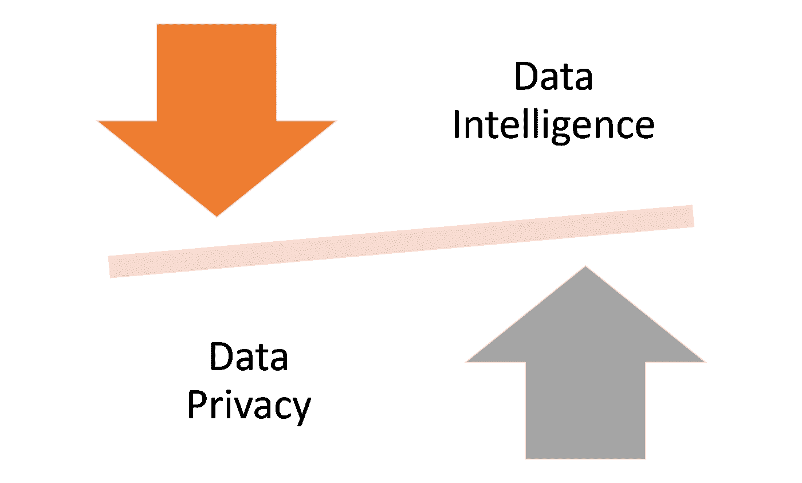
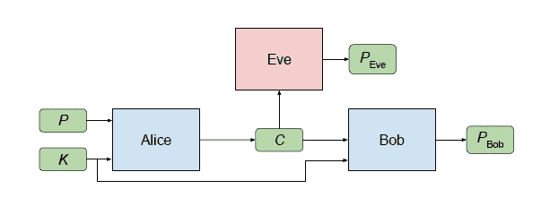
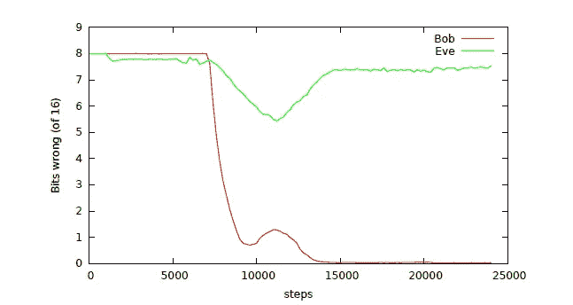
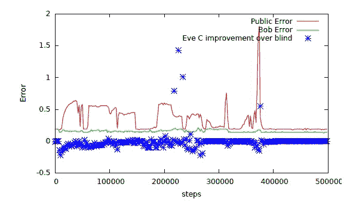

# 什么是对抗性神经密码学？

> 原文：<https://pub.towardsai.net/what-is-adversarial-neural-cryptography-70b461c7db88?source=collection_archive---------0----------------------->

## [密码术](https://towardsai.net/p/category/cryptography)

## 这种新方法将 GANs 和密码学结合在一个强大的安全方法中。

来源:[https://www . spin DOX . it/en/blog/generative-adversarial-neural-networks/](https://www.spindox.it/en/blog/generative-adversarial-neural-networks/)

> 我最近创办了一份专注于人工智能的教育时事通讯，已经有超过 80，000 名订户。《序列》是一份无废话(意思是没有炒作，没有新闻等)的 ML 导向时事通讯，需要 5 分钟阅读。目标是让你与机器学习项目、研究论文和概念保持同步。请通过订阅以下内容来尝试一下:

 [## 序列

### 订阅人工智能世界中最相关的项目和研究论文。受到 85，000 多人的信任…

thesequence.substack.com](https://thesequence.substack.com/) 

安全地共享数据是人工智能(AI)解决方案主流实施的最大障碍之一。人工智能既关乎数据，也关乎智能，而大型数据集是这个世界上少数几家公司的特权。因此，公司倾向于极其保护他们的数据资产，并且在与他人分享时非常保守。同样，数据科学家需要访问大型标记数据集，以验证他们的模型。隐私和智能之间的持续摩擦已经成为现代人工智能应用的主导动力。

对于任何一家公司来说，让一大群数据科学家和研究人员访问他们的数据，以便他们能够从中提取情报，比较和评估模型，并得出正确的解决方案，这将更加有价值。但是，他们如何保证他们的数据会得到保护，他们的客户的利益会得到保护，或者一些无良的数据科学家不会与竞争对手分享他们的情报？当遇到这个问题时，许多公司产生了匿名化其数据集的机制，但在许多情况下这几乎不是一个解决方案。

# 为什么匿名化不起作用？

数据匿名化似乎是数据隐私挑战的显而易见的解决方案。毕竟，如果我们可以模糊数据集的敏感方面，我们就可以实现一定程度的隐私。虽然这是一个理论上站得住脚的论点，但匿名化的问题是它不能阻止推理。让我们来看看这样一个场景:一家对冲基金分享了一只股票(比如苹果)的专有研究指标数据集，这些指标与它们的股价相关。即使苹果这个名字在数据集中模糊不清，任何聪明的数据科学家都可以通过一些基本的推理弄清楚。通常，经验法则是

*“如果数据集中的其他属性可以作为混淆数据的预测器，那么匿名化就不是一个好主意”😉*

# 同态加密

同态加密代表了密码学领域最大的突破之一，并且很可能在不久的将来成为许多人工智能应用的基础。从概念上讲，术语同态加密描述了一类满足同态特性的加密算法:即某些操作，例如加法，可以直接在密文上执行，从而在解密时获得与在原始消息上操作相同的答案。在人工智能的背景下，同态加密可以使数据科学家对加密数据进行操作，产生的结果就像他们对明文数据进行操作一样。

同态加密的主要问题是，这项技术的计算量仍然太大，不能在主流应用中考虑。基本的同态加密技术可以将 1MB 的数据变成 16GB，这使得它在人工智能场景中完全不切实际。更相关的是，同态加密技术(像大多数密码算法一样)通常是不可微的，这是对诸如随机梯度下降(SGD)等算法的要求，这是深度神经网络的主要优化技术。

*最近，分散人工智能新兴领域的一些公司声称，他们依赖同态加密作为其区块链平台的一部分。我怀疑这些说法大部分是纯理论的，因为同态加密的实际应用仍然非常有限。*

# GAN 密码术

在匿名化方法和同态加密之间，我们发现了一种由谷歌开创的新技术，它使用对抗性神经网络来保护信息免受其他神经模型的影响。详细介绍这种技术的研究论文于 2016 年底发表，题为[“学习用对抗性神经密码术保护通信”](https://arxiv.org/abs/1610.06918)，这无疑是我在过去两年中读过的最迷人的人工智能论文之一。

等等，我们在讨论用神经网络来加密？传统上，神经网络被认为在加密操作方面非常糟糕，因为它们很难执行简单的 XOR 计算。虽然这是真的，但事实证明，神经网络可以学习保护其数据的机密性，使其免受其他神经网络的影响:它们发现加密和解密的形式，而无需学习用于这些目的的特定算法。

GAN 加密方案的设置涉及三方:Alice、Bob 和 Eve。通常，Alice 和 Bob 希望安全地通信，而 Eve 希望窃听他们的通信。因此，期望的安全属性是保密性(而不是完整性)，对手是一个“被动攻击者”,可以拦截通信，但在其他方面非常有限。

来源:https://arxiv.org/abs/1610.06918

在上面描述的场景中，Alice 希望向 Bob 发送单个机密消息 P。消息 P 是对爱丽丝的输入。当爱丽丝处理这个输入时，它会产生一个输出 C(“P”代表“明文”，“C”代表“密文”。)Bob 和 Eve 都接收 C，对其进行处理，并尝试恢复 p。让我们分别用 PBob 和 PEve 来表示这些计算。Alice 和 Bob 比 Eve 有优势:他们共享一个密钥 K。该密钥[K]用作 Alice 和 Bob 的附加输入。

非正式地说，参与者的目标如下。Eve 的目标很简单:精确重构 P(换句话说，最小化 P 和 PEve 之间的误差)。Alice 和 Bob 想清楚地交流(尽量减少 P 和 PBob 之间的误差)，但也想对 Eve 隐藏他们的交流。

使用生成性对抗网络技术，爱丽丝和鲍勃被联合训练成功沟通，同时学习打败夏娃。关键是，Alice 和 Bob 对于他们将要用来实现目标的加密算法没有预先定义的概念，甚至对将要使用的技术也没有预先定义的概念。遵循甘原则，爱丽丝和鲍勃被训练打败最好版本的夏娃，而不是一个固定的夏娃。

GAN 密码实验的结果非常显著。正如你在下面的图表中看到的，大约经过 8000 步的训练，Bob 和 Eve 开始能够重建原始信息。在大约 10，000 步的训练后，爱丽丝和鲍勃网络似乎明白了这一点，伊夫的错误率再次攀升。换句话说，Bob 能够从 Eve 的行为中学习并保护通信以避免被攻击，同时仍然提高其效率。

来源:https://arxiv.org/abs/1610.06918

回到人工智能应用，GAN 密码术可用于在公司和神经网络之间交换信息，同时保持高水平的隐私。如果神经网络不能学习**如何**保护信息，但能够学习**在给定对手目标的情况下保护什么**呢？对于人工智能应用程序来说，这甚至将是一个更可行的解决方案，因为模型可以学习有选择地保护信息，保持数据集中的一些元素不加密，但防止任何形式的推断泄露敏感数据。

Google 团队在一个模型中采用了 GAN 加密体系结构，在该模型中，Alice 和 Bob 仍然共享一个密钥，但在这里 Alice 接收 A、B、C，并生成 D-public 以及一个密文；Bob 和 Eve 都可以访问 Alice 的输出；Bob 使用它们来产生 D 的改进估计，而 Eve 试图恢复 C。目标是证明对抗训练允许在不暴露 C 的情况下逼近 D，并且该逼近可以与加密信息和密钥相结合，以便获得 D 的更好逼近

为了了解系统是否正在学习正确地隐藏信息，研究人员使用了一个独立的评估器，我们称之为“盲 Eve”，它知道 C 的分布。盲 Eve 试图仅依靠这一基线信息来猜测 C，而真正的 Eve 也知道中间输出(D-public)和密文。如果 Eve 的重构误差变得与盲 Eve 的误差相等，那就是 Eve 没有成功地从公开估计和密文中提取信息的标志。这就是事实。在几个训练步骤之后，Eve 相对于“盲 Eve”的优势变得可以忽略，这表明 Eve 不能重建关于 C 的任何更多的信息，而仅仅通过知道 C 的值的分布是不可能的

来源:https://arxiv.org/abs/1610.06918

GAN 密码术是一种相对不为人知的技术，但在主流人工智能应用中却是至关重要的。从概念上讲，GAN 加密技术可以让公司与数据科学家共享数据集，而不必泄露其中的敏感数据。同时，神经模型可以对 GAN 加密的数据进行计算，而不必完全解密。