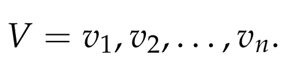
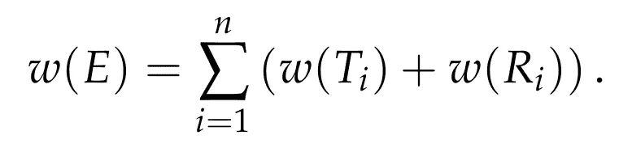
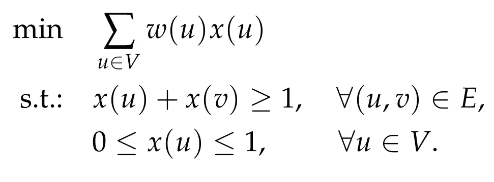
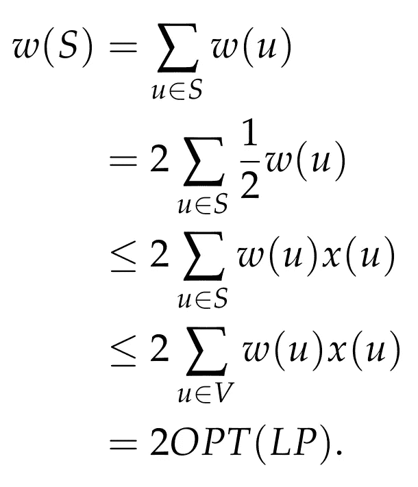

# 什么是近似算法？

> 原文：<https://pub.towardsai.net/what-is-an-approximation-algorithm-59f847cb03fd?source=collection_archive---------2----------------------->


苏阿德·卡玛丁在 [Unsplash](https://unsplash.com/s/photos/gap?utm_source=unsplash&utm_medium=referral&utm_content=creditCopyText) 上拍摄的照片

## [计算机科学](https://towardsai.net/p/category/computer-science)

## 用两个例子深入探讨近似算法

# 介绍

当我们面对一个组合优化问题时，我们的目标是设计一个满足三个重要性质的算法。

> (1)它是有效的，即相对于输入大小以时间多项式运行。
> 
> (2)它返回一个最优解。
> 
> (3)它适用于问题的每一个实例。

然而，当我们处理一个 [NP-hard](https://en.wikipedia.org/wiki/NP-hardness) 问题时，根本不清楚是否存在满足所有上述三个性质的算法。所以，稍微简化我们生活的一个自然的方法是放松这三个属性中的一个。在[近似算法](https://en.wikipedia.org/wiki/Approximation_algorithm)的情况下，我们决定放松属性(2)。这意味着我们对总是返回可行解的有效算法感兴趣，我们关心的是它们返回的解的值和最优解的值之间的差距。

> 更正式地说，如果给我们一个最优值为 OPT 的极小化问题，那么一个α-近似算法，对于某些α ≥ 1，是一个返回值至多为α OPT 的可行解的有效算法。
> 
> 同样，如果给我们一个最优值为 OPT 的最大化问题，那么一个α-近似算法，对于某些α ≥ 1，是一个返回值至少为 OPT / α的可行解的有效算法。

举个例子，假设我们有一个最小化问题的实例，它的最优值是 *100* ，我们也给出了一个*2*-近似算法。然后，如果我们在那个实例上运行这个算法，我们保证算法将返回一个可行的解，其值最多为 *2 x 100 = 200* 。

观察到一个*1*-近似算法是一个最佳解决给定问题的算法。

尽管在许多情况下，当涉及到实际应用时，近似算法被启发式算法所取代，但是它们作为探索有效计算的极限的理论工具是非常重要的，并且在过去的五十年中，围绕它们已经建立了非常丰富的理论。NP-hard 问题的一个特别吸引人的方面是，尽管它们在精确可解性方面都是等价的(在运行时间的多项式因子内),但在逼近性方面它们的行为是不同的。例如，存在 NP 难问题

*   允许任意好的近似算法，即*(1+ε)——*对任意常数 *ε > 0 或*的近似
*   具有常数因子近似值的问题，但该常数不能任意小，即，对于某些常数 *a ≥ 1* ，没有 *a* 近似值的问题，除非 *P = NP* ，或者
*   只有超常数因子近似算法的问题(如*(log n)*-近似)，或
*   根本无法近似的问题(除非 *P = NP* )。

设计近似算法是一项非常重要的任务，需要对问题有深刻的理解。一个重要的障碍通常来自于这样一个事实，即近似算法必须返回一个与最优值相当的解(在某个因子内),尽管计算这个最优值是 NP 难的！克服这一点的方法是研究问题的结构，并找到最佳值的良好替代。

例如，如果给我们一个最小化问题，那么情况可能是 *OPT* 有可有效计算的下限。如果是这种情况，那么我们可以根据下限 *LB* 而不是真实的 *OPT* 来评估算法的性能。如果我们能够设计一个算法，返回一个成本最多的解决方案

*成本≤ α LB，*

然后，由于 *LB ≤ OPT* ，我们立即得到

*成本≤ α OPT，*

这意味着我们有一个α近似算法！

同样的推理也适用于最大化问题，我们为 *OPT* 寻找一个好的上限 *UB* 。

在接下来的章节中，我们将讨论两个例子来说明人们在设计近似算法时使用的一些通用原则。第一个涉及最大化问题，第二个涉及最小化问题。

# 最大割的 2-近似算法

在[最大割问题](https://en.wikipedia.org/wiki/Maximum_cut)中，我们给出了一个图 *G = (V，E)* ，对于 *E* 中的每条边 *e* 都有边权值 *w(e) > 0* ，目标是计算顶点集的二分图 *{A，B}* ，使得集合 *A* 和 *B* 都是非空的，从而最大化

最大割问题是众所周知的 NP 难问题之一。在这一节中，我们将讨论一个非常简单的贪婪 *2* 近似算法。

我们从任意列举图的顶点开始。



算法很简单。换句话说，它一个接一个地处理顶点，并将每个顶点添加到分割的边上，该边使到目前为止切割的边的权重最大化。下面给出了算法的伪代码。

```
1) A = empty_set;2) B = empty_set;3) for i = 1,...,n:
       Let Tᵢ be the set of edges connecting vᵢ to A;
       Let Rᵢ be the set of edges connecting vᵢ to B;
       if w(Tᵢ) > w(Rᵢ) then
           add vᵢ to B;
       else
           add vᵢ to A;4) Return {A,B};
```

显而易见，上述算法在多项式时间内运行，并且总是返回可行解。为了评估它的性能，我们首先寻找最优值 *OPT* 的上界。一个直接的上界是 *w(E)* ，所有边的总权重。形式上，我们有

*OPT ≤ w(E)。*

事实证明，这是一个充分的界限，以便表明上述算法是一个*2*-近似算法。

为了分析该算法，我们首先观察在算法的某些迭代中将考虑图的每个边。更准确地说，一条边 *e = (vⱼ，vₖ)，*与 *j < k，*将属于 *Tₖ* 或 *Rₖ.*这意味着



给定算法做出的贪婪选择，在每次迭代 *i* 中，算法至少“削减”一半的权重 *w(Tᵢ) + w(Rᵢ)* 。这意味着算法返回的由二分切割的边的总权重 *w(A，B)* 为


由此，我们得到 *w(A，B) ≥ w(E)/2* 。并且由于 *OPT ≤ w(E)，*我们得出结论

*w(A，B) ≥ OPT/2。*

我们刚刚证明了我们的算法是一个 2-近似算法！此外，如果我们更仔细地看看这个证明，我们可以看到，我们还证明了在任何图中，至少存在一个二分图，它切割所有边的总重量的至少一半！


马库斯·斯皮斯克在 [Unsplash](https://unsplash.com/s/photos/tight?utm_source=unsplash&utm_medium=referral&utm_content=creditCopyText) 上的照片

在继续之前，我们注意到要问的一个重要问题是我们的分析是紧还是松。换句话说，有没有这样的情况，算法确实返回了一个权重为最优权重一半的解，或者这个 *2* 的因子是我们分析的一个假象？事实证明，上面的分析确实严密。

为了看到这一点，考虑一个三角形:

*   顶点 *a、b* 和 *c* 。
*   边 *(a，b)，(b，c)，(a，c)* 权重 *w(a，b) = w(a，c) = 1* ， *w(b，c) = ε* ，其中 *ε > 0* 是一个很小的数。

由于算法从顶点的任意顺序开始，它可能会按以下顺序考虑顶点: *b，c，a* 。在这种情况下，它会先将 *b* 分配给 *A* ，然后将 *c* 分配给 *B* ，再将 *a* 放置到 *A* 。因此，最终的二分将是

*   *A = {a，b}*
*   *B = {c}* 。

切边的重量为 *ALG = 1 + ε* 。然而，很容易看出，二分图 *A' = {a}* 和 *B' = {b，c}* 是最优的，并且切掉了总重量 *OPT = 2* 的边。我们的结论是，

*OPT/ALG ≥ 2/(1 + ε)，*

其中 *ε* 为任意小的数，因此该比值可以任意接近 *2* 。这意味着我们的分析是严密的。

最后一点，最大割问题有更强的近似算法，特别是，Goemans 和 Williamson 有一个非常漂亮的算法，它给出了大约 *1.139* 的更好的近似因子。

# 最小顶点覆盖问题的 2-近似算法

在[最小顶点覆盖问题](https://en.wikipedia.org/wiki/Vertex_cover)中，我们给出了一个顶点加权图 *G = (V，E)* ，对于 *V* 中的每一个 *u* ，其顶点权重 *w(u) ≥ 0* 。目标是计算最小权重的顶点 *S* 的子集，使得对于 *E* 中的每个边 *(u，v)* ，或者 *u* 包含在 *S* 中，或者 *v* 包含在 *S* 中(或者两者都包含)。

最小顶点覆盖问题是研究最多的 NP-hard 问题之一。我们现在将讨论当涉及到问题的近似性时，什么是本质上最先进的(与我们在这里提出的算法相比，该问题有一个稍微更强的算法，但是随着图形变大，它实现的改进趋向于 *0* )。

我们在上一节中讨论的获得 OPT 值的界限的最成功和最系统的方法之一是对问题使用某种凸松弛。在这里，直接写一个[线性规划](https://en.wikipedia.org/wiki/Linear_programming)松弛为题。对于每个顶点 *u* ，我们引入一个变量 *x(u)* 来表示该顶点是否被选择到我们的顶点覆盖中。通过去掉完整性约束，我们得到下面的有效可解线性规划。



最小顶点覆盖的 LP 松弛。

很容易看出，上述 LP 确实是问题的一个松弛，在这个意义上，每个可行顶点覆盖都可以编码为上述 LP 的一个解。这直接意味着上述 LP 的最优值 *OPT(LP)* 小于或等于最小顶点覆盖的值 *OPT* 。换句话说，我们刚刚获得了 *OPT* 的一个下界！

现在提出的算法非常简单。

```
(1) Solve LP relaxation and obtain optimal solution *x*.(2) Return *S*, where *S* is the set of vertices whose *x*-value is at least *1/2*.
```

显然，上述算法在多项式时间内运行。所以，有两件事要讨论。第一个是算法是否总是返回可行的顶点覆盖，第二个是返回的解的代价是什么。

为了解决第一点，让 *S* 是返回的集合，让( *u，v)* 是图的一条边。由于 *x* 是可行的 LP 解决方案，这意味着

*x(u) + x(v) ≥ 1，*

这意味着 *x(u)* 或 *x(v)* 至少是 *1/2* 。因此，顶点 *u* 和 *v* 中至少有一个将包含在 *S* 中，因此，集合 *S* 确实总是可行顶点覆盖。

我们现在将讨论电视机的成本。我们有



在上面的计算中，我们利用了 *S* 中的每个顶点 *u* 都满足 *x(u) ≥ 1/2* 的事实。最后，由于 *OPT(LP) ≤ OPT* ，我们得出结论

*w(S) ≤ 2 OPT。*

话说，上面的算法是一个*2*-近似算法！

和前面的例子一样，我们再次研究上述因素的紧密性。结果是 2 的因数又变得很紧了。这个例子很简单。我们考虑单条边 *(u，v)* ，其中 *u* 和 *v* 的权重都设置为 *1* 。设 *x(u) = x(v) = 1/2* 的解 *x* 是最优分式解。如果给我们的算法一个这样的解，那么我们的算法将返回集合{u，v}作为可行顶点覆盖，其权重为 *2* 。显然，最优解只选择了 *u* 或 *v* (而不是两者都选)并且权重为 *1* 。因此，两种解决方案之间的差距是 *2* 。

# 结论

近似算法的领域是广阔的，并且是相当技术性的，我们只是对用于设计好的近似算法的论点有一点了解。在我个人看来，这是一个充满美好想法和技术的领域，我们鼓励感兴趣的读者开始探索这一主题中的两本伟大的书籍，它们是:

*   Vijay V. Vazirani 的“近似算法[和](https://www.amazon.com/gp/product/3540653678/ref=as_li_tl?ie=UTF8&camp=1789&creative=9325&creativeASIN=3540653678&linkCode=as2&tag=harisangelida-20&linkId=d4f20f92de8fb877ee023498f6226bec)
*   David P. Williamson 和 David B. Shmoys 的《近似算法的设计》。

## 注意:以上文章包含亚马逊会员链接。