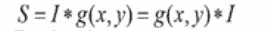
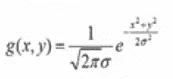
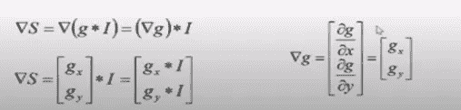
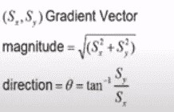
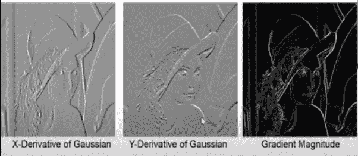
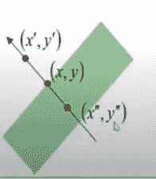
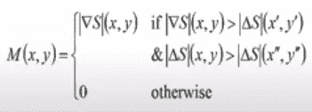
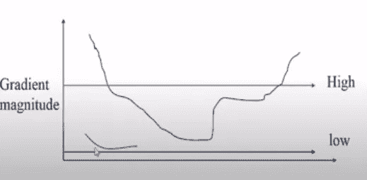

# 什么是 Canny 边缘检测算法？

> 原文：<https://pub.towardsai.net/what-is-canny-edge-detection-algorithm-95defef75492?source=collection_archive---------0----------------------->

## [计算机视觉](https://towardsai.net/p/category/computer-vision)

Canny 边缘检测器是一种多步算法，用于检测任何输入图像的边缘。它包括下面提到的在检测图像边缘时要遵循的步骤。

1.用高斯滤波器去除输入图像中的噪声。

2.计算高斯滤波器的导数以计算图像像素的梯度，从而获得沿 x 和 y 维度的幅值。

3.考虑任何曲线在垂直于给定边的方向上的一组邻居，抑制非最大边贡献者像素点。

4.最后，使用滞后阈值法保留高于梯度值的像素，忽略低于低阈值的像素。

在深入下面的步骤之前，是推导出该算法的 J . K Canny 的三个结论:

- **良好的检测:**最佳的检测器必须消除得到假阳性和假阴性的可能性。

- **良好定位:**检测到的边缘必须尽可能接近真实边缘。

- **单一响应约束:**检测器必须只为每个边缘点返回一个点。

【Canny 算法中需要遵循的步骤:

**噪声去除或图像平滑:**

在噪声存在期间，像素可能不接近于与其相邻像素相似。这可能导致获得不正确或不适当的边缘检测。为了避免同样的情况，我们使用高斯滤波器，它与图像卷积，消除噪声，防止输出图像中出现所需的边缘。

在下面的示例中，我们将高斯滤波器或内核 g(x，y)与图像 I 进行卷积。在这里，我们希望确保任何给定的像素在输出中都必须与其相邻像素相似，因此我们使用矩阵[1 1 1]来保持像素之间的相似性并去除噪声。

g(x，y)=高斯分布

I =输入图像

**衍生:**

计算滤波器在 X 和 Y 维度上的导数，并将其与 I 进行卷积，以给出沿维度的梯度幅度。此外，可以使用两个维度之间的角度的正切来计算图像的方向。

上述卷积产生一个具有大小和方向的梯度矢量。

下面是高斯导数的一个例子，它最终会影响输出图像的边缘。

**非最大抑制**

沿着边缘，通常观察到很少的点使得边缘的可见性更清晰。因此，我们可以忽略那些对特征可见性贡献不大的边缘点。为了达到同样的目的，我们使用非最大抑制法。这里，我们在边缘曲线上标记出幅度最大的点。这可以通过沿着垂直于曲线的切片寻找最大值来获得。

考虑下图中的边，它有三个边点。假设点(x，y)是具有最大边缘梯度的点。检查垂直于边缘的方向上的边缘点，并验证它们的梯度是否小于(x，y)。如果值小于(x，y)梯度，那么我们可以抑制曲线上的非最大值点。

**滞后阈值:**

如果像素处的梯度为:

-高于“高”时，将其声明为“边缘像素”

-下面，“低”将其声明为“非边缘像素”

-在“低”和“高”之间

*   反复考虑它的邻居，如果它连接到“边缘像素”或通过“低”和“高”之间的像素，则声明它为“边缘像素”

感谢阅读！！

穆巴拉克沙阿博士 youtube 视频的来源参考。