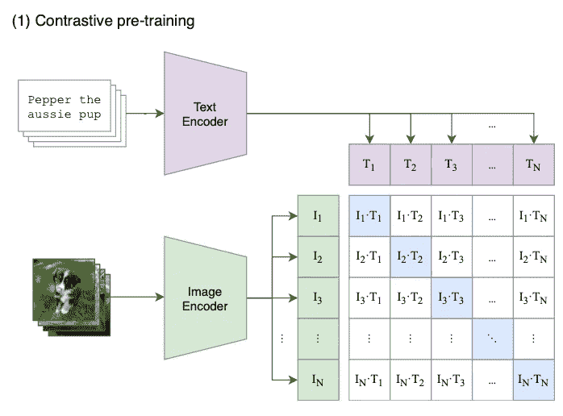
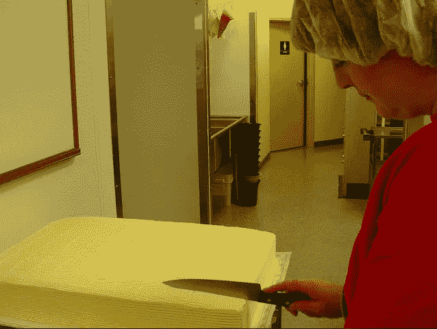
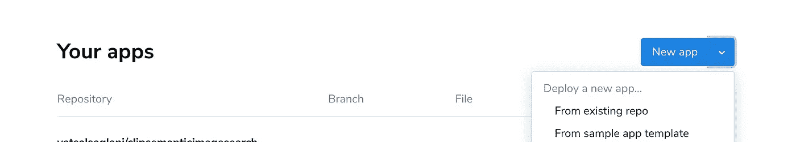
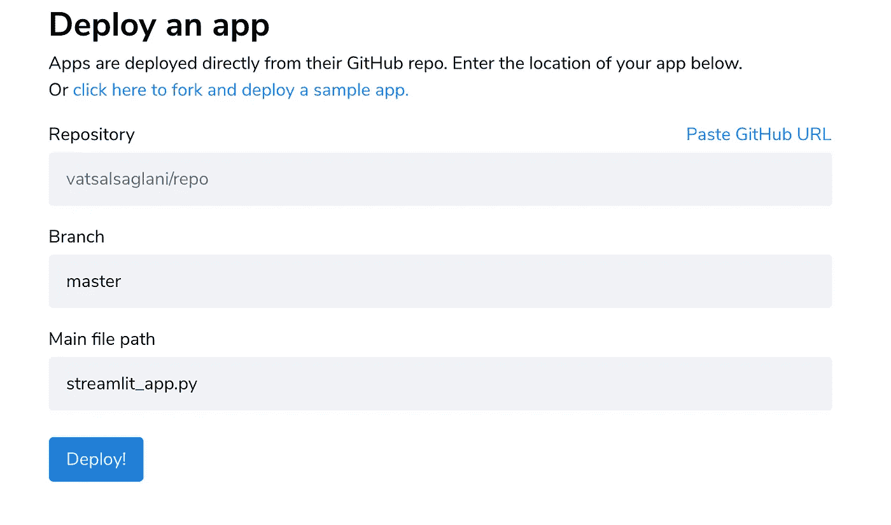

# CLIP(对比语言—图像预训练)是什么，如何用于语义图像搜索？

> 原文：<https://pub.towardsai.net/what-is-clip-contrastive-language-image-pre-training-and-how-it-can-be-used-for-semantic-image-b02ccf49414e?source=collection_archive---------0----------------------->

## [计算机视觉](https://towardsai.net/p/category/computer-vision)

## 深度学习搜索图像的方法


由[玛利亚·特内娃](https://unsplash.com/@miteneva?utm_source=unsplash&utm_medium=referral&utm_content=creditCopyText)在 [Unsplash](https://unsplash.com/s/photos/deep-learning?utm_source=unsplash&utm_medium=referral&utm_content=creditCopyText) 上拍摄的照片

最近，OpenAI 的研究人员发表了一种多模态架构，一旦在大约 4 亿个图像-文本对上进行预训练，就可以用于 30 种不同的任务。这种方法并不新鲜，以前许多其他研究人员试图使用文本转换器和预训练 CNN 模型的组合来预训练图像-文本对的模型，然后将其用于不同的向下任务。但是由于种种原因，这些方法并不像在[论文](https://cdn.openai.com/papers/Learning_Transferable_Visual_Models_From_Natural_Language_Supervision.pdf)中讨论的那样成功。尝试了各种预训练方法，包括预测和对比；在不同的向下任务中达到 SOTA 水平的精确度。在预测方法中，训练多模态架构来基于图像预测字幕。但这种方法在向下的任务中并不奏效，因为模型试图匹配文本中的精确单词。因此，使用对比方法通过联合训练图像编码器和文本编码器来从多模态表示中学习，以最大化正确(图像-文本)对之间的余弦相似性，并最小化不正确(图像-文本)对之间的余弦相似性。



来源:[回形针](https://cdn.openai.com/papers/Learning_Transferable_Visual_Models_From_Natural_Language_Supervision.pdf)

现在，我们如何使用这个预先训练好的模型进行语义图像搜索呢？我们有一个图像查询文本 T 和一堆不同的图像。文本编码器提供查询文本 t 的文本特征(`Tfeat`)。然后，我们遍历图像 Is，并使用图像编码器为每个图像 I 计算图像特征(`Ifeat`)，并计算图像特征和文本特征之间的点积相似度。由于预训练目标最大化了正确(图像、文本)对的相似性得分，因此我们可以认为最大点积值意味着最大相似性。所以对于每张图片，我们计算点积相似度，然后按照分数降序排列。余弦相似性也可以用来计算相似性得分，但 GPU 在矩阵乘法上更快，因此，这里我将使用点积。让我们进入编码。在这篇博客中，我们将使用 Unsplash API 从查询文本中获取图像。使用来自 Unsplash API 的查询文本和图像，我们将根据上面讨论的技术对它们进行排序。

# 下载剪辑模型和包

```
pip install git+https://github.com/openai/CLIP.git
```

# 加载模型并计算相似性

这里，我们将从 **COCO Captions** 数据集中随机选择三张图片，并提供一个标题，然后检查它是如何工作的。

```
import torch
import clip
from PIL import Imageimages = ['391895.png', '522418.png', '318219.png']
text = 'a man with red helmet on a moped'simScore = []
tokenizedText = clip.tokenize(text).to(device)
for img in images:
    image = preprocess(Image.open(os.path.join(path, img))).unsqueeze(0).to(device)
    with torch.no_grad():
        image_features = model.encode_image(image)
        text_features = model.encode_text(tokenizedText)

		# append image name with similarity score
    simScore.append((img, torch.matmul(text_features, image_features.T)[0][0]))print(simScore)# output
[('391895.png', tensor(21.2141)),
 ('522418.png', tensor(11.7804)),
 ('318219.png', tensor(10.6959))]
```



来源:可可字幕数据集(391895.png，391895.png)

# 使用 Streamlit share 部署图像语义搜索应用程序

在 [Unsplash](https://unsplash.com/join) 上注册一个开发者账户，创建一个应用程序并获得访问密钥。

**创建** `**streamlitcliputils.py**` **文件并跟随**

*   导入和模型加载

```
import torch
import clip
from PIL import Image
import os
import re
from tqdm import tqdm, trange
import random
import requests
import numpy as np
import streamlit as stglobal model, preprocess, devicedevice = 'cpu'model, preprocess = clip.load("ViT-B/32", device = 'cpu')
```

*   使用 API 从 Unsplash 获取基于查询文本的图像

```
def getImagesFromUnsplash(total: int, query_text: str):
    '''
    Images from query text
    '''
    num_page = 1
    imgs_total = total
    query = query_text
    url = f"<https://api.unsplash.com/search/photos?query={query_text}&page={num_page}&per_page={imgs_total}>" headers = {
        "Authorization": f"Bearer Client-ID {UPSPLASH_API_KEY}", } req = requests.get(url, headers = headers) resp = req.json() regUrls = [r['urls']['regular'] for r in resp['results']] return regUrls
```

*   图片链接到`PIL.Image`

```
def linkToImage(link):
    '''
    Image URL to PIL.Image
    '''
    content = requests.get(link, stream = True)
    content = content.raw
    img = Image.open(content)
    return img
```

*   计算相似性得分

```
@st.cache(show_spinner=False)
def getImageTextSimScore(link, text):
    '''
    Compute similarity score from image feature
    and text feature
    '''
    image = preprocess(linkToImage(link)).unsqueeze(0).to(device)
    tokenizedText = clip.tokenize(text).to(device)
    with torch.no_grad():
        image_features = model.encode_image(image)
        text_features = model.encode_text(tokenizedText)

    simScore = torch.matmul(text_features, image_features.T)[0][0] return simScore.item()
```

*   从 Unsplash 获取图像并排序

```
@st.cache(show_spinner=False)
def getSortedQuery(text):
    '''
    Get images from text and sort
    using similarity score
    ''' upSplashImages = getImagesFromUnsplash(10, text)

    imgSimScore = [] for ix, img in enumerate(tqdm(upSplashImages)): imgSimScore.append((img, getImageTextSimScore(img, text)))

    imgSimScore = sorted(imgSimScore, key = lambda x: x[1], reverse=True) return imgSimScore, upSplashImages
```

**创建** `**streamlitapp.py**` **文件**

```
from streamlitcliputils import *
import streamlit as st
import io
from PIL import Imagest.set_page_config(
    page_title = 'CLIP',
    page_icon = '🎑'
)st.header("CLIP - Semantic Image Search")
imageText = st.text_input("Search Image")if imageText:
    with st.spinner(text = 'Getting Images from Unsplash and sorting with clip ...'):

        imgSimScore, upSplashImages = getSortedQuery(imageText) images = [linkToImage(img) for img, score in imgSimScore]
        simScore = [f'Sim Score: {score:.2f}' for img, score in imgSimScore] upSplashImages = [linkToImage(img) for img in upSplashImages]
        upSplashIx = [i+1 for i in range(len(upSplashImages))] col1, col2 = st.beta_columns(2) col1.header("Semantic Search")
        col1.image(images, width = 300, caption = simScore) col2.header("Images from Unsplash")
        col2.image(upSplashImages, width = 300, caption = upSplashIx)
```

现在，要使用 Streamlit share 部署应用程序，您需要有一个经过批准的 Streamlit Share 帐户，您可以在此处注册一个。要使用 streamlit share 部署您的应用程序，您需要使用一个`requirements.txt`文件将代码推送到 GitHub。

*   将包添加到`requirements.txt`

```
tqdm==4.56.0
git+https://github.com/openai/CLIP.git
requests==2.25.1
streamlit==0.74.1
torch==1.7.1
numpy==1.20.0rc2
Pillow==8.1.0
```

您可以创建一个 GitHub 存储库并推送您的文件。然后转到 streamlit share 控制台，单击新应用程序下拉菜单，选择“From Existing Repo”。



来源:作者

选择 repo 名称，并在主文件路径输入中提供文件名



来源:作者

单击部署，您将进入部署屏幕，您的应用将在几分钟内完成部署。语义搜索的实时版本可从[这里](https://share.streamlit.io/vatsalsaglani/clipsemanticimagesearch/streamlitClip1/streamlitapp.py)获得

你可以看看这个视频，看看这个模型的表现。

来源:作者

作为博客的总结，我们讨论了 CLIP 的训练方法以及如何将其用于语义图像搜索，然后我们使用 Unsplash API 来查询图像，并使用使用 CLIP 计算的相似性得分进行排序。我希望你喜欢看这个博客。