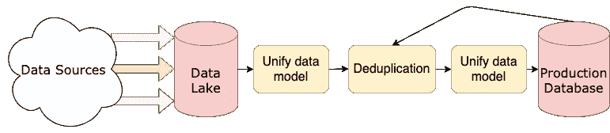
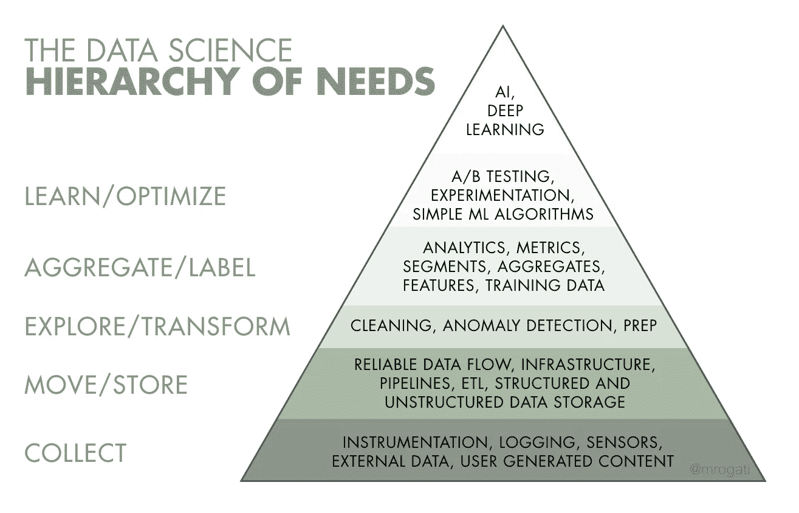
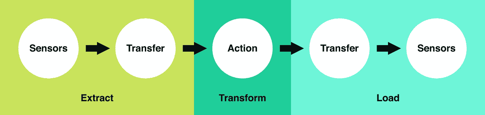

# 什么是数据工程，谁是数据工程师，他们在数据科学中扮演什么角色，如何成为一名数据工程师？

> 原文：<https://pub.towardsai.net/what-is-data-engineering-who-are-data-engineers-what-role-do-they-play-in-data-science-and-how-d6a54e64b50c?source=collection_archive---------1----------------------->

## [数据工程](https://towardsai.net/p/category/data-engineering)

## 数据工程:简介！

照片由 [CHUTTERSNAP](https://unsplash.com/@chuttersnap?utm_source=unsplash&utm_medium=referral&utm_content=creditCopyText) 在 [Unsplash](https://unsplash.com/s/photos/warehouse?utm_source=unsplash&utm_medium=referral&utm_content=creditCopyText) 上拍摄

从帮助脸书在照片上给你贴标签，到帮助网飞和 Spotify 向你推荐你最喜欢的电影和歌曲，数据科学领域发展迅速，并创造了大量宣传。数据科学和数据科学家的职业已经变得非常抢手，也是要求最高的工作。根据《哈佛商业评论》的报道，它被评为 21 世纪最热门的工作。一个熟练的数据科学家可以通过利用数据的巨大力量为企业增加巨大的价值。但是数据工程到底是什么？谁是数据工程师，他或她在数据科学中扮演什么角色？在本文中，我们将学习数据工程的比特和字节。

## **什么是数据工程？**

数据无处不在，并且每天都在呈指数级增长。这就产生了一个新的(尽管不是很新)数据工程领域，它是数据科学的一个分支学科，完全专注于大量数据的收集、传输、转换和存储。也许你已经在网上看到了一些大数据的招聘信息，并对处理 Pb 级数据的前景感到好奇。也许你从来没有听说过数据工程，但有兴趣知道应用程序开发人员如何处理当今大多数应用程序所需的大量数据。无论你属于哪一类，这篇介绍性文章都适合你。你将对这个领域有一个概述，包括什么是数据工程，它做什么样的工作。

我们知道，大多数公司在其数据库中以各种格式存储有价值的数据。为了理解什么是数据工程，首先我们需要关注“*工程*部分。工程和工程师被用来设计、建造和实现各种复杂的系统，以使我们的生活更加轻松。因此，数据工程师设计、构建和实施系统和工具，将原始数据转换为数据科学家或组织的其他用户可以用于不同目的的更复杂和可用的格式。这些系统通常称为数据管道，收集、保存、验证和转换来自各种来源的数据，并将它们存储在一个数据库中，通常称为数据仓库。

数据工程是数据科学的一部分，侧重于数据的实际应用和收获。数据工程和数据科学一样重要。不管你对学习数据工程的兴趣水平如何，确切地知道数据工程是什么是很重要的。《气流》的原作者 Maxime Beauchemin 在他的博文 [**中对数据工程进行了定性【数据工程师**](https://www.freecodecamp.org/news/the-rise-of-the-data-engineer-91be18f1e603/) 的崛起:

> 数据工程领域可以被认为是商业智能和数据仓库的超集，它带来了软件工程的更多元素。该学科还集成了围绕所谓“大数据”分布式系统操作的专业化，以及围绕扩展 Hadoop 生态系统、流处理和大规模计算的概念。

由 [Boitumelo Phetla](https://unsplash.com/@writecodenow?utm_source=unsplash&utm_medium=referral&utm_content=creditCopyText) 在 [Unsplash](https://unsplash.com/s/photos/data-science?utm_source=unsplash&utm_medium=referral&utm_content=creditCopyText) 上拍摄的照片

## **谁是数据工程师，他/她在数据科学中扮演什么角色？**

总的来说，数据科学是一个非常广阔的领域，它提供了多种角色，包括从收集、清理、处理、分析和部署预测模型或机器学习算法的一切。在许多公司，他或她所扮演的角色可能没有特定的头衔。数据工程师将原始数据转换成有用的格式进行分析。

像数据科学家一样，数据工程师也写代码。但与数据科学家不同，数据工程师构建工具、基础设施、框架和服务。我们可以说，数据工程更接近于软件工程，而不是数据科学。

数据工程师收集的数据可用于各种数据驱动的工作，如测试、培训和开发机器学习模型、执行 EDA、设计系统架构和数据库设计。这些数据可以通过多种方式获得，使用特定的工具、技术和技能来获得数据在不同的组织和期望的结果之间会有很大的差异。然而，一种常见的模式是**数据流水线**。数据管道是由许多独立程序组成的系统，这些程序对收集的数据进行各种操作。数据管道通常分布在多个服务器上:

[来源](https://realpython.com/python-data-engineer/)

根据数据的来源，使用数据管道对收集的数据进行批量处理。数据工程师负责这些管道。数据工程团队负责收集、设计、构建、实现、维护、扩展，通常还负责支持这些数据管道的基础设施。他们还可能负责通过各种来源收集输入数据，以及如何更频繁地存储这些数据。

许多数据工程团队还负责构建高效的数据平台。对于许多公司来说，只有一个数据管道来收集传入 SQL 数据库的数据是不够的。许多大公司每天收集大量数据，他们有多个团队需要不同类型的数据用于不同的目的。

由[马丁·施瑞德](https://unsplash.com/@martinshreder?utm_source=unsplash&utm_medium=referral&utm_content=creditCopyText)在 [Unsplash](https://unsplash.com/s/photos/technology?utm_source=unsplash&utm_medium=referral&utm_content=creditCopyText) 上拍摄的照片

## **数据工程师的职责:-**

数据科学家或其他团队用于分析的数据必须经过清理，并可供组织中所有相关用户访问。这些需求在 Monica Rogarty 的优秀文章 [*《人工智能需求层次*](https://hackernoon.com/the-ai-hierarchy-of-needs-18f111fcc007) 中有充分的解释。作为一名数据工程师，您有责任满足客户的数据需求。然而，你会用各种方法来满足他们的个人需求。

数据工程主要属于层次结构的第二和第三层。[来源](https://hackernoon.com/the-ai-hierarchy-of-needs-18f111fcc007)

要对数据执行各种操作，首先必须确保系统有连续的数据流。这些数据可以来自不同的来源——

1.  推文、喜欢、评论、视频和图像等。
2.  传感器、工业设备、医疗设备、游戏、卫星、闭路电视等。
3.  发票、支付指令、收据、实时流等。

数据工程师通常负责收集和存储这些数据，设计一个系统，该系统可以从一个或多个来源收集这些数据作为输入，转换这些数据，然后为用户存储这些数据。这些系统被称为 **ETL** 管道，分别代表**提取**、**转换**、**加载**。记住 ETL 是一个非常宽泛的概念。不仅仅是这三个步骤。ETL 过程在技术上非常具有挑战性，需要所有数据工程师、数据科学家、开发人员、分析师、SWE 和其他人的积极参与。

[来源](https://robinhood.engineering/why-robinhood-uses-airflow-aed13a9a90c8)

ETL 的第一步是抽取。在这一步中，来自各种来源的数据以各种格式提取出来。这一步通常很耗时。数据工程师负责将数据拉入数据管道。但这还不止于此。他们必须确保管道足够健壮，能够在意外事件中保持运行，例如数据损坏、服务器离线以及错误和病毒。保持系统全天候运行非常重要，尤其是在收集实时数据或时间敏感数据时。

**ETL** 流程的第二步是**转换**。在提取和存储数据之后，需要将数据传输到整个组织的物理系统，以供进一步分析。因此，通过使用不同的工具和技术对数据进行清理和处理，并将其转换为单一的标准可用格式。这包括过滤数据、清理、连接、创建、拆分和删除数据等任务。

**ETL** 过程的第三步也是最后一步是**装载**。在最后一步中，数据被加载到目标数据仓库中。有时，数据工程师会频繁地更新和更改这些数据。

泰勒·维克在 [Unsplash](https://unsplash.com/s/photos/server-room?utm_source=unsplash&utm_medium=referral&utm_content=creditCopyText) 上的照片

## 数据工程师挣多少钱？

根据工资等级表，数据工程师在₹835 的平均年薪是 135 英镑，根据技能、经验和工作地点的不同，₹的年薪从 47 万英镑到₹的 1847931 英镑不等。

[来源](https://www.payscale.com/research/IN/Job=Data_Engineer/Salary)

## **数据工程所需技能—**

数据工程师需要具备以下技能

1.  编程语言——SQL、Python、R、Java、Julia、MATLAB 等。
2.  RDBMS 和非 RDBMS——MySQL、PostgreSQL、MS SQL Server、MongoDB、DynamoDB 等。
3.  云技能— AWS、GCS、Azure 等。
4.  分布式系统——Apache Kafka、Hadoop、Spark 等。
5.  机器学习算法
6.  ETL 工具

## **软技能—**

1.  演示技巧
2.  商业头脑
3.  沟通
4.  合作

丹尼尔·施鲁迪在 [Unsplash](https://unsplash.com/s/photos/books?utm_source=unsplash&utm_medium=referral&utm_content=creditCopyText) 上拍摄的照片

## **如何成为一名数据工程师？**

成为一名数据工程师没有明确的道路。如果你想成为一名数据工程师，这里有一些你可以参加的课程

1.  [成为数据工程师— Udacity 纳米学位](https://www.udacity.com/course/data-engineer-nanodegree--nd027)
2.  [谷歌云数据工程 Coursera 专业证书](https://www.coursera.org/professional-certificates/gcp-data-engineering)
3.  [数据工程基础专业— IBM by Coursera](https://www.coursera.org/specializations/data-engineering-foundations)
4.  [大数据专业化— Coursera](https://www.coursera.org/specializations/big-data)
5.  微软认证:Azure 数据工程师助理
6.  [AWS 认证大数据—专业](https://aws.amazon.com/certification/certified-big-data-specialty/)
7.  [Data camp 的数据工程简介](https://www.datacamp.com/courses/introduction-to-data-engineering)
8.  [数据工程师跟踪数据请求](https://www.dataquest.io/path/data-engineer/)

## **结论—**

至此，我们结束了对数据工程的介绍。现在你可以决定是否要深入这个真正令人兴奋且回报丰厚的领域。这让你兴奋吗？你有兴趣更深入地探索它吗？请在下面的评论中告诉我！

*感谢阅读！！*