# 什么是深度学习？

> 原文：<https://pub.towardsai.net/what-is-deep-learning-34767bb10366?source=collection_archive---------0----------------------->

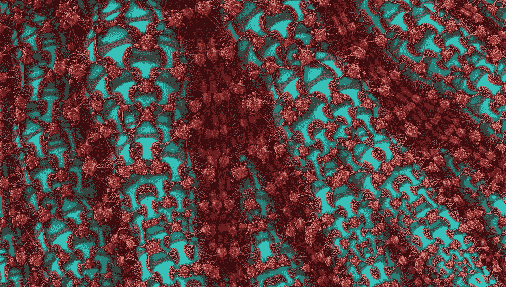

来源: [Pixabay](https://pixabay.com/illustrations/web-network-neural-network-1487046/)

## [深度学习](https://towardsai.net/p/category/machine-learning/deep-learning)，[社论](https://towardsai.net/p/category/editorial)

## 深入探讨“什么是深度学习”,同时提供关于深度学习、其工作原理以及一些示例实现的激动人心的简单介绍

**作者:**桑妮娅·帕维斯，[罗伯特·伊里翁多](https://mktg.best/vguzs)

**本教程的代码可在**[**Github**](https://github.com/towardsai/tutorials/tree/master/deep-learning)**上获得，其完整实现也可在**[**Google Colab**](https://colab.research.google.com/drive/1sV7ZaSegIvR6nL8IYFapSOyd2DBJ-qiY?usp=sharing)**上获得。**

[](https://towardsai.net/members) [## 加入我们吧↓

### “走向人工智能”是一个讨论人工智能、数据科学、数据可视化、深度学习的社区

towardsai.net](https://towardsai.net/members) 

# 介绍

在过去十年中，深度学习在现实生活应用和研究中的使用变得至关重要，例如，随着图像识别、迁移学习、计算机视觉、推荐系统、语言理解、医疗保健、机器智能等领域的进步[ [2](https://www2.cs.duke.edu/courses/spring20/compsci527/papers/Pouyanfar.pdf) ] [ [9](https://www.youtube.com/watch?v=TFlV57P8JKo) ]。

例如，如果你曾经使用脸书发布照片，你可能已经见证了他们的技术如何识别照片中的人。这些可以是你的朋友，也可以是朋友的朋友，在大多数情况下，即使照片不清晰模糊，他们的图像识别软件在识别其中的人并自动标记他们上的准确率也很高[ [1](https://engineering.fb.com/2017/02/02/ml-applications/building-scalable-systems-to-understand-content/) ]。

然而，深度学习的应用不仅仅局限于图像识别。本教程将提供一条通往**深度学习**的直截了当的基本路径，同时解释它如何工作、它的应用和它的实现。

现在，让我们开始吧！

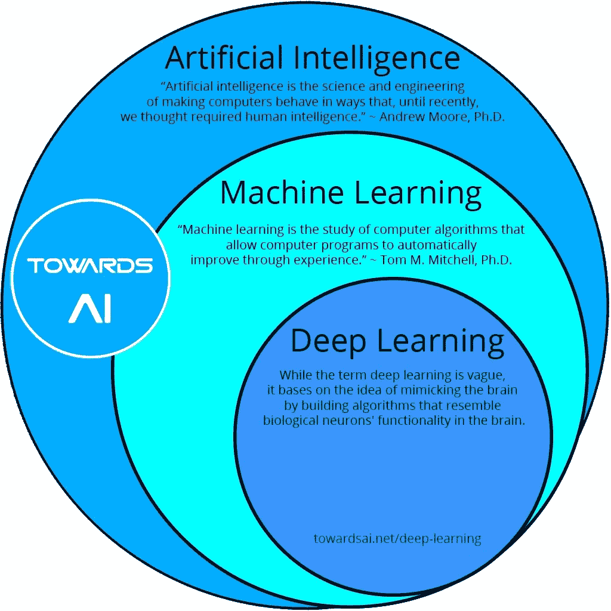

图 1:人工智能(AI) vs 机器学习(ML) vs 深度学习(DL)。

# 什么是深度学习？

**深度学习** (DL)是 [**机器学习**](https://mld.ai/mldcmu) (ML)方法论的一个独特子集，使用 [**人工神经网络**](https://towardsai.net/p/machine-learning/building-neural-networks-from-scratch-with-python-code-and-math-in-detail-i-536fae5d7bbf) (ANNs)不知不觉中受人类大脑中发现的神经元结构的启发。

在深度学习中，单词 **deep** 意义重大，因为它指的是人工神经网络中的大量层。如今，深度学习是一种成功的方法，主要是由于训练数据的大量可用性和相对低成本的 GPU 用于非常高效的数值计算[ [3](https://d2l.ai/chapter_introduction/index.html) ]。

从根本上说，深度学习旨在学习从经验中表现世界。把它想象成黑盒中的统计数据，然而，它在学习模式方面非常有效。

总而言之:

> 深度学习可以定义为输入和输出之间的一系列层，在类似于人脑的一系列阶段[ [14](https://www.cs.brandeis.edu/~cs136a/CS136a_Slides/DeepLearning_Corne.pdf) ]中执行特征识别和处理。它的目标是通过构建模拟大脑中生物神经元功能的算法来模仿人脑。

# 机器学习与深度学习

图 2 解释了机器学习和深度学习的工作流程之间的清晰和概念性的想法:

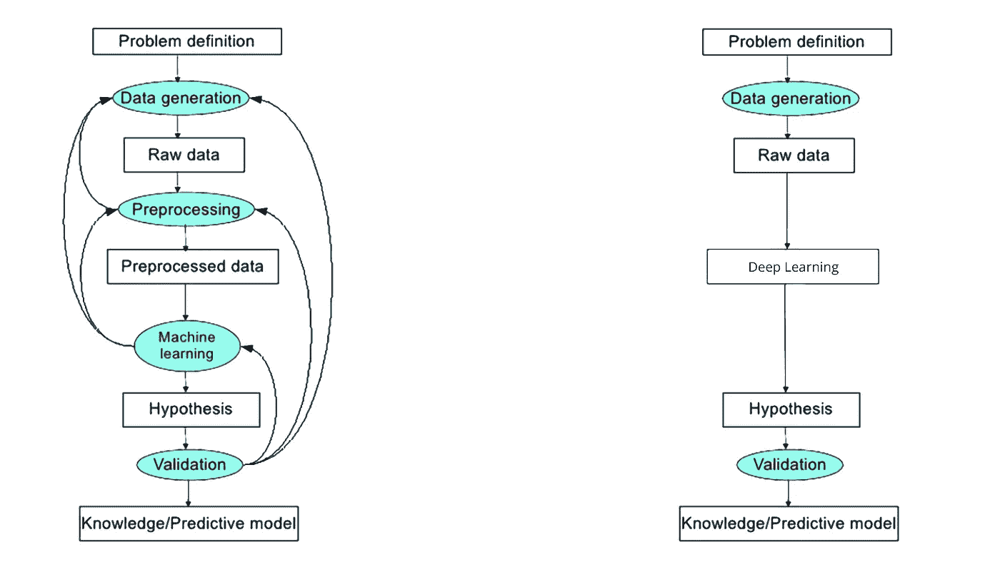

图 2:机器学习与深度学习工作流程。

# 深度学习简史

深度学习的早期阶段可以追溯到 1943 年，当时沃尔特·皮茨和沃伦·T21、麦卡洛克创建了一个基于人脑神经回路的计算机模型。研究人员将算法和其他逻辑结合起来模拟人脑，开发人工神经网络的努力来自**阿列克谢·格里戈里耶维奇·伊瓦赫年科**。

在 1979 年**，**，**福岛**设计了具有多个池和卷积层的神经网络。他们的设计让计算机能够轻松地学习和识别事物。在 **1989 年**， **Yann LeCun** 在贝尔实验室提供了第一个反向传播的实际演示。他将卷积神经网络与反向传播结合起来，读取“**手写**”数字[ [15](https://nyuscholars.nyu.edu/en/publications/handwritten-digit-recognition-applications-of-neural-net-chips-an-2) ]。

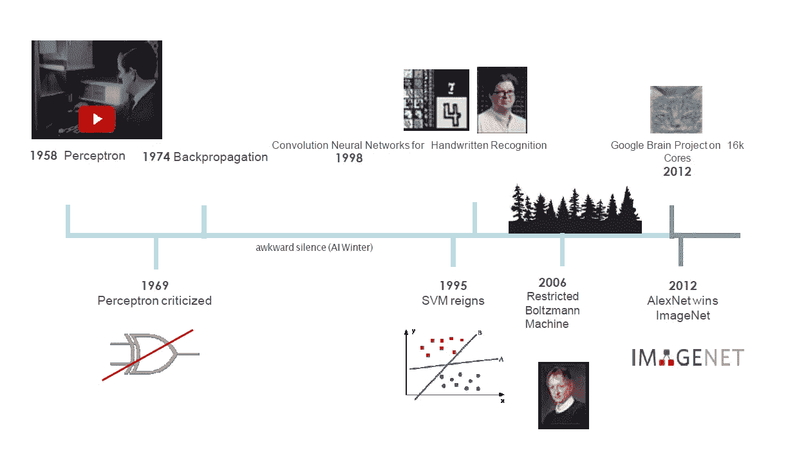

图 3:深度学习进化相关简史[ [10](https://dreaven.github.io/papers/deep_learning_lecture_at_columbia.pdf) ]。

# 深度学习的有用术语

查看深度学习中使用的以下术语:

*   **模型**:模型是通过实现算法从数据中学习到的**特定表示**。模型也被称为**假设**。
*   **特征:**特征是我们数据的一个具体的、可测量的属性。特征向量可以方便地描述一组数字特征。深度学习模型将特征向量作为输入。例如，为了预测一种水果，可能有颜色、气味、味道等特征。
*   **目标(标签):**目标变量或标签是我们的模型要预测的值。
*   **训练:**方法是给定一组输入(特征)，它是必需的输出(标签)，所以在训练之后，它有一个模型(**假设**)，然后将新数据映射到被训练的类别之一。
*   **预测:**一旦一个模型准备好了，就可以给它输入一组输入来提供一个预测的输出(标签)。
*   **历元:**历元是一种超参数，它是一次迭代，由一次前向传递和一次后向传递组成。由于一个历元不能应用于一个巨大的数据集，它被划分成多个批次。迭代是指完成一个历元所需的批次数量。例如，如果数据集中有 *5000 个*样本，并且需要找到一个时期。假设有 500 个批次，那么将有 **10 次迭代**来完成 1 个历元。
*   **神经元**:在深度学习中，神经元是模拟**生物神经元功能**的数学函数。通常，一个神经元计算其输入的加权平均值，这个和通过一个非线性函数传递，通常称为激活函数，如 **sigmoid** 。
*   **轴突:**它们是我们神经系统的抽象表示，神经系统包含一组神经元，这些神经元通过所谓的**轴突相互通信。**
*   **层:** A 层是深度学习中最高级的构建块。层是一个容器，通常接受加权输入，用一组非线性函数对其进行转换，然后将这些值作为输出传输到下一层。
*   **密集层:**密集层表示矩阵向量乘法。**密集层是规则的、深度连接的**神经网络**层。这是最常见和最常用的层。**

# **神经元**

**生物神经元激发了深度学习神经元的形成。**

# **生物神经元**

**生物神经元由以下组成:**

*   ****一个细胞体或胞体。****
*   ****一个或多个树突**:其主要职责是接收来自其他神经元的信号。**
*   ****轴突:**它将同一神经元产生的信号传递给其他相连的神经元。**

**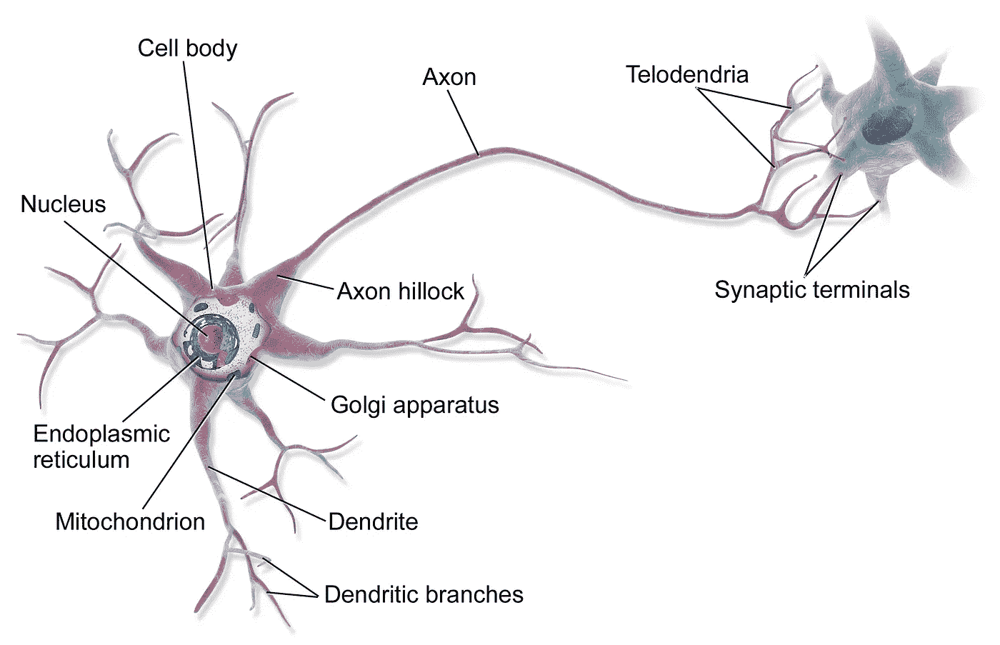**

**图 4:一个生物神经元。| BruceBlaus， [CC BY 3.0](https://creativecommons.org/licenses/by/3.0) ，via [Wikimedia Commons](https://commons.wikimedia.org/wiki/File:Blausen_0657_MultipolarNeuron.png)**

**从一个阶段到另一个阶段的过渡是由树突拾取的信号所代表的外部刺激引起的。每个信号都有兴奋或抑制作用[ [4](https://www.amazon.com/Deep-Learning-TensorFlow-Explore-networks/dp/1786469782) ]。神经元处于积累所有接收信号的空闲状态。**

# **人工神经元**

**类似于生物过程，人工神经元包括:**

*   **为了从一个或多个输出连接中收集数字信号，一个或多个输入链接携带其他**神经元的信号**。**
*   **每个神经元给人工神经元用来考虑发送的每个信号的链路分配一个**权重**。**
*   **一个或多个输出链路为其他神经元传送信号。**
*   **一个**激活函数**确定输出信号的数值，该数值基于从与其他神经元的输入连接接收的信号。**

**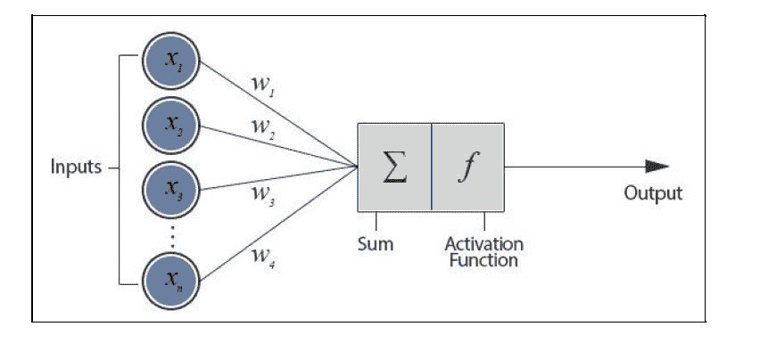**

**图 5:感知器的图形表示，神经网络模型|杰拉多·弗朗西斯科·佩雷斯·拉耶德拉， [CC BY 3.0](https://creativecommons.org/licenses/by/3.0) ，通过 UPCommons，开放访问[ [11](https://upcommons.upc.edu/bitstream/handle/2117/117737/131440.pdf?sequence=1&isAllowed=y)**

**以下是人工神经元的方程式:**

**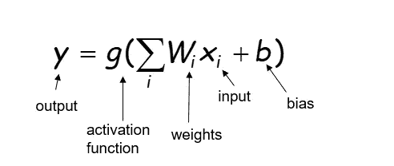**

**图 6:人工神经元的方程式。**

**因此，总结神经元:**

> ***神经元是神经网络的基本单位。一个神经元接受输入，对它们进行一些数学运算，并产生一个输出[* [*5*](https://victorzhou.com/blog/intro-to-neural-networks/) *]。***

**图 7 显示了一个双输入神经元的示意图:**

**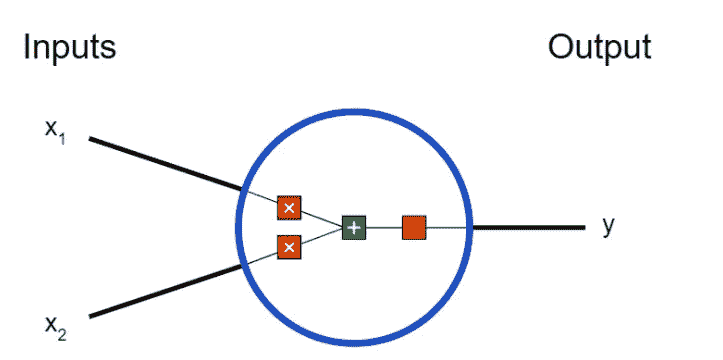**

**图 7:由[Victor Zhou](https://victorzhou.com/)[[5](https://victorzhou.com/blog/intro-to-neural-networks/)[[12](https://github.com/vzhou842/victorzhou.com/blob/master/NOTICE)]创作的 [MIT 许可](https://github.com/vzhou842/victorzhou.com/blob/master/NOTICE)下的双输入神经元、知识共享图像。**

**在图 6 神经元中发生了以下计算:**

****每个输入都乘以一个权重:****

**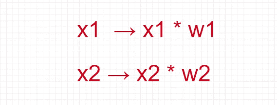**

**图 8:输入乘以权重。**

****所有加权输入与 *a* 偏差 *b* :** 相加**

**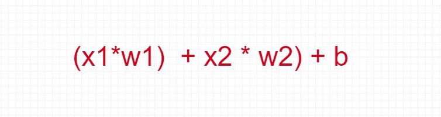**

**图 9:加权输入与偏差 b 相加。**

****最后，总和通过一个激活函数传递:****

**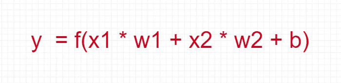**

**图 10:激活函数方程。**

****激活函数**用于将一个无界输入转换成一个友好的、可预测形式的输出。**

# **在神经网络上组合神经元**

**神经网络只不过是一组神经元的组合。图 11 显示了一个简单的人工神经网络的样子:**

****

**图 11:前馈神经网络[ [8](https://towardsai.net/p/machine-learning/main-types-of-neural-networks-and-its-applications-tutorial-734480d7ec8e) ]的表示。**

**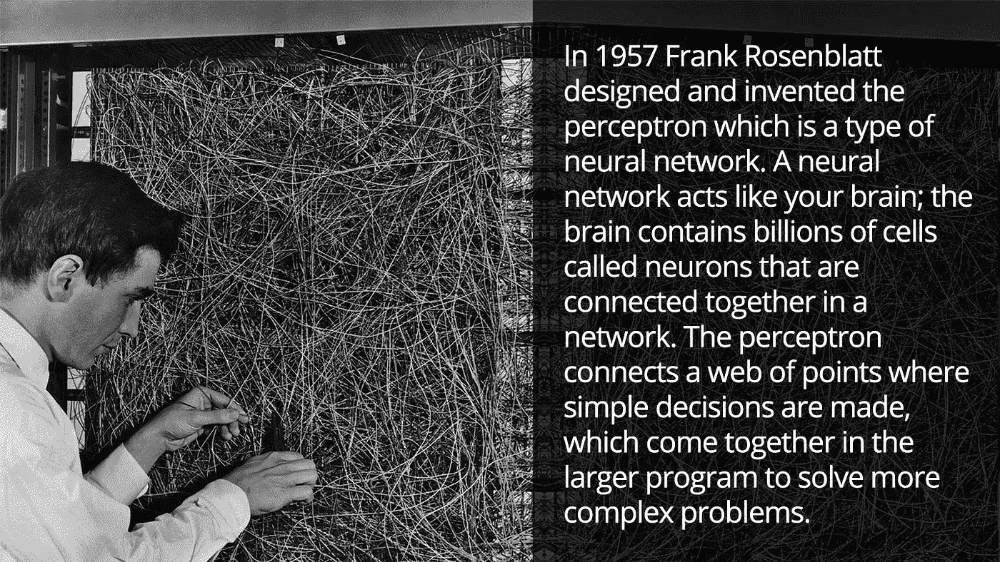**

**图 12:感知机:大脑中信息存储和组织的概率模型[16] |来源:康奈尔航空实验室的弗兰克·罗森布拉特的 Mark I 感知机。纽约水牛城，1960 年[17]**

# **感知器**

**感知器是一个基本的单层神经网络。如此直白，其核心就是一个简单化的激活函数，一个简单的二元函数，只有两种可能和可计算的结果。图 13 展示了一个人工感知器:**

****

**图 13:感知器(p) [ [8](https://towardsai.net/p/machine-learning/main-types-of-neural-networks-and-its-applications-tutorial-734480d7ec8e) 的表示。**

**感知器是由科学家**弗兰克·罗森布拉特**在 20 世纪 50 年代和 60 年代开发的。感知器接受许多二进制输入(u1，u2，...)并产生单个二进制输出(比如 v1)。感知器可以有多个输入，但只输出一个二进制标签。**

**感知器由以下组件组成:**

*   **分对数**
*   **阶跃激活函数**

# **分对数**

****logit** 的方程与直线**(y = MX+c)**的方程共振，如图 14 所示:**

**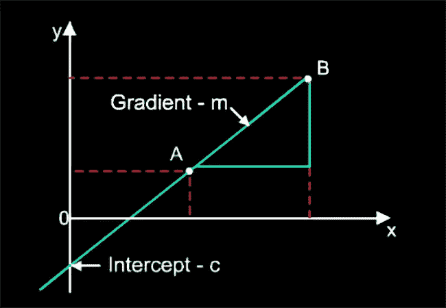**

**图 14:直线方程**

**类似地，logit 函数如图 15 所示:**

**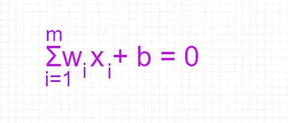**

**图 logit 函数的等式**

**其中 *w* 是应用于每个输入的权重， *b* 是偏置项。**

# **阶跃激活函数**

**阶跃激活函数表明，给定 logit 的值，是否应该将神经元从这种感知中驱逐出去。图 16 显示了逐步激活功能:**

**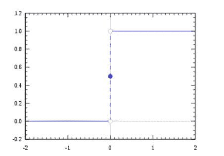**

**图 16:步进激活功能，Omegatron， [CC BY-SA 3.0](https://creativecommons.org/licenses/by-sa/3.0) ，通过[维基共享](https://commons.wikimedia.org/)**

**因此，从上图来看，只有当 logit 函数值大于或等于 **0** 时，神经元才会被激发。**

**决策边界的两种情况:**

*   **在单输入感知器的情况下，判定边界是一条线性线。**
*   **在多输入感知器的情况下，决策边界扩展到一个超平面，该超平面比它所在的表面的维度小一个维度。**

**总而言之:**

> *****感知器= logit +阶跃函数*****

# **层**

**深度学习中的**层**是一个常用术语，适用于神经网络中特定深度的几个节点一起执行。每一层都试图通过最小化误差/成本函数来学习数据的不同方面。**

**例如，在图像识别中，第一层可以学习边缘检测，第二层可以检测眼睛，第三层可以检测鼻子，等等。**

**不同的公共层:**

*   **输入层**
*   **隐蔽层**
*   **输出层**

**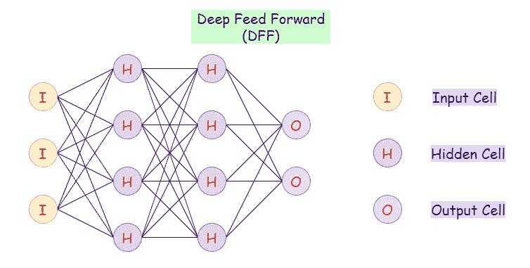**

**图 17:神经网络中的不同层[ [8](https://towardsai.net/p/machine-learning/main-types-of-neural-networks-and-its-applications-tutorial-734480d7ec8e) ]。**

# **输入层(输入像元)**

**该层包含原始数据。神经网络的**输入层**包括人工**输入**神经元，并通过后续的**人工神经元层**开始将初始数据输入系统进行进一步处理。**输入层**是神经网络工作流程的起点。**

# **隐藏层(隐藏单元格)**

****在算法的输入和输出之间存在一个**隐藏层，其中函数对输入使用权重，并引导它们通过一个激活函数作为输出。因此，**隐藏层**对进入网络的输入进行非线性改变。**

# **输出图层(输出像元)**

**输出层是最简单的，通常由分类问题的单个输出组成。它是单个节点，但仍被视为神经网络中的*层*，因为它可以包含多个节点。输出层负责产生最终结果。神经网络中必须始终有一个输出层。**

# **重量**

**权重是连接的力量。如果它增加了投入，那么它对产出的影响有多大。权重控制两个神经元之间的信号(或连接强度)。简而言之，权重决定了输入对输出的影响程度。**

**示例:**

**让我们承担三个任务:1)玩，2)工作，3)睡觉。**

**如果我们更加重视“ **play”，**那么“play”将比其他选项具有更高的权重。**

**因此，在等式中:**

> ***Y = F(x1，x2，x3)=w1*x1 + w2*x2 + w3*x3***

**计算 **Y，** x1 将比 x2 和 x3 更重要。因此，play 的功能是 play(x1)。**

# **学习率**

**学习率是定义更新步骤在多大程度上控制权重的当前值的参数。**学习率**指的是优化算法中的调整参数，它定义了每次迭代的步长，同时向最小损失函数移动。【 [6](https://en.wikipedia.org/wiki/Learning_rate) 】。**

**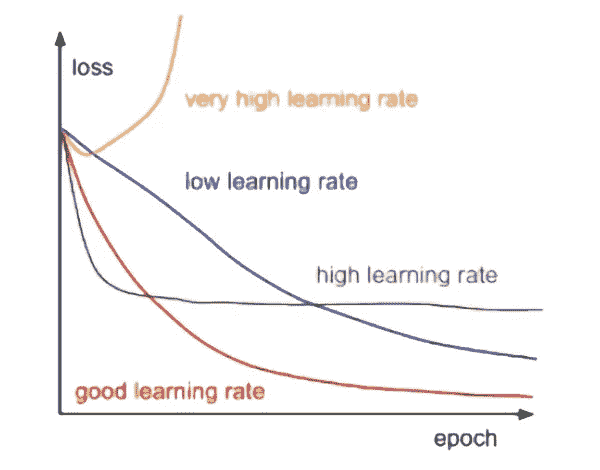**

**图 18:学习率**

**总结一下:**

> **学习率控制神经网络模型学习问题的快慢。**

# **人工神经网络(ann)是如何学习的？**

**人工神经网络的学习过程被设置为优化其权重的迭代过程，因此是受监督类型[ [3](https://d2l.ai/chapter_introduction/index.html) ][ [4](https://www.amazon.com/Deep-Learning-TensorFlow-Explore-networks/dp/1786469782) ]。**

# **重量衰减**

**权重衰减是用于避免过度拟合的正则化技术。它是通过删除元素来降低模型复杂性的一种概括。神经网络也会过度拟合。可以通过将所有权重/偏差初始化为最小随机值并在学习过程中增加它们来避免。**

**这些是体重下降的不同步骤:**

*   **人们可以在验证集上检查性能并尽早停止。**
*   **或者，可以改变更新规则以阻止大的权重:**

**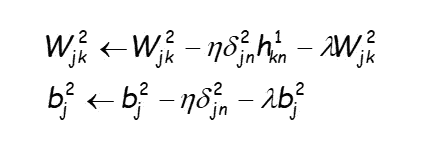**

**图 19:重量衰减。**

*   **使用 x 验证设置 lambda 的值。**

****

**图 20:不同重量衰减超参数[ [13](https://cedar.buffalo.edu/~srihari/CSE676/5.3%20MLBasics-Hyperparam.pdf) ]。**

# **神经元的实现**

**下面的 Python 代码实现旨在创建一个人工神经元。**

**导入数量:**

```
import numpy as np
```

**创建一个 Sigmoid 函数:**

```
def sigmoid(x):
   return 1/ (1 + np.exp(-x))
```

**创建神经元:**

```
class Neuron:

   def __init__(self, weights, bias):
        self.weights = weights
        self.bias = bias def feedforwards(self, inputs):
        total = np.dot(self.weights, inputs) + self.bias
        return sigmoid(total)
```

**神经元的输入和执行:**

```
weights = np.array([0, 1])
bias = 4
neuron = Neuron(weights, bias)
x = np.array([2, 3])
forward = neuron.feedforwards(x)
print(forward)
```

**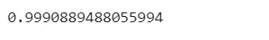**

**图 21:神经元的输出。**

# **反向传播**

**在深度学习中，反向传播是一种用于训练多层感知机的监督学习算法。**

# **为什么需要反向传播？**

**在创建神经网络时，在开始时，用一些随机值或事实的任何变量来初始化权重。显然，数据科学家不是超人。选定的权重值不必是正确的或最适合模型的。**

**数据科学家最初选择一些值，但我们的模型输出与我们的实际输出相差甚远，即误差值很大。**

****现在，他们将如何减少误差？****

**基本上，数据科学家需要做的是解释模型，以改变参数(权重)，使误差最小。**

**训练模型的步骤:**

*   **计算误差**
*   **最小误差**
*   **更新参数—如果误差很大，更新参数(权重和偏差)。之后，再次检查错误。重复该过程，直到误差最小。**
*   **该模型已准备好进行预测。**

**因此，他们需要训练模型，反向传播是一种训练模型的方法。反向传播算法使用 delta 规则或梯度下降技术在权重空间中寻找误差函数的最小值[ [7](https://github.com/alexeygrigorev/data-science-interviews/blob/master/theory.md) ]。**

**反向传播的步骤:**

*   **首先，将某个随机值初始化为“W ”,并向前传播。**
*   **然后，注意到有一些错误。该方法将其向后传播以降低错误率并增加“w”的值**
*   **之后，也注意到误差增加了。人们开始知道“W”的值不能增加。**
*   **因此，它再次向后传播，并且“W”的值减小。**
*   **现在，注意到误差已经减小。**

**基本上，它试图达到“全球损失最小化”**

**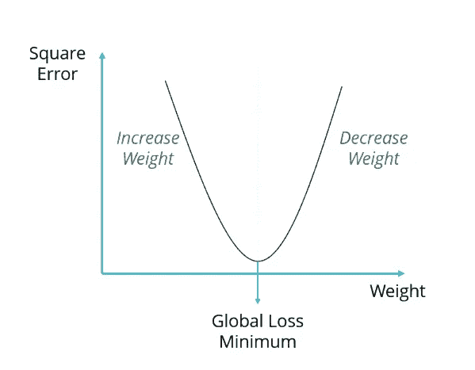**

**图 22:全局损失最小。**

# **结论**

**深度学习是机器学习的一部分，专注于人工神经网络。这是一种人工智能技术，指导计算机像人类一样执行精确的任务。**

**深度学习模型由于其高准确性而获得了越来越多的关注，有时其水平高于人类的表现。在深度学习中，计算机可以对图像、文本、声音等进行分类。**

**这些模型使用大型神经架构和大量标记数据进行训练。如今，深度学习被用于所有行业的各种任务。神经网络是一种建模输入/输出函数的灵活方式。它对噪声数据是鲁棒的，并且可以使用权重衰减或早期停止来避免过拟合。**

****免责声明:**本文表达的观点仅代表作者个人观点，不代表卡内基梅隆大学或其他(直接或间接)与作者相关的公司的观点。这些文章并不打算成为最终产品，而是当前思想的反映，同时也是讨论和改进的催化剂。**

****除非另有说明，所有图片均来自作者。****

**通过[向艾](https://towardsai.net/)发布**

# **资源**

## **教程的伴侣**

**[**Github 库**](https://github.com/towardsai/tutorials/tree/master/deep-learning) 。**

**[**Google Colab 实现**](https://colab.research.google.com/drive/1sV7ZaSegIvR6nL8IYFapSOyd2DBJ-qiY?usp=sharing) **。****

## **书**

**如果你真的对深度学习感兴趣，下面这本书可能是最好的伴侣，而且是免费的**

**[**潜入深度学习**](https://d2l.ai/) 、阿斯顿·张、扎卡里·c·利普顿、李牧和亚历山大·j·斯莫拉**

# **参考**

**[1]坎德拉，J. (2017)。构建可扩展的系统来理解内容——脸书工程。检索于 2021 年 1 月 15 日，来自[https://engineering . FB . com/2017/02/02/ml-applications/building-scalable-systems-to-understand-content/](https://engineering.fb.com/2017/02/02/ml-applications/building-scalable-systems-to-understand-content/)**

**[2]《深度学习的调查:算法、技术和应用》，Poyanfar 等人，(2021)。检索于 2021 年 1 月 15 日，来自[https://www2 . cs . duke . edu/courses/spring 20/compsci 527/papers/pouyanfar . pdf](https://www2.cs.duke.edu/courses/spring20/compsci527/papers/Pouyanfar.pdf)**

**[3]深入研究深度学习—深入研究深度学习 0.16.0 文档，Aston Zhang 和 Zachary C. Lipton 以及李牧和 Alexander J. Smola。(2021).检索于 2021 年 1 月 15 日，来自 https://d2l.ai/**

**[4] Zaccone，Giancarlo 等*tensor flow 深度学习:借助 TensorFlow* 的力量，让你的机器学习知识更上一层楼。帕克特出版社，2017 年。**

**[5]维克多·周。"初学者的机器学习:神经网络导论."*周胜利*，周胜利，**

**[6]“学习率。”*维基百科*，维基媒体基金会，2021 年 1 月 4 日，[https://en.wikipedia.org/wiki/Learning_rate](https://en.wikipedia.org/wiki/Learning_rate)。**

**[7]阿列克谢·格里戈里耶夫(2021)。检索于 2021 年 1 月 11 日，来自[https://github . com/alexeygrigorev/data-science-interversations/blob/master/theory . MD](https://github.com/alexeygrigorev/data-science-interviews/blob/master/theory.md)**

**[8]神经网络的主要类型及其应用—教程。(2021).检索于 2021 年 1 月 15 日，来自[https://toward sai . net/p/machine-learning/main-types-of-neural-networks-and-its-applications-tutorial-734480 D7 ec8e](https://towardsai.net/p/machine-learning/main-types-of-neural-networks-and-its-applications-tutorial-734480d7ec8e)**

**[9]深度学习第一部分，Ruslan Salakhutdinov，(2021)。于 2021 年 1 月 15 日从[https://www.youtube.com/watch?v=TFlV57P8JKo](https://www.youtube.com/watch?v=TFlV57P8JKo)检索**

**[10]《深度学习导论》，权耕，哥伦比亚大学，(2021)。检索于 2021 年 1 月 15 日，来自[https://dreaven . github . io/papers/deep _ learning _ lecture _ at _ Columbia . pdf](https://dreaven.github.io/papers/deep_learning_lecture_at_columbia.pdf)**

**[11]使用深度学习对点云进行实例分割，杰拉多·弗朗西斯科·佩雷斯·拉耶德拉，UPC，(2021)。检索于 2021 年 1 月 15 日，来自[https://up commons . UPC . edu/bitstream/handle/2117/117737/131440 . pdf？sequence=1 & isAllowed=y](https://upcommons.upc.edu/bitstream/handle/2117/117737/131440.pdf?sequence=1&isAllowed=y)**

**[12] Victor Zhou，MIT License，Github，【https://Github . com/vzhou 842/Victor Zhou . com/blob/master/NOTICE**

**[13]超参数和验证集，Sargur N. Srihari，(2021 年)。检索于 2021 年 1 月 15 日，来自[https://cedar . buffalo . edu/~ Sri Hari/CSE 676/5.3% 20m lbasics-hyperparam . pdf](https://cedar.buffalo.edu/~srihari/CSE676/5.3%20MLBasics-Hyperparam.pdf)**

**[14]《深度学习导论》，大卫·沃尔夫·康恩，开放式课件，(2021)。检索于 2021 年 1 月 15 日，来自[https://www . cs . brandeis . edu/~ cs36a/cs36a _ Slides/deep learning _ corne . pdf](https://www.cs.brandeis.edu/~cs136a/CS136a_Slides/DeepLearning_Corne.pdf)**

**[15] Y. LeCun，L. D. Jackel，B. Boser，J. S. Denker，H. P. Graf，I. Guyon，D. Henderson，R. E. Howard 和 W. Hubbard:手写数字识别:神经网络芯片和自动学习的应用，载于 Fogelman，f .和 Herault，j .和 Burnod，y .(编辑)，*《神经计算、算法、结构和应用》，Springer，Les Arcs，法国，1989 年。***

**[16]康奈尔航空实验室的弗兰克·罗森布拉特的 Mark I 感知机。纽约布法罗，1960 | Instagram，卡耐基梅隆大学机器学习系|[https://www.instagram.com/p/Bn_s3bjBA7n/](https://www.instagram.com/p/Bn_s3bjBA7n/)**

**[17]反向传播|维基百科|[https://en.wikipedia.org/wiki/Backpropagation](https://en.wikipedia.org/wiki/Backpropagation)**