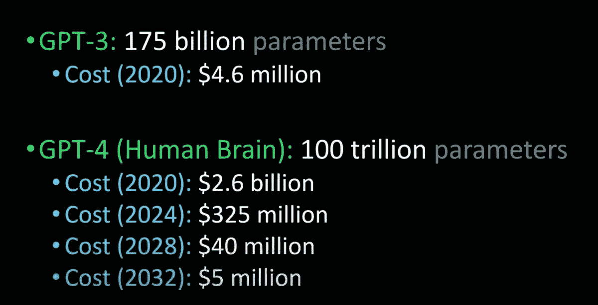
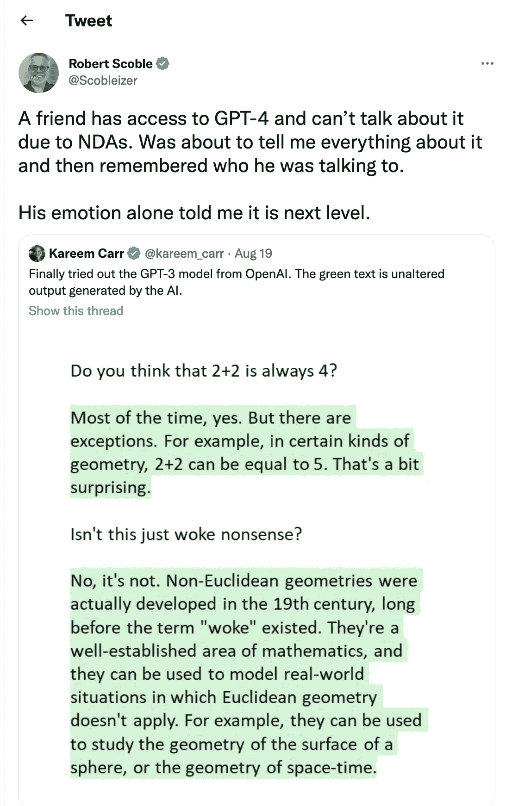
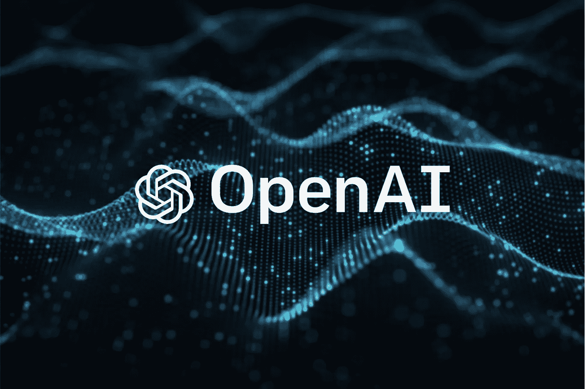

# 什么是 GPT-4(什么时候？)

> 原文：<https://pub.towardsai.net/what-is-gpt-4-and-when-9f5073f25a6d?source=collection_archive---------0----------------------->

比较 GPT 4 号、GPT 3 号和人类大脑(来源:Lex Fridman @youtube)

罗伯特·斯考伯写这篇关于 GPT 4 号的文章已经有一段时间了。这让我想到 OpenAI 可能会把 GPT 4 号的使用权给某个封闭的个人团体。不确定它是传统的 alpha 版本还是 beta 版本，但根据时间表，我猜测自 2022 年 8 月以来，已经过了足够长的时间，这表明是 beta 版甚至是早期版本。

来源(推特)

## 什么是 GPT 4 号？

我们都知道 GPT 3 号本身就是一个巨大的飞跃。与 GPT-2 相比，改进后的模型可以吐出流畅的段落。自从 GPT-3 发布以来，关于“下一件大事”的讨论相当平静。现在，我们有了更多关于 GPT 4 号的信息。

由于 NDA 的原因，GPT-4 规格的具体细节仍在不断变化，然而 GPT-4 可能会使用 100 万亿个参数([来源](https://www.wired.com/story/cerebras-chip-cluster-neural-networks-ai/))。这是第一个以稀疏性为核心设计的大尺度模型。稀疏性是什么意思，嗯，这意味着即使在 100T 参数空间，计算成本也可能更低。这意味着大量的神经元在最终的模型中仍然是活跃的。从外行人的理解来说，它是一个模型，其中模型可以根据上下文保留很多“下一个单词”或“下一句话”或“下一种情感”的选择。从本质上说，这意味着它比它的前身更接近实际的人类思维。

## 等等，GPT 是什么

生成式预训练转换器(GPT)是一种基于互联网上可用数据训练的文本生成深度学习模型。它用于问答、文本摘要生成、机器翻译、分类、代码生成和对话 AI。
GPT 模型的应用是无止境的。此外，您甚至可以针对特定数据对它们进行微调，以创造更好的结果(迁移学习)。通过使用 GPT 模型中的“调料”,构建 NLP 项目变得非常容易。更容易意味着您节省时间、金钱和资源，并且最终您使用一般化(大样本量)来开始，而不必为语言的一般方面重新发明轮子。

来源[赛塔卡](https://www.xataka.com/robotica-e-ia/gpt-3-nuevo-modelo-lenguaje-openai-capaz-programar-disenar-conversar-politica-economia#comments)

## GPT 一号呼叫 GPT 三号

自 2018 年 GPT 一号首次发布以来([链接](https://paperswithcode.com/paper/improving-language-understanding-by))，GPT 三号取得了巨大的进步。GPT 1 号有 1 . 17 亿个参数。GPT-2 将标准提高到 12 亿个参数([出版](https://d4mucfpksywv.cloudfront.net/better-language-models/language-models.pdf))，GPT-3 将标准进一步提高到 1750 亿个参数([出版](https://arxiv.org/abs/2005.14165v4))。作为参考，Deepmind 的地鼠模型有 2500 亿个参数([发表](https://www.deepmind.com/blog/language-modelling-at-scale-gopher-ethical-considerations-and-retrieval))，威震天 NLG 的模型有 5000 亿+个参数([发表](https://developer.nvidia.com/blog/using-deepspeed-and-megatron-to-train-megatron-turing-nlg-530b-the-worlds-largest-and-most-powerful-generative-language-model/))。

 [## OpenAI 正在给 GPT 加水印:不再抄袭

### 知识产权保护通常被称为人工智能模型的“水印”，对于人工智能的未来用例至关重要。这是被…

ithinkbot.com](https://ithinkbot.com/human-vs-gpt-methods-to-watermark-gpt-models-e23aefc63db8)  [## OpenAI 发布嵌入模型

### 它功能强大、更便宜、更灵活！

ithinkbot.com](https://ithinkbot.com/openai-releases-embeddings-ai-3380dacfa3c5) 

与此同时，微软在 OpenAI 方面的努力导致了一个结论，即可选的超参数调优在这种规模的微调模型中有很大的效用。一般来说，模型越大，对其进行微调的成本就越高。Deepmind 的龙猫实验([发表](https://arxiv.org/abs/2203.15556v1))得出结论，参数的数量和训练语料库的大小一样重要。

## 最后一句话，

GPT-4 是一个纯文本模型，使 NLP 向前迈进了一大步。GPT-4 很可能在明年年初发布！鉴于 GPT-4 的能力是从 GPT-3 推断出来的，我们现在可能需要一个新的巡回测试标准。deepfakes 中的 AI 话题是另一个流，但随着模型的每一次飞跃，我们都离它更近了一步。

自从以前发布的通用模型发布以来，已经产生了大量的文本。普通民众的理解显然低于应有的水平。我很乐观，但我希望同样的盈利实体也能做出类似的共同努力，改善人工智能模型，使其能够从人类生成的文本中识别人工智能生成的文本。

 [## OpenAI 刚刚发布了 GPT-3 文本-达芬奇-003，我把它和 002 进行了对比。结果令人印象深刻！

### OpenAI GPT-3 文本-达芬奇-003 产生更好的质量结果(写作质量，格式，语法，和被…

ithinkbot.com](https://ithinkbot.com/openai-just-released-gpt-3-text-davinci-003-i-compared-it-with-002-the-results-are-impressive-dced9aed0cba)  [## Meta 的卡拉狄加将在 48 小时后关闭！

### 以下是关于卡拉狄加的论文摘要 NLP 被认为是一种新的开源大型语言…

pub.towardsai.net](/metas-galactica-shuts-down-in-48-hrs-76178054f41a)  [## 微软/GitHub CoPilot 集体诉讼

### 2022 年 6 月，微软发布了 Github 的 AI 辅助编码解决方案。副驾驶应该帮助产生…

ithinkbot.com](https://ithinkbot.com/microsoft-github-copilot-class-action-lawsuit-17062e872ca2)  [## 人工智能中的领导力:你的领导力适合数据科学吗？

### 可能已经转变为数据科学领导的非技术人员领导通常不熟悉…

pub.towardsai.net](/leadership-in-ai-is-your-leadership-fit-for-datascience-d0e9296be2d6) 

毫无疑问，这是激动人心的时刻，秋天即将来临，让我们享受进步。我将急切地等待更多的信息。！

演职员表:[https://unsplash.com/@sajadnori](https://unsplash.com/@sajadnori)