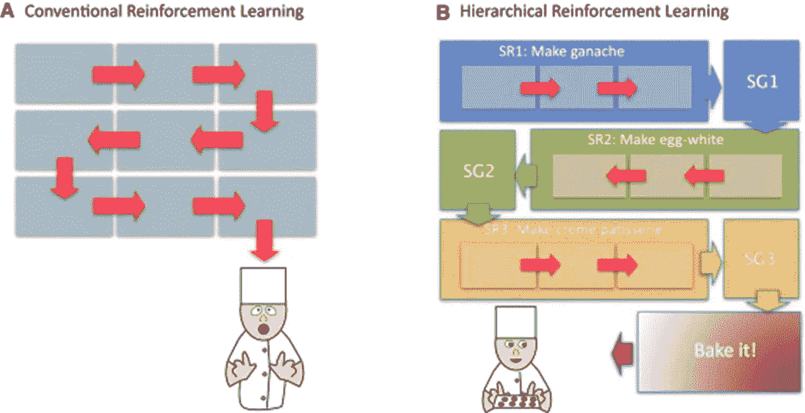
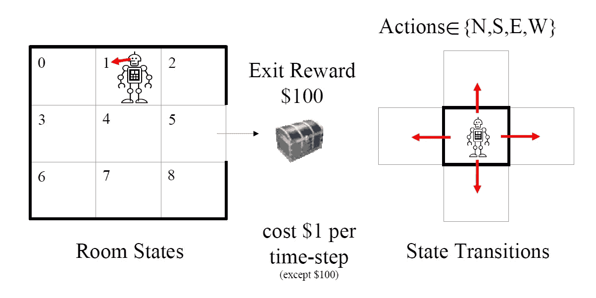
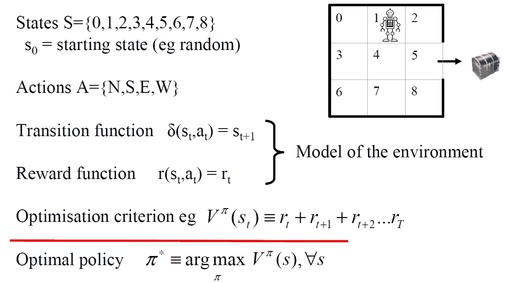
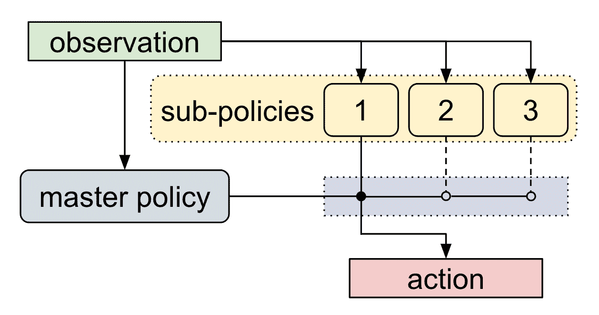

# 什么是分层强化学习？

> 原文：<https://pub.towardsai.net/what-is-hierarchical-reinforcement-learning-e61f8a41c8e1?source=collection_archive---------0----------------------->

## [机器学习](https://towardsai.net/p/category/machine-learning)

## 这种强化学习的变体通过分解成小任务来解决复杂的问题。

**来源:**[**https://www . science direct . com/science/article/pii/s 089662731100599 x**](https://www.sciencedirect.com/science/article/pii/S089662731100599X)

> 我最近创办了一份专注于人工智能的教育时事通讯，已经有超过 80，000 名订户。《序列》是一份无废话(意思是没有炒作，没有新闻等)的 ML 导向时事通讯，需要 5 分钟阅读。目标是让你与机器学习项目、研究论文和概念保持同步。请通过订阅以下内容来尝试一下:

 [## 序列

### 订阅人工智能世界中最相关的项目和研究论文。受到 85，000 多人的信任…

thesequence.substack.com](https://thesequence.substack.com/) 

人类在掌握新技能时，有很强的重用已有知识的能力。只要按照你的步骤去学习新的烹饪方法或新的锻炼程序。本能地，我们将那些复杂的任务分解成成千上万的小任务，这些小任务可以帮助我们有效地掌握这门新学科。相比之下，无监督的机器学习算法，如强化学习，通常需要从头掌握数千个小任务，从计算的角度来看，这导致了难以置信的昂贵。在强化学习模型中，跨相关任务实现知识重用可以极大地提高解决复杂任务的效率。

在强化学习模型中重用知识的问题超出了可重用性本身。集成或迁移学习等学科为跨不同模型重用知识提供了健壮的架构。然而，这些方法只有在不同的模型共享相同的学习策略时才有效。如果我们将强化学习问题分解成相关任务的分布，我们可能会发现，在不同任务之间共享信息是低效的，因为它们在不同的学习策略下运行。换句话说，强化学习中的知识重用不仅仅是将一个问题分解成小的子问题，而是将一个学习策略分解成其他子学习策略。

两年前，来自 OpenAI [的研究人员发表了一篇论文](https://arxiv.org/abs/1710.09767)，提出了一种使用相关任务的层次来掌握新任务的强化学习方法。名为[元学习共享层次](https://arxiv.org/abs/1710.09767)的新技术依赖于一个相对未知的深度学习领域，称为分层强化学习。

# 分层强化学习

分层强化学习(HRL)是深度学习领域中相对较新的学科，它将学习问题建模为相关子问题的层次结构。考虑这样一个问题:一个代理人试图学习如何通过走迷宫来获得简单的奖励。

**图片来源:OpenAI**

这种情况的挑战在于，对于同一个最优值函数，它可以有许多最优学习策略，这对于传统的强化学习模型来说可能导致计算非常昂贵的练习。HRL 将模型问题作为一个马尔可夫决策问题(MDP)，优化学习一个最佳政策的过程。

**图片来源:OpenAI**

大多数 HRL 算法都专注于学习单个任务，当在多任务环境中测试时，已经证明效率低下，因为它们难以处理多个并发学习策略。这是 OpenAI 的 HRL 方法大放异彩的领域。

# 元学习共享层次

OpenAI 的元学习共享层次(MLSH)方法背后的思想是建立一个学习策略的层次，可以用来将大量的低级任务抽象为少量的高级任务。使用 MLSH，代理学习一个分层策略，其中主策略在一组子策略之间切换。主机每 N 个时间步长选择一个动作，可能需要 N=200。执行 N 个时间步的子策略构成高级动作。例如，对于导航任务，子策略对应于不同方向的行走或爬行。

**图片来源:OpenAI**

MLSH 的第一步包括培训主策略。在该阶段，任何行动奖励更新仅取决于主保单的行动和总奖励。在子策略被训练之后，它们会将主策略的行为视为观察集的一部分，从而产生更有效的结果。

**图片来源:OpenAI**

MLSH 和传统 HRL 方法的主要区别在于，后者采用的是精心设计的政策。另一方面，MLSH 使用元学习通过与环境的交互来自动发现层次结构。从元学习的角度来看，MLSH 定义了一个好的层次结构，当训练看不见的任务时，它能迅速达到高回报。因此，MLSH 算法旨在学习子策略，这些子策略能够快速学习先前未看到的任务。

# MLSH 在行动

OpenAI 团队在各种导航问题上测试了元学习共享层次(MLSH)方法。例如，在蚂蚁迷宫环境中，一个机器人被放置在 9 个不同的迷宫中，并且必须从起始位置到达目标。MLSH 算法能够成功地找到一组不同的子策略，这些子策略可以单独通过与环境的交互来一起排序以解决迷宫任务。

MLSH 将分层强化学习(HRL)和元学习结合在一个模型中，能够通过将问题抽象为少量的学习策略来学习复杂的任务。OpenAI 团队在 [GitHub](https://github.com/openai/mlsh) 上开源了一个 MLSH 的基本实现，这将允许开发者试验这种新技术。关于 MLSH 的工作大部分是实验性的，但它包含许多有趣的想法，可以用于强化学习应用。