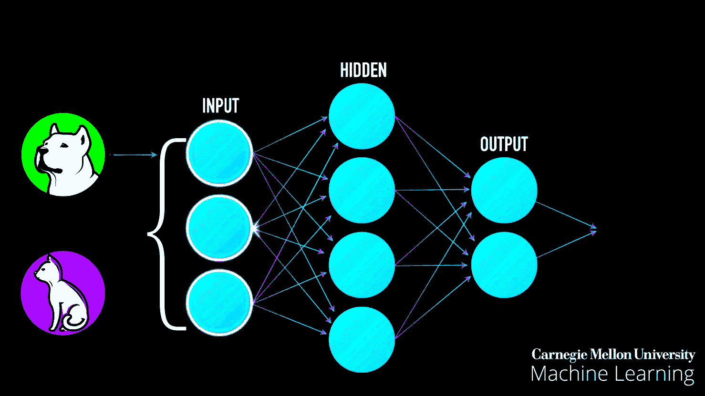
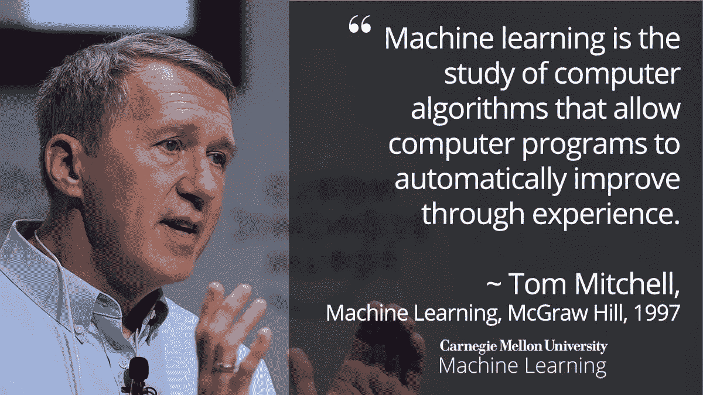
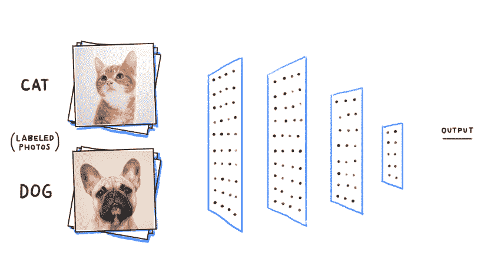
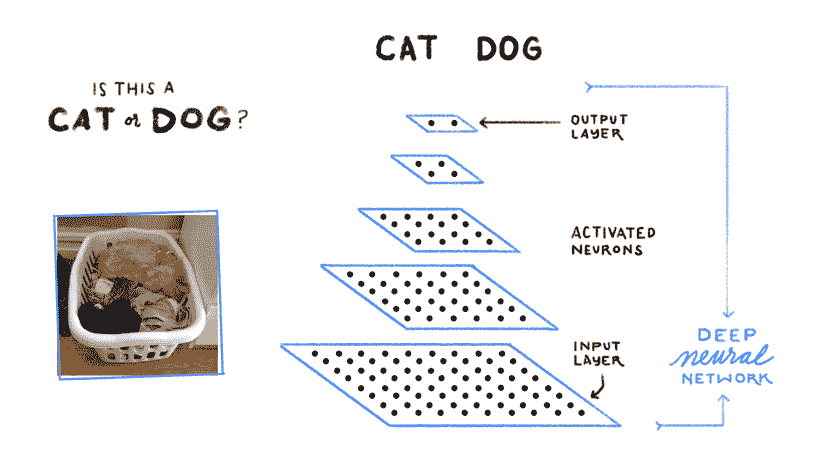
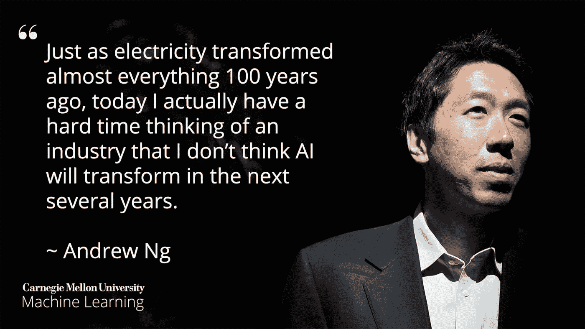

# 什么是机器学习(ML)？

> 原文：<https://pub.towardsai.net/what-is-machine-learning-ml-b58162f97ec7?source=collection_archive---------1----------------------->

## [机器学习](https://towardsai.net/p/category/machine-learning)

## 在五分钟内了解什么是机器学习(ML)，它是如何工作的，以及它的重要性

最后更新于 2022 年 5 月 6 日

**作者:** [罗伯托·伊里翁多](https://www.robertoiriondo.com/)，[普拉蒂克·舒克拉](https://medium.com/@shuklapratik22)

# 谁应该阅读这篇文章？

任何好奇的人，如果想直接而准确地了解什么是机器学习，它是如何工作的，以及它的重要性。我们通过对机器学习先驱和行业领导者的技术定义进行切片，来研究上面提出的每个相关问题，为您提供一个关于机器学习这一奇妙的科学领域的基本而简单的介绍。

在文章的底部可以找到一个术语表，以及一小部分用于进一步学习、参考和披露的资源。

# 什么是机器学习？

计算机科学家和机器学习先驱汤姆·m·米切尔描绘|来源:[机器学习，麦格劳·希尔，1997，汤姆·m·米切尔](http://www.cs.cmu.edu/afs/cs.cmu.edu/user/mitchell/ftp/mlbook.html) [2]

> [**机器学习的科学领域**](https://mld.ai/mldcmu) (ML)是人工智能的一个分支，由计算机科学家、机器学习先驱[ [1](https://www.nae.edu/30398.aspx) ] [汤姆·米契尔](http://www.cs.cmu.edu/~tom/):**机器学习是对计算机算法的研究，让计算机程序通过经验** [ [2](http://www.cs.cmu.edu/afs/cs.cmu.edu/user/mitchell/ftp/mlbook.html) ]。”

算法可以被认为是计算机程序员指定的、计算机可以处理的一组规则/指令。简单来说，机器学习算法通过经验进行学习，类似于人类的学习方式。例如，在已经看到一个对象的多个示例之后，使用计算机的机器学习算法能够在新的、以前看不到的场景中识别该对象。

机器学习的行为类似于儿童的成长。随着孩子的成长，她在执行任务 T 中的经验 E 增加，这导致更高的绩效测量(P)。

例如，我们给孩子一个“形状分类积木”玩具。(现在我们都知道，在这个玩具里，我们有不同的形状和形状洞)。在这种情况下，我们任务是为一个形状找到一个合适的形状孔。之后，孩子观察形状，并试图将它放入一个成型的孔中。假设这个玩具有三种形状:圆形、三角形和正方形。在她第一次尝试寻找一个形状的洞时，她的表现度量(P)是 1/3，这意味着孩子找到了 3 个正确形状的洞中的 1 个。

第二，孩子又尝试了一次，并注意到她在这项任务中有点经验。考虑到获得的经验(E)，孩子在另一次尝试这个任务，当测量表现(P)时，结果是 2/3。在重复这个任务(T) 100 次后，婴儿现在知道了哪个形状进入哪个形状孔。

所以她的经验(E)增加了，她的表现(P)也增加了，然后我们注意到，随着尝试这个玩具的次数增加。性能也会提高，从而导致更高的精度。

这样的执行类似于机器学习。机器所做的是，接受一个任务(T)，执行它，并测量它的性能(P)。现在，一台机器有大量的数据，因此当它处理这些数据时，它的经验(E)会随着时间的推移而增加，从而产生更高的性能指标(P)。因此，在浏览所有数据后，我们的机器学习模型的准确性增加了，这意味着我们的模型做出的预测将非常准确。

# 我们为什么需要机器学习？

例如，我们有一组猫和狗的图像。我们想做的是把它们归为一群猫狗。为此，我们需要找出不同的动物特征，例如:

1.  每种动物有几只眼睛？
2.  每种动物的眼睛是什么颜色？
3.  每种动物的身高是多少？
4.  每种动物的重量是多少？
5.  每种动物一般吃什么？

我们在每个问题的答案上形成一个向量。接下来，我们应用一组规则，例如:

> 如果身高> 1 英尺，体重> 15 磅，那么它可能是一只猫。

现在，我们必须为每个数据点制定这样一套规则。此外，我们放置一个 if、else if、else 语句的决策树，并检查它是否属于其中一个类别。

让我们假设这个实验的结果没有收获，因为它错误地分类了许多动物，这给了我们一个使用机器学习的绝佳机会。

机器学习所做的是用不同种类的算法处理数据，并告诉我们哪个特征更重要，以确定它是猫还是狗。因此，我们可以基于两个或三个特征来简化它，而不是应用许多规则集，结果，它给了我们更高的准确性。以前的方法不够一般化，不足以做出预测。

机器学习模型在许多任务中帮助我们，例如:

*   物体识别
*   摘要
*   预言；预测；预告
*   分类
*   使聚集
*   推荐系统
*   以及其他等等

# 主要的机器学习算法:

## 1.回归(预测)

我们使用回归算法来预测连续值。

**回归算法:**

*   线性回归
*   多项式回归
*   指数回归
*   逻辑回归
*   对数回归

## 2.分类

我们使用分类算法来预测一组项目的类别或种类。

**分类算法:**

*   k-最近邻
*   决策树
*   随机森林
*   支持向量机
*   朴素贝叶斯

## 3.使聚集

我们使用聚类算法进行汇总或构建数据。

**聚类算法:**

*   k 均值
*   基于密度的噪声应用空间聚类
*   均值漂移
*   等级体系的

## 4.联合

我们使用关联算法来关联同时发生的项目或事件。

**关联算法:**

*   推测的

## 5.异常检测

我们使用异常检测来发现异常活动和异常案例，如欺诈检测。

## 6.序列模式挖掘

我们使用序列模式挖掘来预测序列中数据实例之间的下一个数据事件。

## 7.降维

我们使用降维来减少数据的大小，以便从数据集中只提取有用的特征。

## 8.推荐系统

我们使用推荐算法来构建推荐引擎。

示例:

*   网飞推荐系统。
*   一个图书推荐系统。
*   亚马逊上的产品推荐系统。

# 机器学习算法的类型:

机器学习算法通常根据其目的进行分类。

*   监督机器学习算法
*   无监督机器学习算法
*   半监督机器学习算法
*   强化学习

现在，让我们简要看看机器学习算法的每一个类别。

## 1.监督机器学习算法:

在这里，人类专家扮演教师的角色，向计算机提供由输入/预测器组成的训练数据，并向它显示正确的答案(输出)，期望机器能够从数据中学习模式。简而言之，我们可以说，我们在算法处于训练阶段时对其进行监督。监督机器学习算法使用训练数据来寻找模式，然后使用学习到的行为来预测新数据点上的目标变量的值。

监督机器学习算法的示例:

*   最近邻
*   朴素贝叶斯
*   决策树
*   线性回归
*   支持向量机(SVM)
*   神经网络

## 2.无监督机器学习算法:

在无监督的机器学习算法中，没有老师的概念。我们拥有的数据集是未标记的，没有目标变量的真值。相反，无监督的机器学习算法在数据中找到模式来执行它们的工作。无监督的机器学习算法尤其在主题专家不确定在数据集中寻找什么，即哪些特征是必要的情况下有用。无监督机器学习算法专门用于模式检测和描述性建模。这些算法试图挖掘规则，识别模式，总结和聚合数据点，以便获得有用的见解，并使用应用于输入数据的技术更好地向消费者呈现数据。

无监督机器学习算法的例子:

*   k 均值聚类
*   主成分分析
*   分层聚类

## 3.半监督机器学习算法；

在有监督的机器学习算法中，所有的数据都是有标签的——而在无监督的机器学习算法中，我们没有任何有标签的数据。半监督学习介于两者之间。在许多实际情况下，贴标签的成本相对较高，因为它需要使用合格的人类专家。因此，当标签在大多数观察中不存在但在少数观察中存在时，半监督算法是模型开发的最佳选择。这些方法利用了未标记数据包含关于组参数的关键信息的事实，即使组成员是未知的。

## 4.强化学习:

强化学习算法(称为代理)以迭代的方式不断地从环境中学习。代理从其环境的经验中学习，直到它探索了所有可能的状态。
强化学习是人工智能的一个学科，是机器学习的一种形式。它使机器和软件代理能够在给定情况下自动选择最佳行为，以提高它们的效率。对于学习它的行为的主体来说，它只需要简单的奖励反馈，这就是所谓的强化信号。

# 机器学习是如何工作的？

机器学习是如何工作的？~ [Yann LeCun](http://yann.lecun.com/) ，脸书 AI 研究负责人|来源: [Youtube](https://www.youtube.com/watch?v=mmXB636p_E8) [ [3](https://www.youtube.com/watch?v=mmXB636p_E8) ]

在上面的视频中，脸书人工智能研究中心的负责人 Yann LeCun 用简单易懂的例子简单解释了机器学习是如何工作的。机器学习利用各种技术来智能地处理大量复杂的信息，以做出决策和/或预测。

在实践中，计算机(机器学习系统)学习的模式可能非常复杂，很难解释。考虑在[谷歌搜索](https://www.google.com/search?q=dog&prmd=inv&source=lnms&tbm=isch&sa=X)上搜索**狗**的图片——如下图所示，谷歌非常擅长带来相关结果，然而谷歌搜索是如何完成这项任务的呢？简单来说，谷歌搜索首先获得大量标签为“狗”的照片示例(图像数据集)——然后计算机(机器学习系统)寻找像素模式和颜色模式，帮助它猜测(预测)查询的图像是否确实是一只狗。

在谷歌搜索上查询“狗”|来源:[谷歌搜索](https://www.google.com/search?q=dog&prmd=inv&source=lnms&tbm=isch&sa=X)

起初，谷歌的计算机让随机猜测哪些模式是合理的，以识别一只狗的图像。如果它犯了一个错误，那么就要对计算机进行一系列的调整以使它正确。最终，这种由模仿人脑(深度神经网络)的大型计算机系统学习的模式集合，一旦经过训练，就可以正确识别并在谷歌搜索上带来狗图像的准确结果，以及你能想到的任何其他东西——这样的过程被称为机器学习系统的训练阶段。

机器学习系统寻找狗和猫图像之间的模式[ [5](https://www.google.com/about/main/machine-learning-qa/)

想象一下，你负责建立一个机器学习预测系统，试图识别狗和猫之间的图像。正如我们上面解释的，第一步是收集大量带有“狗”和“猫”标签的图片。第二，我们将训练计算机在图像上寻找模式，分别识别狗和猫。

经过训练的机器学习系统能够识别猫或狗。[ [5](https://www.google.com/about/main/machine-learning-qa/)

一旦机器学习模型经过训练[ [7](https://docs.aws.amazon.com/machine-learning/latest/dg/training-ml-models.html) ]，我们就可以向它投掷(输入)不同的图像，看看它能否正确识别狗和猫。如上图所示，一个经过训练的机器学习模型可以(大部分时间)正确识别这样的查询。

# 为什么机器学习很重要？

“正如 100 年前电力几乎改变了一切一样，今天我实际上很难想到一个我认为人工智能在未来几年内不会改变的行业。”~吴恩达|来源:[斯坦福商学院](https://www.gsb.stanford.edu/insights/andrew-ng-why-ai-new-electricity) [ [4](https://www.gsb.stanford.edu/insights/andrew-ng-why-ai-new-electricity) ]

如今，机器学习非常重要。首先，因为它可以以可扩展的方式解决复杂的现实世界问题，其次，因为它在过去十年内[9](https://disruptionhub.com/5-industries-machine-learning-disrupting/)颠覆了各种行业，并在未来继续这样做，因为越来越多的行业领导者和研究人员正在专注于机器学习，并利用他们所学的知识继续他们的研究和/或开发机器学习工具，以积极影响他们自己的领域。第三，人工智能有潜力到 2030 年为美国经济增加 16%或大约 13 万亿美元[ [18](https://blogs.wsj.com/cio/2018/11/16/the-impact-of-artificial-intelligence-on-the-world-economy/%20[19]%20The%20macroeconomic%20impact%20of%20artificial%20i) ]。机器学习产生积极影响的速度已经令人惊讶地令人印象深刻[[10](https://www.youtube.com/watch?v=mmXB636p_E8)][[11](https://www.chemistryworld.com/news/lithiumion-battery-book-written-by-machine-learning-algorithm/3010380.article)][[12](https://www.chemistryworld.com/news/lithiumion-battery-book-written-by-machine-learning-algorithm/3010380.article)][[13](https://www.technologyreview.com/s/613262/machine-learning-is-making-pesto-even-more-delicious/)][[14](https://medium.com/datadriveninvestor/machine-learning-generated-artwork-auctions-off-for-432-500-c377be74146f)][[15](https://www.radiologybusiness.com/topics/artificial-intelligence/machine-learning-ai-healthcare-workflow-clinicians)][[16](https://www.technologyreview.com/the-download/612292/googles-ai-is-better-at-spotting-advanced-breast-cancer-than-pathologists/)]，这是由于数据存储和计算处理能力的巨大变化而取得的成功[[17](https://www.visualcapitalist.com/visualizing-trillion-fold-increase-computing-power/)— 我们只能期待它继续走这条路线，继续在不同领域引起惊人的进步[ [6](https://medium.com/foursquare-direct/in-ten-years-the-future-of-ai-and-ml-fa68a527f378) ]。

# 谁使用机器学习，为什么？

大多数处理大量数据的企业都承认机器学习技术的价值。通过经常实时地从这些数据中收集见解，组织可以更有效地工作或获得相对于竞争对手的优势。

*   金融服务
*   卫生保健
*   政府
*   零售
*   石油和天然气
*   运输

# 机器学习的优势和劣势:

1.  优势:

*   趋势和模式很容易辨别
*   没有人为干预
*   低成本持续改进
*   处理多维数据
*   处理各种数据
*   广泛的应用

2.缺点:

*   需要大量的数据
*   时间和资源的利用
*   结果解释
*   对关键领域错误的易感性

# 机器学习的未来是什么样的？

机器学习的未来令人着迷。机器学习应用目前几乎被用于每个主流领域。医疗保健、搜索引擎优化、数字营销和教育只是受益的几个行业。在没有这项新技术的情况下，就实现客观结果而言，研究一个主题看起来几乎是不可能的。机器学习对于一个企业或组织来说可能是一个有争议的好处，无论是跨国公司还是初创公司，因为**目前人工完成的重复性任务将在未来自动完成**。下面是几个例子，通过它们我们可以验证机器学习的未来

*   精确的搜索引擎结果
*   基于偏好的精确定制
*   量子计算正在兴起
*   数据的指数级增长
*   自动化自学机器
*   汽车和自动驾驶车辆
*   制造业

# 致谢:

作者要感谢卡耐基梅隆大学[机器学习系](https://mld.ai/mldcmu)的博士研究员 [Anthony Platanios](https://platanios.org/) ，为本文的准备提供了建设性的批评和编辑意见。

**免责声明:**本文中表达的观点仅代表作者个人，不代表卡内基梅隆大学或其他(直接或间接)与作者相关的公司的观点。这些文章并不打算成为最终产品，而是当前思想的反映，同时也是讨论和改进的催化剂。

# 术语表:

## [关键机器学习定义](https://medium.com/towards-artificial-intelligence/key-machine-learning-ml-definitions-43e837ec6add)

[机器学习中最常用定义的词汇表](https://medium.com/towards-artificial-intelligence/key-machine-learning-ml-definitions-43e837ec6add)

 [## 帮助将人工智能和技术初创公司扩展到企业|走向人工智能

### 《走向人工智能》每月通过我们的定制软件为数百万科技读者提供服务。我们拥有成千上万的人工智能和…

sponsors.towardsai.net](https://sponsors.towardsai.net)  [## 店铺↓ |走向 AI

### 全球领先的人工智能&科技新闻&媒体公司

towardsai.net](https://towardsai.net/shop)  [## 加入 AI 社区↓走向 AI

### 与成千上万的数据领导者一起加入 AI 社区。支持我们，与其他人工智能爱好者合作，参与…

community.towardsai.net](https://community.towardsai.net/) 

# 参考资料:

[1]在机器学习方法和应用方面的开创性贡献和领导地位。汤姆·m·米切尔教授。[美国国家工程院](https://en.wikipedia.org/wiki/National_Academy_of_Engineering)。检索于 2011 年 10 月 2 日。

[2]机器学习定义|汤姆·m·米切尔|麦格劳-希尔科学/工程/数学；(1997 年 3 月 1 日)第 1 页| h[TTP://www . cs . CMU . edu/AFS/cs . CMU . edu/user/Mitchell/FTP/ml book . html](http://www.cs.cmu.edu/afs/cs.cmu.edu/user/mitchell/ftp/mlbook.html)

[3]机器学习是如何工作的？| Yann le Cun | Youtube |[https://www.youtube.com/watch?v=mmXB636p_E8](https://www.youtube.com/watch?v=mmXB636p_E8)

[4]吴恩达:为什么 AI 是新电|沙娜林奇|斯坦福商学|[https://www . gsb . Stanford . edu/insights/Andrew-ng-Why-AI-New-Electricity](https://www.gsb.stanford.edu/insights/andrew-ng-why-ai-new-electricity)

[5]分解一下:关于机器学习的问答|谷歌|[https://www.google.com/about/main/machine-learning-qa/](https://www.google.com/about/main/machine-learning-qa/)

[6]十年后:人工智能和 ML 的未来| four square |[https://medium . com/four square-direct/In-Ten-The-Future-of-AI-and-ML-fa68a 527 f 378](https://medium.com/foursquare-direct/in-ten-years-the-future-of-ai-and-ml-fa68a527f378)

[7]Training ML Models | Amazon Web Services |[https://docs . AWS . Amazon . com/machine-learning/latest/DG/Training-ML-Models . html](https://docs.aws.amazon.com/machine-learning/latest/dg/training-ml-models.html)

[8]机器学习模型训练流程|亚马逊 Web 服务|[https://docs . AWS . Amazon . com/Machine-learning/latest/DG/training-process . html](https://docs.aws.amazon.com/machine-learning/latest/dg/training-process.html)

[9]机器学习正在颠覆 5 个行业| Disruption，Inc . |[https://Disruption hub . com/5-Industries-Machine-Learning-Disrupting/](https://disruptionhub.com/5-industries-machine-learning-disrupting/)

[10]https://www.youtube.com/watch?v=mmXB636p_E8 脸书发布了一款机器学习工具，帮助工程师编写代码

[11]机器学习算法写的锂离子电池书| chemistry world |[https://www . chemistry world . com/news/Lithium ion-Battery-Book-Written-by-Machine-Learning-Algorithm/3010380 . article](https://www.chemistryworld.com/news/lithiumion-battery-book-written-by-machine-learning-algorithm/3010380.article)

[12]机器学习算法预测谁将在《权力的游戏》中幸存| VW |[https://www . chemistry world . com/news/lithium ion-battery-book-written-by-Machine-Learning-Algorithm/3010380 . article](https://www.chemistryworld.com/news/lithiumion-battery-book-written-by-machine-learning-algorithm/3010380.article)

[13]机器学习让香蒜酱更美味|麻省理工科技评论|[https://www . Technology Review . com/s/613262/Machine-Learning-is-Making-Pesto-Even-More-Delicious/](https://www.technologyreview.com/s/613262/machine-learning-is-making-pesto-even-more-delicious/)

[14]机器学习生成的艺术品拍卖价格为 432，500 美元|数据驱动的投资者|[https://medium . com/datadriveninvestor/Machine-learning-generated-artwork-auctions-off-for-432-500-c 377 be 74146 f](https://medium.com/datadriveninvestor/machine-learning-generated-artwork-auctions-off-for-432-500-c377be74146f)

[15]机器学习将如何从根本上改变医疗保健提供者的生活|放射学业务|[https://www . Radiology Business . com/topics/人工智能/机器学习-人工智能-医疗保健-工作流程-临床医生](https://www.radiologybusiness.com/topics/artificial-intelligence/machine-learning-ai-healthcare-workflow-clinicians)

[16]谷歌的人工智能比病理学家更擅长发现晚期乳腺癌|麻省理工学院技术评论|[https://www . Technology Review . com/the-download/612292/Google-AI-is-better-at-spotting-advanced-breast-cancer-than-pathologists/](https://www.technologyreview.com/the-download/612292/googles-ai-is-better-at-spotting-advanced-breast-cancer-than-pathologists/)

[17]可视化万亿倍增长的计算能力| Visual Capitalist |[https://www . Visual Capitalist . com/Visualizing-万亿倍增长计算能力/](https://www.visualcapitalist.com/visualizing-trillion-fold-increase-computing-power/)

[18]人工智能对世界经济的影响|华尔街日报|经济中的智能|普华永道|[https://www . PWC . co . uk/economic-services/assets/macroeconomic-Impact-of-ai-technical-report-Fe b-18 . pdf](https://www.pwc.co.uk/economic-services/assets/macroeconomic-impact-of-ai-technical-report-feb-18.pdf)

[19]面向初学者的机器学习算法用 Python 编写代码示例|走向 AI 编辑团队|[https://pub . toward sai . net/Machine-Learning-Algorithms-For-初学者用 Python-Code-Examples-ml-19 c 6 AFD 60 DAA](/machine-learning-algorithms-for-beginners-with-python-code-examples-ml-19c6afd60daa)

通过[向 AI](https://towardsai.net/) 发布

# 推荐文章

一、[机器学习和数据科学最佳数据集](https://towardsai.net/p/machine-learning/best-datasets-for-machine-learning-and-data-science-d80e9f030279)
二。[艾薪资冲天](http://towardsai.net/ai-salaries)三世
。[什么是机器学习？](https://towardsai.net/p/machine-learning/what-is-machine-learning-ml-b58162f97ec7)
四世。[2020 年最佳机器学习硕士项目](https://towardsai.net/ml-masters)
五、[2020 年最佳机器学习博士项目](https://towardsai.net/ml-phd)
六、[最佳机器学习博客](https://towardsai.net/p/machine-learning/best-machine-learning-blogs-6730ea2df3bd)
七。[关键机器学习定义](https://towardsai.net/p/machine-learning/key-machine-learning-ml-definitions-43e837ec6add)
八。[用机器学习在 0.05 秒内破解验证码](https://towardsai.net/ml-captcha)
九。[机器学习 vs. AI 及其重要区别](https://towardsai.net/p/machine-learning/machine-learning-vs-ai-important-differences-between-them/robiriondo/3432/)
十.[确保成功开创机器学习事业(ML)](https://towardsai.net/p/machine-learning/moocs-vs-academia-ensuring-success-starting-in-a-machine-learning-ml-career-304b2e42315e)
XI。[机器学习算法初学者](https://towardsai.net/p/machine-learning/machine-learning-algorithms-for-beginners-with-python-code-examples-ml-19c6afd60daa)
十二。[神经网络从零开始详细用 Python 代码和数学](https://towardsai.net/neural-networks-with-python)
XIII。[用 Python 构建神经网络](https://towardsai.net/p/machine-learning/building-neural-networks-with-python-code-and-math-in-detail-ii-bbe8accbf3d1)
XIV。[神经网络的主要类型](https://towardsai.net/p/machine-learning/main-types-of-neural-networks-and-its-applications-tutorial-734480d7ec8e)
十五。[用 Python 编写的蒙特卡洛模拟教程](https://towardsai.net/p/machine-learning/monte-carlo-simulation-an-in-depth-tutorial-with-python-bcf6eb7856c8)
XVI。[Python 自然语言处理教程](https://towardsai.net/p/nlp/natural-language-processing-nlp-with-python-tutorial-for-beginners-1f54e610a1a0)