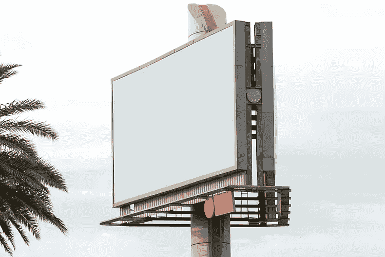
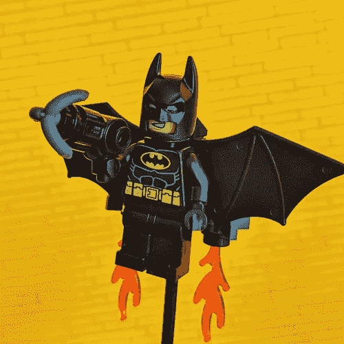
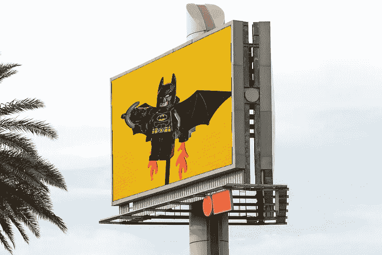
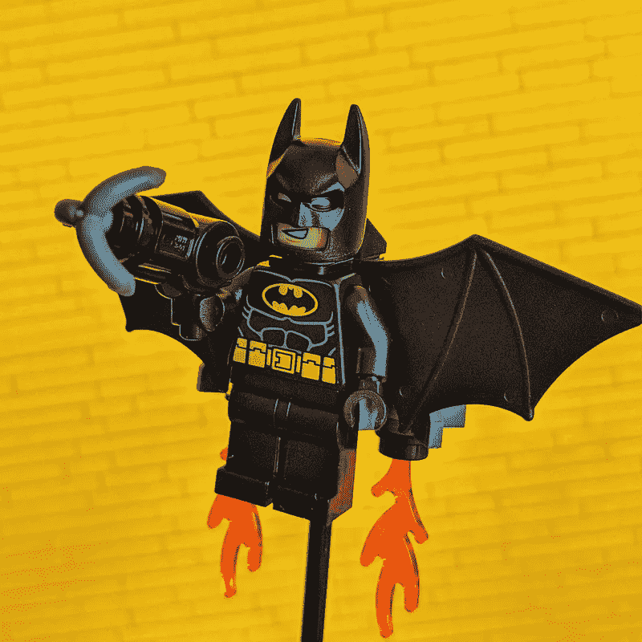
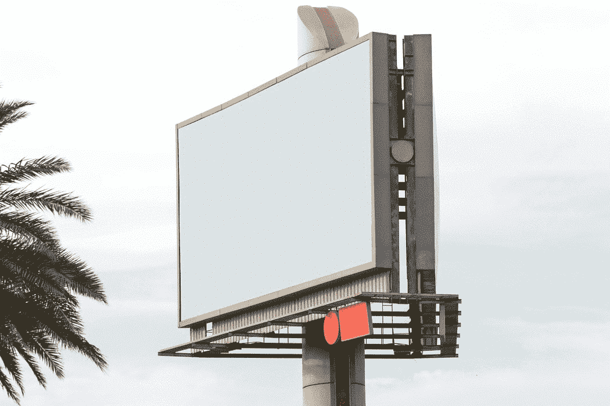
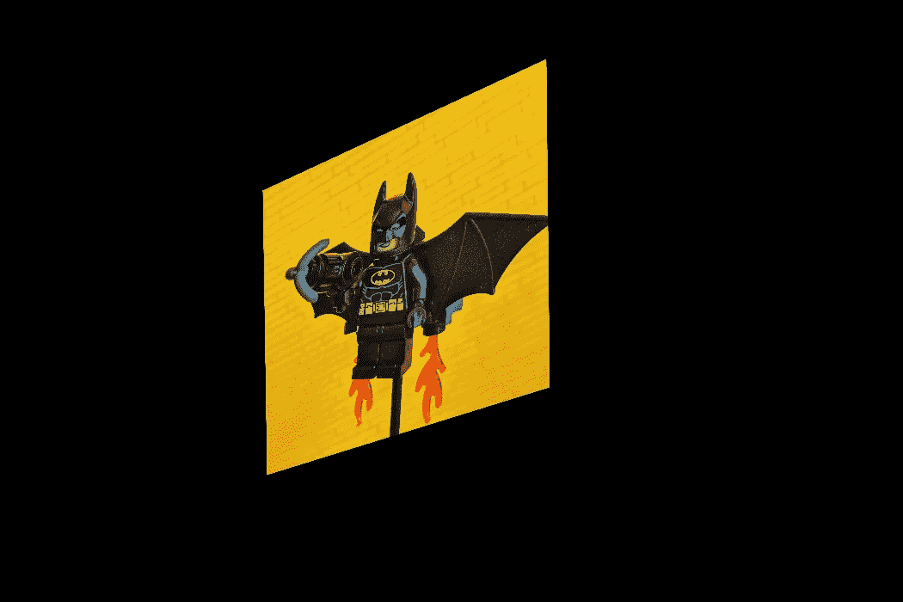
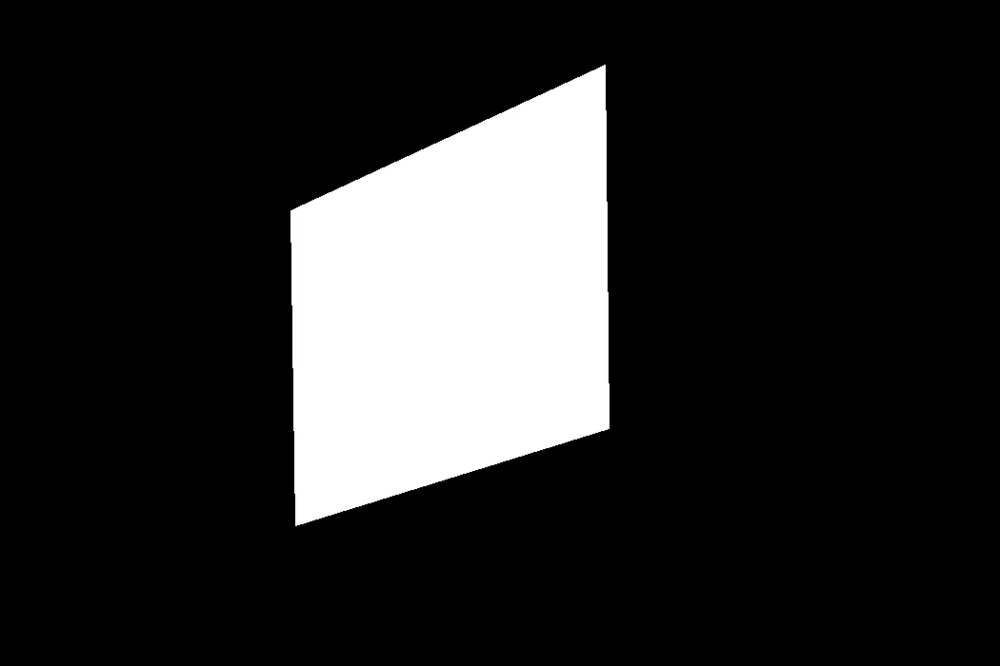
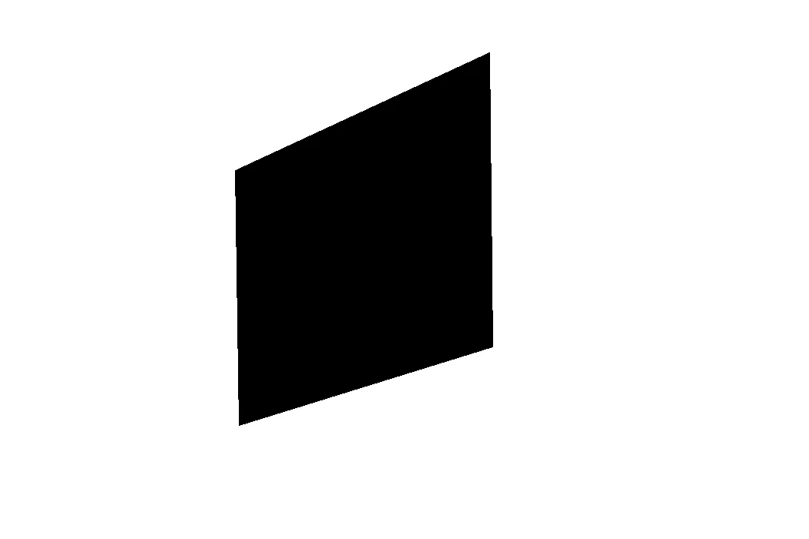
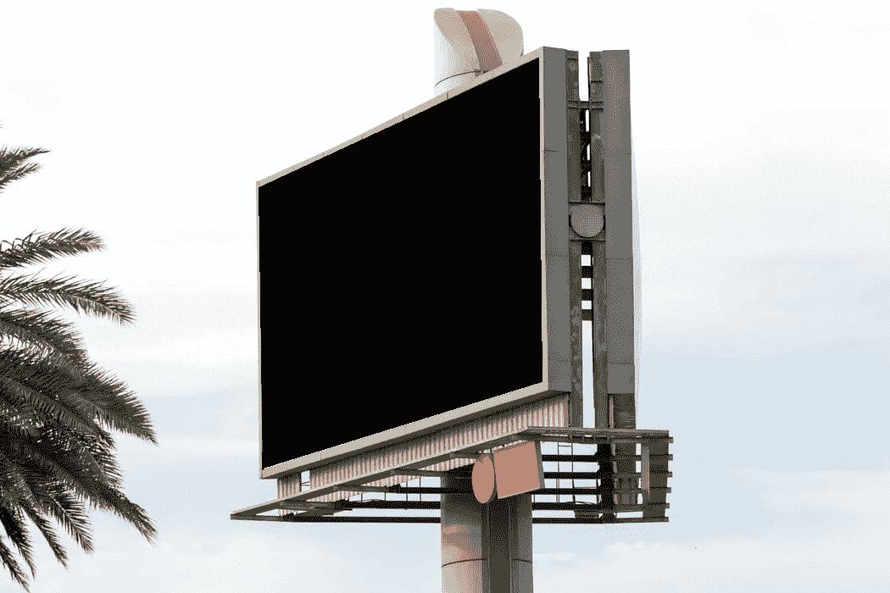

# 什么是透视翘曲？| OpenCV 和 Python

> 原文：<https://pub.towardsai.net/what-is-perspective-warping-opencv-and-python-750e7a13d386?source=collection_archive---------1----------------------->

## [计算机视觉](https://towardsai.net/p/category/computer-vision)

## 对图像应用透视变换的分步指南

计算机视觉现在非常热门。各地的人们都在从事某种形式的基于深度学习的计算机视觉项目。但是在深度学习出现之前，图像处理技术被用来操纵和转换图像，以获得帮助我们完成手头任务的洞察力。今天，让我们看看如何实现一种简单而有用的技术，即透视投影来扭曲图像。

但是等等！扭曲图像是什么意思？我可以用许多花哨的词语和专业术语来解释它。但是，展示最终结果会很容易，这样你就可以通过观察来学习。反正你在看计算机视觉的文章:)



基础图像([来源](https://unsplash.com/photos/Dnkr_lmdKi8) ) —主题图像([来源](https://unsplash.com/photos/demvKRNvtLY) ) —扭曲输出(图片由作者提供)

所以基本上，你拿一个图像，剪切它，使它适合任何想要的形状的画布。注意，反过来也是可能的。现在，这个问题已经解决了，让我们看看如何使用 OpenCV 和我们值得信赖的朋友 Python(❤).来实现它

对于那些只想要代码的人，不用担心，我会帮你们搞定的:P 这里是我的 GitHub [库](https://github.com/GSNCodes/Image_Overlaying_Using_Perspective_Transform)的链接。

在我们进入代码的主要部分之前，我们必须首先导入必要的库。

```
import cv2
import numpy as np
```

现在，让我们如下读入基础图像和主体图像。

```
base_image = cv2.imread('base_img.jpg')
base_image_copy = base_image.copy()
subject_image = cv2.imread('subject.jpg')
```



[基础图像](https://unsplash.com/photos/Dnkr_lmdKi8)(左)——[被摄体图像](https://unsplash.com/photos/demvKRNvtLY)(右)

初始化一个数组来存储我们想要覆盖主题图像的四个角的坐标。我们可以使用如下所示的 **setMouseCallback()** 函数手动选择这 4 个点。

```
def click_event(event, x, y, flags, params):
    if event == cv2.EVENT_LBUTTONDOWN:
        cv2.circle(base_image_copy, (x, y), 4, (0, 0, 255), -1)
        points.append([x, y])
        if len(points) <= 4:
            cv2.imshow('image', base_image_copy)points = []base_image = cv2.imread('base_img.jpg')
base_image_copy = base_image.copy()
subject_image = cv2.imread('subject.jpg')

cv2.imshow('image', base_image_copy)
cv2.setMouseCallback('image', click_event)
cv2.waitKey(0)
cv2.destroyAllWindows()
```

在上面给出的代码片段中，我们定义了一个名为 **click_event()** 的函数，并将其作为参数传递给 **setMouseCallback()** 函数。使用这种方法，我们将首先显示基础图像。然后，我们可以手动选择图像中的四个点作为目标。我们的主体图像将被扭曲到这个目标上。当鼠标左键被按下时，坐标被记录。这些存储在我们之前初始化的点数组中。选定的点以红点突出显示，如下所示。



选择角点(作者 GIF)

众所周知，我们每个人可能会以任意顺序选择 4 个点。因此，需要在选择的点之间保持恒定的顺序。我选择了按顺时针方向排序，即从左上到右上，从右下到左下。这是通过下面显示的 **sort_pts()** 方法实现的。我们利用了这样一个事实，即 x 和 y 坐标之和在左上角最小，在右下角最大。同样，它们之间的差异在右上角最小，在左下角最大。花点时间自己验证一下是不是真的。**请记住，对于图像，原点在图像的左上角。**

```
def sort_pts(points):
    sorted_pts = np.zeros((4, 2), dtype="float32")
    s = np.sum(points, axis=1)
    sorted_pts[0] = points[np.argmin(s)]
    sorted_pts[2] = points[np.argmax(s)]

    diff = np.diff(points, axis=1)
    sorted_pts[1] = points[np.argmin(diff)]
    sorted_pts[3] = points[np.argmax(diff)]

    return sorted_ptssorted_pts = sort_pts(points)
```

把点排序后，我们用它们来计算变换矩阵。我们创建了一个名为“ **pts1** 的 numpy 数组，它保存了主题图像的四个角的坐标。类似地，我们创建一个名为“ **pts2** 的列表来保存排序后的点。“ **pts1** 的坐标顺序应与“ **pts2** 的坐标顺序相匹配。

```
h_base, w_base, c_base = base_image.shape
h_subject, w_subject = subject_image.shape[:2]

pts1 = np.float32([[0, 0], [w_subject, 0], [w_subject, h_subject],                     [0, h_subject]])pts2 = np.float32(sorted_pts)
```

我们现在获得了扭曲目标图像所需的变换矩阵。这是使用函数**cv2 . getperspective transform()**获得的。因为我们想以这样一种方式转换主题图像，使其适合我们在基础图像中选择的框，所以" **src** "应该是" **pts1** ",而" **dst** "应该是" **pts2** "。生成的图像的大小可以指定为一个元组。我们确保结果图像具有基本图像的尺寸。使用生成的矩阵，我们可以使用 **cv2.warpPerspective()** 方法扭曲图像，如给定片段所示。

```
transformation_matrix = cv2.getPerspectiveTransform(pts1, pts2)

warped_img = cv2.warpPerspective(subject_image, transformation_matrix, (w_base, h_base))cv2.imshow('Warped Image', warped_img)
```

扭曲的图像看起来像这样



扭曲的图像(作者提供的图像)

下一步是创建一个蒙版，我们用基础图像的形状创建一个空白图像。

```
mask = np.zeros(base_image.shape, dtype=np.uint8)
```


初始遮罩(图片由作者提供)

在这个空白蒙版上，我们画一个多边形，它的角由“ **sorted_pts** 给出，并使用**cv2 . fillcungpoly()**方法填充白色。最终的遮罩看起来会像这样。

```
roi_corners = np.int32(sorted_pts)

cv2.fillConvexPoly(mask, roi_corners, (255, 255, 255))
```



填充遮罩(图片由作者提供)

现在我们使用 **cv2.bitwise_not()** 方法反转遮罩颜色。

```
mask = cv2.bitwise_not(mask)
```



反转遮罩(图片由作者提供)

现在，我们使用 **cv2.bitwise_and()** 方法获取蒙版和基础图像并执行逐位 and 运算。

```
masked_image = cv2.bitwise_and(base_image, mask)
```

这将给我们一个如下图所示的图像。您可以看到单独放置主题图像的区域是黑色的。



蒙版基础图像(作者提供的图像)

最后一步是使用 **cv2.bitwise_or()** 方法获取扭曲的图像和遮罩的图像，并执行按位“或”运算。这将生成我们想要完成的融合图像。

```
output = cv2.bitwise_or(warped_img, masked_image)
cv2.imshow('Fused Image', output)
cv2.imwrite('Final_Output.png', output)
cv2.waitKey(0)
cv2.destroyAllWindows()
```

我们做到了！我们已经成功地将一幅图像叠加到另一幅图像上。


融合图像(作者提供的图像)

这是透视转换的一个非常简单的用例。当您在帧中跟踪对象/人的移动时，您可以使用它来生成一个区域的鸟瞰图。唯一的限制是你的想象力。

本文的全部代码可以通过这个[链接](https://github.com/GSNCodes/Image_Overlaying_Using_Perspective_Transform)在我的 GitHub 存储库中找到。

*~ ~**SowmiyaNarayanan G*

**PS:-**

如果你有任何疑问，请随时联系我，我很乐意帮助你。我随时欢迎建设性的批评，因此请不要犹豫让我知道你对我的工作的看法。也可以在 [LinkedIn](https://www.linkedin.com/in/sowmiyanarayanan-g/) 上联系我。

**心灵字节:-**

*“你能想象的一切都是真实的”*——巴勃罗·毕加索