# 什么是无服务器 AWS Lambda 以及如何使用它

> 原文：<https://pub.towardsai.net/what-is-serverless-aws-lambda-and-how-to-use-it-2c69672c0161?source=collection_archive---------0----------------------->

## [云计算](https://towardsai.net/p/category/cloud-computing)

## AWS 提供的 Lambda 服务概述

[**点击这里了解我，我的项目，我的最新文章。**](http://www.michelangiolo.best/)

在本文中，我将详细解释如何开始将 AWS Lambda 用于无服务器应用程序。如何设置您的第一个功能，以及如何将其连接到其他服务。我很少写一步一步的教程，我的大多数文章都包含代码和解释，但是我想试一试。


AWS Lambda 徽标

# AWS 云

AWS(亚马逊网络服务)是互联网上最大的云之一。云是一个服务的集合，一个大的技术允许你根据你的使用来租用。您不必在自己的基础设施上花费数百万美元，而是可以以几美分的成本(如果您很小)获得计算能力、网络服务、分析工具，甚至高达数百万美元的成本(如果您很大并且正在扩展)。

# 无服务器计算

当选择构建一个无服务器的应用程序时，不要租用一个必须 24 小时运行的服务器来在客户端连接时提供应用程序的后端，而是只在需要时才激活服务器。当一个客户端在你的网站上执行一个动作时，这个动作会触发一个功能，这个功能可以执行一个你选择的算法(发送电子邮件，收集或发送数据，授权):任何你不能在前端直接做的事情。

选择无服务器而不是基于服务器的计算可能会节省你的钱，特别是如果你很小，没有那么多人使用你的网站，但你需要知道如何做到这一点。开始时，如果你习惯于在 flask 或 Django 框架中编码所有东西，你可能会发现无服务器的概念相当混乱。

# 开始使用 Lambda

在本教程中，如果您是 AWS 新手，需要遵循以下说明:

1.  访问 AWS 控制台
2.  选择λ
3.  创建您的第一个函数
4.  编码
5.  正在创建触发器
6.  与 AWS API 网关连接
7.  创建发布方法
8.  部署
9.  URL 测试

编写您的函数

## 2.选择λ

当您打开服务列表时，您可以立即看到 Lambda:您可以单击它来访问服务。

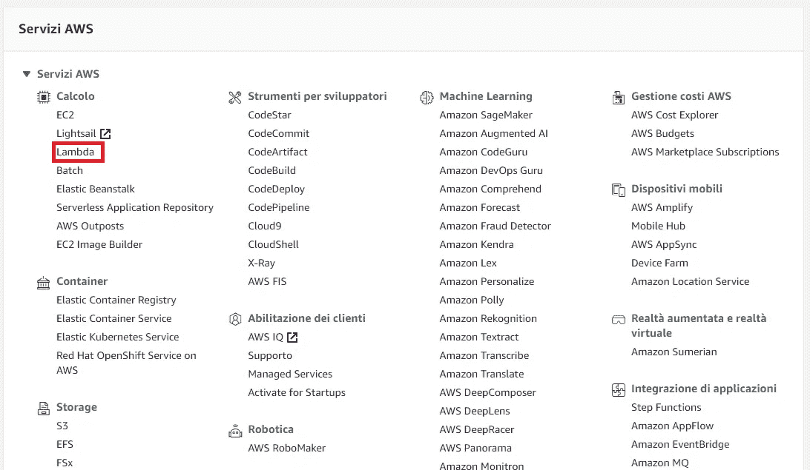

控制台中一些可用服务的列表

## 3.创建您的第一个函数

我们将从使用 Lambda 创建第一个函数开始:

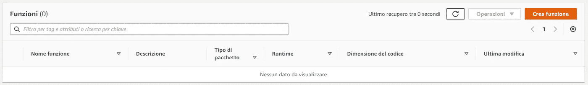

点击创建功能开始(右上方，抱歉是意大利语)

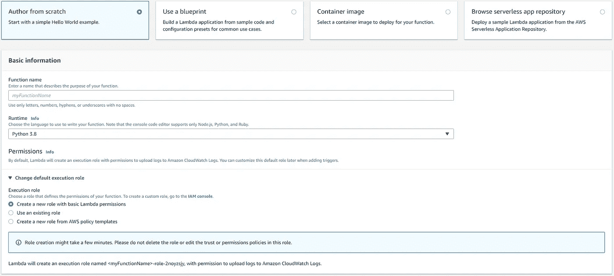

当创建你的第一个函数时，你可以选择参数，包括运行的语言，权限…

在这种情况下，我选择了 python 3.8。您还可以根据自己的喜好，用不同的语言构建函数。

*** * *记住，一旦创建了函数**，就不能对其进行重命名

## 4.编码

AWS 已经提供了一个可以编写函数的接口。并非所有的云都会提供相同的功能。lambda 函数有一个输入，您可以用触发器传递它，它允许您将 JSON 代码作为输出输出，以防您希望向您的程序传达一切顺利。

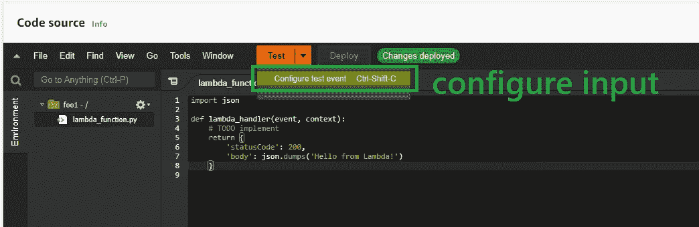

点击 test > Configure Test Event 来编辑输入 JSON

通过配置测试事件，您可以决定在调用时哪个输入(以 JSON 格式)进入您的函数。

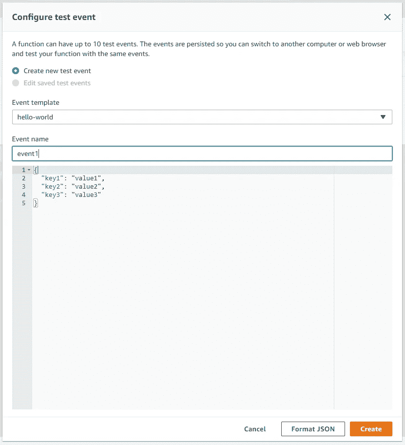

测试函数时，这将是函数将接收的输入(主体)。您可以保存不同的身体样本，以方便您的测试。

JSON 格式非常简单，事实上，至少在 python 中，是一个只有 3 个值的字典:key1、key2 和 key3。在该函数中，输入将作为**事件**参数接收。让我编辑 lambda 函数，并通过单击 DEPLOY 保存它。如果运行，输出如下:

```
import jsondef lambda_handler(event, context):
 # TODO implement
 return {
 ‘statusCode’: 200,
 ‘body’: json.dumps(str(event[‘key1’]))
 }
```

运行时的输出(测试功能):

```
Response
{
  "statusCode": 200,
  "body": "\"value1\""
}
```

有用！响应包含输入的 key1。

## 5.正在创建触发器

我们现在需要公开部署 Lambda 函数。我们可以通过将它连接到一个 API 来做到这一点。AWS 用来执行此任务的工具称为 API Gateway:

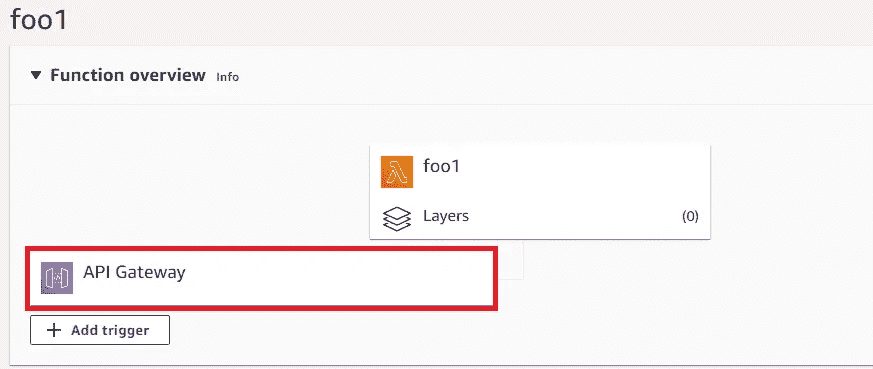

在 Lambda 接口的顶部，您可以选择使用 API Gateway 作为触发器来激活您的

添加该功能将出现以下菜单:

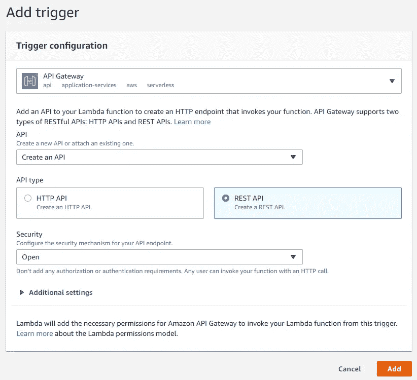

使用 API 网关创建 REST API 触发器

## 6.与 AWS API 网关连接

通过访问 API 网关，您将能够编辑 API 详细信息。我们现在可以添加一个 HTTP 来执行请求:

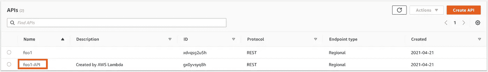

有了这个接口，你可以将 HTTP 方法添加到 lambda 函数中

## 7.创建发布方法

我将从声明一个新的 HTTP 方法开始。因为我需要传入一些 JSON，所以我需要一个 POST 请求:

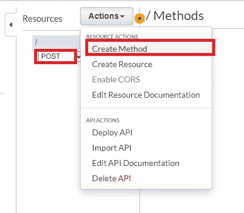

声明与 lambda 函数 foo1 关联的新 HTTP 方法的步骤

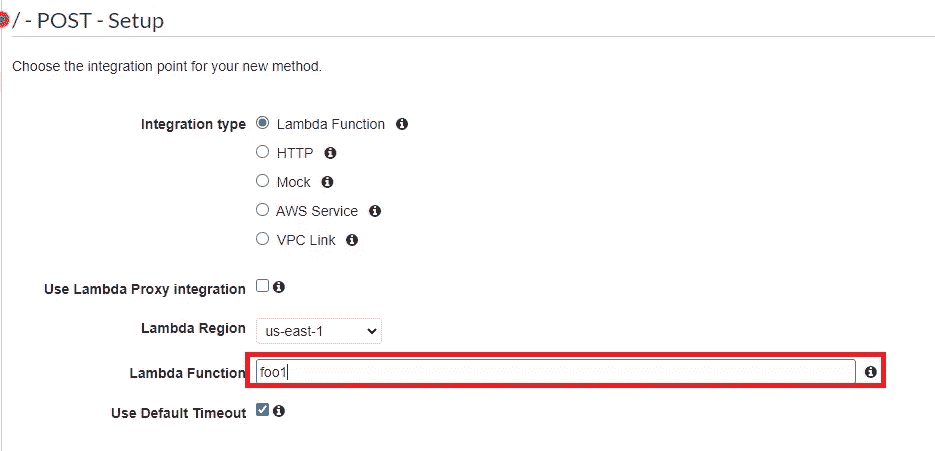

为了方便起见，我使用了相同名称的函数

现在是测试函数的时候了(可选，但也是很好的实践)。我们可以在没有测试和实践的情况下部署它，但是如果出现错误，我们会知道。

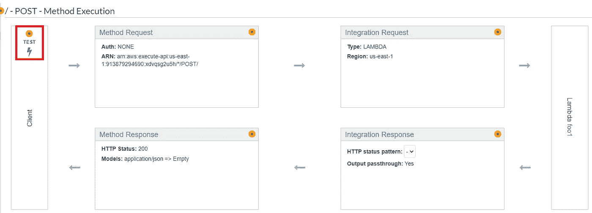

进入测试界面

测试的工作方式(在 API 网关内)很简单。我们可以访问一个接口，在这个接口上，根据调用的类型(GET、POST……)，我们可以像部署函数一样与函数进行交互。因为我想将一个 JSON 文件传递给函数，所以我需要使用 POST 方法:

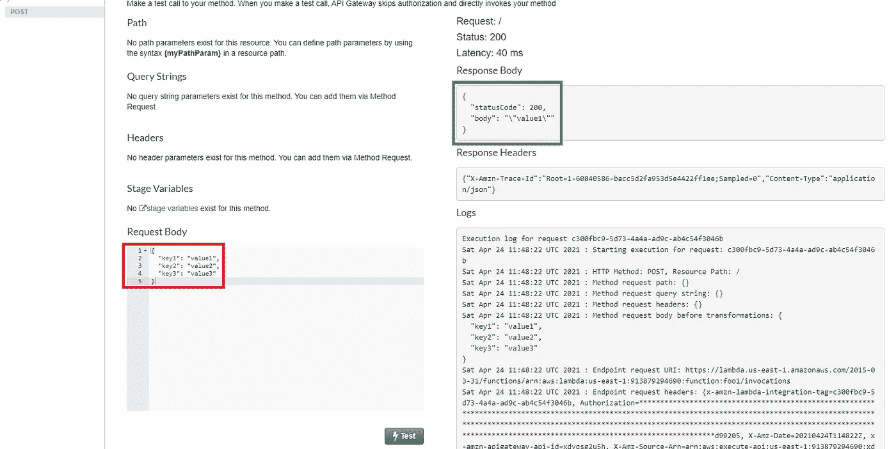

测试界面

如您所见，该函数将按键作为输入并正确运行。如果它有错误，它将输出:“内部服务器错误”。

## 8.部署

既然我们已经确定该功能工作正常，现在是时候把它放到网上了，可以通过 URL 访问。我们将通过部署 API 来实现这一点:

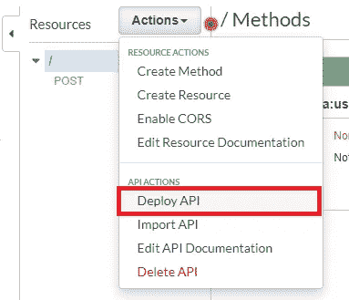

部署说明

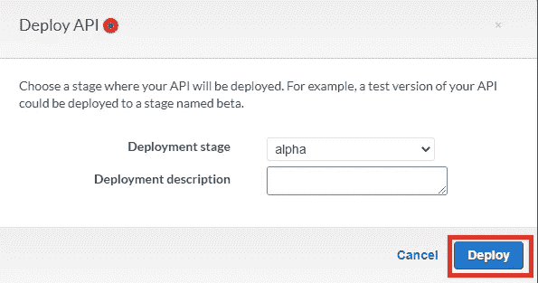

部署阶段参数

## 9.URL 测试

既然已经部署了 URL，它就在线了。我们只需要 URL 的链接，我们可以将它用作 HTTP 方法。我们可以从 API 网关接口检索工作 URL，或者返回到 lambda 接口，如下所示:

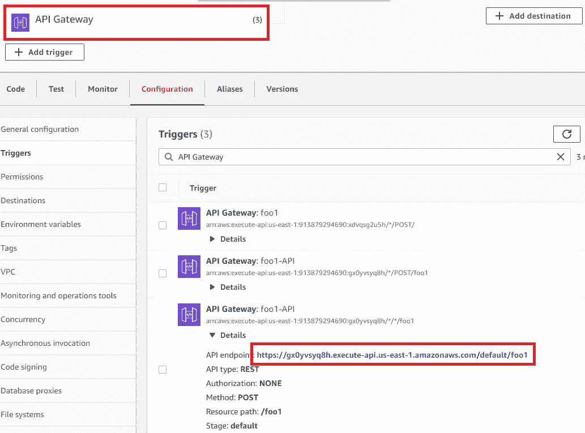

在 Lambda 接口中找到您部署的 API Url

我将使用一个名为 Postman 的软件来测试我的函数，传递一个 JSON 并期待一个响应:

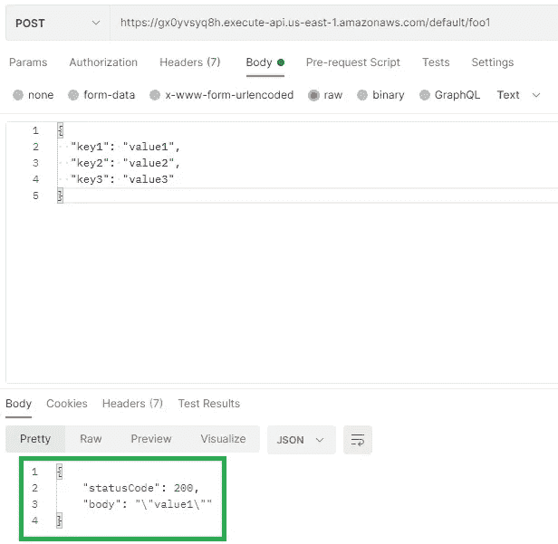

邮递员成功投递邮件的截图

有用！用于 JSON 代码的函数作为主体传递，以正确处理它并输出 statuscode 200 和主体中键的第一个值。您可以将 value1 更改为任何值，它将输出您所编写的内容。