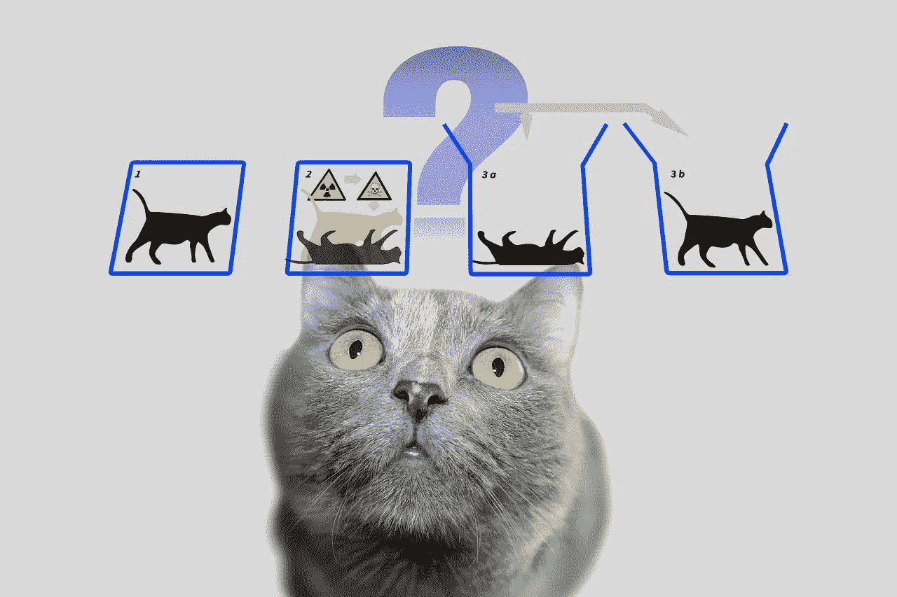
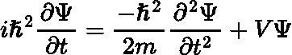
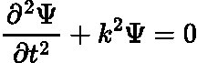
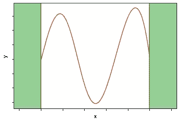

# 一个世界模型，薛定谔的猫，和神经网络有什么联系？

> 原文：<https://pub.towardsai.net/what-is-the-connection-between-a-world-model-schr%C3%B6dingers-cat-and-neural-network-a94b25d1d8c5?source=collection_archive---------1----------------------->

## 利用物理信息神经网络(PINN)求解著名的薛定谔方程

[来源](https://cdn.pixabay.com/photo/2018/12/09/09/29/physics-3864569_1280.jpg)

几个世纪以来，好奇的头脑一直试图破解我们周围世界的结构。大多数人会同意，任何科学分支都遵循相同的目标——试图将一个函数映射到观察结果。该函数以某种方式通过近似解释了世界模型，可以是连续的，也可以是离散的，旨在找到输入和输出集之间的对应关系。

在没有任何先验知识的情况下，对描述世界模型的函数的搜索可能是棘手的。然而，我们知道我们周围的世界是复杂和动态的。复杂的模型可以用[简单的规则](https://www.wolframphysics.org/visual-summary/dark/)来表示，所以可能会有一个绕过。😅然而，由于事物往往在时间和空间中演变，不断变化的世界的动态方面不能被简单地忽视。

> “有些事情只能通过认为其他事情是理所当然的来解释”
> 
> 理查德·费曼

动态可以通过导数来描述，导数测量函数输出相对于输入变化的灵敏度。同时，函数及其导数之间的关系以[微分方程](https://en.wikipedia.org/wiki/Differential_equation)的形式定义。因此，毫无疑问，物理学中的许多现象、[工程学](http://www.civil.uwaterloo.ca/xie/Graphics/XIE_Differential%20Equations%20for%20Engineers_excerpt.pdf)、[经济学](https://u.math.biu.ac.il/~shnider/Course_Notes/ODE-economics-chap1.pdf)、[生物学](https://www.cambridge.org/cz/academic/subjects/mathematics/mathematical-modelling-and-methods/modeling-differential-equations-biology-2nd-edition?format=AR&isbn=9781316040355)、[心理学](https://europepmc.org/article/med/28329860)等等都可以通过使用任何类型的微分方程来成功建模。微分方程可以用来计算电或热的运动或流动，物体的运动，甚至可以用来检查疾病的生长。不用说，整个[反向传播算法](https://en.wikipedia.org/wiki/Backpropagation)可以被视为一个微分方程，其中误差的偏导数是使用链式法则相对于权重计算的。

一方面，我们有一个未知函数；另一方面，它的导数代表变化率。微分方程定义了两者之间的关系。

尽管你们中的许多人可能知道埃尔温·薛定谔的思想实验，这个实验通常被称为“薛定谔的猫”，但他最著名的是量子理论领域的教父之一。薛定谔假设了控制量子力学系统的[波函数](https://en.wikipedia.org/wiki/Wave_function)或者描述量子粒子在哪里的方程(现在被称为[薛定谔方程](https://en.wikipedia.org/wiki/Schr%C3%B6dinger_equation))。

> 人们甚至可以建立非常荒谬的案例。一只猫被关在一个钢制的小房间里，还有下面的装置(必须保证不受猫的直接干扰):在一个盖革计数器里，有一点点放射性物质，非常小，可能在一个小时内一个原子衰变，但也有同样的概率，可能一个也没有；如果发生这种情况，计数管放电，并通过继电器释放一个锤子，打碎一小瓶氢氰酸。如果一个人把整个系统留给自己一个小时，他会说，如果在此期间，没有原子衰变，猫仍然活着。第一次原子衰变会使它中毒。整个系统的 psi 功能将通过在其中混合或涂抹等份的活猫和死猫(原谅这种表达)来表达这一点。
> 
> 薛定谔，e.《量子力学中的基本情况》。自然科学(1935 年)。

“薛定谔方程”是理解量子物理和构建更清晰的世界模型图景的基本里程碑之一。你猜怎么着？该方程是一个如下所示的**线性偏微分方程**:

其中ψ是我们要找的未知波函数。在我们开始之前，我必须告诉你，薛定谔方程有不可计数的特殊情况，尽管其中许多非常复杂，因此对于大多数原子来说，它们无法解析求解。因此，现在让我们集中讨论一个最简单的情况，即“薛定谔方程对于 [**盒中粒子**](https://en.wikipedia.org/wiki/Particle_in_a_box) 的解”，这很好地展示了经典系统和量子系统之间的差异。

想象一下，我们的粒子被困在两个无限势阱之间(这种情况有时被称为**无限势阱**)。不过，粒子可以在墙壁之间自由移动。由于这是一个非常受限制的情况，实际上是一个假设的玩具例子，所以有一些方法可以简化我们的初始表达式，从而得到盒子中单个粒子的与时间无关的薛定谔方程:

我们如何做到这一点？请看下面这个精彩的视频，它解释了如何推导出一个盒子里的粒子的特例，并解析地解决它:

然而，我们最终得到了一个二阶微分方程。ψ函数描述了粒子的行为。位置、动量和能量可以从ψ导出。如果你已经看过视频，就已经知道怎么解决了。然而，如果你没有，上面的等式看起来并不复杂。那么问题是什么呢？！

如果我们仔细看看，那么我们只知道，ψ(0)= 0，ψ(a)= 0，ψ加ψ本身的二阶导数也是零！但是，我们知道ψ在区间(0，a)不为零。

## ಠ益ಠ

好吧，让我们把我们所有的知识，除了方程本身，都集中起来:

*   ψ是函数；
*   Ψ(0) = 0
*   ψ(a)= 0

由于ψ是一个函数，而我们是数据科学家，我们可以利用[通用近似定理](https://link.springer.com/article/10.1007/BF02551274)，它大致陈述如下:

*一旦神经元的数量足够，具有非多项式激活函数的前馈神经网络可以以任何精度逼近任何性能良好的函数。*

这个定理对多隐层和单隐层神经网络都有效，基本上对任何现代激活函数(ReLU，GeLU，Sigmoid，Tanh 等)都有效。).似乎正是我们需要的！

不…等等…数据呢？！

嗯，我们没有。然而，有一种方法，叫做[物理学通知神经网络](https://www.brown.edu/research/projects/crunch/sites/brown.edu.research.projects.crunch/files/uploads/Nature-REviews_GK.pdf)，或 PINNs。PINNs 最近引起了特别的关注，主要是因为它们能够模拟和预测多物理和多尺度真实世界系统的动力学。PINNs 的另一个有趣的性质是，如果我们正在拟合应该遵守某种物理定律的数据，并且我们知道这种定律，我们可以简单地将这种依赖性添加到损失函数中，这使得我们的机器学习模型尊重物理定律，即，被物理告知。

一般来说，关于 PINNs，我们可以定义三种方法来有效地训练模型:

*   大量的数据，没有物理学(我们都很熟悉)
*   少量数据和一些物理知识
*   没有数据和我们所有的物理知识

***NB:*** *为了简单起见，我们打算省略方程中的所有常数。我们假设 k=1，我们的量子阱从 0 到 a=10。*

我们的案例正好是第三个。我们有物理规律可循，却没有数据。让我们简单地将边界条件定义为返回零的函数:

由于上面的方程没有残差，即所有包含ψ的项都在左边，我们可以为薛定谔方程定义一个函数。简单地说，它将是趋于零的东西。

然后，如上所述，具有非多项式非线性的多层感知应该是逼近我们的波函数ψ的好选择。这里，我们使用[高斯误差线性单元](https://arxiv.org/abs/1606.08415)非线性，因为根据经验，它比 Sigmoid 和 Tanh 稍好，而 ReLU 表现最差。

PINN 建筑

因此，我们必须让我们的模型尊重薛定谔方程，也就是说要了解物理学。这可以通过定义包括整个微分方程的差异和边界差异的损失函数来实现:

PINN 损失函数

注意，我们可以通过使用`[torch.autograd.grad()](https://pytorch.org/docs/stable/generated/torch.autograd.grad.html)`来计算梯度(或简单地计算ψ函数`psi_x`的导数)，这是一个自动微分函数，它计算并返回输出相对于输入的梯度之和。要计算二阶导数`psi_xx`，只需应用两次`grad()`函数。

因此，我们可以通过盒子壁上的边界和盒子内的数据点来计算总损耗，然后反向传播误差来更新权重。

训练循环

经过几千次迭代，我们可以看看结果。如下所示，我们函数的输出类似于盒子里的粒子的[解](https://en.wikipedia.org/wiki/Particle_in_a_box#/media/File:InfiniteSquareWellAnimation.gif)。因为我们知道薛定谔方程的解实际上是一族解，所以输出可能随着权重和训练参数的随机初始化而变化。完整的代码可以在[这里](https://github.com/kovalenko-alx/NeuralSchrodinger/blob/main/NeuralSchrodinger.ipynb)找到。

4500 次迭代后的 PINN 输出

当然，还有许多更复杂的实现来展示如何使用深度神经网络[ [1](https://www.nature.com/articles/s41598-022-06442-x) 、 [2](https://www.sciencedirect.com/science/article/pii/S0021999119306345) 、 [3](https://lup.lub.lu.se/luur/download?func=downloadFile&recordOId=9059610&fileOId=9059611) ]来求解薛定谔方程。另一方面，这篇博客文章展示了一个简单易懂的物理学通知机器学习的介绍，并给出了我们何时以及为什么要“通知”我们的模型的想法。我选择薛定谔方程的原因很简单——因为方程本身和边界条件非常严格，信息也不丰富(正如你所记得的，零无处不在)。梯度下降算法，能够找到一个非零的解决方案，即使它没有受到惩罚。

最后，我们可以回答博文标题中陈述的问题:“一个世界模型、薛定谔的猫和神经网络之间有什么联系？”。正如我们所知，许多描述世界模型的动态过程可以用微分方程来建模。另一方面，即使非常复杂的微分方程也可以用基于物理学的神经网络来求解。