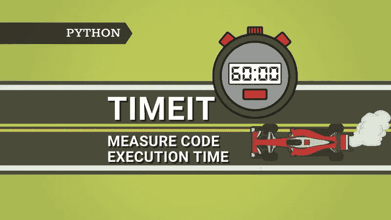

# Python 中的 timeit 模块是什么？

> 原文：<https://pub.towardsai.net/what-is-timeit-module-in-python-7a0adcb551ae?source=collection_archive---------1----------------------->



作者图片

您可能需要估计代码片段的执行时间。例如，如果您有五种方法在 Python 中制作列表对象的副本，那么您需要选择一种更快的方法。

你是做什么的？一种方法是使用 DateTime 模块来捕获任务的开始和结束时间。然后计算两者的差值。然而，这种方法效率不高，因为背景过程会扭曲估计值。那么，有什么有效的方法来估计代码片段的执行时间呢？

Python **timeit** 模块就是为做这件事而设计的。这对于测量代码片段的执行时间很有用。让我们用一个例子来看看 **timeit** 模块是如何工作的。

> 最初发表于 2022 年 2 月 2 日 pythonsimplifed.com**。**

# **什么是 timeit 模块？**

****timeit** 是 Python 的内置模块，可以用来估计 Python 代码片段的执行时间。我们在之前的博文中已经使用过几次了。**

## **句法**

```
timeit(stmt='pass', 
       setup='pass', 
       timer=<built-in function perf_counter>, 
       number=1000000, 
       globals=None)
```

*   ****stmt:** 它是您想要度量的代码片段。默认值为“通过”**
*   ****设置:**在测量时间时，通常是您不想包含在代码片段中的导入语句。**
*   ****定时器:**定时器对象，你不用担心，因为它会自动设置。**
*   ****number:** 想要执行代码片段的次数。默认值为 1，000，000。**
*   ****全局变量:**您可以传递全局名称空间 globals()，以便代码片段可以使用全局名称空间中的所有变量。**

## **例子**

**(1)以下示例使用一行语句作为代码片段。它计算从 0 到 50 的所有数字的平方。注意，把 0 到 50 的所有数字平方大约一百万次，大约需要 16 秒。**

```
>>> import timeit
>>> timeit.timeit(stmt="[i**2 for i in range(50)]")
16.153305899999395
```

**要计算单次运行所需的时间，需要通过 1 到 ***数*** 参数或者用 16 秒除以 100 万。**

```
>>> timeit(stmt="[i**2 for i in range(50)]", number=1)
0.00003070000093430281
```

**(2)请注意， **timeit** 模块在它自己的名称空间中运行。在下面的例子中，我们试图使用 math 模块找到从 0 到 50 的所有数字的平方根，math 模块被导入到主作用域中。由于数学模块没有被导入到 **timeit** 区，下面的代码将导致一个`NameError. The name `math’is not defined`。**

```
import math
import timeitcode = """
squares = [math.sqrt(i) for i in range(50)]
"""timeit.timeit(stmt=stmt)
```

**如何解决这个问题？当然，你也可以包含 ***【导入数学】*** 作为你代码片段的一部分。但是，您可能不希望将它包括在内，因为您只想估计在不使用 import 语句的情况下生成从 0 到 50 的所有数字的平方根的代码的执行情况。有两个选项: **a)设置**和 **b)全局**参数。**

*****a)设置参数:*** 可以通过**设置**参数传递导入语句。setup 参数中的语句只执行一次，不是代码段的一部分。**

```
>>> import timeit>>> code = """
... squares = [math.sqrt(i) for i in range(50)]
... """>>> timeit.timeit(stmt=code, setup='import math')
10.895839600000272
```

*****b)globals 参数:***globals()是内置函数，返回属于全局模块的所有对象。如果通过将 globals()传递给 globals 参数在全局范围内导入了 math 模块，则代码段可以使用 import math。**

```
>>> import math
>>> import timeit>>> code = """
... squares = [math.sqrt(i) for i in range(50)]
... """>>> timeit.timeit(stmt=code, globals=globals())
10.318579799999952
```

**希望你现在了解了 **timeit** 方法的所有参数，主要是 ***设置*** 和 ***全局*** 参数。让我们看看 **timeit** 模块中其他可用的重要方法。**

## **timeit 模块上可用的方法**

**除了 **timeit()** 方法之外， **timeit** 模块中还有两个更重要的方法。**

****timeit.repeat():** 它的工作方式与***time It . time It()****几乎相同，主要区别在于它将***time It . time It()***重复 n 次，作为传递给 repeat 参数。***

```
*>>> import timeit>>> code = """
... squares = [math.sqrt(i) for i in range(50)]
... """>>> timeit.repeat(stmt=code, setup='import math', repeat=3)
[10.724541399998998, 9.994093399996927, 10.465739999999641]*
```

*****time it . default _ timer():**默认定时器始终是 [time.perf_counter()](https://docs.python.org/3/library/time.html#time.perf_counter) 。它返回性能计数器的值(以秒为单位)。***

```
*>>> import timeit
>>> start_time = timeit.default_timer()
>>> code = """
... squares = [math.sqrt(i) for i in range(50)]
... """
>>> timeit.timeit(stmt=code, setup='import math')
>>> stop_time = timeit.default_timer()
>>> print("The execution time is:", stop_time - start_time)
The execution time is: 10.00125609999668*
```

## ***命令行界面***

*****timeit** 模块还提供了使用命令行界面的选项。命令行界面的语法如下所示-***

```
*python -m timeit [-n N] [-r N] [-u U] [-s S] [-h] [statement ...]*
```

*   ***-n N:要执行代码片段的次数***
*   ***-r N:希望 timeit()函数重复的次数***
*   ***-u U:定时器输出的时间单位；可以选择毫秒、秒等。***
*   ***-s S:将在代码执行之前执行的安装详细信息***
*   ***-h:求助***
*   ***语句:代码段。***

*****一个使用命令行界面的例子:**下面的例子估计了使用命令行界面计算 0-50 之间所有整数的平方所花费的时间。***

```
*>>> (base) C:\Users\swath>python -m timeit -n 1000000 "[i**2 for i in range(50)]"
1000000 loops, best of 5: 16.2 usec per loop*
```

## ***Python 中的%time 和%%timeit 是什么？***

***对于 Jupyter 笔记本用户来说， **%timeit** 和 **%%timeit** 是对代码片段计时的两个流行命令。使用这些神奇方法的一个好处是，你不必导入 **timeit** 模块，因为它会在后台完成。***

*****%time:** 行魔命令为单行语句代码跟随该命令。***

```
*%timeit squares = [i**2 for i in range(50)]*
```

***输出:***

```
*15.3 µs ± 767 ns per loop (mean ± std. dev. of 7 runs, 10000 loops each)*
```

*****%%timeit:** 覆盖 Jupyter 笔记本一个单元格的多行代码的单元格魔术命令。***

```
*%%timeit
sq = []
cu = []
for i in range(1, 51):
    sq.append(i**2)
    cu.append(i**3)*
```

***输出:***

```
*37.4 µs ± 1.09 µs per loop (mean ± std. dev. of 7 runs, 10000 loops each)*
```

# ***结论***

***在本文中，您已经理解了 Python 中的 **timeit** 模块，以及如何使用它通过示例为代码片段计时。我们已经介绍了使用 **timeit** 模块的 Python 接口和命令行接口。此外，我们还介绍了 Jupyter 笔记本中流行的用于计时代码片段的 **%timeit** 和 **%%timeit** 魔法函数。***

# ***进一步阅读***

*   ***[Python 中 a=a+b 和 a+=b 的区别](/the-difference-between-a-a-b-and-a-b-in-python-a7338d96e408)***
*   ***[用 Faker 和 Python 生成假数据](https://pythonsimplified.com/generate-fake-data-using-faker-and-python/)***
*   ***[Python 中 sort()和 sorted()的区别](https://pythonsimplified.com/difference-between-sort-and-sorted-in-python/)***
*   ***[最有争议的 Python 的海象算子](https://pythonsimplified.com/the-most-controversial-python-walrus-operator/)***
*   ***[了解 Python 中的索引和切片](https://pythonsimplified.com/understanding-indexing-and-slicing-in-python/)***
*   ***[理解 Python 中的可迭代项和迭代器](https://pythonsimplified.com/making-sense-of-python-iterables-and-iterators/)***
*   ***[理解 Python 中的生成器](https://pythonsimplified.com/understanding-generators-in-python/)***

***我希望你喜欢阅读这篇文章。如果你喜欢我的文章并想订阅 Medium，你可以在这里订阅:***

***[](https://chetanambi.medium.com/membership) [## 通过我的推荐链接加入媒体- Chetan Ambi

### 作为一个媒体会员，你的会员费的一部分会给你阅读的作家，你可以完全接触到每一个故事…

chetanambi.medium.com](https://chetanambi.medium.com/membership)***