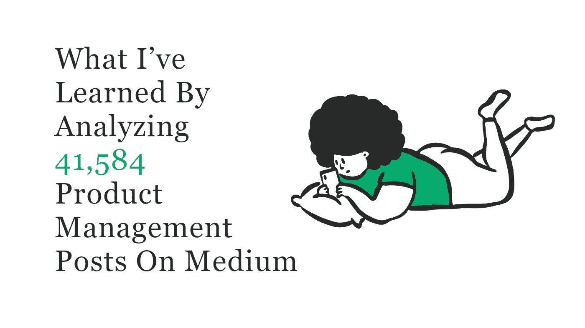
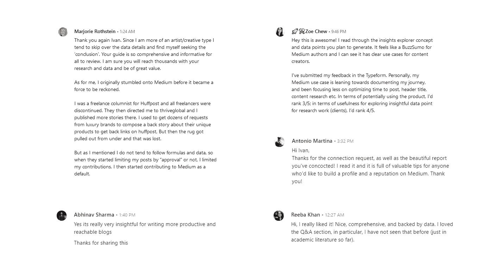
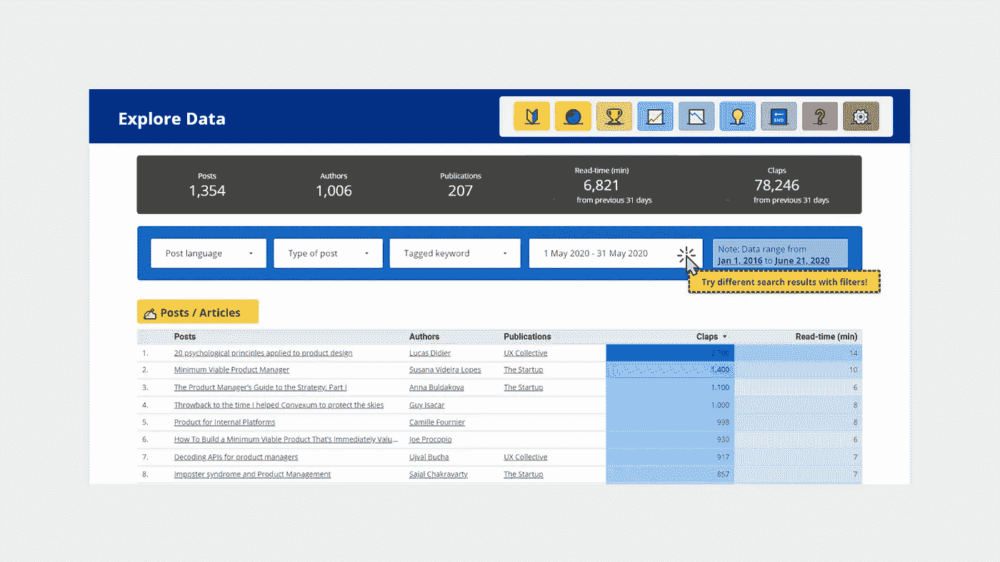

# 通过分析 41，584 个产品管理帖子，我学到了什么

> 原文：<https://pub.towardsai.net/what-ive-learned-by-analyzing-41-584-product-management-posts-b817c8d9fe05?source=collection_archive---------2----------------------->

## [产品管理](https://towardsai.net/p/category/product-management)

## 我不应该成为一个搜索引擎优化专家来写点击的内容

详细报道— [链接](https://datastudio.google.com/reporting/ba00a3d5-451c-4f8e-9ad9-3bb9813747ab/page/AapYB)

你是否在通过媒介建立你的声音，但是媒介却没有帮助？

在 Medium 上寻找最好的资源，但是缺少有用的导航，这似乎是不可能的？

或者你正在寻找合适的人来分享你的想法和想法吗？

以上我都有。

我努力成长为一名产品经理，却没有以写作的形式与社区分享我的想法，或者找到有用的资源，却没有跨越内容重新打包子堆栈或充满幽灵的空闲频道。

面对现实吧，成长是痛苦的。运气并不总是在那里。

不是每个人都能在资金充足的初创公司、跨国公司或增长驱动型公司工作，在这些公司，决策是由数据/客户反馈驱动的。也没有以培养你的职业生涯为荣的前辈。

“媒介”是我试图通过吸引注意力和向最优秀的人学习来啃过这条荆棘之路。

想出足够独特的想法来娱乐读者并不是一件容易的事，但也不要有太多的陈词滥调，感觉像是在打死马。(是的，敏捷、scrum、OKR，我说的是你们所有人)现在，我必须成为一名 SEO 专家和数据科学家，才能创作出好的内容，找到有用的内容？

不要误解我。我喜欢中号。事实上，从他们开始把内容放在付费墙后面的那天起，我就订阅了 Medium。我使用 Medium 的书签功能，就像囤积者使用卡车一样；我几乎每天都会囤积一些有帮助的文章和帖子，以备日后参考。

但是，嘿，我们是产品极客，不是吗？一定有更好的办法。

事实上，是的，[那里](https://datastudio.google.com/reporting/ba00a3d5-451c-4f8e-9ad9-3bb9813747ab/page/AapYB)就是。

在 3 周的时间里，我分析了 41，584 篇产品管理帖子，涵盖了 17，903 位作者和 4，035 篇出版物，以下是我学到的东西。

# TL；博士；医生

**1。4 ~ 8 个字的标题效果最好**

针对移动和电子邮件预览进行优化。此外，短标题迫使你简洁地表达你想要分享的内容。

**2。使用“How”或“How-to”开始标题**

例如，[*Sherif Mansour*](https://medium.com/u/88fa38f5646a?source=post_page-----b817c8d9fe05--------------------------------)的《*我们如何摧毁用户故事》和*[*Andreea nasta se*](https://medium.com/u/99aad3e53433?source=post_page-----b817c8d9fe05--------------------------------)的《*我如何准备经理面试》就是最好的例子。*

**3。标题中不需要“产品”一词**

产品管理并不总是只关注产品，而是更多地从多个角度解决一个问题。根据 Justin Welsh 的说法，在 LinkedIn 的*剧本*中，我们可以用不同的方法将我们的内容和专业性吸引到 4 个不同的领域。

**4。从一个数字开始**

> 模糊滋生平庸

人类的平均注意力持续时间比以往任何时候都要短。观众越早知道如何从你的产品中获益，他们在猜测时失去兴趣的几率就越低。

我敢肯定， [Johnny makes，](https://medium.com/u/e6fa2418c5e5?source=post_page-----b817c8d9fe05--------------------------------)，[qu](https://medium.com/u/dbafa53d756b?source=post_page-----b817c8d9fe05--------------------------------)， [Jon Moore](https://medium.com/u/8cebe625c432?source=post_page-----b817c8d9fe05--------------------------------) 在分别写“*我在乐高*当设计师学到的 5 件事””，“ *4 个产品管理面试技巧‘强聘’应该知道的*”和“*你【可能】忘记设计*的 50 件事”时，也有同样的想法。

**5。530 ~ 1325 字效果最好**

读者选择阅读小内容，不仅是因为它们更容易消费，也因为它们更容易引起读者的共鸣。

此外，出于同样的原因，这些微小的内容在 LinkedIn 等社交平台上被重新利用，作为任何人品牌努力的一部分。

**6。尝试其他语言**

***繁体中文*** ， ***挪威语*** ， ***法语，*** 和 ***葡萄牙语*** 都是分散和扩大你的内容范围的不错选择。

**7。避免使用某些语言**

***缅甸*** 、 ***荷兰语、*** 和 ***简体中文*** 产出一些最低的接通率。你仍然可以给他们写信，但是不要写交通。

**8。个人粉丝被高估**

媒体不再是 Twitter 成立时的样子，良好的追随-不追随策略不会帮助你增加流量。

**9。站在巨人的肩膀上**

由于个人粉丝在接触更多受众方面并不是一个重要因素，所以在 UX 集体、初创公司、产品联盟和走向数据科学等成熟的出版物上发帖。

# 结论

希望这些见解对你有用。我知道你会的，因为这是其他人对见解的看法。

[医学](https://datastudio.google.com/reporting/ba00a3d5-451c-4f8e-9ad9-3bb9813747ab/page/AapYB) —用户评价

为了探索 41，584 个帖子的全部内容，或者你是一个写作的产品极客，我正在寻找支持你的最佳方式。联系，帮我塑造媒介写作的未来。

[自己探索数据](https://datastudio.google.com/reporting/ba00a3d5-451c-4f8e-9ad9-3bb9813747ab/page/GFLVB)

我是一名 SaaS/市场专家，专注于通过在业务、用户体验和开发之间架起沟通的桥梁来构建有用的产品。我特别喜欢结识有趣的人，与志同道合的人交流有趣的想法和观点。

*   [领英](https://www.linkedin.com/in/ivanoung)
*   [推特](https://twitter.com/IvanTheChaos)

如果你想聊聊领导力、产品管理、成长型创业公司或新的生产工具，我很乐意与你联系！