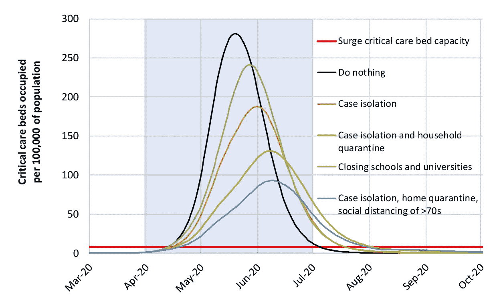
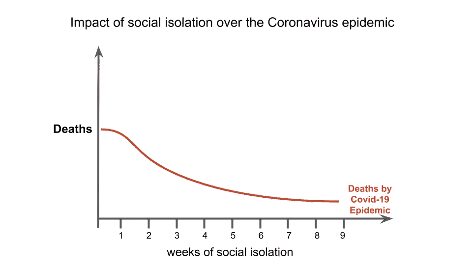
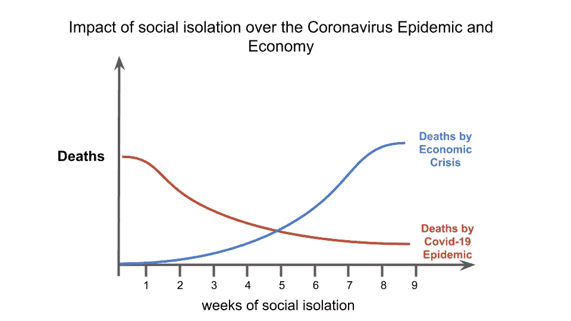
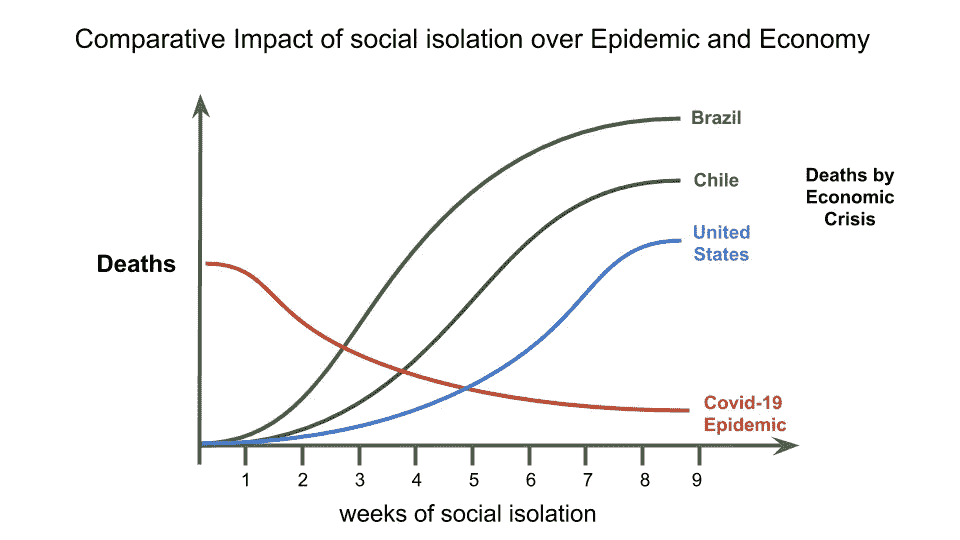

# 新冠肺炎流行病模型没有告诉你的是

> 原文：<https://pub.towardsai.net/what-the-covid-19-epidemic-models-are-not-telling-you-629218791246?source=collection_archive---------1----------------------->

## 是时候让科学家和经济学家一起工作来指导我们的决策了

照片由[在](https://unsplash.com/@freetousesoundscom?utm_source=medium&utm_medium=referral) [Unsplash](https://unsplash.com?utm_source=medium&utm_medium=referral) 上免费使用声音

# 介绍

到目前为止，我们所知道的故事如下:SARS-Cov-2 是一种高度传染性的病毒，导致呼吸系统疾病新冠肺炎。它起源于 2019 年最后一个季度的中国武汉省，现已传播到地球上几乎每个国家。传播主要是在个人接触之间，到目前为止，我们已经确认超过 240 万人感染了这种病毒，死亡人数超过 16 万。

已经开发了流行病学模型来估计疫情对不同国家的影响。被引用最多的模型是由伦敦帝国理工学院(ICL)的 Neil Ferguson 团队开发的，于 2020 年 3 月 16 日发表。**该模型预测，在“没有任何控制措施或个人行为自发变化的情况下”，英国将有 51 万人死亡，美国将有 220 万人死亡**

英国和美国政府都受到了 ICL 模型的影响，也受到了其他模型的影响，比如由位于 IHME 的华盛顿大学健康度量和评估研究所开发的模型。为了应对病毒威胁，各国开始实施一系列与社会隔离和检疫、检测以及医疗基础设施投资相关的政策。

# 当前的流行病学模型中缺少了什么？

首先，我不是在质疑这些模型的方法论。我确实相信它是由伟大的专业人士利用当时可用的资源开发出来的。我知道在流行病期间获得可靠的数据并为模型建立正确的假设和参数是多么困难。

> "本质上，所有的模型都是错误的，但有些是有用的."
> 
> 乔治·博克斯；诺曼·r·德雷珀(1987)。经验建模和响应面。

图一。由伦敦大学学院小组模拟的每种情况下的医院床位占用预测。

图 1 显示了 ICL 模型对重症监护病床需求的不同预测情景，黑线代表疫情的自然发展过程，其他彩色线代表实施非药物干预(NPI)的情况。红线代表英国重症监护病床的可用容量。因此，我们可以很容易地得出结论，无论发生什么情况，英国(美国或任何其他国家)都将没有床位容纳感染和患病的病人。

通过建议 NPIs 可以使曲线变平，我们预计更多的人将有机会使用医院病床，从而减少由于缺乏医院基础设施而导致的死亡人数。

> 任何非药物干预背后的逻辑都是试图通过减少感染者与健康个体相互作用的机会来降低感染率。

通过对有和没有 NPIs 的冠状病毒流行病进行建模，作者认为，如果实施社会隔离水平，那么死于感染的人会更少。

那么它有什么问题呢？

> ICL 模型的问题在于，作者提出的解决方案不仅影响了流行病的动态，还影响了社会的其他活动，尤其是经济。

这就是我们发现流行病模型的第一个问题，因为它没有考虑到社会隔离对经济、社会生活、心理健康或社会其他方面的影响！

正如《ICL 报告》的文章所述:

> “在这里，我们不考虑任何一种策略的伦理或经济影响，只是要指出，没有容易做出的政策决定。”—帝国理工学院新冠肺炎响应小组报告 9(2020 年 3 月 16 日)

# 模拟社会隔离对社会的影响

如前所述，根据已发布的关于当前疫情的模型，通过实施社会隔离措施，我们理论上可以通过降低每个感染者的感染人数和平坦化曲线来拯救生命。因此，基于这一前提，如果我们增加社会隔离的天数，我们就会降低冠状病毒的死亡率。

我的**假设图**描述了这个假设，如图 2 所示。

从流行病学的角度来看，实施与社会隔离相关的公共政策是明智的，因为更少的人会因为感染而死亡(更准确地说，是因为缺乏医院基础设施)。

另一方面，社会孤立直接影响到受其影响的每个国家的经济。仅举一个例子，在社会隔离开始后的短短两周内，美国申请失业保险的人数就达到了惊人的 1000 万。

假设经济衰退或萧条影响了一个国家的总体健康，通过实施 NPIs，我们可能会增加长期死亡的公民数量。

图 3 显示了新冠肺炎疫情导致的死亡和非盈利机构引发的经济危机之间的**假设**关系。

我们从图 2 中得到的趋势是**更广泛的社会隔离降低了疫情的影响，但增加了经济危机的影响。**

# 全世界社会经济影响的证据

为了解释我对 NPIs 的影响的关注，我将描述几个相关的报告，这些报告为我们提供了对形势的总体看法。

国际货币基金组织发布了一份报告(世界经济展望，2020 年 4 月)，估计“在基线情景中，假设疫情在 2020 年下半年消退，遏制措施可以逐步放松”，全球经济将收缩-3%。为了让你了解这可能有多严重，在 2008 年金融危机期间，全球 GDP 收缩了-1.67%。

2012 年发表在《柳叶刀》(The Lancet)上的一篇文章(“经济衰退期间美国各州自杀率的增加”，Reeves 等人)估计，2007 年至 2010 年，美国发生了超过 4500 起与金融危机有关的超额自杀事件。这只针对美国。

联合国粮食及农业组织(粮农组织)对冠状病毒流行可能导致的全球粮食供应短缺表示担忧。商品和资源的国际贸易网络正受到影响，对世界各国的供应链产生潜在后果。

这只是列举了当前疫情的一些可能的社会经济影响。

你可能会问我如何估计经济危机导致的潜在死亡人数，答案是我只是假设更多的人会因为经济崩溃而死亡。但是我没有预测这种现象的模型。

> 这就是这篇文章的关键点:没有人模拟社会隔离措施对社会的影响以及由此造成的附带损害！

回到图 2，如果你注意 x 轴，你会注意到，**假设**，有一个社会隔离的最佳时期，在这个时期我们试图减少总死亡人数。我想再次强调，周数只是为了说明我的观点。

这一理论分析的一个重要方面是，由疫情或经济危机导致的**死亡不会在同一时间框架**内发生。新冠肺炎造成的死亡将发生在我们现在这个时刻，而经济危机的影响可能会在很长一段时间内影响死亡率。

> “很难预测，尤其是未来”——尼尔斯·玻尔

总结到目前为止的想法，我们有一个不完全是医学/流行病学的危机，因为建议的解决方案(NPIs)对经济有重大影响。

换句话说，我们有一个复杂的问题，用来理解它并帮助我们解决它的模型需要考虑到对社会其余部分的所有影响和后果。

# 不同国家呢？

我想探讨关于 NPIs 对国家/场景的影响的最后一个想法。不同国家的经济在对 NPI 影响的弹性方面具有难以置信的动态性和多样性，就像完全锁定一样。

图 4 显示了社会隔离对三个经济稳定性不同的国家的可能影响:巴西、智利和美国。

假设经济更稳定的国家可以忍受长期的社会孤立，对经济和公共健康的长期影响更小，那么每个国家的 NPI 持续的最佳时间将会不同。

所以回到流行病期间最小化死亡的模型的想法，**使用一个没有考虑每个国家的社会和经济特点的模型不会提供必要的信息来帮助政府做出明智的决定。**

# 那么我们该如何解决这场危机呢？

首先，我们需要定义疫情挑战及其所有影响。它的影响再次超出了流行病学/医学领域。

> “一个明确的问题已经解决了一半。”——约翰·杜威

接下来，需要建立各种领域的专业人员之间的交流。

> 我们现在需要的是科学家、经济学家、政治家和其他专业人士共同努力，试图为每个特定国家(甚至城市)找到最佳解决方案，以最大限度地减少疫情给人类带来的痛苦。

**必须记住，预测模型不是科学事实，**而是帮助领导者应对不确定时期的工具。我们必须确保这些模型被视为每天都在更新、验证和测试的假设。

最近关于新冠肺炎的研究表明，一些变量可能会影响特定国家的疫情动态，如人口的平均年龄、卡介苗接种覆盖率和平均气温。应该测试这些类型的替代特征，以优化响应模型，以及所有的社会经济变量。

# 结束语

马丁·艾肯鲍姆、塞尔吉奥·雷贝洛、马蒂亚斯·特拉班德最近发表的一篇文章(《流行病的宏观经济学》)描述了美国流行病的模型，评估了限制性措施以及对经济其他部分的影响。作者试图定义在美国环境下最大限度减少死亡的最佳简单控制政策。这是一项有希望的研究，应该推广到其他国家，探索其他情况。

Bjorn Lomborg 在他的著作《如何花费 750 亿美元让世界变得更美好》中描述了哥本哈根共识所做的工作，哥本哈根共识是一群经济学家(一些诺贝尔奖获得者)聚集在一起讨论并提出全球问题的解决方案。该组织试图对最紧迫问题的最有希望的解决方案进行排序，以使结果最大化，这样更多的人可以从推荐的政策中受益。

当我们试图估算疫情对全球的影响时，我们意识到人类的生命和数万亿美元正在消失。如果我们把这个话题加入到哥本哈根共识所评估的讨论中，它可能会排在第一位，因为开发考虑到本文所述特征的新模型的投资是可笑的。但它有巨大的潜力向政治领导人提供关键信息，帮助全世界数百万人。

这可能是人类历史上开发的最重要的数据科学项目，其积极成果将影响当代和后代。

# 非常感谢你阅读我的文章！

*   你可以在我的[个人资料页面](https://medium.com/@gabrielsgoncalves) **找到我的其他文章🔬**
*   如果你喜欢并且**想成为中级会员**，你可以使用我的 [**推荐链接**](https://medium.com/@gabrielsgoncalves/membership) 来支持我👍

# 资源

 [## 报告 9 —非药物干预(NPIs)对降低新冠肺炎死亡率和死亡率的影响

### 报告 9:非医疗干预措施(INM)对降低死亡率的影响

www.imperial.ac.uk](https://www.imperial.ac.uk/mrc-global-infectious-disease-analysis/covid-19/report-9-impact-of-npis-on-covid-19/)  [## IHME |新冠肺炎预测

### 基于预期死亡，探讨新冠肺炎导致的医院病床使用、重症监护病床需求和呼吸机使用

covid19.healthdata.org。](https://covid19.healthdata.org/united-states-of-america)  [## 过去两周创纪录的 1000 万人寻求美国失业救济

### 华盛顿——上周超过 660 万美国人申请失业救济——比最高纪录翻了一番…

www.nytimes.com](https://www.nytimes.com/aponline/2020/04/02/business/bc-us-virus-outbreak-unemployment-benefits.html)  [## 世界经济展望，2020 年 4 月——第一章:大封锁

### 新冠肺炎疫情在世界范围内造成了高昂且不断上升的人类代价，而必要的保护措施是…

www.imf.org。](https://www.imf.org/en/Publications/WEO/Issues/2020/04/14/weo-april-2020)  [## 国内生产总值增长率(年%)

### 世界银行的国内生产总值增长(年%)数据

data.worldbank.org](https://data.worldbank.org/indicator/NY.GDP.MKTP.KD.ZG?name_desc=true)  [## 新冠肺炎危机期间确保全球粮食供应的作战计划

### 新冠肺炎疫情已经将世界置于危机之中，采取了前所未有的行动来限制行动和计划…

www.fao.org。](http://www.fao.org/news/story/en/item/1268059/icode/)  [## 卡介苗接种政策与新冠肺炎患病率和死亡率的关系

### 有证据表明，结核疫苗卡介苗(BCG)具有非特异性的有益作用…

www.medrxiv.org。](https://www.medrxiv.org/content/10.1101/2020.03.30.20048165v1)  [## 流行病的宏观经济学

### 2020 年 3 月发布的第 26882 号 NBER 工作文件，2020 年 4 月修订的 NBER 计划:经济波动和…

www.nber.org](https://www.nber.org/papers/w26882)  [## 如何花 750 亿美元让世界变得更美好

### 当谈到援助支出时，政治决策者常常表现得好像资源池是无限的，我们…

www.copenhagenconsensus.com。](https://www.copenhagenconsensus.com/copenhagen-consensus-iii/how-spend-75-billion-make-world-better-place-0)