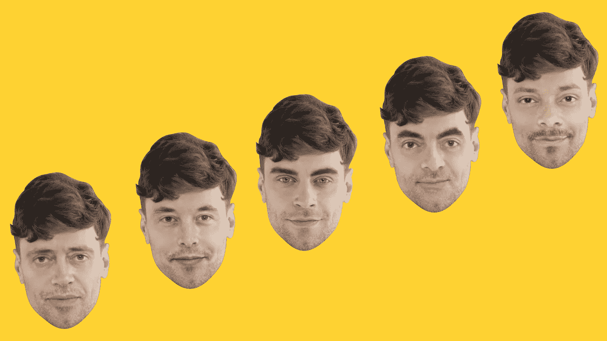

# 我们所谓的“深度假货”不再是假货:如何善用这项技术

> 原文：<https://pub.towardsai.net/what-we-called-deepfakes-are-no-longer-fakes-how-to-use-the-technology-for-good-78d7a280d886?source=collection_archive---------5----------------------->

## [人工智能](https://towardsai.net/p/category/artificial-intelligence)，[科技](https://towardsai.net/p/category/technology)

## 人们如何利用合成媒体**促进个性化交流**

九年来，我们一直致力于机器学习。今天，每天有数百万人使用我们的面部交换应用 Reface。尽管我们的应用程序很受欢迎，也很安全，但人脸交换技术仍然被错误地与传播虚假信息的**【deep fakes】**联系在一起。

# 奶酪不是粉笔

术语**“deep fakes”**源于一位 Reddit 用户，他在 2017 年 12 月应用机器学习算法制作了名人色情假货。媒体很快开始使用**【deep fakes】**作为任何合成内容的统称。人们错误地称 deepfakes，包括没有深度学习技术或不打算欺骗观众的视频剪辑[创建的](https://www.poynter.org/fact-checking/2018/a-potential-new-marketing-strategy-for-political-campaigns-deepfake-videos/)。

**我们为 Reface 开发的面部交换技术**是一种合成媒体，它通过一个通用的神经网络来操作，只需一张照片就可以在几秒钟内改变面部特征。这种最先进的技术是个性化通信的巨大突破。它与 Instagram 自拍面具或 IOS 表情符号头像并列，任何拥有智能手机的人都可以使用。

下面是过去两年中人工智能生成的内容在不同领域中用于公益的例子。

●达利博物馆用人工智能制作了一个视频装置，看起来像是真实的萨瓦尔多·达利，并帮助游客以一种新的方式与他的艺术联系起来。Dalí Lives 是使用机器学习算法制作的，该算法在 6000 帧存档视频中研究了其主题。

●唇同步技术可以将外国观众的内容改编成不同的语言。这就是 Synthesia.io 和他们的[视频](https://www.youtube.com/watch?v=QiiSAvKJIHo&feature=emb_logo)的情况，其中大卫·贝克汉姆用九种不同的语言来提高人们对疟疾的认识。

●令人着迷的 [Respeecher 的](https://www.youtube.com/watch?v=B78TE_zxx8w) 声音克隆技术复制声音，产生与原件难以区分的合成语音。它将电影配音领域带到了一个全新的高度，我们听到的是其他语言的演员原声。

> 使用“deepfake”标签来描述上面的例子是一个命名错误。“合成媒体”是一个更好的术语，用来表示人工智能生成的视听内容。

# 顾客使用面部交换技术

我们从用户和潜在客户那里收集了**的反馈，以深入了解他们的用户体验，并检验我们的假设。 ***调查*** 显示，73%的受访者将面部交换技术用于娱乐。另外 22%的人正在寻找一种工具来提升他们的产品、组织或营销业绩。大约 5%的回答甚至让我们感到惊讶，例如，改善心理健康，求婚。**

下面是我们在客户开发研究中发现的一些人们使用面部交换技术的最显著的方式。

**1。** **改善精神保健和身体不安全感**

尽管面部交换技术相对较新，还需要进一步研究，但它已经在医疗保健领域大有可为。Reface 用户已经承认，我们的技术具有巨大的潜力，可以为自闭症谱系障碍和社会排斥患者的个性化治疗勾勒出新的方法。

> 一位受访者表示:“面部交换有助于他们沉浸在一个学习环境中，拥有更强大的自我，并展示了他们如何真正与他人互动并建立关系。”。

我们的研究表明，这项技术与身体变形症患者、跨性别者和非二进制人群相关。重构可以改善他们的体验，即时帮助他们想象自己的身体或他们内心感受到的性别。

**2。**匿名化

Reface 技术可以将真实视频和图像上的面部和身体与人工改造的人进行交换。该系统与向量一起工作，并将脸改变为相似的脸——相同性别和种族的脸。因此，图像看起来很普通，可以用于商业目的，而不受隐私权的限制。这可以极大地方便摄影师和摄像师的日常工作。

**3。** **打造完整的沉浸式游戏体验**

我们从研究中获得的最有力的见解之一是，重构是增加身临其境的游戏体验的一种新方法。该技术提高了人物面部表情的质量，模仿并提高了与原型的相似性。

随着公司将整合面部交换技术，游戏玩家的体验将变得更加个性化，允许他们根据自己的外貌创造角色。

> “我们正在开发一款体育游戏，所以我们希望用户模型看起来就像玩家一样。目标只是尽可能地增加沉浸感。虚拟现实让你置身于游戏中，我们希望玩家能够在社交媒体平台上分享这种体验，”*我们在游戏行业工作的受访者说。*

**4。** **便于个性化交流**

如果你可以给你的好朋友寄一张他们在卡迪 B、麦当娜或泰勒·斯威夫特的视频中跳舞的超现实记录，为什么要满足于一张无聊的生日贺卡呢？

> 想看一部以你的脸为主角的新电影预告片吗？只需要 15 分钟，这不再是火箭科学。

个性化可能是新的黑色，但它也是一个新的竞争战场。通过人工智能，人们正在寻找新的自我表达和灵感的方式。人脸交换技术将个性化内容带到了一个新的高度。无论是创建 gif 来给你的朋友发送垃圾邮件，编辑视频剪辑来祝贺某人，为你的客户制作教育内容或定制营销，甚至是通过交换家庭成员的面孔来纪念一个人的家庭档案。

一位调查参与者分享说，Reface 帮助他实现了他的提案想法。他重新制作了一个联邦调查局的参考视频，把钱德和莫妮卡的脸换成了他和他女朋友的脸。

**5。** **创意产业的重要新工具**

在其他领域中，面部交换技术有相当大的潜力，包括电影和视觉艺术。

> 制作可以使用换脸工具来尝试各种演员的角色，测试不同的化妆外观和风格，创建人工演员，进行虚拟选角，修复制作混乱，更换或替换演员，以及与各种地点合作。

疫情正在加速电影制作、发行和消费的变革。然而，在新冠肺炎限制范围内，换脸已经被证明是一种有效的解决方案。

例如，乌克兰品牌 KSENIASCHNAIDER [发布了](https://www.kseniaschnaider.com/blogs/news/reworked-and-refaced-spring-summer-2021)一个 2021 春夏时装秀视频，使用 Reface 技术改变模特的外观。通过这种方式，仅使用三个模特和一个面部交换应用程序，该品牌就用最少的资源创造了 20 多种独特的外观。技术使得整个铸造过程不仅更安全，而且时间更短，成本更低。

利用换脸技术改变模特的外貌

一般来说，合成媒体和表面技术提供了各种机会。它增强了 Youtube、电视和电影制作、营销、游戏、社会服务和医疗保健行业。

重要的是使用正确的术语，感受技术发展和误用之间的区别。像任何新技术一样，人工智能内容的创造需要监管、限制和监督。为了实现这一目标，我们采用了内容审核策略，并设计了 deepfake 检测工具。我们致力于确保我们的技术用于正确的目的，不具有攻击性，不侵犯任何人的权利。

