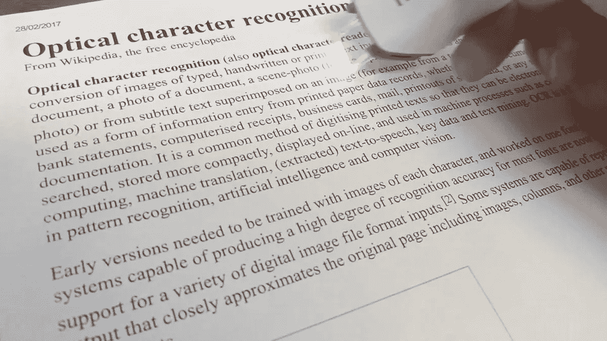
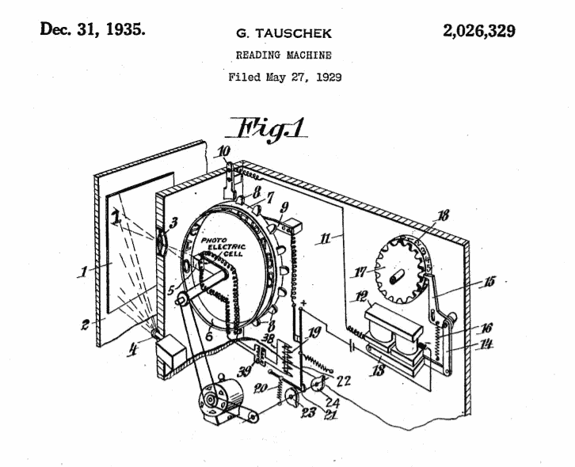
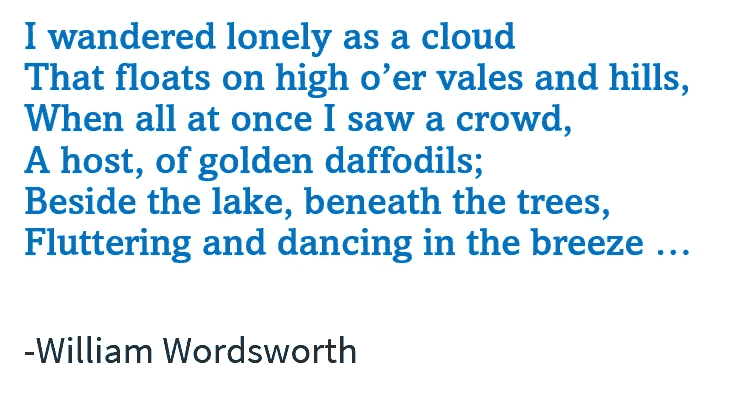
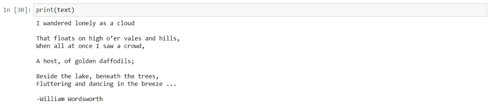
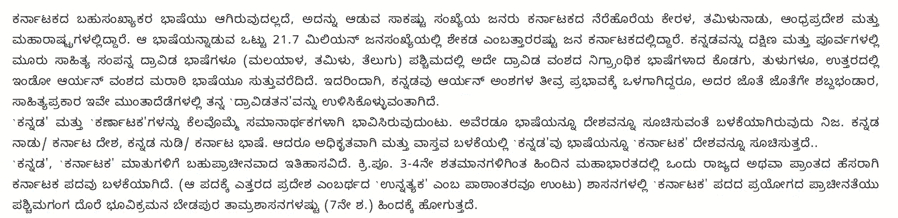
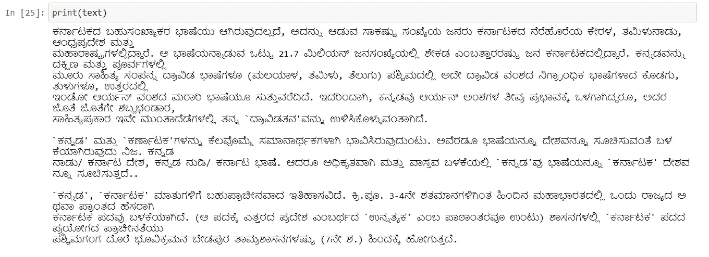
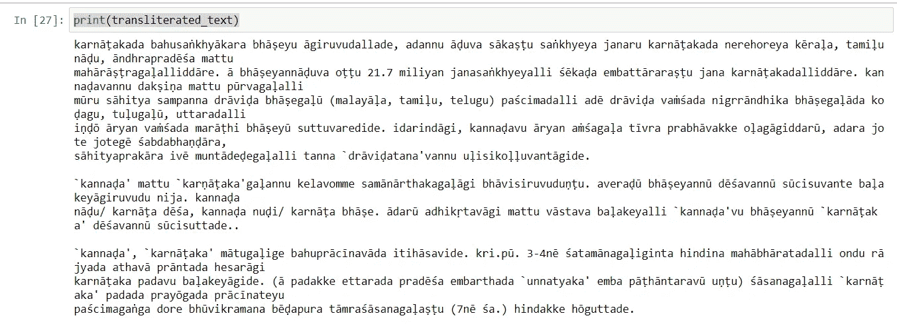
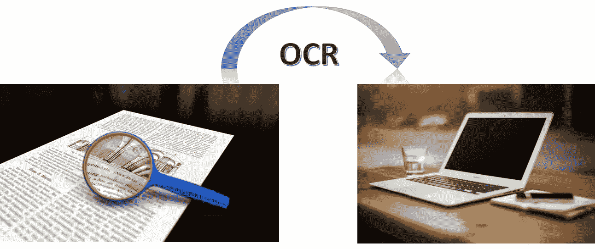

# 光学字符识别(OCR)是什么，为什么和如何

> 原文：<https://pub.towardsai.net/what-why-and-how-of-ocr-4c227f280672?source=collection_archive---------4----------------------->

由于语言能力和先进的通讯技术，人类在辉煌的孤立中脱颖而出。然而，交流的速度是一个和人类一样古老的探索。

# **什么是 OCR？**

光学字符识别(OCR)是一种以编程方式视觉识别字符并将其转换为最佳猜测的等效计算机代码的过程。

# 为什么是 OCR？

时间是宝贵的，上个世纪已经出现了自动化来加速耗时的任务。从一种交流形式转换到另一种交流形式是很麻烦的，将语音或文字转换成其他形式的能力一直在不断发展。

> 为了数字化而重写文件所浪费的时间多得令人难以置信。在使用技术使内容可互换时，人们追求的是转换速度的新颖性。

# **今天的 OCR 技术会有什么帮助？**

OCR 被认为是当今全球企业的一大福音，它是将图像中的印刷文本、不可编辑的电子文档(PDF)和硬拷贝记录转换为各种机器可搜索和可编辑的数据格式背后的科学和技术。这些格式包括 Word、Excel 和 PDF 等格式的数据存储。

对个人来说，意味着个人生活的便利性和生产力。

对于企业来说，这意味着您的底线真正的节省。

来源:https://www.adobe.com/acrobat/acrobat-pro.html

利用 SaaS 业务需求解决方案，可以收集和存储大量数据。没有自动化，就没有人类可持续的方式来处理大内容问题。

机器不能解释任何内容。他们所能做的是在文本示例和图像中的模式之间进行极其精确的比较。多年来，使用机器学习进行 OCR 已经有了很大的创新，并取得了令人印象深刻的成果。今天，我们已经有了非常先进的包和包装器，它们易于集成并且速度更快。

# **OCR 工具的历史**

对有效工具的探索始于 19 世纪。早在 1885 年，尼普科夫圆盘就是一种图像扫描设备。后来的设备开始通过解释莫尔斯电码来朗读文本。能够读取文本的第一台扫描仪要求文本采用特殊字体，以便扫描软件识别。1974 年，库兹韦尔计算机产品公司开发了第一个全字体软件。

第一个 OCR(光学字符识别)设备是由奥地利工程师 Gustav Tauschek(1899–1945)在 20 世纪 20 年代末开发的，他在 1929 年获得了德国 OCR(所谓的*阅读器*)的专利，随后 Paul Handel 在 1933 年获得了美国 OCR(所谓的*统计机*)的专利(美国专利 1915993)。1935 年，陶谢克的机器也获得了美国专利([美国专利 2026329](https://history-computer.com/Library/US2026329.pdf) )。

# **2021 年的 OCR**

机器学习帮助我们扩展 OCR 的准确性和灵活性，通过业务配置的工作流实现的自动化确保了这些海量数据能够被为我们工作的工具优雅、一致和可靠地处理。

那么，我们可以通过 OCR 寻求哪些交流的答案呢？我们可以遵循的机器学习方法是什么？让我们找出答案。

最近一段时间，有大量的内容是通过图像、视频、闭路电视和其他方式获取的。将内容转换成机器可编辑的内容具有很大的价值。OCR 的应用示例包括:

从 dashcam 或 CCTV 读取车辆的铭牌

将手写手稿转换为可编辑的文档

将书籍的扫描副本转换为可编辑的内容。

所有的编程语言都有丰富的库和包来方便 OCR 操作。Python 是机器学习的热门选择之一，Python 也有 Python-tesseract 作为光学字符识别(OCR)工具。也就是说，它将识别并“读取”嵌入图像中的文本。

> Python-tesseract 是 Google 的 Tesseract-OCR 引擎的包装器。它作为 tesseract 的独立调用脚本也很有用，因为它可以读取 Pillow 和 Leptonica 图像库支持的所有图像类型，包括 jpeg、png、gif、bmp、tiff 等。此外，如果用作脚本，Python-tesseract 将打印识别的文本，而不是将其写入文件。

I **安装**:访问安装宇宙魔方；向下滚动以查找 32 位和 64 位系统的最新安装程序；根据需要下载它们。

> 警告:Tesseract 应该安装在安装过程中建议的目录中，或者安装在新的目录中。卸载程序会删除整个安装目录。如果您在现有目录中安装了 Tesseract，该目录及其所有子目录和文件都将被删除。
> 
> 解决方法当所有目录都被删除并且您无法识别 numpy 或 Jupyter 中的任何其他库时，您可能希望使用此处说明的步骤创建一个新环境:
> 
> [https://conda . io/projects/conda/en/latest/user-guide/tasks/manage-environments . html #用命令创建环境](https://conda.io/projects/conda/en/latest/user-guide/tasks/manage-environments.html#creating-an-environment-with-commands)

请确保您在 Jupyter 中选择了这个新环境，以便解除阻止并成功运行 notebook。

我们现在将使用它来浏览图像，并将内容转换为可编辑的数据。我们可以进一步选择使用这些数据进行一系列操作。

让我们浏览一下涉及的各个步骤…

**第一步**。导入模块:

*导入立方体*

*从 PIL 进口图片*

*导入操作系统*

**第二步**。验证宇宙魔方的目录并复制整个路径

`pytesseract.pytesseract.tesseract_cmd = r”C:\Program Files\Tesseract-OCR\tesseract.exe”`

**第三步**。首先，用 image 函数打开图像，然后使用 pytesseract 获取图像的所有数据，并将所有文本存储在一个变量中。

*img = image . open(" About-book . png ")*

*text = pytesserac t . image _ to _ string(img)*

**第四步**。打印从图像中检索的文本:

`print(text)`

使用 *pytesseract* 获得的文本

我们可以看到图像中的单词被正确识别。我们现在可以将它用于任何有用的应用。为了好玩，我们现在将这些数据转换成手写！

Pywhatkit:这是一个库，可能用于多种用途，包括发送 WhatsApp 消息、观看 YouTube 视频、搜索 Google 以及编写手写文本。

`pip install pywhatkit`

我们将使用 **pywhatkit** 中的**text _ to _ handscription**函数将文本转换为指定的 RGB 颜色；在这种情况下，蓝色的 RGB 是 **0，0，250** 。

`kit.text_to_handwriting(text, rgb=[0, 0, 250], save_to=”handwriting-eng.jpg”)`

这样得到的笔迹惊人的逼真！

我们可以以编程方式在新窗口中显示它:

`img_out = cv2.imread(“handwriting-eng.jpg”)`

*cv2.imshow("文本到手写"，img_out)*

*cv2.waitKey(0)*

*cv2 . destroyallwindows()*

接下来，让我们探索一些使用非英语语言的操作。我会考虑卡纳达语(T42)，南印度的德拉威语之一。

让我们检查一下**pytesserac**是否支持其他语言。可执行文件内置了英语、西班牙语、法语的语言模型，但没有印度语言。为了与其他语言一起使用，我们需要提供 **langdata** 和 **tessdata** ，它们在 OCR 引擎上为大多数语言提供训练数据和 LSTM 训练模型:

[https://github.com/tesseract-ocr/langdata](https://github.com/tesseract-ocr/langdata)

[https://github.com/tesseract-ocr/tessdata](https://github.com/tesseract-ocr/tessdata)

这个 GitHub 文件夹包含许多语言的 Tesseract 的源训练数据。

将 **langdata** 和 **tessdata** 文件夹复制到 C:\Program Files\Tesseract-OCR

读取图像中的卡纳达语文本和捕获字符串中的文本的步骤:

**第一步**。安装模块

*导入立方体*

*从 PIL 进口图片*

*导入操作系统*

导入 cv2

**第二步**。验证宇宙魔方的目录并复制整个路径

*pytesserac t . pytesserac t . tesserac t _ cmd = r " C:\ Program Files \ tesserac t-OCR \ tesserac t . exe "*

**第三步**。首先，用 image 函数打开图像，然后使用 pytesseract 获取图像的所有数据，并将所有文本存储在一个变量中。

*img = image . open(" kannada . png ")*

*text = pytesserac t . image _ to _ string(img)*

考虑中的图像

**第四步**。打印从图像中检索的文本:

*打印(文字)*

从上面的图像中提取的文本

我们现在可以用卡纳达语显示所有的文本了！

是时候用这个内容做任务了。我选择做以下两个操作:

用 Python 中的 om _ 音译程序将卡纳达语音译为英语(拉丁语)ISO 15919 语。

使用 gTTS 包通过 Python 朗读卡纳达语文本。

**音译**:罗马化就是将不同书写系统的文字转换成罗马(拉丁)文字。在我们的例子中，从卡纳达语到罗马语。随着时间的推移，多种系统和标准，如亨特利音译、伊特朗斯、IAST、ISO 15919 (2001)等，已经发展到将印度文字罗马化。

对于这个音译练习，我将使用[这位](https://medium.com/@shrirambhat/transliteration-of-kannada-to-english-latin-iso-15919-with-om-transliterator-in-python-821c64dd3d89)天才撰稿人的“om-音译”。

[https://pypi.org/project/om-transliterator/](https://pypi.org/project/om-transliterator/)

**安装** : pip 安装 om-音译

**显示文本的代码**:

*从 om _ 音译进口音译*

*音译=音译()*

*音译 _text =音译者. knda_to_latn(text)*

现在看音译！

*打印(音译 _text)*

卡纳达文的音译

**接下来，让我们大声朗读内容！** **让 Python 为我们说话吧！**

Python 提供了成千上万的包，允许开发者编写几乎任何类型的程序。使用 Python 可以将文本转换成语音的两个跨平台包是 PyTTSx3 和 gTTS。

我们将使用 gTTS 进行实验:[https://pypi.org/project/gTTS/](https://pypi.org/project/gTTS/)

*pip 安装 pyttsx3*

**代码**:

*从 gtts 进口 gTTS*

*从 playsound 导入 playsound*

*语言='kn'*

*myobj=gTTS(text=text，lang=language，slow=True)*

*myobj . save(" About-kannada . MP3 ")*

mp3 文件存储在您的目录中。这是有趣的练习！

现在，让我们也了解一下市场上容易使用的 OCR 工具。流行的 SaaS 工具有:

1. **IBM Datacap** — Datacap 简化了业务文档的捕获、识别和分类，以便从中提取重要信息。Datacap 拥有强大的 OCR 引擎、多种功能以及可定制的规则。它跨多个渠道工作，包括扫描仪、移动设备、多功能外设和传真。

2.**谷歌文档人工智能** —谷歌云人工智能套件中的解决方案之一，文档人工智能(DocAI)是一个文档处理控制台，它使用机器学习来自动分类、提取、丰富数据并解锁文档内的见解。

3.**AWS text ract**—AWS text ract 使用机器学习和 OCR 从扫描的文档中自动提取文本和其他数据。它还用于识别、理解和提取表单和表格中的数据。要了解更多信息，请查看 AWS Textract 的详细分类。

4. **Adobe Acrobat DC** — Adobe 提供全面的 PDF 编辑器，内置 OCR 功能。

5.**使用 Microsoft OneNote 的 OCR**—Microsoft OneNote 主要是一个笔记管理器，也可以兼作 OCR。它为光学字符识别提供了一种简单易行的方法，但有一点小小的限制，那就是它不支持表格和列。

**使用谷歌文档进行光学字符识别** —您可以使用谷歌驱动将图像文件转换为文本。

# 结论:

通过使用 Python 和**pytesserac**包的演示，我们似乎在图像到文本的转换上有了重大的飞跃。因此，最新的 OCR 软件包和 SaaS 工具可以帮助企业节省时间和资源，否则这些时间和资源将花费在数据输入&手动验证上。使用 OCR，从原始纸质文档、图像或 PDF 进行数据转换的整个过程只需不到几分钟，最终识别的文档看起来就像原始文档一样！

## **补充阅读:**

了解 LSTM:[https://www . analyticsvidhya . com/blog/2017/12/fundamentals-of-deep-learning-introduction-to-lstm/](https://www.analyticsvidhya.com/blog/2017/12/fundamentals-of-deep-learning-introduction-to-lstm/)

了解 pytessarat:[https://pypi.org/project/pytesseract/](https://pypi.org/project/pytesseract/)