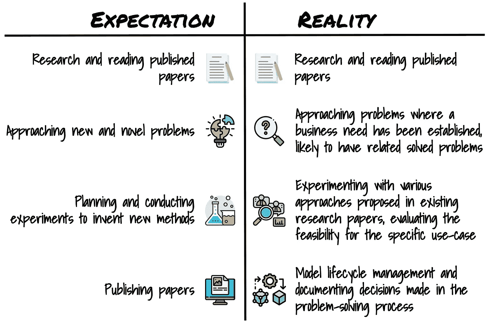
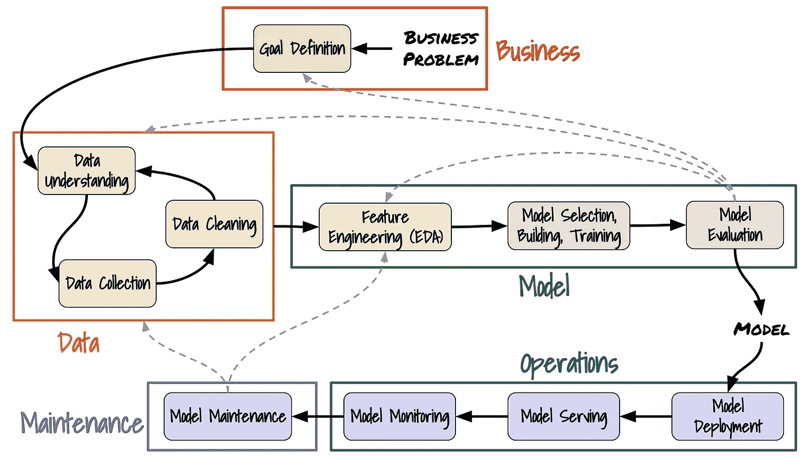

# 从事应用人工智能工作是什么感觉？

> 原文：<https://pub.towardsai.net/whats-it-like-to-work-in-applied-ai-6541a44a0cd7?source=collection_archive---------0----------------------->

## 从职业生涯早期的角度理解机器学习工程师的角色

来源:[附身摄影](https://unsplash.com/@possessedphotography?utm_source=unsplash&utm_medium=referral&utm_content=creditCopyText)在 [Unsplash](https://unsplash.com/?utm_source=unsplash&utm_medium=referral&utm_content=creditCopyText) 上的照片

# 介绍

## *披露和准确性*

*本文是从职业生涯早期阶段的角度撰写的:2 年以上的技术领域经验，1 年以上的应用人工智能/人工智能经验，拥有(预期的)工程学士学位。大量的经验存在于初创、小型和中型的环境中，这些环境天生比成熟的组织更少结构化。*

作者努力维护对普通读者有用的准确信息。但是，请注意，关于这个主题的信息发展很快，并且各个组织的实践可能大相径庭，因此存在来自各种来源的大量相互冲突的观点。

## *目标受众*

*本文面向应用人工智能领域的其他早期职业工程师、对职业转型感兴趣的软件工程师以及对这个主题感兴趣的任何人。*

# 什么是应用 AI？

有大量的现有资源可以更深入地挖掘这一点，但总而言之，应用人工智能是:

> “…人工智能的一个分支，将它从实验室带入现实世界…”[1]

本质上，应用人工智能正在进行科学研究并将其应用于商业问题。

## 什么是机器学习工程师？

从机器学习的定义开始会有所帮助。它被定义为:

> “……在没有直接指导的情况下，使用数据的数学模型来帮助计算机学习的过程。这使得计算机系统能够根据经验不断学习和改进。”[2]

本质上，“人工智能”是“智能”机器的概念。机器学习是用来开发这种“智能”的过程。因此，在这种情况下，机器学习(ML)工程师设计并构建实现机器学习过程所需的基础设施。

我们将在后面详细讨论 ML 工程师的特殊职责。

## 期望与现实

这与我们传统上理解的在“机器学习”和“人工智能”领域工作的工程师的角色有何不同？我们很可能会想到做了以下事情的人:

*   大量的研究和阅读已发表的论文，
*   处理新的和新奇的问题，
*   计划和进行实验来发明解决这些问题的新方法，
*   发表新论文。

这些职责实际上是由我们称之为“研究科学家”甚至“数据科学家”的人来完成的。我们错误地将理论归因于实践。

事实上，这就是我们在实践中所期望看到的:

来源:图片由作者提供，使用来自 [Flaticon](http://Flaticon.com) 和 [Freepik](http://Freepik.com) 的资源设计

我们可以看到，通过阅读论文来了解当前的研究和解决问题的方法是不变的。然而，每个其他点都有类似的职责，更多地反映了机器学习工程师的日常工作。

稍后我们会详细讨论这些区别。首先，我们必须讨论一些“应用人工智能”领域的行业术语。

# 错综复杂的职责划分

## 职位名称

这是你会经历最矛盾的观点的地方。根据不同职称的职责划分在组织之间甚至同一组织内的子团队之间并不一致。试图理解不同的描述和复杂的图表很大程度上是浪费时间，并且会让你对它们之间的区别更加困惑。相信我，当我试着写这篇文章时，我甚至开始质疑我自己的工作是什么。您将听到以下标题的一部分:

*   数据工程师
*   数据科学家
*   应用数据科学家
*   数据分析师
*   商业分析员
*   ML 工程师
*   MLOps
*   数据基础设施工程师
*   DevOps

描述招聘信息的组织，以及描述过去经历的个人，会交替使用这些术语，所以很难找到一致的数据。

冒着给这个论点增加更多混乱的风险，我将根据它们如何适应 ***数据科学过程*** 来定义我自己的在本文之外没有重大意义的通用标题。

## 数据科学过程

标准数据科学流程。黑色箭头代表主要流程，灰色虚线箭头代表决策点，在这里我们返回到上一步。(来源:图片由作者提供，灵感来自[【3】](https://miro.medium.com/max/700/1*zKTXJKxpEUbN11kMfg3LLQ@2x.jpeg)[【4】](http://www.mlebook.com))

在上图中，我们可以看到五个不同的“角色”:

*   **业务**:这个阶段包括理解和制定业务问题，定义项目的目标。这个角色通常被称为“业务(和/或数据)分析师”。
*   **数据**:这一阶段包括迭代，直到特征工程所需的数据数量和质量达到。这些包括了解可用于解决业务问题的潜在数据源(评估可用性、可用性、质量和成本等关键因素)、收集所述数据和清理(减少异常值、重新采样等)。)收集的数据。这将被分配给“数据工程师”和“数据标签员”的组合。构建数据管道通常会被指派给“数据基础设施工程师”。
*   **模型**:该阶段包括两个部分:特征工程和建模。收集的数据用于执行特征工程。选择、构建和训练模型。然后，根据“业务”阶段设定的指标对模型进行评估。如果它没有达到要求的指标，我们必须评估问题并返回到上一步。这个角色在职称方面最不一致。它可以是“数据科学家”(最不正确)、“应用数据科学家”或“数据分析师”中的任何一个。
*   **操作**:这个阶段包括部署、服务和监控完成的模型。在模型的生命周期中，监视是一个持续的操作。这个角色传统上被称为“DevOps”(软件开发和 IT 运营)，但对于机器学习项目，通常被称为“MLOps”(机器学习运营)。
*   **维护**:最后，如果监控检测到模型不再达到期望的指标，我们必须返回到流程中的前一个阶段。

涵盖了上述缺失的标题，“ML 工程师”的职责是数据、模型、操作和维护，通常强调数据和模型。

# 早期职业前景

现在，我们已经从高层次上了解了什么是“应用人工智能”以及您将在该领域听到的常见角色，**这对您来说意味着什么？在这一部分，我们将讨论作为一名早期职业 ML 工程师，你可以期待什么。**

来源:照片由[绍洛·莫哈纳](https://unsplash.com/@saulomohana?utm_source=unsplash&utm_medium=referral&utm_content=creditCopyText)在 [Unsplash](https://unsplash.com/s/photos/early-career?utm_source=unsplash&utm_medium=referral&utm_content=creditCopyText) 上拍摄

## 常见的误解

我们将从对该领域的一些误解开始。

> **机器学习重在统计。在这个领域工作，你需要很深的统计知识。**

如果你告诉别人你从事机器学习，你会经常听到，*“哇，你一定很擅长统计和数学，”*而我的回答通常是，*“也许？但这与我的工作并不十分相关。*

这就是说，这种说法在一定程度上是真实的，但被严重夸大了。从本质上讲，机器学习只是旧数学的新应用:统计、线性代数和微积分。了解基础知识对于理解如何真正有效地应用机器学习很重要。

然而，这仅仅到此为止。作为一名 ML 工程师，你需要从头开始实现反向传播吗？*大概不会。*现代的 ML 框架抽象了所有这些基本的理解(不管是好是坏)。你需要理解研究论文中使用的数学吗(在高水平上)？绝对是。这是使他们的方法有效适应您自己的业务问题所必需的知识。

> **从事机器学习领域的工作需要研究生水平的学位。**

从应用人工智能领域的早期职业角度来看，这是不真实的。在这个领域工作的许多人都有更高的学位，但这并不意味着你需要更高的学位。许多和我一起工作过的人证明这不一定是真的(至少是传闻)。

实用的机器学习工程比你想象的更加传统。

> **机器学习都是研究。**

机器学习工程师本质上是工程师。

> "工程师是结合科学和数学知识来解决社会面临的技术问题的个人."[5]

ML 工程师利用科学研究来解决商业问题。他们更关心如何让解决方案在实践中发挥作用。大多数问题都是已解决的问题，理解现有的解决方案并使之适应业务用例是主要目标。

## 你在哪里？

作为一名早期职业机器学习工程师，你在这个过程中处于什么位置？这在很大程度上取决于组织，但我会尽可能概括地描述这一点。

参考“数据科学流程”图，我将把它分成几个部分。

*   **业务**:这个阶段一般不会涉及到你。你可能会被找来讨论技术可行性，在一些罕见的情况下(特别是初创企业)，你可能会参与确定业务问题的优先级。
*   **数据**:这个阶段你会很投入——具体来说，就是了解数据源和清理数据。在大型组织中，数据收集通常是外包的(如果确实需要的话)。在极少数情况下(还是初创企业)，你会自己收集数据。这通常是最漫长(也是最重要)的阶段。
*   你会非常投入这个阶段。特征工程和建模通常是你的全部责任。
*   **操作**:你可能不会参与这个阶段。大多数组织都有专门的 DevOps 团队来处理这个问题。例外情况是配置特定于您的应用程序的模型监控工具。
*   **维护**:你将负责你已部署车型的未来维护。我建议你让这个过程尽可能简单(如果你想知道什么会出错，查看一下[以前的帖子](https://towardsdatascience.com/lack-of-foresight-in-the-ml-development-process-ebc9f33f9878))。

# 结论

我们已经看到了什么是“应用人工智能”以及那些在该领域工作的人的职称。我们还看到了数据科学过程的各个阶段，以及“机器学习工程师”的位置。以这些知识为基础，我们探索了早期职业机器学习工程师的主要职责以及对该领域的一些常见误解。

我希望这篇文章描绘了应用人工智能领域早期职业环境的现实图景，并有助于指导你职业生涯的下一步。

这只是开始！如果你喜欢这篇文章，请关注我以获得下一篇文章的通知！我感谢❤️的支持

 [## 布兰登·利斯克—中号

### 阅读介质上的布兰登·利斯克的作品。机器学习 R&D 工程师🤖|热衷于打造酷和…

medium.com](https://medium.com/@brandenlisk) 

## 来源

[1]“应用人工智能”，*认知技术解决方案*。【在线】。可用:[https://www.cognizant.com/us/en/glossary/applied-ai.](https://www.cognizant.com/us/en/glossary/applied-ai.)【访问时间:2022 年 7 月 24 日】。

[2]“人工智能 vs .机器学习”，*微软 Azure* 。【在线】。可用:[https://azure . Microsoft . com/en-us/solutions/ai/artificial-intelligence-vs-machine-learning/#简介。](https://azure.microsoft.com/en-us/solutions/ai/artificial-intelligence-vs-machine-learning/#introduction.)【访问时间:2022 年 7 月 24 日】。

[3] C. Nantasenamat，“数据科学过程”，*走向数据科学*，2020 年 7 月 27 日。

[4] A .布尔科夫，*机器学习工程*。加拿大魁北克省:True Positive 公司，2020 年。

[5] D .王，“工程专业”，载于 *ECE 190* ，2018 年。