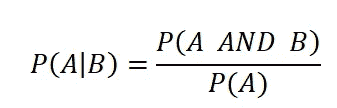
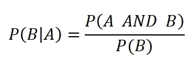
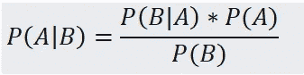
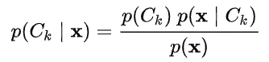
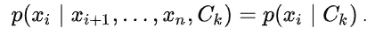
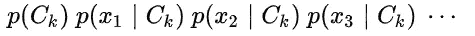
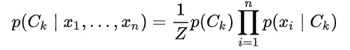
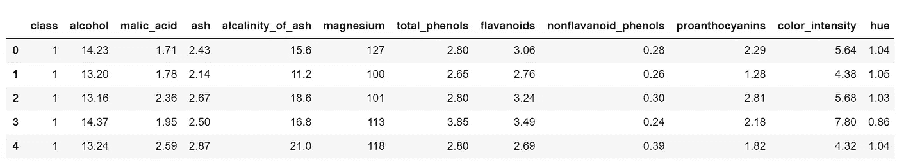

# 朴素贝叶斯分类器的‘朴素’是什么？

> 原文：<https://pub.towardsai.net/whats-naive-about-naive-bayes-classifier-dab83d98dfe0?source=collection_archive---------4----------------------->


[天真的艺术](https://www.forestgallery.com/art-insights/naive-art-top-picks/)

## 机器学习

朴素贝叶斯分类器是用于分类任务的概率机器学习模型。它可以用来解决任何数量的类的分类问题，并且易于解释。

**在本文中，我们将讨论朴素贝叶斯分类器背后的数学，分类器的类型，在数据集上的实现，以及它的优点。**

讨论流程如下:

1.  贝叶斯定理
2.  朴素贝叶斯分类器背后的数学
3.  朴素贝叶斯的实现
4.  朴素贝叶斯的类型
5.  朴素贝叶斯的优势
6.  如何改进朴素贝叶斯？

# 贝叶斯定理:

朴素贝叶斯源于**统计学**。在了解什么是朴素贝叶斯之前，让我们先看看它的根源。

*概率*是事件发生的几率。从数学上来说，一个事件的概率就是该事件的发生率与所有可能的实验结果的简单比率。

*条件概率*是在给定另一事件发生的情况下，某一事件发生的概率。



给定 B，A 的概率



给定 A，B 的概率

结合这两个公式，我们可以很容易地得到，



概率 A，给定 B 根据概率 B，给定 A

这就是**贝叶斯定理，**也就是朴素贝叶斯算法的关键。

# 朴素贝叶斯分类器背后的数学:

考虑一个机器学习分类问题。给定一个新的数据点，使用朴素贝叶斯的分类解决方案基于该点在每个类中的概率。

设新点是 n 维的 x，其中每个维分量由 x₁,x₂,…xₙ.表示在 Cₖ类中，这个 n 维点“x”的概率由下式给出



x 成为 Cₖ类一部分的概率

P(Cₖ和 x)可以表示为，P(Cₖ，x)。而“x”可以用它的 n 个分量来表示。现在，P (Cₖ和 x)被表示为，P(Cₖ,x₁,x₂,…xₙ)

对我们得到的每个分量应用条件概率，


产品中的每一个元素都是一个组件的概率，比如说 x₁，给定所有其他特性，x₂,…xₙ和 Cₖ.等级

现在到了 Naive Baye 分类器的“幼稚”部分。

> 在 Naive Baye 的分类器中，假设对于点 x，它的每个分量都相互独立于其他分量，并且所有分量对结果都有相同的影响。

在这种假设下，产品中的每个元素都变成了，



我们的概率很简单，



点 x 属于 Cₖ类的概率是，



其中 Z = P(x)

在 navies bayes 分类器中，我们为所有类别计算 x 的条件概率，并估计点 x 属于具有最高 P(Cₖ|x).值的 Cₖ类别

# **朴素贝叶斯分类器的实现:**

让我们使用 Kaggle 的[葡萄酒分类器](https://www.kaggle.com/brynja/wineuci)问题。

## 关于数据集:

这些数据是对生长在意大利同一地区但来自三个不同品种的葡萄酒进行化学分析的结果。这项分析确定了三种葡萄酒中 13 种成分的含量。

每个葡萄酒类别的实例数量:

*   1 级–59 级
*   2 级–71 级
*   3 级–48 级

特点:

酒精、苹果酸、灰分、灰分碱度、镁、总酚、类黄酮、非类黄酮酚、原花色素、颜色强度、色调、稀释葡萄酒的 OD280/OD315、脯氨酸

现在让我们实现朴素贝叶斯分类器，

```
import pandas as pd
features = ['class','alcohol', 'malic_acid', 'ash', 'alcalinity_of_ash', 'magnesium', 'total_phenols', 'flavanoids', 'nonflavanoid_phenols', 'proanthocyanins', 'color_intensity', 'hue', 'od280/od315_of_diluted_wines', 'proline']wine_data = pd.read_csv("wine_class.csv",names=features)
```

*使用 pandas 将*CSV(逗号分隔值)数据加载到数据帧中。

```
wine_data.head()
```

输出:



Head()给出了数据帧中的前 5 个数据点。

```
wine_data.shape
```

输出:(178，14)

这意味着葡萄酒数据有 178 个数据点和 14 个特征，包括类。

```
wine_target = wine_data['class']
wine_features = wine_data.drop(['class'],axis=1)
```

*从从属特征中分离出独立特征*。

```
from sklearn.model_selection import train_test_splitX_train, X_test, y_train, y_test = train_test_split(wine_features, wine_target, test_size=0.3,random_state=0)
```

*将数据*拆分为训练数据和测试数据，其中测试数据占总数据的 30%，训练数据占总数据的 70%。

```
#Import Gaussian Naive Bayes model 
from sklearn.naive_bayes import GaussianNB 

#Create a Gaussian Classifier 
gnb = GaussianNB()#Train the model using the training sets 
gnb.fit(X_train, y_train)
```

是的，不管数据大小如何，实现朴素贝叶斯分类器只需要 3 行代码。

现在我们已经*生成了我们的模型，*让我们来测量它的准确性。

```
#Import scikit-learn metrics module for accuracy calculation
from sklearn import metrics#Predict the response for test dataset
y_pred = gnb.predict(X_test)# Model Accuracy, how often is the classifier correct?
print("Accuracy:",metrics.accuracy_score(y_test, y_pred))
```

输出:
精度:0.9000000000001

我们实现了一个*朴素贝叶斯分类器模型，准确率约为 90%。对于葡萄酒分类的问题，精确度是衡量模型性能的合理指标。*

# 朴素贝叶斯分类器的类型:

## 1.高斯朴素贝叶斯

当数据是连续的并且假设数据是正态分布时，使用该模型

## **②*。伯努利*** 朴素贝叶斯

如果向量是二进制的(即 0 和 1)，这个模型是有用的。一个应用是使用“单词包”模型的文本分类，其中如果单词出现在文档中，1 表示*，如果单词没有出现在文档*中，0 表示

## *3.多元朴素贝叶斯*

*这个模型类似于 Bernoulli Naive Bayes，只是这里的向量表示组件出现的次数。这意味着，如果我们有多个类，这个模型是有用的*

# *朴素贝叶斯的优势*

1.  *这是一种简单、快速、准确的分类方法*
2.  *它具有非常低的计算成本*
3.  *它可以有效地处理大型数据集*
4.  *它可用于二元分类或多类分类问题*
5.  *当假设成立时，朴素贝叶斯分类器比大多数分类器工作得更好*

*朴素贝叶斯分类器广泛应用于垃圾邮件检测和评论情感分析等文本分类问题。*

# *如何改进朴素贝叶斯？*

*   *当数据测试数据有一个不同于已训练数据的新类别时，应用“拉普拉斯平滑”*
*   *如果数据不是正态分布，建议将数据更改为正态分布*
*   *移除相关要素，因为它们不会给输出增加任何值*

*因此，朴素贝叶斯可以有效地用于二元和多类分类问题，而不管数据的大小，并且计算成本低。*

*谢谢你的阅读。我也将在未来写更多初学者友好的帖子。请在[媒体](https://medium.com/@ramyavidiyala)上关注我，以便了解他们。我欢迎反馈，可以通过 Twitter [ramya_vidiyala](https://twitter.com/ramya_vidiyala) 和 LinkedIn [RamyaVidiyala](https://www.linkedin.com/in/ramya-vidiyala-308ba6139/) 联系我。快乐学习！*