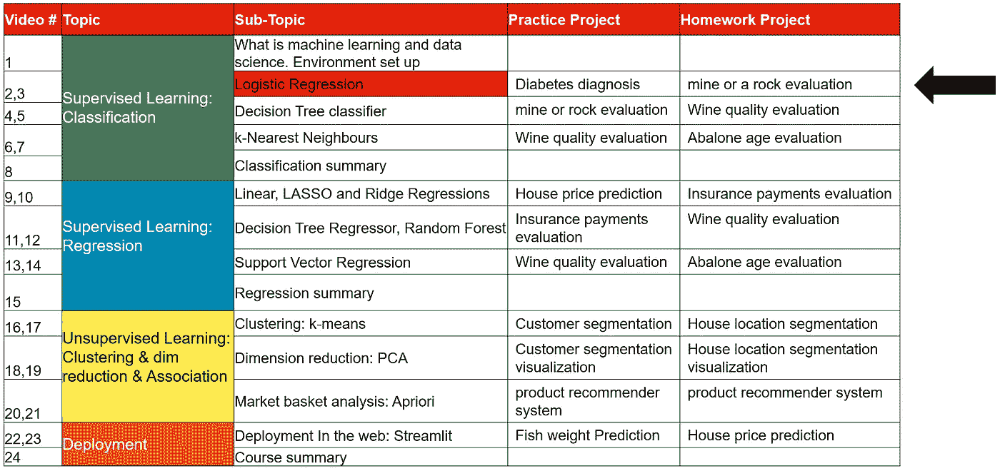
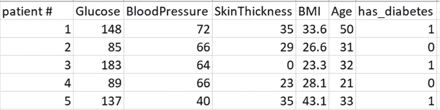
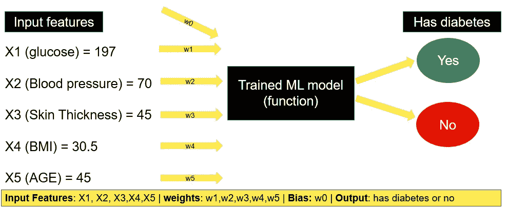
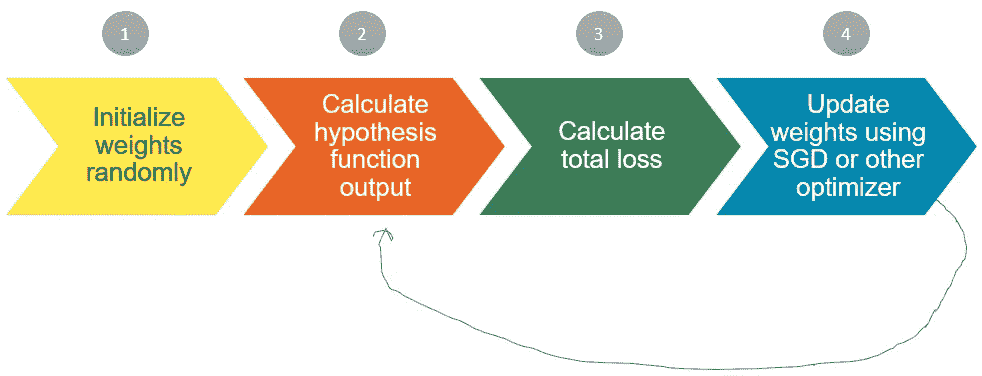
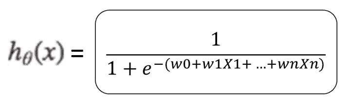
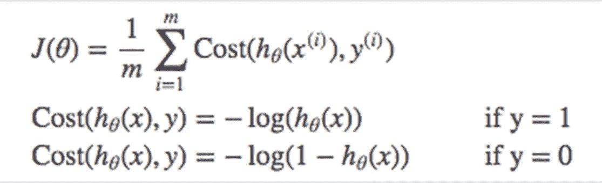
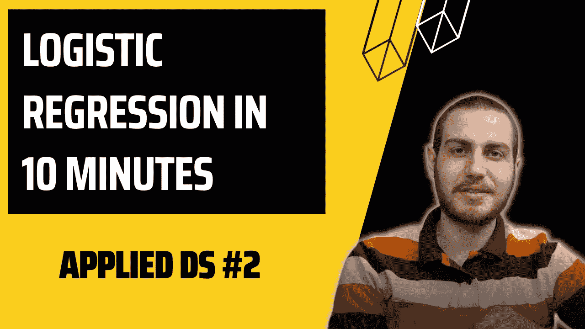

# 逻辑回归背后的思想是什么？

> 原文：<https://pub.towardsai.net/whats-the-idea-behind-logistic-regression-25fc20b8b896?source=collection_archive---------5----------------------->

## 分类问题是什么？逻辑回归是如何工作的？|应用的 DS #2

在本教程中，我们将讨论流行的监督学习算法— **逻辑回归。**

课程大纲

# 您将学到的内容:

1.  什么是机器学习中的分类问题？
2.  逻辑回归及其工作流程

# 1.什么是分类问题？

假设我们有一个患者，他有以下记录:

*   葡萄糖浓度:197
*   血压:70
*   皮肤厚度:45
*   身体质量指数:30.5 岁
*   年龄:45 岁

我们的 ***目标*** 是根据这些信息，诊断患者是否患有糖尿病。这类问题在机器学习中称为*分类*。

问题是——我们如何诊断它？为了回答这个问题，我们需要以前的患者记录和他们是否患有糖尿病的标签。这种数据集被称为标记为数据集的**。**

标注数据集的样本

因此，我们需要数据集来创建任何机器学习模型。一旦我们有了一个训练好的 ML 模型，我们就可以很容易地做出预测。

预测的例子

各项记录，如血糖、血压等。**被称为*特性*被称为**，其中自有分量。但是我们不知道这些权重的值，**我们应该如何找到它呢？** —这就是机器学习算法的用武之地。

# 2.逻辑回归及其工作流程

***逻辑回归*** 是一种流行的机器学习算法，可以预测二元类别(有或没有糖尿病，高或低等)。)

我们的**目标**是找到***(w1，w2 …)*** *的特征和 ***的偏差(w0)。为了做到这一点，我们以迭代的方式找到它们。逻辑回归有以下工作流程:****

**

*机器学习工作流*

## ***第一步:我们随机初始化特征权重***

*最初，所有特征和偏差的权重都是随机分配的。*

## ***第二步:我们计算假设函数输出***

*逻辑回归的假设函数如下:*

**

*逻辑回归的假设函数*

*其中**权重**为 w1，w2…wn，**偏差**为 w0，**特征值**为 X1，X2…Xn。*

*该假设函数的**输出**在 **0 到 1 之间变化。***

**

*sigmoid 函数*

*因为输出从 0 变为 1，所以它赋予算法执行二进制分类任务的能力。例如，如果假设函数的输出为 0.8，则意味着此人更有可能患有糖尿病。*

## ***第三步:我们根据这些权重计算总损失***

*总损失值是每个患者的成本值总和除以患者总数。*

**

*损失函数公式*

*其中 h(x)是假设函数的输出，也称为**预测，**，y 是真实值，也称为**地面真实值。**当 y=1(地面真值等于 1)时，代价函数为-log(h(x))，当 y=0(地面真值等于 0)时，代价函数为-log(1-h(x))*

## *步骤 4:我们使用随机梯度下降(SGD)或其他优化器来更新权重。*

*当我们计算第一个总损失值时，接下来，我们基于 [*SGD*](https://en.wikipedia.org/wiki/Stochastic_gradient_descent) 或其他优化器更新权重。这些算法背后的直觉是，它们通过关注损失函数相对于权重的微小变化如何变化来更新权重。*

## ***我们重复步骤 2-4，直到损失函数达到局部最小值或达到最大迭代。***

*视频 **中的 [**可以更详细地看到**逻辑回归的完整示例**。**](https://www.youtube.com/watch?v=9nuTbrA3w0Y)***

**

*作者图片*

# *下一个教程:*

*python 中逻辑回归的实际例子。*

# *如果你喜欢我的文章或视频，如果你支持我，我会更有动力:*

1.  *您可以将我的 YouTube 频道—[**AI Academy with Friends**](https://www.youtube.com/channel/UCvlF0PPaQ2GAuqYKJT4UpJQ)**与您的朋友分享***

*** [## 和朋友一起的 AI 学院

### 与朋友、家人和全世界分享您的视频

www.youtube.com](https://www.youtube.com/channel/UCvlF0PPaQ2GAuqYKJT4UpJQ) 

2.你可以和你的朋友分享我的《人工智能与朋友学院》。

 [## 和朋友一起的 AI 学院

### 你可以了解更多关于数据科学、机器学习和人工智能的知识。

medium.com](https://medium.com/ai-academy-with-friends) 

3.如果你想在 medium 上注册，以获得无限的故事，你可以使用我的 [**推荐链接**](https://medium.com/@gkeretchashvili/membership) (我会免费向你收取一小笔佣金 *)*

 [## 通过我的推荐链接加入媒体-Gurami keretcashvili

### 阅读 Gurami Keretchashvili(以及媒体上成千上万的其他作家)的每一个故事。您的会员费直接…

medium.com](https://medium.com/@gkeretchashvili/membership)***