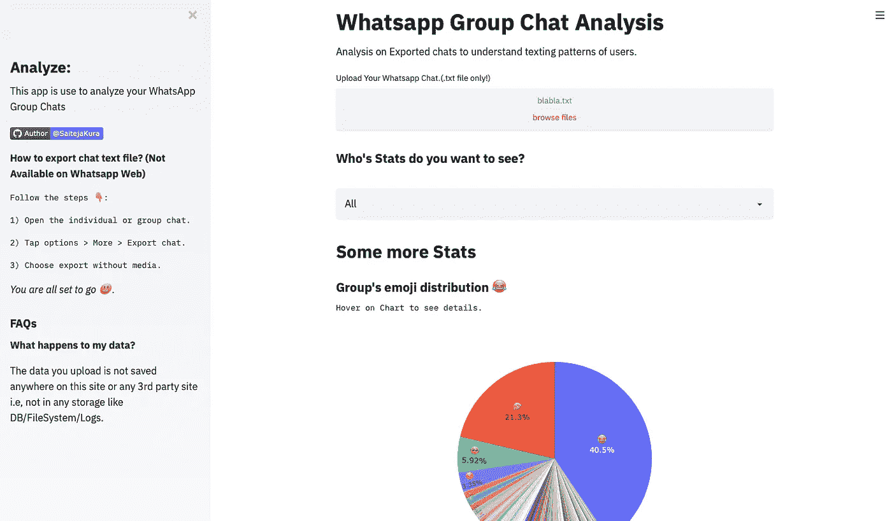
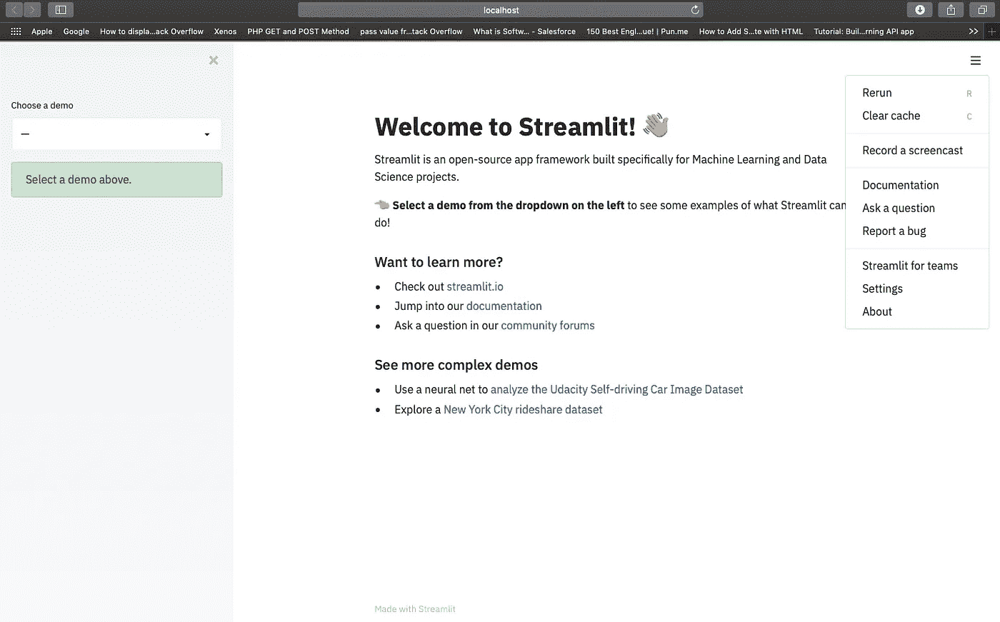
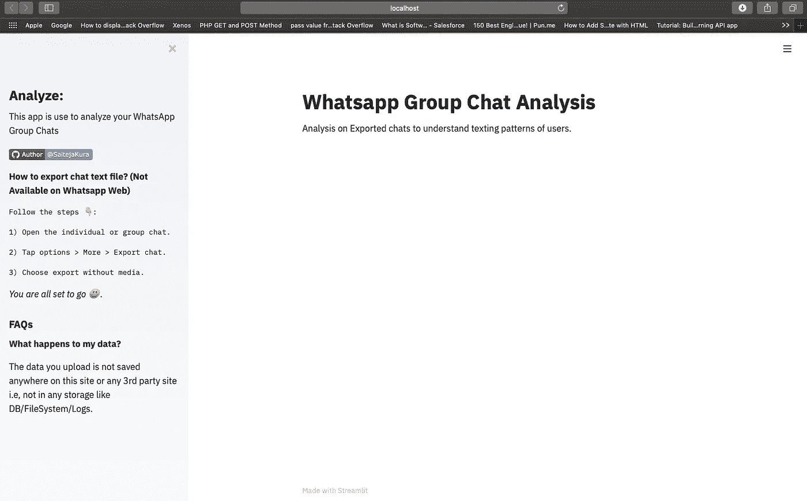
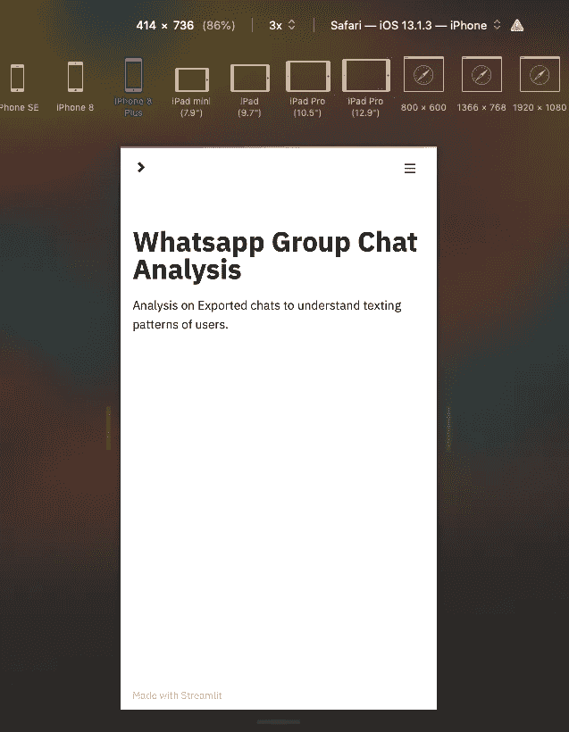
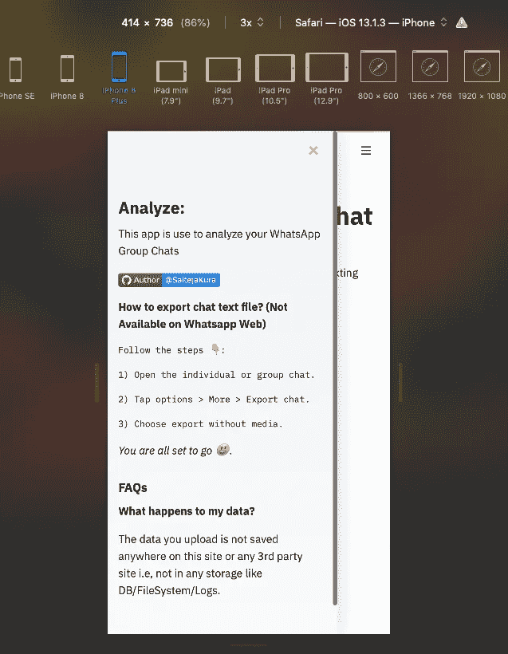
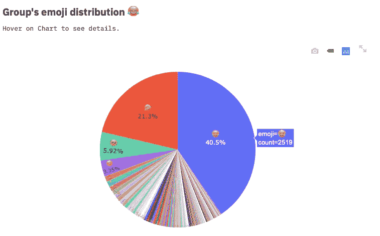
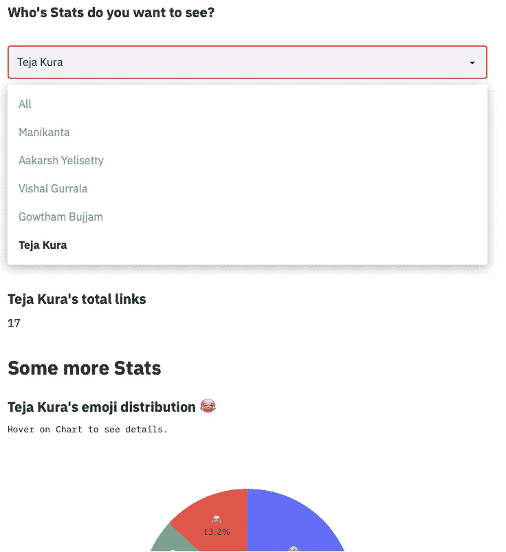
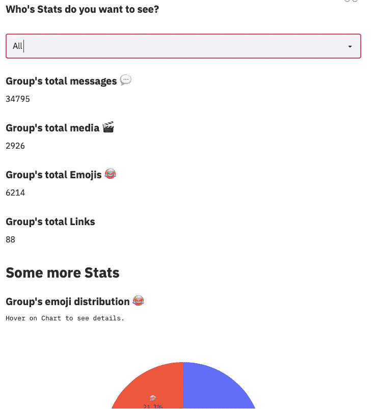

# 使用 StreamLit 分析 Whatsapp 群聊—第二部分

> 原文：<https://pub.towardsai.net/whatsapp-group-chat-analysis-part-ii-efd7d4d0b051?source=collection_archive---------1----------------------->

## [数据科学](https://towardsai.net/p/category/data-science)，[编程](https://towardsai.net/p/category/programming)

## 我的应用程序从笔记本到使用 Streamlit 和 Heroku 的 web 应用程序的旅程。



web 应用程序的屏幕截图。

> **不要满足于“差不多”完成一项任务。继续，直到你完成它。**

在数据科学中，从事实时项目非常重要。与世界分享您的工作同样重要，这可以确保我们不断收到反馈，并提高我们应用程序的性能。Jupyter 笔记本，Google Colab 链接是分享我们工作的好方法。但在大多数情况下，客户或最终用户是一个拥有最少技术知识的人。你如何与他们分享你的工作？

**一款网络应用来拯救我们了！我们可以将我们的分析嵌入到 Web 应用程序中，并与外界共享。因此，客户端上的负载减少，这使得他们的工作更容易。请务必阅读我以前的 [**文章**](https://medium.com/towards-artificial-intelligence/whatsapp-group-chat-analysis-using-python-and-plotly-89bade2bc382) ，了解我们是如何执行数据收集、清理、转换和可视化部分的。在本文中，我将讲述如何使用 Streamlit 创建一个代码最少的 web 应用程序。**

# 什么是 Streamlit？

Streamlit 是一个开源的应用程序框架，通过它我们可以为机器学习和数据科学创建高性能和漂亮的 web 应用程序。一切都是纯 python 写的。让我们开始吧！

1.  确保您安装了 [Python 3.6](https://www.python.org/downloads/) 或更高版本。
2.  使用 [PIP](https://pip.pypa.io/en/stable/installing/) 安装 Streamlit:

```
pip install streamlit
```

运行以下命令。

```
streamlit hello
```

就是这样！在接下来的几秒钟内，示例应用程序将在默认浏览器的新选项卡中打开。



可以看到一个看起来简单整洁的默认布局。为了创建我们的应用程序，让我们创建一个新的 python 脚本`Whatsapp_Analysis.py`并开始编写代码！
首先，我们将导入所需的依赖关系。Streamlit 为我们提供了一些实用功能，如`st.text()`、`st.sidebar.text()`、`st.markdown()`等。我们可以在`st.markdown()`中嵌入 HTML 代码，确保我们可以修改用户界面。

## 输出—



令人惊讶的是，70%的 UI 都是用上面的 10 行代码完成的。上面的代码也是响应性的，当在手机上查看时-



让 web 应用程序具有响应性是前端开发人员可能面临的最大问题，但幸运的是，框架在我们的案例中处理了这个问题。现在我们需要加载导出的聊天文件并运行分析。

# 数据流

Streamlit 的架构允许我们像编写 python 脚本一样编写应用程序。为了在屏幕上呈现任何更新，Streamlit 从上到下运行 python 脚本。每当我们与屏幕上的任何按钮进行交互或给出任何输入时，Streamlit 都会从头到尾运行整个 python 脚本。

您可能认为对于较长的脚本来说，这是一个乏味的过程。是的，它是！但这正是 Streamlit 在幕后为我们做一些繁重工作的地方。一个大玩家`st.cache()`装饰者出现了。这允许应用程序在重新运行时跳过某些高成本的计算(其输出不会改变)。

# 小工具

当您将数据放入您想要探索的状态时，您可以添加像`[st.slider()](https://docs.streamlit.io/en/stable/api.html#streamlit.slider)`、`[st.button()](https://docs.streamlit.io/en/stable/api.html#streamlit.button)`或`[st.selectbox()](https://docs.streamlit.io/en/stable/api.html#streamlit.selectbox)`这样的小部件。这非常简单——只需将小部件视为变量:

在我们的聊天分析应用中，我们将使用两个小部件。一个上传聊天文件，另一个根据用户输入过滤统计数据。

```
uploaded_file = st.file_uploader("Upload Your Whatsapp Chat.(.txt file only!)", type="txt")
```

这将创建一个文件上传器，并且只接受`.txt`类型的文件。第一个参数是这个文件上传器的标题。


点击**浏览文件**会将我们导向本地系统，我们必须上传一个`.txt`文件。

`.txt`文件是一个文本文件，由导出的 WhatsApp 聊天组成。正如我在上一篇文章中所讨论的，我们将解析文本，将其分为日期、时间、作者、消息类别，并创建一个数据框。我们还将通过删除丢失的值来清理数据帧，并执行适当的类型转换(即将日期字符串转换为日期时间格式等。).之后，我们可以根据需要过滤数据框并创建图。

由于我使用 Plotly 进行可视化，我们可以使用函数`st.plotly_chart(fig)`创建 Plotly 图形。例如，为了创建一个表情符号分布图，我们将编写一个函数`visualize_emoji()`，它将通过过滤数据帧来创建一个 Plotly 图，并返回该图。

现在我们可以使用下面的代码来绘制这个图。

```
st.subheader("**%s's emoji distribution 😂**"% name)
st.text("Hover on Chart to see details.")
st.plotly_chart(visualize_emoji(data),use_container_width=True)
```

这里的名称表示个人名称或团体。

## 输出-



同样，上一篇文章中提到的所有情节都是创造出来的。web 应用程序中包含的另一个功能是基于用户过滤统计数据的能力。我们提供了一个下拉菜单，并要求用户选择一个特定的用户，其个人统计数据将被显示。

要创建下拉菜单，我们将使用`st.selectbox()`命令。我们将向`st.selectbox()`命令传递一个包含唯一作者的列表和一个选项“all”(针对整个组统计)。用户选择的选项存储在名为**选项**的变量中，该变量用于过滤数据帧中的统计数据。

```
authorlist = list(data.Author.unique())
authorlist.insert(0,'All')
st.subheader("**Who's Stats do you want to see?**")
option = st.selectbox("", authorlist)
```



# 圣缓存()

正如我已经提到的，每当我们给出一个新的输入流时，它就从上到下运行 python 脚本。在我们的例子中，当我们从下拉列表中选择一个用户时，Streamlit 运行整个脚本，包括打开文件、解析文件、创建数据框和应用过滤。

这不是一个最优的方式，因为过滤只需要数据框并每次解析数据，当我们点击每个用户时再次创建数据框是不合适的。因此，我们将使用 st.cache()命令和`load_data()`函数。这将确保第二次运行`load_data()`函数时，其结果将直接从缓存中取出，而不是重新运行该函数。这提高了应用程序的速度并增强了性能。

```
[@st](http://twitter.com/st).cache(allow_output_mutation=True)
# This function parses the text file and creates the data frame.
def load_data(uploaded_file):
         .....function body
```

# 使用 Heroku 部署

Heroku 是一个平台即服务(PaaS ),支持开发者完全在云中构建、运行和操作应用。我们将把我们的 web 应用程序部署到 Heroku。这是一个简短的过程，在这篇文章[中有很好的解释。](https://towardsdatascience.com/deploy-streamlit-on-heroku-9c87798d2088)

您可以通过点击下面的链接访问完全运行的 web 应用程序。
[Whatsapp-群聊-分析器](https://group-whatsapp-analyzer.herokuapp.com/)。

# 结论

在本文中，我试图解释使用 Streamlit 为一个数据科学项目创建一个 web 应用程序。对于数据分析师来说，以简单的方式向技术/非技术用户展示他们的结果是非常重要的。我希望你今天学到了新东西！

我希望你今天带回家一些新概念！如果你想联系，**在**[**LinkedIn**](https://www.linkedin.com/in/saiteja-kura-49803b13b/)**上联系我。**