# 使用 Python 和 Plotly 的 Whatsapp 群聊分析

> 原文：<https://pub.towardsai.net/whatsapp-group-chat-analysis-using-python-and-plotly-89bade2bc382?source=collection_archive---------0----------------------->

## [数据科学](https://towardsai.net/p/category/data-science)，[编程](https://towardsai.net/p/category/programming)

## 使用 Pandas 和 Plotly 从 Whatsapp 群聊的数据中获得洞察力和模式。


一组五个朋友决定在他们的第六学期去果阿旅行。在社交媒体出现之前，他们习惯于随叫随到或在大学食堂里计划一切。但现在多亏了 Whatsapp，从旅行到考试和作业，一切都在 Whatsapp 群组上进行。同样，我也有五个朋友。

一天，我的朋友争辩说，与其他人相比，他是小组中唯一一个经常发短信的人。作为一名数据爱好者，我决定分析我们的群聊，以获得见解和使用模式，并验证我朋友的说法。我发现了相当有趣的东西。此外，最后一定要检查一下可视化效果！！！。

> 或者对代码不感兴趣的人，您可以浏览图片并复制本文末尾提供的笔记本。如果您对分析感兴趣，您也可以使用导出的聊天文件运行笔记本。

# 数据准备和清理

首先，Whatsapp 提供了将任何聊天(有媒体和无媒体)导出为`.txt`文件的功能。我导出了我的没有媒体的群聊。一个示例导出的`.txt`文件看起来像这样—

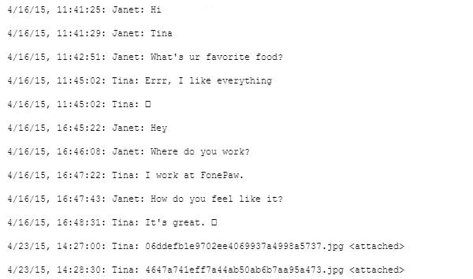

样本图像

这个纯文本文件必须以有意义的方式进行解析和标记，以便在 Pandas 数据帧中提供(存储)。

让我们只考虑文本中的一行(我们称之为“原始文本”)，看看如何从中提取相关的列:

2017 年 6 月 18 日，晚上 9:47——Teja Kura:为什么你有两个号码？

在我们的示例文本行中，我们的主要目标是将原始消息自动分解成 4 个标记。

{日期}，{时间}—{作者}:{消息}

{18/06/17}，{晚上 9:47 }—{ Teja }:{为什么你有两个号码？}

可能会有消息多于一行的情况。这看起来像—

2019 年 4 月 1 日，晚上 8:30—Vishal gur rala:下载所需的 PDF 或 JPG 格式的文件。

因此，我们需要编写一个函数来检测每行是否以日期开头。如果是这样，这意味着这是一个独特的信息。然后，我们可以提取日期、时间、作者和消息。下面的代码检查每一行是否以日期和时间开始，然后将该行分成日期、时间、作者和消息标记。它还创建了一个数据框，将上述四个令牌作为四个单独的列。

让我们看看我们创建的数据框。

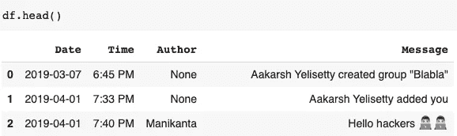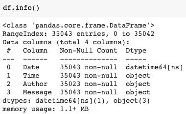

我们可以看到该数据帧由 **35043** 个条目组成，这意味着该组中有 **35k+消息**。还要注意，前两条消息的作者值为 None。是因为这些消息是由 Whatsapp 生成的，不包含作者。让我们放弃没有作者的消息。

```
df = df.dropna()
```

让我们试着找出组中用户的总数。

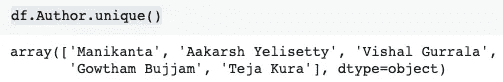

# 分组统计

这里需要注意的一点是，我们导出的聊天没有媒体。因此，在媒体信息的地方，我们会发现短语 **<媒体省略了>。**有了这个的帮助，我们就可以找到群里分享的媒体消息总数了。为了找到使用的表情符号总数，我们将使用表情符号库。我们还将创建一个单独的列**表情符号**，其中仅包含该特定消息的表情符号。为了找到共享链接的总数，我们将编写一个 regex 模式，并使用 python 中的`re`库来识别给定消息中的 URL。我们还将创建一个单独的列 **urlcount** ，它包含特定消息中的 URL 计数。稍后将使用所有额外创建的列。

通过添加`urlcount`列来计算共享的链接总数。表情符号的总数是通过将`emoji`栏中所有列表的长度相加计算出来的。

**输出—**

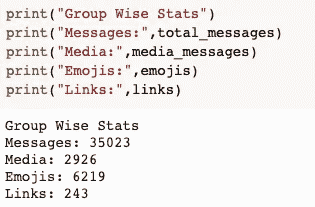

你可以注意到**媒体**的总数大约为 **2k** ，使用的**表情符号**总数为 **6k** ，共享的**链接**总数大约为 **240** 。

现在让我们将文本消息和媒体消息分成两个独立的数据帧。`messages_df`将只包含短信。

```
media_messages_df = df[df['Message'] == '<Media omitted>']messages_df = df.drop(media_messages_df.index)
```

计算每个作者在每条消息中使用的字母和单词的数量可能会很有趣。因此，让我们使用以下代码向数据帧添加两个新列，称为“字母计数”和“单词计数”:

```
messages_df['Letter_Count'] = messages_df['Message'].apply(lambda s : len(s))
messages_df['Word_Count'] = messages_df['Message'].apply(lambda s : len(s.split(' ')))
```

我们的 messages_df 数据帧现在看起来像这样。

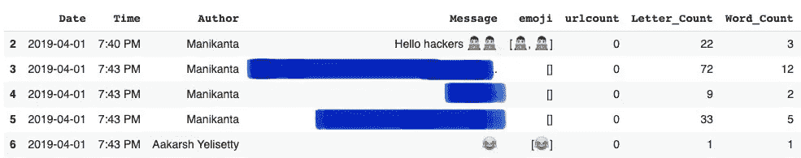

# 作者明智的统计

要查找每个作者的统计数据，首先，我们将创建数据框中所有唯一作者的列表。接下来，我们将遍历作者列表，过滤数据框并打印每个作者的统计数据。我们还将打印每位作者每封邮件的平均字数。因为我们有字数统计，所以总字数/总消息数将得出每条消息的平均字数。

## 输出—


这足以证明我朋友的论点是错误的。但是我继续分析更多。

# 表情符号统计

## 群组中使用的独特表情符号的数量

在分组统计中，我们计算了使用表情符号的总数。但是让我们找出使用的独特表情符号的总数。为了实现这一点，我们可以组合表情符号列中的所有列表，并通过使用 set 数据类型来查找唯一表情符号的数量。

```
total_emojis_list = list(set([a for b in messages_df.emoji for a in b]))
total_emojis = len(total_emojis_list)
print(total_emojis)# Output:
# 185
```

我们小组使用了 185 个独特的表情符号。似乎是一个相当大的数字。

## 群组中使用最多的表情符号

在表情符号栏中，我们有每条信息的表情符号列表。通过将所有列表合并成一个大列表，并使用计数器功能，我们可以创建一个所有表情符号的频率列表。

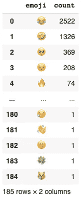

我们可以看《T2》😂 ' **称霸**榜单，果然在一群朋友中。现在，让我们用一个饼状图来形象化这个群体的表情分布。

```
import plotly.express as px
fig = px.pie(emoji_df, values='count', names='emoji',
             title='Emoji Distribution')
fig.update_traces(textposition='inside', textinfo='percent+label')
fig.show()
```

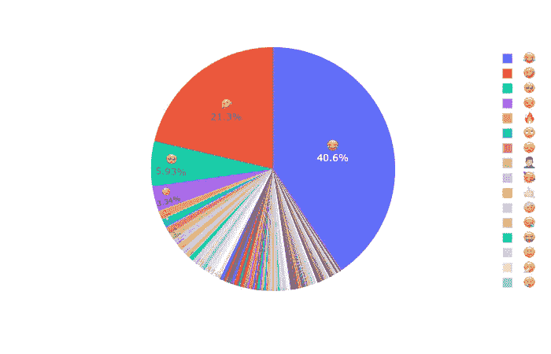

Plotly 的主要优点是情节在视觉上很吸引人，而且具有互动性。在 Plotly 中创建一个情节也是一件容易的事情。同样，我们可以为每个作者的表情符号分布 ie 创建饼状图。像我们之前做的那样过滤数据框，并为每个作者绘制表情分布的饼状图。

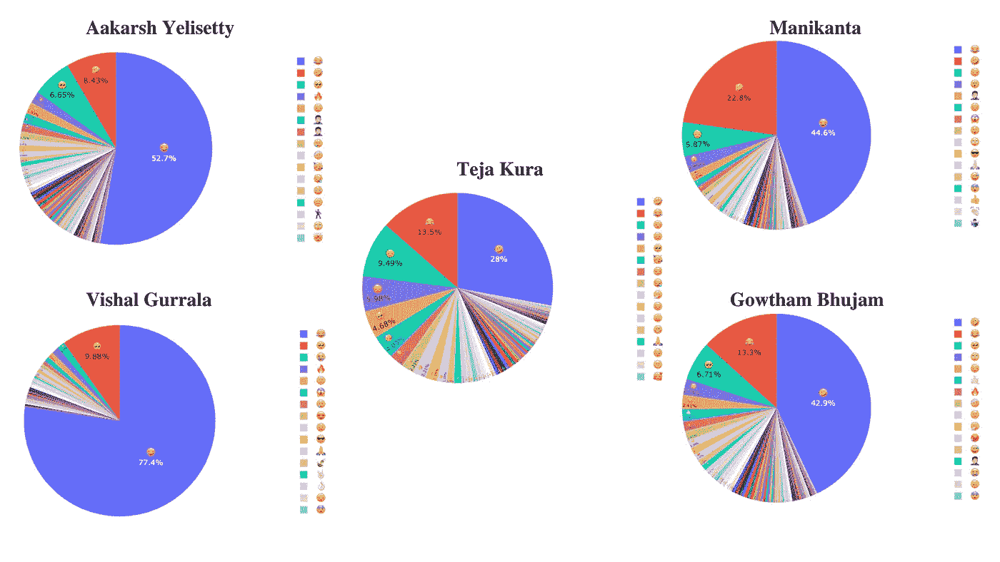

移动用户可以点击图片并缩放以查看更多内容。

你可以注意到不同的作者有不同的模式。**前两个**饼图(按行)类似于组饼图，而后三个饼图略有不同。您还可以注意到饼图旁边的标签，这些标签对于 5 个用户是不同的。我(Teja Kura)在看到我的多样化饼状图后，才知道我使用的表情符号数量最多！

# 词云

单词云是特定文本中单词的可视化表示。单词云中单词的大小与该单词在文本中的出现频率成正比。我们将为群组中的所有消息创建一个单词云。

首先，让我们将所有 35k 条消息合并成一条大的单个文本消息，以创建单词云。

```
text = " ".join(review for review in messages_df.Message)
print ("There are {} words in all the messages.".format(len(text)))# OUTPUT - 
# There are 687467 words in all the messages.
```

**看起来所有的 35k 消息加起来包含 6.8L 个单词！**接下来，在创建单词云之前，我们需要了解什么是**停用词**。停用词是文本中常用的词(如“the”、“a”、“an”、“in”)。搜索引擎被设计成可以忽略这些词。因为这些单词没有给文章增加新的意思，我们可以忽略它们。

我们将使用 python 中的单词云库。库中已经存在预定的停用词列表。这个列表由英语单词组成。因为我们的母语是泰卢固语，而我们的大部分文本都是用英语输入的，所以我添加了额外的单词来更新停用词表。

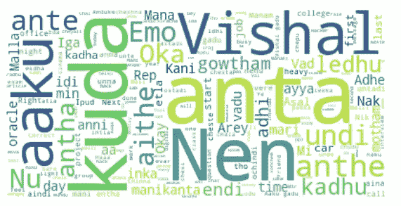

你可以看到像' **anta** '、 **kuda** '这样的词比较大，这说明了它们被大量使用的事实。

# 更多统计数据

## 随着时间的推移消息的数量。

我们将按日期对数据帧进行分组，并查找每个日期的总消息数。

```
date_df = messages_df.groupby("Date").sum()
date_df.reset_index(inplace=True)fig = px.line(date_df, x="Date", y="MessageCount", title='Number of Messages as time moves on.')fig.update_xaxes(nticks=20)
fig.show()
```

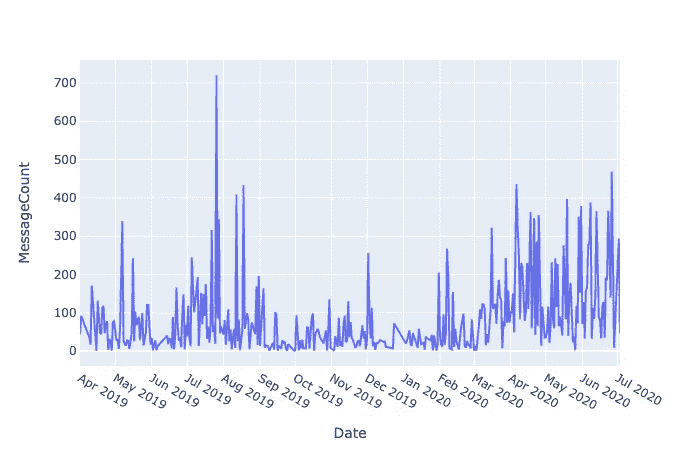

## 最有意思的一天是。

通过使用`value_counts()` pandas 方法，我们可以按降序查找数据帧中某个日期出现的总次数。

```
messages_df['Date'].value_counts().head(10).plot.barh()
plt.xlabel('Number of Messages')
plt.ylabel('Date')
```

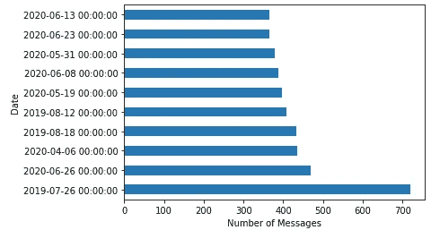

看来**2019 年 7 月 26 日**是群里发生最多的一天！那天有 700 多条信息。经过深思熟虑，我了解到我们团队的一名成员在那天被安排到了甲骨文公司。也许我们在庆祝他在我们组的胜利！

## 日间配送。

让我们试着了解一下总共 35k 条消息在一天中(星期日、星期一……)的分布情况。我们将使用雷达图来了解白天的分布。

一定要看看下面的 GIF 来理解我们是如何解读雷达图的。

我们可以看到**星期五**的消息数量**最多**(大约在 5000 到 6000 条之间)。

## 小组成员什么时候最活跃？

与日期类似，我们也可以在时间列上应用`value_counts`方法。

```
messages_df['Time'].value_counts().head(10).plot.barh() plt.xlabel('Number of messages')
plt.ylabel('Time')
```


我们可以注意到小组中的大部分活动发生在晚上 10:00 到 10:15 之间。

**重大更新！！！—在收到许多关于兼容性问题的回复后，我创建了一个 web 应用程序，您只需上传您的聊天文件并进行分析即可！！**

**Web App 链接** — [Whatsapp 群聊分析器](https://group-whatsapp-analyzer.herokuapp.com/)
**文章链接**关于我是如何创建这个 App 的。点击[这里](https://medium.com/towards-artificial-intelligence/whatsapp-group-chat-analysis-part-ii-efd7d4d0b051)

# 结论

长篇大论的分析告一段落！在这篇文章中，我试图使用 Python 和 Plotly 来分析我们的 Whatsapp 群聊。我也理解了我们发短信方式的一些趋势，以及每个人的短信风格与群体相比有何不同。我希望你今天带了新东西回家！

如果您想联系，**请在**[**LinkedIn**](https://www.linkedin.com/in/saiteja-kura-49803b13b/)**上联系我。**