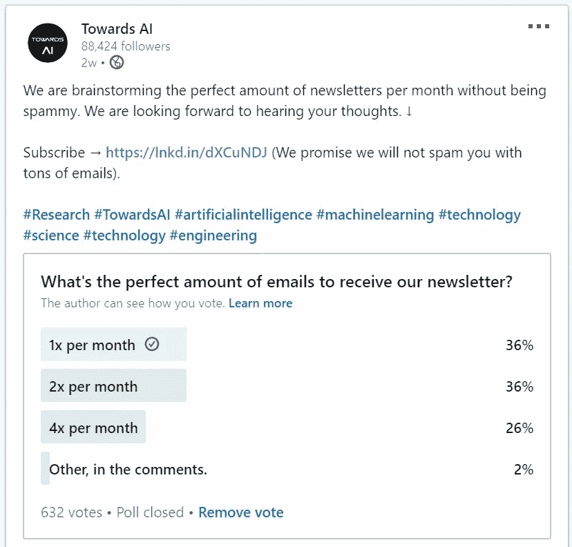
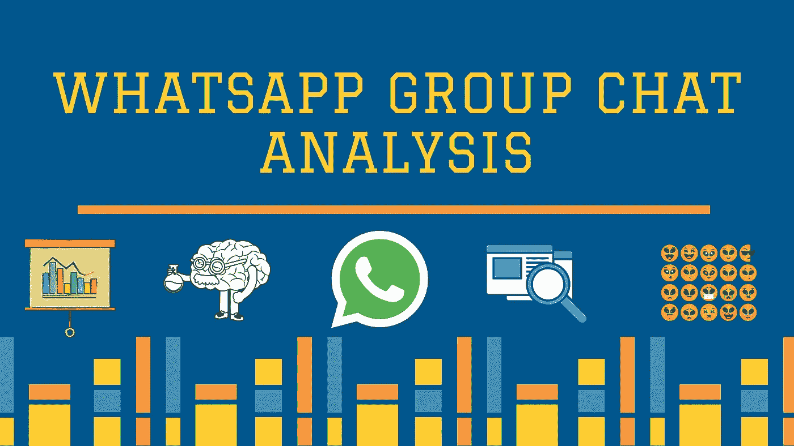
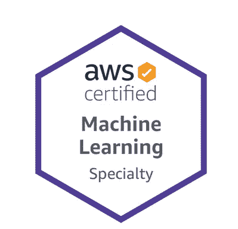

# Whatsapp 群聊分析用 Python 和 Plotly…还有更多！

> 原文：<https://pub.towardsai.net/whatsapp-group-chat-analysis-with-python-and-plotly-and-more-7cc1d410465d?source=collection_archive---------2----------------------->

## [新闻](https://towardsai.net/p/category/news)，[快讯](https://towardsai.net/p/category/newsletter)

## 📚编辑选择的本月特色文章📚

最近，我们发布了一份 [**调查**](https://www.linkedin.com/feed/update/urn:li:activity:6688436982604947456/) ，询问我们的读者，对他们来说，每月多少份简讯最合适。

人工智能调查结果

基于这些回复，我们决定每月发送一次简讯，除了一些真正出色的工作，每月最多发送两次。我们不是那些不断向读者发送垃圾邮件的出版商之一，我们打算保持这种方式。

如果可以，请与您的朋友和熟人分享我们的 [**订阅链接**](https://towardsai.net/subscribe) ，我们保证不会向他们的收件箱发送垃圾邮件。

> 📈通过来自 Udacity 的[机器学习简介](https://imp.i115008.net/c/2372938/788201/11298)学习从数据操作到无监督和有监督算法的基本机器学习技术(使用[我们的优惠券](https://imp.i115008.net/c/2372938/788201/11298)可获得 50 美元优惠)📈

现在进入月度精选！我们选择这些文章是基于读者群、粉丝以及某篇文章的浏览量。我们希望你和我们一样喜欢阅读它们。

## [使用 Python 和 Plotly 的 Whatsapp 群聊分析](https://mktg.best/fktyk)作者 [Saiteja Kura](https://medium.com/u/8c2586dd6938?source=post_page-----7cc1d410465d--------------------------------)

使用 Pandas 和 Plotly 从 Whatsapp 群聊的数据中获得洞察力和模式。一组五个朋友决定在他们的第六学期去果阿旅行。在社交媒体出现之前，他们习惯于随叫随到或在大学食堂里计划一切。但现在多亏了 Whatsapp，从旅行到考试和作业，一切都在 Whatsapp 群组上进行。同样，我也有五个朋友…

## 普拉蒂克·舒克拉和罗伯特·伊里翁多的 Python 自然语言处理教程

在本文中，我们将通过代码示例探索自然语言处理(NLP)的基础知识。我们深入研究了自然语言工具包(NLTK)库，以展示它对于自然语言处理相关任务是如何有用的。之后，我们将讨论其他自然语言处理库的基础知识和 NLP 的其他基本方法，以及它们各自在 Python 中的编码示例实现…

## [代数基本定理](https://mktg.best/5zgxv)作者[马尔科·塔沃拉博士](https://medium.com/u/9bfccc40b00d?source=post_page-----7cc1d410465d--------------------------------)

用复数证明所有多项式函数都有根。根据代数的[基本定理，每一个](https://mathworld.wolfram.com/FundamentalTheoremofAlgebra.html)[多项式](https://mathworld.wolfram.com/Polynomial.html)在其[域](https://en.wikipedia.org/wiki/Domain_of_a_function)中的某点都有一个[根](https://www.britannica.com/science/root-mathematics)(等于零)。虽然这个定理在 18 世纪早期就已经被提出来了(由三位数学家，[彼得·罗斯](https://de.wikipedia.org/wiki/Peter_Roth_%28Mathematiker%29)、[阿尔伯特·吉拉德](https://en.wikipedia.org/wiki/Albert_Girard)和[勒内·笛卡尔](https://en.wikipedia.org/wiki/Ren%C3%A9_Descartes))，但是第一个(不严格的)证明…

## [我是如何准备 AWS 认证机器学习考试的](https://mktg.best/k7sln)作者:Mohd Shukri Hasan

在这篇文章中，我将描述我是如何准备 AWS 认证机器学习-专业考试的。我将分享我使用的材料和我对它们有用性的想法。我做的第一件事就是阅读考试指南，弄清楚考试内容、考试形式、及格分数等等。这份文件非常有助于发现我的知识差距…

## [利用快速傅立叶变换(FFT)和 Python 进行季节性检测](https://mktg.best/c6fcl)由 [Satsawat Natakarnkitkul](https://medium.com/u/43a2b4818096?source=post_page-----7cc1d410465d--------------------------------)

使用 Python 中的 FFT 快速检测季节性。**预测**是根据过去和现在的数据预测未来的过程之一。大多数预测问题都与时间序列数据有关(例如，下个月产品 A 的销售量是多少)。有些问题可能比其他问题更容易预测。一个事件或一个量的可预测性取决于几个因素，有些是…

## [这些数据科学技能将成为你的超能力](https://mktg.best/3fhuv)作者 [Benjamin Obi Tayo 博士](https://medium.com/u/3a025d440e6b?source=post_page-----7cc1d410465d--------------------------------)

使您的数据科学培训完整的软硬技能。数据科学领域的大多数学术培训项目主要侧重于教授硬技能。一次又一次，行业数据、市场趋势和顶级商业领袖的见解都强调软技能是职场成功的关键因素。本文将讨论在数据科学实践中取得成功的基本硬技能和软技能。数学技能在数据科学和机器学习中至关重要。有关数据科学和机器学习所需的基本数学技能的更多信息，请参见本文:[数据科学我需要多少数学？](https://medium.com/towards-artificial-intelligence/how-much-math-do-i-need-in-data-science-d05d83f8cb19) …

## [情感分析——ML 项目从无到有(Web 应用)](https://mktg.best/8p9s4)作者 [Shareef Shaik](https://medium.com/u/b7b36814d144?source=post_page-----7cc1d410465d--------------------------------)

当我开始学习数据科学时，我总是迷失在它提供的大量资料中。学了一段时间后，我会忘记它，然后回来看视频或参考博客。然后我意识到，像其他技能一样，你需要练习和解决现实世界的问题。牢记这一点，我开始着手一个简单的项目。在开发一个端到端项目的过程中，你会了解到很多简单学习所无法获得的东西…

## [使用 Tesseract-OCR 通过 Google Colab 进行文本识别](https://mktg.best/u96xw)由[michelaangolo Mazzeschi](https://medium.com/u/153452706ad7?source=post_page-----7cc1d410465d--------------------------------)

在 Google Colab 上安装宇宙魔方并试用。以上是 Google OCR API 的一个例子，希望有一天我也能对 Tesseract 做同样的事情。这个库的安装花了我比平时更长的时间。虽然您应该从使用 pip 安装 pytesseract 开始，但是如果您试图运行库，它将运行一个错误…

## [为什么我们在神经网络中需要激活函数？](https://mktg.best/i8d9n)作者[道林·耶戈](https://medium.com/u/79574042e17b?source=post_page-----7cc1d410465d--------------------------------)

实例激发的激活函数。如果你正在读这篇文章，那么很可能你已经知道什么是神经网络，什么是激活函数，但是，一些关于机器学习的入门课程没有足够清楚地说明，为什么我们需要这些激活函数。我们需要它们吗？没有它们，神经网络还能工作吗？…

## [神经架构搜索(NAS)的基础](https://mktg.best/4xslj)作者 [Arjun Ghosh](https://medium.com/u/add16b429026?source=post_page-----7cc1d410465d--------------------------------)

神经结构搜索(NAS)已经成为机器学习科学领域的一个热门课题。Google 的 AutoML 等商业服务和 Auto-Keras 等开源库[1]使 NAS 可以访问更广泛的机器学习环境。在这篇博文中，我们探讨了 NAS 的思想和方法，以帮助读者更好地理解这个领域，并找到实时应用的可能性。

## 感谢您成为《走向 AI》的[订户](https://towardsai.net/subscribe)！

> 🤖在社交媒体上关注 AI↓🤖
> 
> [脸书](https://www.facebook.com/towardsAl/) | [推特](https://twitter.com/towards_ai?lang=en)|[insta gram](https://www.instagram.com/towards_ai/)|[LinkedIn](https://www.linkedin.com/company/towards-artificial-intelligence)|[谷歌新闻](https://news.google.com/publications/CAAqBwgKMNiLmgswgpayAw?oc=3&ceid=US:en) | [Flipboard](https://flipboard.com/@Towards_AI) | [移动 Feed](https://feed.towardsai.net/)