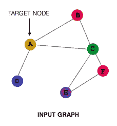
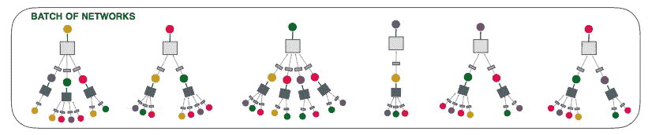

# 当 GraphSAGE 遇到 Pinterest

> 原文：<https://pub.towardsai.net/when-graphsage-meets-pinterest-5e82c9a88120?source=collection_archive---------1----------------------->

照片由 [Pinterest](https://www.linkedin.com/company/pinterest) 提供

在之前的故事中，我们介绍了[图嵌入简介](https://medium.com/towards-artificial-intelligence/a-gentle-introduction-to-graph-embeddings-c7b3d1db0fa8)、[节点嵌入中的随机游走](https://medium.com/towards-artificial-intelligence/random-walk-in-node-embeddings-deepwalk-node2vec-line-and-graphsage-ca23df60e493)和 [4 图神经网络](https://medium.com/towards-artificial-intelligence/4-graph-neural-networks-you-need-to-know-wlg-gcn-gat-gin-1bf10d29d836)。我想进一步延伸到 PingSAGE。它是由应等人在 2018 年提出的。应是 [GraphSAGE](https://arxiv.org/pdf/1706.02216.pdf) (Hamilton et al .，2018)的作者之一。他和他的团队在 [Pinterest](https://www.pinterest.com/) 数据集中应用了 [GraphSAGE](https://arxiv.org/pdf/1706.02216.pdf) (Hamilton 等人，2018)的修改版本。

我们将使用以下无向图来遍历 PinSAGE (Ying 等人，2018)算法。首先，我们有一个输入图，节点 A、B、C、D、E 和 f 分别来自节点，每个节点是根节点，而其他节点是邻居节点。

输入图(应等，2018)

我们将以节点 A 为例。节点 A 的相邻节点包括节点 B、节点 C 和节点 D。PinSAGE(Ying 等人，2018 年)使用深度 2 卷积，因此我们也需要按相邻节点聚合节点 B、节点 C 和节点 D。

在 1 跳层(即节点 B、C 和 D)，我们使用聚合函数(即卷积)来聚合所有邻居节点。在聚集邻居节点之后，目标节点的嵌入(即，节点 A)和邻居节点的嵌入(即，节点 B、C 和 D)。最后，我们得到一个节点 A 的表示。

我们如何获得节点 B、C 和 D 的表示？我们使用上一步中相同的技术，但是不同的权重来获得嵌入。您可能会注意到，节点 A 再次出现在第二层邻居中。这是因为节点 A 是节点 B、C 和 d 的邻居节点，如果我们将其从聚合中删除，我们将忽略邻居关系。

节点 A 的聚集(应等，2018)

Ying 等人提出使用基于重要度的随机游走方法来仅包括最重要的邻居，而不是使用所有的邻居。它不仅减少了计算量，还考虑了重要的邻居。

邻居节点概述(应等，2018)

# 拿走

*   Ying 等人在 PinSAGE (Ying 等人，2018)中观察到，当使用串联运算而不是平均运算时，性能会显著提高。
*   Ying 等人结合了随机游走、GraphSAGE (Hamilton 等人，2017)和基于重要性的采样来减少计算足迹。
*   [图形嵌入简介](https://medium.com/towards-artificial-intelligence/a-gentle-introduction-to-graph-embeddings-c7b3d1db0fa8)
*   [节点嵌入中的随机游走](https://medium.com/towards-artificial-intelligence/random-walk-in-node-embeddings-deepwalk-node2vec-line-and-graphsage-ca23df60e493)
*   [4 图神经网络](https://medium.com/towards-artificial-intelligence/4-graph-neural-networks-you-need-to-know-wlg-gcn-gat-gin-1bf10d29d836)

# 参考

*   R.应，何瑞芳，陈刚，和 P. Eksombatchai。[网络规模推荐系统的图卷积神经网络](https://arxiv.org/pdf/1806.01973.pdf)。2018.