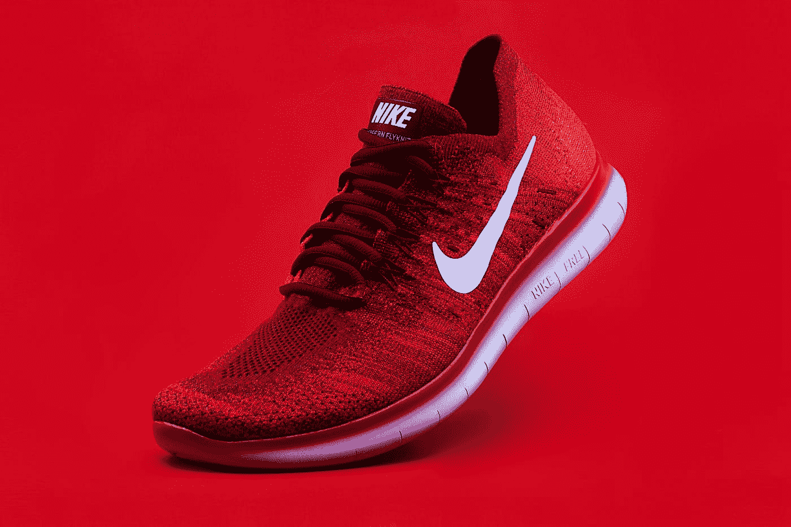

# 机器学习模型什么时候可以投入生产

> 原文：<https://pub.towardsai.net/when-is-a-machine-learning-model-ready-for-product-bec30476cf5f?source=collection_archive---------1----------------------->

## 构建产品时，在您的机器学习模型中寻找什么

照片由[反抗](https://unsplash.com/@revolt?utm_source=medium&utm_medium=referral)上[的 Unsplash](https://unsplash.com?utm_source=medium&utm_medium=referral)

当你建立一个机器学习模型时，你需要确保这个模型适合它的用途。你不想建立一个不适合你的目的的模型。这不仅对模型很重要，而且对创建模型所花费的时间和金钱也很重要。你怎么知道一个机器学习模型什么时候可以用于产品？本博客将讨论机器学习模型何时可以投入生产。

# 为什么知道你的机器学习模型何时适合产品很重要

几乎每个企业都希望拥有一个人工智能，机器学习是一个受驱动的系统。这可以通过许多方式实现，最流行的是通过一系列人工智能聊天机器人和其他对话界面。大多数企业问的问题是我们什么时候能真正实施它。机器学习模型什么时候可以投入生产？这个问题的答案并不简单，因为它取决于几个因素，包括机器学习模型、业务、目标受众以及部署它的平台类型。最重要的因素是模型的准确性。你可以有一个预测非常好的高度精确的模型，但是如果它返回错误的结果，那么它是没有用的。因此，模型的准确性是决定其生产就绪性的最重要因素。

如果你正在研究机器学习或人工智能，你无疑已经做了大量的实验。您已经尝试了不同的模型，评估了不同的算法，甚至可能已经带着您的数据集和您构建模型的方式回到了绘图板。随着机器学习和人工智能的增加，围绕这些技术的可能性有很多炒作。但是出错的可能性呢？我见过许多组织(包括我自己)将机器学习模型投入生产，但这些模型还没有准备好投入使用。这不是因为我们没有耐心。通常是因为很难知道一个模型什么时候准备好了。作为开发人员，我们通常知道一个软件什么时候准备好了，因为我们已经写好了，只需要做一些 QA 工作，然后把它发布出去。但是有了机器学习，就没那么容易了。我们必须知道模型什么时候准备好了，但是我们真的没有很多数据来判断它。这就是为什么我们必须有某种过程或方法。

# 评估一个机器学习模型的最好方法是什么？

很多人没有意识到，当你在处理一个机器学习模型时，有很多方法可以判断这个模型是否可行。最重要的是在投产前测试一下这个模型。您可以用几种方法来测试您的模型。一种方法是将模型的结果与基线算法或不同算法的结果进行比较。这被称为你的地面真相。这是一种非常常见的方法，有几种方法可以做到这一点。例如，您可以使用 k-fold 交叉验证来进行留一测试。值得注意的是，您应该尝试使用几种不同的方法来测试您的模型，因为您永远无法知道它在未来的表现如何。测试模型的其他方法是确保模型在精确度、召回率和 F1 评分方面是准确的。有很多方法可以测试你的模型，所以对不同的方法做一些研究是很重要的。

机器学习模型的评估是确定模型是否按照预期执行的过程。如果期望模型能够预测某项任务的结果，那么就要进行评估，以确定它能在多大程度上完成这项工作。有许多方法可以评估机器学习模型。概括地说，您可以使用拒绝集、交叉验证集或 k 重交叉验证。

很多人已经讨论了如何评估机器学习模型，其中一些非常好。问题是，首先，它们中的大多数是为数据科学家或对模型评估感兴趣的人量身定制的。我想写这篇博文，为产品经理和其他对在生产中使用机器学习模型感兴趣的利益相关者提供一个更广阔的视角。我将把模型评估作为一个端到端的过程来关注，它包括:—模型开发—模型测试—模型改进我将尝试提供一个清单，列出当您评估产品的机器学习模型的准备情况时应该寻找的东西。以下是评估模型时您应该问自己(或您的团队)的一系列问题。

# 查看模型时，您应该使用什么性能标准？

机器学习模型(ML)总是一个权衡的问题。你可以要求一个能够高精度预测用户行为的模型，但是如果你牺牲了构建模型的时间，这个项目将会失败。另一方面，如果您想要构建一个能够高精度预测用户行为的模型，但是您牺牲了优化来为生产做好准备，那么您也将失败。在定义项目目标时，绩效标准是必须的。为了定义正确的绩效标准，你需要知道你的目标是什么。在开始构建模型之前，应该定义四个主要目标:预测准确性、学习时间、生产时间和泛化。预测精度是最重要的目标。如果你试图建立一个模型来预测你的用户的感受，那么高的预测准确度将是你的首要目标。然而，如果你试图建立一个模型来优化你的网站，那么高的预测准确率就不是你的主要目标。

因此，产品负责人有责任决定一个模型何时可以投入生产。这个决定通常是基于模型的性能、准确性和模型的置信度的有根据的猜测。如果模型正在返回相当好的预测，正在提供很高的准确性，并且您对模型有很高的信心，那么它可能已经准备好了。如果你没有这些东西，那很可能是没准备好。

# 如何在模型评估中使用基准

机器学习是一个如此广泛的行业，难怪许多人对机器学习是什么以及如何应用机器学习感到困惑。我在这个领域工作了几年，仍然觉得自己对它了解不够。当有这么多不同类型的 ML 模型，并且其中一些模型如此复杂时，我们如何能够期望了解关于机器学习的一切？在互联网上找到大量关于机器学习的资源确实很容易，但为您的应用程序找到正确的信息可能需要一些时间。机器学习模型真的很强大，潜力也很大，但是你得明白如何评价和衡量它们。在这篇文章中，我将带你浏览不同的 ML 模型，从基础到复杂，我将解释如何评估一个模型。

评估机器学习模型的过程可能看起来冗长而复杂，但它不需要如此。事实上，有一种简单的方法可以评估你的模型，而且比你想象的要简单得多。此外，你可以在这个过程中学到很多东西，这和一个好的模型一样有价值。在评估一个模型时，我们使用一组指标来帮助我们确定该模型是否可以投入生产。重要的是要建立一个过程或管道，你可以很容易地通过它来评估你的模型。事实上，该过程本身可以分为三个步骤:数据准备模型评估模型调整这些步骤不一定是按顺序进行的，可以反复进行。但是现在，让我们依次来看看它们中的每一个。

> **结论**

在你把你的模型送到一个不太友好的环境之前，确保你的模型已经为真实世界做好了准备。