# 当方差和标准差无法解释可变性时！

> 原文：<https://pub.towardsai.net/when-variance-and-standard-deviation-fail-to-explain-variability-7a38ccbeae46?source=collection_archive---------0----------------------->

我们都知道方差的定义——它帮助我们理解数据点在平均值周围有多分散。

如果数据点远离平均值，我们会得到比接近平均值的数据点更大的曲线。

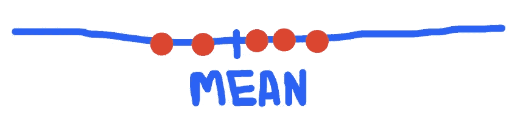

接近平均值的点

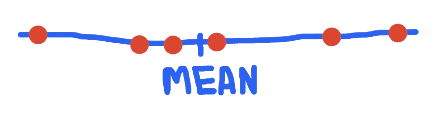

远离平均值的点

给定一组 n 个样本观察值，计算样本方差的公式为:

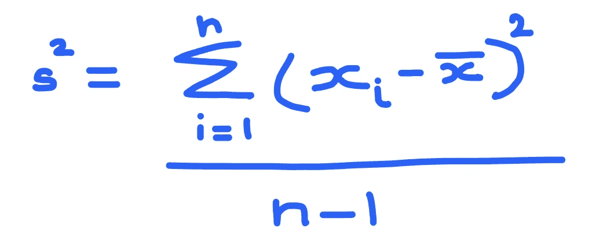

其中 xbar 是样本平均值。

假设一个数据集只包含两个点-> x1 和 x2。

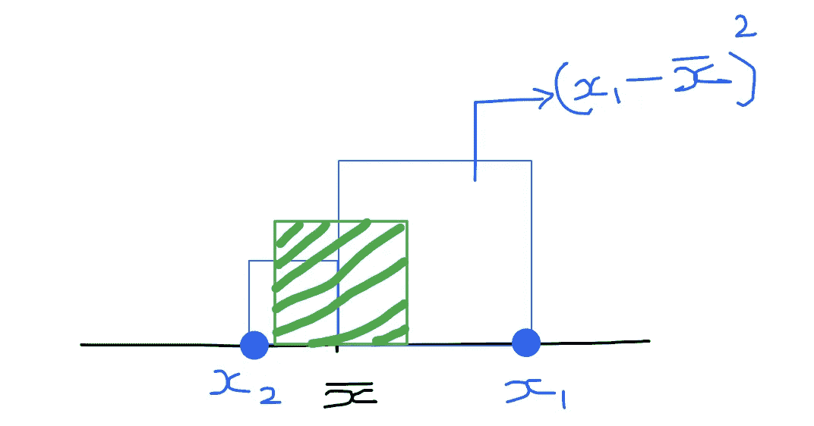

为了计算方差，

*   **第一步—** 求各点离均值的距离。想象这个距离是一个正方形的边长。
*   **第二步—** 到 2 次方的距离是由每个点(蓝框)形成的正方形的面积
*   **第三步—** 方差将是所有这些正方形的平均面积—由上面的绿框表示 2 个点 x1 和 x2 的情况。

**标准差=方差的平方根— - >这是绿色方框(代表所有其他蓝色方框平均面积的方框)的边长**

方差的问题在于它的单位是平方的。

考虑这个列出了西班牙马德里的 Airbnbs 的 Kaggle 数据集

([https://www.kaggle.com/rusiano/madrid-airbnb-data](https://www.kaggle.com/rusiano/madrid-airbnb-data))。

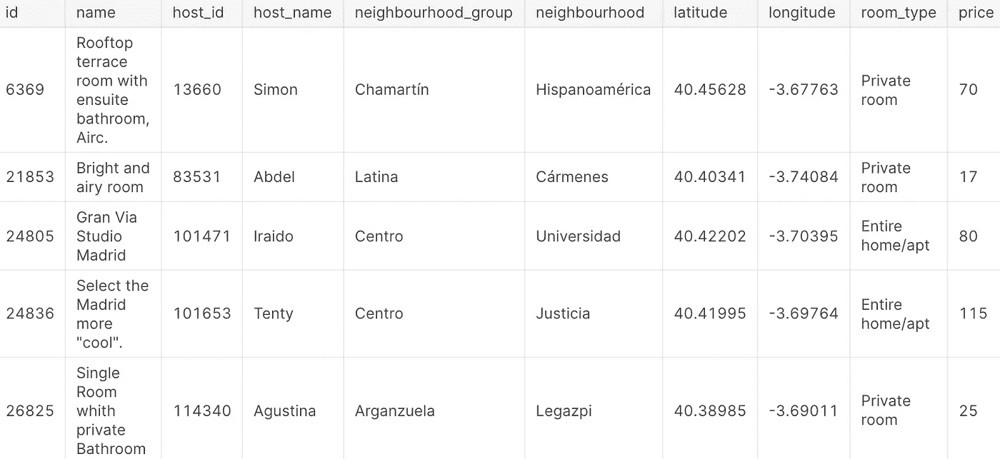

如果我们计算这些 Airbnb 房源的价格差异，我们会得到欧洲广场，这不是很好解释。所以，我们有一个叫做标准差的东西，它是方差的平方根。标准差是可变性最常见的度量，它解决了我们在使用方差时单位被平方的问题。

那么标准差在哪里失效呢？

假设我们需要比较两个数据集——一个以欧元列出 Airbnb 价格，另一个以美元列出。

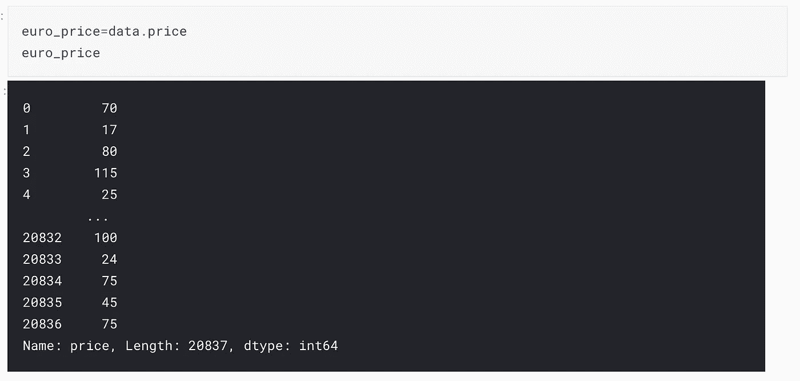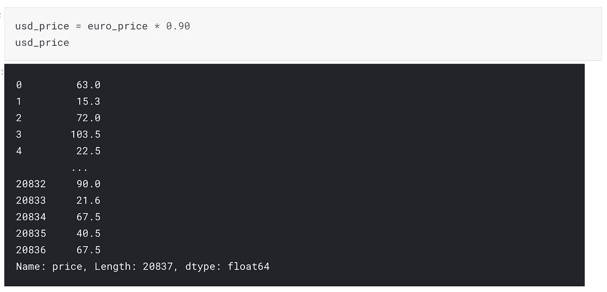

我们从这两个数据集得到的标准偏差将是不同的，即使它们列出了相同的地理位置和相同价格的相同房屋列表——在这种情况下，它们对可变性的测量，即标准偏差，给出了不同的值。

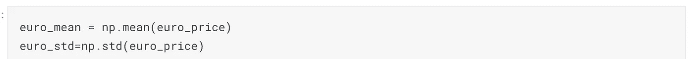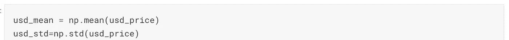

当我们想要比较不同数据集的离差时，我们希望能够以绝对值来比较它们。这就是变异系数可以发挥作用的地方。它有助于比较两个不同数据集的可变性。样本变异系数的公式就是样本标准差除以样本均值。

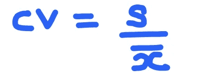

让我们将变异系数应用于上面的例子:

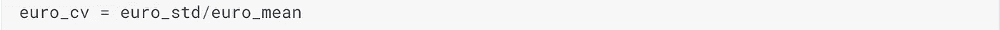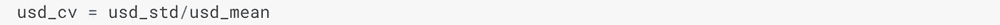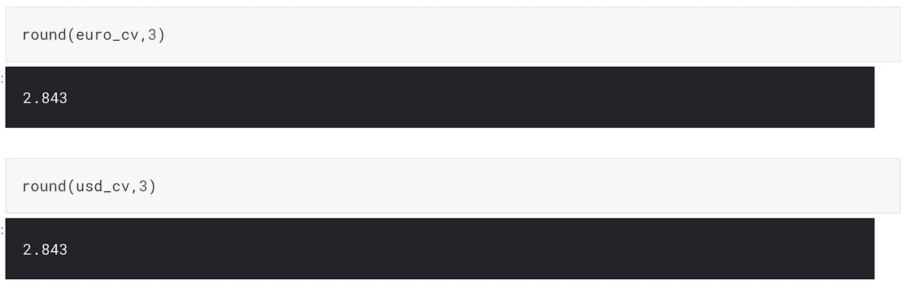

因此，在这些 Airbnb 房源的情况下，不管我们如何看待两个不同数据集中的价格，因为它们是我们正在比较的完全相同的房屋房源，所以变异系数是相同的，即使标准偏差不同。

因此，如果我们只看一个数据集，标准差是最常见的可变性度量。当我们想要比较不同数据集中的可变性时，变异系数是有用的。