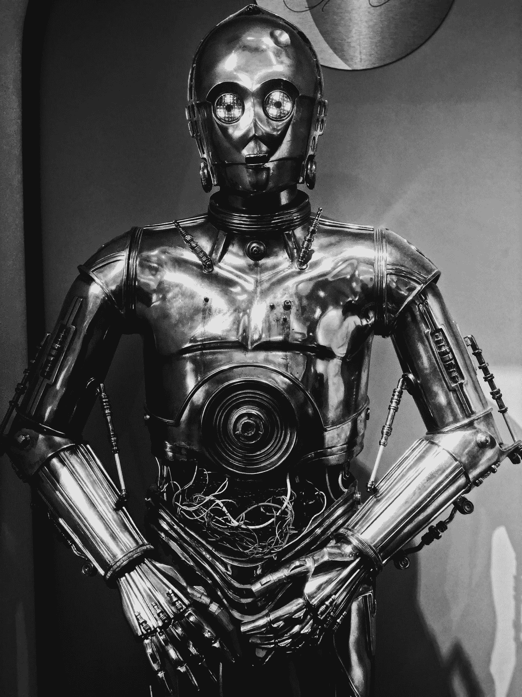

# 科幻电影和书籍中承诺的机器人在哪里？

> 原文：<https://pub.towardsai.net/where-are-the-robots-that-sci-fi-movies-and-books-promised-fee18d0fccea?source=collection_archive---------1----------------------->

## 机器人学

尼斯·姆舒蒂在 [Unsplash](https://unsplash.com?utm_source=medium&utm_medium=referral) 上的照片

科幻电影和书籍承诺，有了最先进的机器人，未来看起来会很不一样。*星球大战*定制 C-3PO 和 R2-D2。回到未来给了我们时间旅行和无处不在的飞行汽车的梦想。《银河系漫游指南》承诺机器人能够拥有人类的情感，而《杰森一家》承诺机器人能够照看家庭，机器人能够做饭、打扫卫生并成为同伴。随着现代技术的进步和实验室的突破，这似乎是可能的。然而，当我们环顾四周时，我们似乎还没有走到半路。

在现实中，我们有接近飞行汽车的飞机，并且有能力带人类去月球，这是非常令人印象深刻的。然而，在机器人方面，我们有擅长单一任务的真空吸尘器 Roomba，没有自适应智能的洗碗机，可编程洗衣机。此外，我们有像 Alexa 或 Google Home 这样的虚拟代理(但不是机器人)，它们经常误解我浓重的口音，无法进行对话。那么，科幻电影和书籍中承诺的机器人在哪里呢？

过去两年，随着新型机器人平台的推出，如友好的家用机器人“库里”、“瑙”、“佩珀”以及清洁机器人“抖音”,前景似乎一片光明。然而，库里和抖音甚至在起飞前就消失了。Nao 和 Pepper 的应用仍然局限于一些脚本任务。Spot Mini 展示了一些前景，它是一只能够打扫房间的机器狗，但是在不断变化的环境中与人类一起工作对它来说是一个巨大的挑战，目前，让这个机器人在你的房子里工作仍然是一个遥远的未来。[波士顿动力公司创造了 Atlas](https://www.youtube.com/watch?v=fRj34o4hN4I) ，一个能够跳跃、奔跑，甚至后空翻的机器人。然而，流行的镜头只显示了机器人的最佳尝试，而不是一般的行为。

所以问题依然存在——在创造承诺的机器人的过程中，我们哪里出了错？有一点可以肯定，制造这些机器人并不像最初设想的那么容易。我们对机器人期望过高。我们的幻想来自科幻电影，而不是正在进行的和推断的研究。我们希望我们的机器人看起来像人类，并具有像人类一样的感知、抓取和操纵能力。此外，我们希望他们能够与周围环境进行推理，并自主行动。让我们深入这些期望，看看问题出在哪里。

由于我们复杂的身体结构，看起来像人类的机器人真的很难制造。由于其复杂的结构，我们甚至无法复制人类的手——适应性皮肤层，增强力量的骨骼核心，感觉信息的神经，肌肉，灵活运动的肌腱。最接近我们来创造索菲亚，但她所能做的只是面部识别和给脚本的答案。

即使我们复制了人类的关节结构，在不损害强度的情况下增加必要的适应能力仍然是一个问题。此外，我们无法在微观层面上为人体添加丰富的感知能力，如触觉、振动、压力和温度。这使得类似人类的机器人无法执行人类水平的任务。

抓取和操作是人类毫不费力就能完成的基本任务，即使没有视觉辅助。对于机器人来说，由于我们无法整合传感能力和自适应“皮肤”，它需要精心规划此外，我们希望机器人能够 100%准确地完成这项任务。即使是 99%，也意味着机器人在捡起杯子的 99 次中会掉杯子，我们当然不希望这样。

帮助机器人看东西的摄像头和使用感官数据来感知周围环境的算法仍然不准确。即使我们使用多个摄像头和不同类型的摄像头，如红外线，扩大机器人的视野和信息丰富度，连续处理如此大量的数据仍然是一个挑战。为了客观地看待事物，我们的大脑在识别一个物体之前会捕捉和看到这个物体一百万次。训练机器人认识所有周围物体所需的计算能力和内存仍然无法实现。

根据周围环境进行推理和自主行动是人类随着时间的推移发展起来的一些东西。感官能力和推理能力是互补的。此外，我们的好奇心帮助我们学习和探索。如何对此进行编码仍是正在进行的研究课题。

拥有具有丰富传感器形态的廉价机器人平台是加速研究的障碍之一。有人可能会想，如果买不起机器人，为什么不用模拟呢？嗯，我们还不擅长将技能从模拟转移到真实的机器人，尽管目前的研究认为这个问题非常重要。此外，创建一个能够精确表示物体，尤其是可变形物体的模拟环境本身就具有挑战性。

由于不同的机器人形态、不同的传感器接口、可用模态和精度，将算法从一个机器人转移到另一个机器人也是一个重大挑战。与互联网不同，在互联网上，每个人都可以编写自己的网页，并在很大程度上定制任何网站的每一个页面，甚至在个人电脑上，机器人硬件不提供这种灵活性。为解决操纵、抓取和规划等问题而提供的解决方案仍然依赖于平台。他们中的大多数迎合了特定的实验室场景。将这些技能带到外部动态和不可预测的世界是一个巨大的挑战。

我们缺乏制造下一代机器人的软件和硬件能力。但鉴于创新的速度，机器人似乎有能力自主正确地完成一项任务。Roomba 是一个自主清洁地板的机器人，已经做得很好了。我们有遥控机器人，可以进入危险区域，使用人类的推理技能来完成任务，例如，拆弹机器人。我们有像达芬奇这样的机器人，它可以让外科医生以亚毫米的精度操纵手术工具，提高手术的成功率。

我们可能没有杰特森家的机器人，但我们可以有一个机器人整天跟着你在房子里，提醒你类似 Kuri 的家务。我们正在测试和改进自动驾驶汽车。社交机器人和自动送货机器人在当前的 COVID 危机中特别有用，并将继续改进。这花了三年时间，但我们有了一只机器人手，它可以在没有任何人类帮助的情况下从零开始解决一个魔方。

科幻机器人梦可能看起来有点遥远，但我们每天都在向它前进，而不是冲刺。

由[向艾](https://towardsai.net/)发布