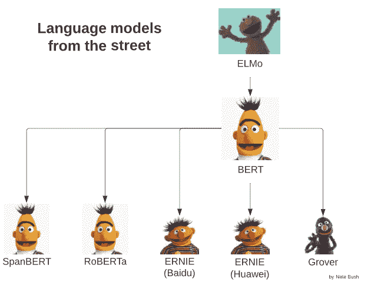
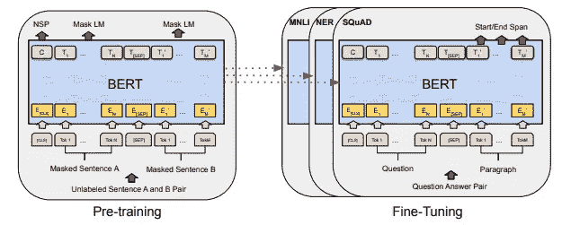
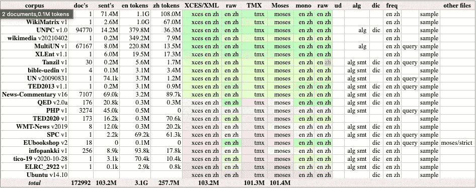
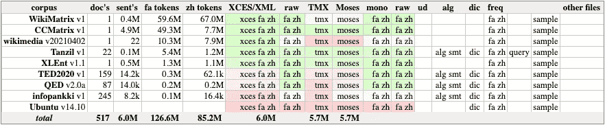
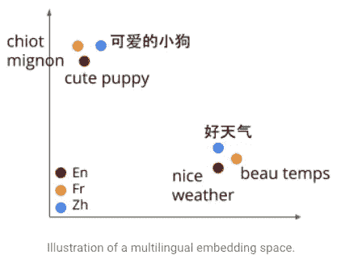

# 哪项自然语言处理任务没有受益于预先训练的语言模型？

> 原文：<https://pub.towardsai.net/which-nlp-task-does-not-benefit-from-pre-trained-language-models-90430ed1207e?source=collection_archive---------0----------------------->

预训练的通用语言表示模型有着如此悠久的历史，产生了巨大的影响，以至于我们理所当然地认为它们是所有 NLP 任务完全 100%必要的基础。有两个独立的阶跃函数创新推动了所有 NLP 任务的准确性:(1)像 Word2Vec 和 GloVe 这样的统计语言模型，以及最近的(2)像 [BERT](https://arxiv.org/pdf/1810.04805.pdf) 、 [ELMo](https://arxiv.org/abs/1802.05365) 和最近的 [BLOOM](https://huggingface.co/bigscience/bloom) 这样的神经语言模型。在建模工作流的开始插入预先训练好的神经语言模型 ***几乎*** 保证能提高性能，但至少有一种情况不能。

侧边栏:为什么是芝麻街主题？！

# 命名实体识别(NER)

只需看看最初的 BERT 论文，标题为“ [BERT:用于语言理解的深度双向转换器的预训练](https://arxiv.org/pdf/1810.04805.pdf)”，即可在第 5 节中看到预训练 BERT 嵌入如何提高 NER 性能的详细分析。下面的 BERT 图显示了一个典型的机器学习工作流，它利用任何语言模型来完成一般的 NLP 任务。

来源:[https://arxiv.org/pdf/1810.04805.pdf](https://arxiv.org/pdf/1810.04805.pdf)—BERT 整体预培训和微调流程

论文还显示了在问答(QA)和自然语言理解(NLU)的大杂烩任务 [GLUE](https://openreview.net/pdf?id=rJ4km2R5t7) 上的显著进步。

# 实体消歧

全球 ED 任务还使用 BERT 在多个数据集上取得了新的最先进的结果。请参见本“[使用 BERT](https://arxiv.org/pdf/1909.00426.pdf) 进行全局实体消歧”的相关工作部分，了解将 BERT 用作 ed 预处理步骤的各种工作流程的概要。

# 摘录摘要

在“[微调用于提取摘要的 BERT](https://arxiv.org/pdf/1903.10318.pdf)”中可以找到一个简单的 BERT 变体，它在几个 ES 数据集上再次实现了最先进的性能。

# 情感分析

在最近的论文“[用于情感分析的 BERT:预训练和微调的备选方案](https://arxiv.org/abs/2201.03382)”中，情感分析同样受到 BERT 语言模型的存在的青睐。

我可以继续…但是我不会。预训练语言模型的荣耀是显而易见的。我们只需要站在巨人的肩膀上，他们花了无数个小时来准备大量的数据，部署昂贵的 GPU 来为我们预先训练这些模型。然而，这些模型并不是灵丹妙药。

《芝麻街》和《老友记》中未能显示出一致性能提升的主要自然语言任务是 ***【神经机器翻译】【NMT】***。

# NMT 通常不会从预先训练的语言模型中受益

很难找到讨论它为什么不起作用的论文，很容易想象为什么。写关于什么不起作用的论文不是很受欢迎…也不太可能获得认可或被频繁引用。唉，糟糕——那么我为什么又要写这篇文章呢？

我找到一篇关于这个主题的论文:“ [**预训练单词嵌入何时以及为什么对神经机器翻译有用？**](https://arxiv.org/pdf/1804.06323.pdf)**读起来很有意思。他们将 NMT 分为两类任务:**

1.  **低资源语言的 NMT**
2.  **高资源语言的 NMT**

**他们所说的 ***低/高*** 资源语言是指可以获得的平行语料库的大小。对于世界上最流行的语言，可以很容易地在网上找到开源的大型平行语料库。最大的此类知识库是 [OPUS](https://opus.nlpl.eu/) ，这是一个开放的并行语料库，对于任何希望训练 NMT 模型的机器学习工程师来说，这都是一个惊人的资源。**

****

**来源: [OPUS](https://opus.nlpl.eu/) -英汉高资源平行语料库**

**上图显示，开放的英汉平行语料库拥有 1.03 亿个平行句或 172K 个平行文档。但是如果你想训练一个 NMT 模型把波斯语翻译成中文呢？在这种情况下，您只有来自 517 个文档的 600 万个平行句子可以使用。**

****

**来源: [OPUS](https://opus.nlpl.eu/) -波斯语(fa)和汉语(zh)低资源平行语料库**

**如您所料，低资源语言受益于预先训练的语言模型，并能够在通过 NMT 网络反向传播错误的同时，在微调嵌入时获得更好的性能。然而，令人惊讶的是，对于高资源语言，在 NMT 模型训练之前使用预训练语言模型作为预处理步骤的效果并没有导致性能增益。**

**必须指出的是，语言模型只有在源语言和目标语言(例如，第一个例子中的中文和英文)上都经过训练的情况下，才适用于机器翻译。这些通常被称为多语言嵌入模型或语言不可知嵌入。他们能够获得有趣的结果，即多种语言中的单词在嵌入空间中获得相似的向量表示。**

****

**来源: [AI Googleblog](https://ai.googleblog.com/2020/08/language-agnostic-bert-sentence.html#:~:text=A%20multilingual%20embedding%20model%20is,semantic%20information%20for%20language%20understanding.)**

**但是多语言语言模型是如何训练的呢？事实证明，他们是在与 NMT 完全相同的数据上接受训练的:一个源语言和目标语言之间的大规模平行语料库。那么，语言模型是否有一个根本性的缺点，使它们无法有效地完成 NLP 任务？不，语言模型使用与 NMT 模型相同的数据，并且它们都是由同一个动力单元构建的:转换器。**

**回顾一下，语言模型和 NMT 是在相同的数据上训练的，使用非常相似的基础架构。当你考虑相似性时，语言模型并没有带来什么新的东西，所以 BERT、ELMo、ERNIE 和我们的其他芝麻街朋友没有出现在 NMT 的报纸上吹捧模型性能的巨大突破也就不足为奇了。**

**持怀疑态度的读者可能会在这一解释中找出漏洞。当然，有一些可设计的用例是在大型并行语料库上训练逻辑模型，但在小得多的语料库上训练伯特+ NMT 工作流会直观地提高性能。但我认为，一个严肃的深度学习工程师不太可能在没有所有可用数据的情况下试图建立一个 NMT 模型……除了纯粹的学术好奇心。**

**我小心翼翼地提到了一些令人毛骨悚然的细节，所以如果你感兴趣，我推荐你阅读[的原文](https://arxiv.org/pdf/1804.06323.pdf)！**

**我希望你喜欢这篇简短的探索，探究是什么让 NLP 算法成功的背后的直觉。更多深度学习知识请点赞、分享、关注。**