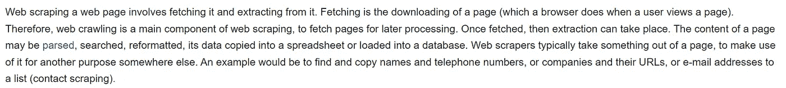
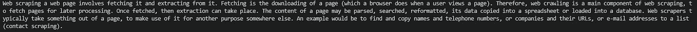

# 哪个 Python 网页抓取包最好？

> 原文：<https://pub.towardsai.net/which-python-web-scraping-package-is-the-best-11a97bfed9?source=collection_archive---------0----------------------->

## 2022，又一年，又一方喧嚣。这次为什么不自己编码呢？

内森·杜姆劳在 [Unsplash](https://unsplash.com/s/photos/web-spider?utm_source=unsplash&utm_medium=referral&utm_content=creditCopyText) 上的照片

***免责声明:*** *本文仅出于教育目的。我们不鼓励任何人抓取网站，尤其是那些可能有条款和条件反对此类行为的网站。*

# 漂亮的汤，刺痒还是硒？

我有一个项目即将到来，这将需要一个很好的网页抓取。因此，我决定真正深入网络抓取的世界。我将写几篇关于这个主题的文章——从这篇开始:

用哪个 Python 包最好？

我以前使用过这三种方法，有时会一起使用，它们都有各自的优缺点，我将在这里尝试一下。这将不会是一个通用的复制和粘贴文章，这将是纯粹的个人经验。

# 什么是网页抓取，什么是好的抓取工具？

我相信现在每个人都很清楚什么是网络抓取，所以我会尽量简短。

Web 抓取包括两个阶段，*数据获取*和*数据提取。*抓取是指从网站上有效下载整个页面。你可以在 Chrome 的开发者工具中点击右键，然后点击 inspect，查看网站的完整信息。然后，数据提取就是将所有这些数据整理成有用的信息片段，提取精华。你可以把它想象成淘金。获取是挖出渣滓，提取是筛选材料，直到黄金浮出水面。这通常是在许多网站上完成的，会产生一个有用信息的电子表格或文件；例如联系方式或价格。这在商业中是非常有用的工具。

如今，公司会花很多钱购买数据集，所以如果你知道自己在做什么，搜索互联网是有利可图的。

# 美味的汤

**小型项目的快速方法。**

美丽的汤的主要优势是它的易用性，这就是为什么它在这个名单上的第一位。它真的非常容易使用。如果是基本的，你可以在几分钟内设置好并做你需要做的事情。这里有一个非常基本的例子。

作者自己的代码:[https://github.com/jasher4994](https://github.com/jasher4994)

在这六行代码中(当然去掉了注释)，我们可以从网页中提取任何一段我们想要的数据。在这里，我选择了维基百科关于网络垃圾的页面。

在最初的 GET 请求之后，我们几乎可以立即用 Beautiful Soup 解析数据。输出很容易迭代，可用性非常高。下面是维基百科上的第二段，下面是输出。

**变成了:**

来源:【https://en.wikipedia.org/wiki/Web_scraping】和作者自己的代码。

所以正如你所看到的，Beautiful Soup 最好的方面显然是它的易用性和简单性。剧透一下，在我今天重点介绍的三个中，它是迄今为止最容易使用的。因此，如果你有一个项目需要快速完成，并且相对简单，这是一个适合你的。

现在我们来谈谈不利方面。

第一个缺点可以在代码的前三行中看到。依赖性。漂亮的汤需要其他包才能运行。这有时会使向其他机器或其他人传输代码变得困难。然而，就我个人而言，我真的不觉得这是什么大问题，因为它很容易安装在其他机器上。

它也是我今天要展示的三个库中最慢的一个，所以如果它是一个大项目，你可能想使用其他选项之一。

因此，总的来说，Beautiful Soup 是您快速轻松抓取的好朋友，尤其是作为进入网络抓取世界的敲门砖。

# **刺儿头**

**生力军。**

总的来说，如果你有一个真正的举重项目要做，Scrapy 是你想要的庞然大物。用 Scrapy 自己的话来说，这是一个“从网站上提取你需要的数据的开源和合作框架”。以一种快速、简单而又可扩展的方式。我不得不同意。相对而言，简单的部分可能有点长，它肯定比它的两个竞争对手更复杂，但它在速度和可转移性方面弥补了这一点。

速度是 Scrapy 最大的优势。它是围绕异步蜘蛛构建的，异步蜘蛛不必等待一次发出一个请求，而是可以并行发出请求。这使得它更有效率，这也使得 Scrapy 内存和 CPU 的使用效率相比，其他人在这里提到的。

与其即将到来的竞争对手相比，Scrapy 并不擅长处理 JavaScript 渲染代码。如今很多 HTML 都是通过