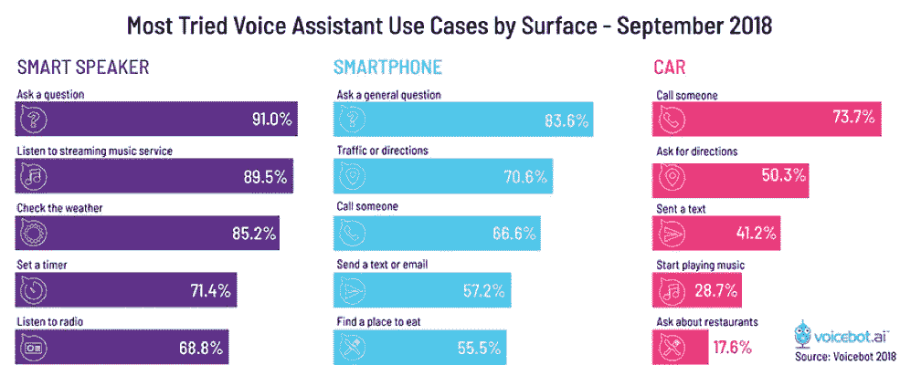
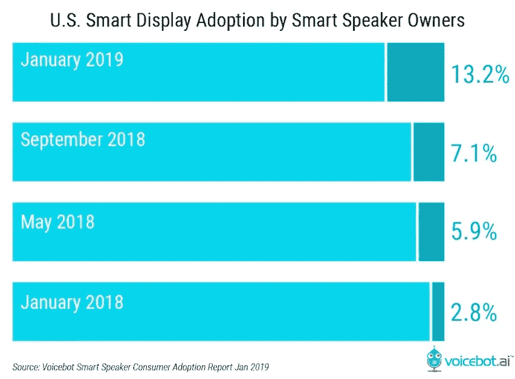

# 哪些声音技巧会在不久的将来流行起来？

> 原文：<https://pub.towardsai.net/which-voice-skills-will-rock-in-the-very-near-future-4c98065cff67?source=collection_archive---------1----------------------->

## 潜入语音助手生态| [走向 AI](https://towardsai.net)

到 2026 年，全球对话式人工智能市场[预计](https://reportsuptodate.us/6659/conversational-ai-market-forecast-to-2026-with-top-players-oracle-nuance-communications-inc-baidu-sap-se-artificial-solutions-kore-ai-inc-avaamo-conversica-inc-microsoft-ama/)将超过**270.8 亿美元。在很大程度上决定技术进一步发展的主要驱动因素是人工智能支持的客户支持服务和降低的聊天机器人开发成本。由于大量便捷的[开发平台](https://aimylogic.com/)，如今任何人都可以创建语音体验。亚马逊、谷歌和其他行业领导者正在尽最大努力为语音设备创造和推广有效和有影响力的技能。**

技能商店似乎充斥着语音助手所能获得的所有智能，但我们仍然感觉缺少了一些东西。我们仔细观察了智能助手的生态系统，并试图预测在不久的将来哪些技能将处于领先地位。

网飞黑镜

现在有成千上万的 Alexa 技能和 Google 动作可用，而且每天都在增加。创造它们是为了帮助、娱乐、学习、激励，以及做许多其他有用和不太有用的事情。商业需求的技能在这里尤为重要。自从第一天智能助手的生态系统向第三方开放以来，它们就已经建立起来了。但是自 2 月 13 日亚马逊发布其 1000 多份蓝图以来，Alexa 开发者生态系统已经发展到拥有数十万技能的 T2。现在，企业能够建立自己的技能来提高生产力或协作，并提供更好的客户服务。使用这些技能，你可以跟踪时间，管理员工，处理会议，设置提醒，甚至通过 Alexa 使用 [Slack。](https://www.amazon.com/PromptWorks-Chat-Bot-for-Slack/dp/B01FEVJDFM/ref=sr_1_259?s=digital-skills&ie=UTF8&qid=1486486718&sr=1-259)

嗯，这仅仅是一个开始——就目前而言，智能助理承担着……实际上，助理或办公室经理的角色，但最终它们将演变成一个多功能的智能办公中心。与办公设备制造商的集成将使员工的生活更加轻松，并节省他们的时间。想象一下，你说‘嘿，谷歌/Alexa，把那份文件打印出来，取消今天所有的会议，开始我的电话会议，打开[编辑文件](https://www.amazon.com/Antonio-Cucciniello-Edit-Docs/dp/B01MYOGRD5/ref=sr_1_103?s=digital-skills&ie=UTF8&qid=1486486218&sr=1-103)，而不是半个小时的鼠标点击和键盘敲击。

*现代会议，微软*

对于普通用户来说，事情也很棒——他们可以使用大多数可用的技能和动作。目前，人们主要使用语音助手来播放音乐、回答问题、设置闹钟和提醒。但是语音助手有更多你可以下载的社区技能。你可能会找到很棒的[厨房助手](https://www.theverge.com/2019/1/6/18168917/kitchenaid-google-assistant-smart-display-splash-resistant-cooking-price-specs-features)，帮助你更健康地烹饪和饮食，或者一个[车内备用](https://www.aarp.org/auto/trends-lifestyle/info-2018/alexa-voice-assistants-car.html)，让你在驾驶时保持冷静，或者一个[整夜打鼾](https://www.amazon.co.uk/dp/B07GTX52S6/ref=sr_1_16?slotNum=9&s=digital-skills&keywords=ambient&sr=1-16&linkCode=g12&imprToken=TaUtO9j5ZVaPKAgygJwm.w&creativeASIN=B07GTX52S6&tag=mashonelink-21)的朋友，让你不感到孤独，你知道，无论你想要什么。谷歌助手中有 18 个类别，Alexa 中有 20 多个类别，数千个技能和动作。一个人可能会变得困惑和迷失方向。有没有办法找到真正好的值得的东西？排名重要吗？你应该依靠技能审查吗？评分和一项技能的好坏有直接关联吗？

**嗯，** **很复杂**

首先，从来都不清楚有多少技能(或动作)是全局的。在大多数或所有能够使用数字助理的国家，有许多技能是完全相同的。例如，这发生在一个叫做[鸡蛋事实](https://www.amazon.co.uk/dp/B01L4RQKWO/ref=sr_1_4?slotNum=4&s=digital-skills&keywords=egg+facts&sr=1-4&linkCode=g12&imprToken=jQXU0Zi0eIfgBcPWzIpbEg&creativeASIN=B01L4RQKWO&tag=mashonelink-21)的怪异事实告诉 Alexa 技能上——不知何故在同一个名字下有多个技能。

重要的一点是，只有少数人使用助手的技能库来浏览，因此不太可能看到评级或自己写评级。事实上，这整个评级故事从一开始就不是很清楚。

2017 年 9 月 [Voicebot 批准](https://voicebot.ai/2017/09/13/62-percent-alexa-skills-no-ratings-4-1000/)，62%的 Alexa 技能没有评分，但 4%超过 1000。他们分析了这一评级系统的工作原理，并得出结论:在排名、受众和技能受欢迎程度之间没有精确的相关性。

这一分析的关键教训是，评论和评级的总数只是用户在考虑是否尝试一项新技能时应该考虑的一个信号。然而，很少有用户访问 Alexa 应用程序并实际查看技能评级，这一事实表明，它不会对多少人使用某项技能或他们对该技能的感受产生很大影响。这里真正重要的是媒体报道和正面的口碑推荐。用户满意度和保留率的真正驱动因素是技能概念、设计和性能的质量。

**今天错过了什么技能**

尽管有大量的现有技能和动作，但大多数人对如何使用他们的智能助手仍然不是很有创造力。[通常是](https://www.marketwatch.com/story/more-people-are-using-smart-speakers-but-not-for-shopping-2019-02-26)，他们会询问天气预报、音乐、新闻和报时。

通常，他们在独处时会这样做，因为他们觉得在公共场合对着一个设备大喊大叫很奇怪(好像用 AirPods 打电话不那么尴尬)🤪).一些人去技能商店寻找与智能设备交互的新方式，尽管他们可以找到一千种不同的娱乐和有用的技能。考虑到它们也是由普通用户创建的，这些技能涵盖了广泛的问题。无论你能想到什么，你很可能会在亚马逊或谷歌商店找到这种技巧。有很多非常相似的技能，但你可能会认为这是质量的竞争。VoiceLabs 的 Adam Marchick 曾经说过:

> *你宁愿有 493 个天气应用，让消费者决定他们喜欢哪个，让生态系统成长，而不是人为地约束系统，强迫每个人都使用一个。这将破坏创新。*

今天完全错过的是可以让语音交互成为真正的感觉的新技术。伟大的事情是，这个确切的时刻有如此多的可能性——以智能显示器为例。谷歌发布了它的 [Nest hub](https://store.google.com/us/?hl=en-US&countryRedirect=true) ，亚马逊发布了 [Echo Show 5](https://www.techradar.com/news/amazon-echo-show-5-everything-you-need-to-know) 。这些设备(以及许多其他制造商)结合了智能助理和智能显示器。这种联盟非常方便，这些设备的销售增长非常快。

智能显示器为技能开发人员打开了新的视角——多人游戏、教育、旅行、烹饪、购物——你可以列举很多事情。这款设备可以在任何地方使用，原因有很多，但我们相信它会作为智能家居中枢找到最广泛的用途。

智能显示器可以找到的另一个有趣的应用——约会服务。想象一下把 Tinder 和语音助手结合起来，想象一下告诉你的助手你在寻找什么类型的伴侣。也许你甚至会信任你的助手，而他对你如此了解，代替你做出选择。我们认为，很快设备就会与其他设备连接起来，人们会见面并交流，每个人和所有东西都会相互交流，这很好，因为新人会带来新的想法和灵感。

> 今天，我们应该把重点放在新的机制和技术上，这些机制和技术将彻底改变事物运行的顺序，彻底改变所有的行业。我们需要重新思考语音界面，创造我们这个时代的愤怒的小鸟。

**即将推出的内容**

游戏/娱乐是当今所有语音助手中最受欢迎的类别。因此，我们认为这是最有前途的领域之一。已经有很多非常有趣和非常有利可图的技能和项目。例如，有一项技能可以让你成为[使命召唤](https://www.callofduty.com/wwii/alexa)的主人——你可以获得个性化的玩家推荐、游戏内成就通知以及如何提高技能的提示。另一个例子:一些精通技术的初创公司将语音助手与棋盘游戏等传统娱乐相结合——这里一个很好的例子是由 [X2Games](http://x2.games/) 和 [Sensible Object](https://venturebeat.com/2018/06/18/sensible-object-raises-3-2-million-for-board-games-you-play-with-alexa-and-google-assistant/) 创建的基于 Alexa 的游戏 [St. Noire](https://www.youtube.com/watch?time_continue=30&v=3TV7lbN4X74) 。

另一个体现在语音技能中的出色想法的例子是这款完全沉浸式的亚马逊 Alexa 游戏，它允许粉丝只使用他们的声音来导航西部世界:

*西部世界:迷宫*

事实上，亚马逊非常清楚成功取决于集成能力，自 Amazon Echo 发布之日起，该公司就在积极为此努力。不久前，公司[与最大的游戏开发者社区 GDC](https://aws.amazon.com/gametech/gdc-2019/)合作。现在，开发者可以通过特殊工具用 Alexa 创建语音优先的游戏，这些游戏将通过数千万个 Alexa 设备到达客户手中。此外，在 [CES 2019](https://www.ces.tech/) 期间，Razer、索尼、联想等科技巨头[已经宣布](https://www.letsnurture.com/blog/alexa-voice-skills-integrating-with-mainstream-tech-giants.html)他们将把亚马逊 Alexa 的语音技能集成到他们的产品中。比如游戏外设，智能平板，降噪耳机，甚至[智能马桶](https://www.cnbc.com/2019/01/08/kohlers-7000-numi-2point0-toilet-with-amazon-alexa-built-in.html)。

自信地预测哪种确切的技能会变得完全新颖和有影响力并不容易。肯定会有突破性的方法和技术，使语音交互成为一种真正的感觉，会有一些只有语音助手才能做的事情，只有语音平台才能提供。这是给定的游戏和教育技能将是最重要的，尤其是因为年轻人是早期采用者。游戏和娱乐、语言教学和培训、数学和编码——所有这些技能在不久的将来都会有影响力，所有主要品牌都预计这些领域会有可观的增长。

*《少数派报告》(史蒂文·斯皮尔伯格，2002)*

我们正朝着使用起来越来越自然的用户界面前进，这是最重要的事情。结合语音命令、手势和虚拟屏幕的交互设计是我们在电影中看到的东西，我们相信这是未来与数字世界交互的方式。想象一下这种互动可能简化日常事务和商业任务的所有方式；也不知道这项技术对行动不便的人有多大好处。语音 UI 是迈向伟大数字体验的又一大步，人类思维和机器之间的界限正在模糊。