# 递归神经网络的基础

> 原文：<https://pub.towardsai.net/whirlwind-tour-of-rnns-a11effb7808f?source=collection_archive---------0----------------------->

## [机器学习](https://towardsai.net/p/category/machine-learning)

# 目录

*   rnn 是用来做什么的？
*   什么是 rnn，它们是如何工作的？
*   一个简单的例子——正向传播，反向传播
*   一个主要问题是:渐变消失

# rnn 是用来做什么的？

递归神经网络(RNNs)广泛用于具有某种顺序结构的数据。例如，时序数据具有基于时间的内在排序。句子也是连续的，“我喜欢狗”和“我喜欢的狗”有不同的意思简单地说，如果你的数据的*语义*被随机排列改变了，你就有了一个连续的数据集，RNNs 可能会被用于你的问题！为了帮助巩固 rnn 可以解决的问题类型，这里有一个常见应用的**列表:**

*   语音识别
*   情感分类
*   机器翻译(即中文翻译成英文)
*   视频活动识别
*   名称实体识别—(即识别句子中的名称)

太好了！我们知道可以应用 RNNs 解决的问题类型，现在…

# 什么是 rnn，它们是如何工作的？

rnn 不同于经典的多层感知器(MLP)网络，因为两个主要原因:1)它们考虑了之前发生的事情(2)它们共享参数/权重。

**RNN 的建筑**

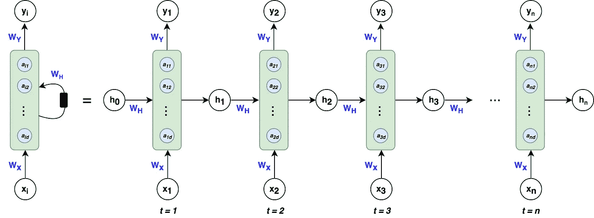

**左**:常用于 RNNs 的简写符号，**右**:RNNs 的展开符号

如果这没有意义，请不要担心，我们将分解所有变量，稍后将进行正向传播和反向传播！第一眼只关注变量的流动。

**架构分解**

绿色方块被称为 ***隐藏状态*** 。由**向量** ***定义的蓝色圆圈，一个*** 在每个块内，被称为 ***隐藏节点*** *或* ***隐藏单元*** 其中节点的数量由超参数 ***d*** *决定。*类似于 MLPs 中的激活，将每个绿色块视为作用于每个蓝色节点的激活函数。在本文的正向传播部分，我们将讨论隐藏状态中的计算。

**向量 *h*** *—* 是隐藏节点应用激活函数后隐藏状态的输出。如您在时间 *t、*所见，该架构通过包括来自*先前*隐藏状态的 *h* 以及时间 *t* 的输入 *x* 来考虑在 *t-1* 发生的事情。这允许网络考虑来自顺序在当前输入之后的先前输入的信息。值得注意的是，第零个 *h* 向量将总是以 0 的向量开始，因为该算法在序列中的第一个元素之前没有任何信息。

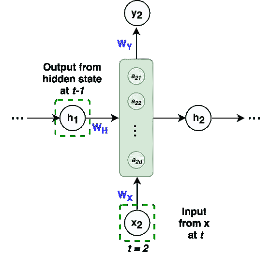

在 t=2 时的隐藏状态将 t-1 和 x 在 t 时的输出作为输入。

**矩阵 *Wx，Wy，Wh*** —是整个网络中*共享的*RNN 架构的权重。 *Wx* 在 *t=1* 处的模型权重与 *Wx* 在 *t=2* 处以及每隔一个时间步的权重完全相同。

**向量 *xᵢ*** *—* 是输入序列中每个元素的每个隐藏状态的输入，其中 i=1，2，…，n。回想一下，文本必须编码成数值。例如，单词“dogs”中的每个字母都是一个一维编码向量，维数为 *(4x1)。*同样，x 也可以是单词嵌入或其他数值表示。

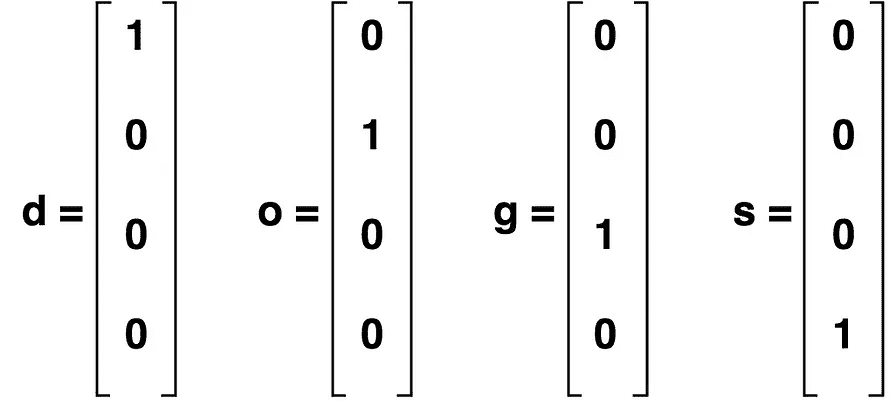

“狗”这个词的一键编码

**RNN 方程**

现在我们知道了所有的变量，这是我们进行 RNN 计算需要的所有方程:

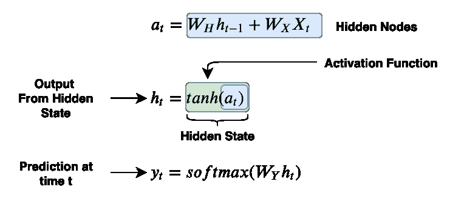

这是我们唯一需要的三个方程，非常好！**隐藏节点**是由权重矩阵 *Wh* 加权的前一状态的输出和由权重矩阵 *Wx 加权的输入 *x* 的串联。**tanh*功能就是我们之前提到的**激活功能**，用绿色方块表示。隐藏状态的**输出是应用于隐藏节点的激活函数。为了进行**预测**，我们从当前隐藏状态中提取输出，并通过 softmax 激活的权重矩阵 *Wy* 对其进行加权。**

理解所有浮动变量的维度也很重要。一般来说，预测一个序列:

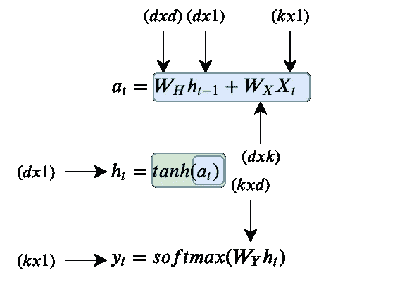

在哪里

*   **k** 是输入向量的维数 *xᵢ*
*   **d** 是隐藏节点的数量

现在，我们准备浏览一个示例！

# **一个微不足道的例子**

以单词**、**为例，在给定字母**、【d】、【o】、【g】、**的情况下，我们希望训练一个 RNN 来预测字母**、【s】、**。上面的体系结构如下所示:

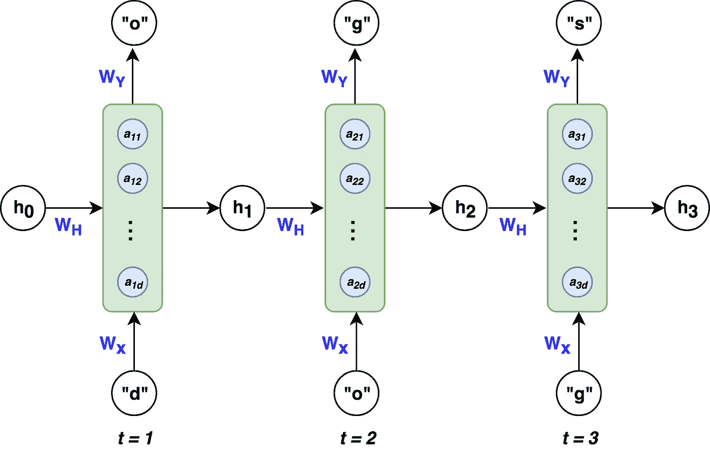

RNN 建筑预测“狗”中的字母“s”

为了使这个例子简单，我们将在 RNN *(d=3)* 中使用 3 个隐藏节点。我们每个变量的维度如下:

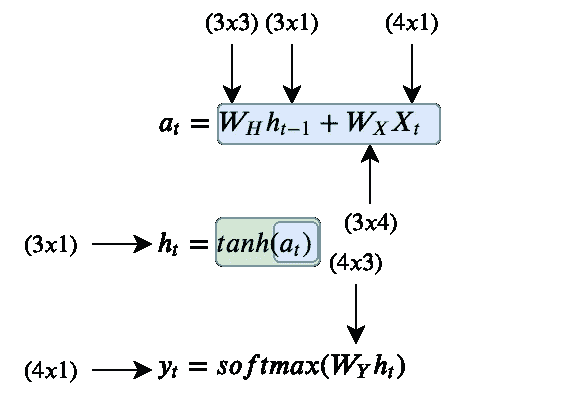

其中 k = 4，因为我们的输入 *x* 是“dogs”中字母的一个 4 维 hot 向量。

## *正向传播*

*让我们看看在时间 *t=1 时正向传播是如何工作的。*首先我们要计算隐藏节点 ***a*** ，然后应用激活函数得到 ***h*** ，最后计算**预测**。轻松点。*

*在 t=1 时*

*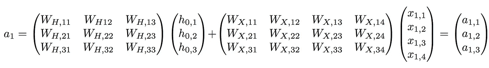**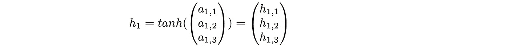**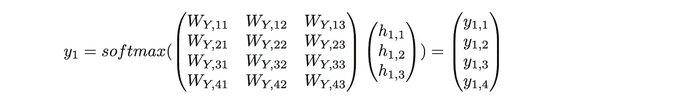*

*为了使这个例子具体化，我已经为矩阵 ***Wx，Wy，*** 和**Wh** 初始化了随机权重，以提供一个带有数字的例子。*

*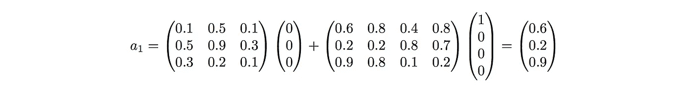**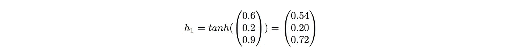**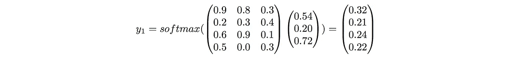*

*在 t=1 时，给定输入“d”，我们的 RNN 将预测字母“d”。这没有意义，但没关系，因为我们已经使用了未经训练的随机权重。这只是为了展示 RNN 向前传球的工作流程。在 t=2 和 t=3 时，除了来自 *t-1* 的*向量 h* 不再是 0 的向量，而是基于时间 *t 之前的输入的非零向量之外，工作流程将是类似的。(提醒一下，对于 t=1、2 和 3，权重矩阵 Wx、Wh 和 Wy 保持不变。*)*

*值得注意的是，虽然 RNN *可以*在每一个时间步输出一个预测，但这不是必须的。如果我们只对输入“dog”后面的字母感兴趣，我们可以只取 t=3 时的输出，而忽略其他的。*

*现在我们已经了解了如何用 rnn 进行预测，让我们来探索 rnn 如何学习进行*正确预测*。*

## *穿越时间的反向传播*

*像它们的经典对应物(MLP)一样，rnn 使用反向传播方法从序列训练数据中学习。由于权重的 ***递归性质及其对时间跨度损失的影响，使用 RNNs 进行反向传播更具挑战性。*** 我们一会儿就明白这是什么意思了。*

*为了具体理解反向传播是如何工作的，让我们展示一下一般的工作流程:*

1.  *随机初始化权重矩阵 *Wx，Wy，Wh**
2.  *向前传播以计算预测*
3.  *计算损失*
4.  *反向传播计算梯度*
5.  *基于梯度更新权重*
6.  *重复步骤 2–5*

***因为这个例子是一个分类问题，我们试图预测四个可能的字母(“d-o-g-s”)，所以使用**多类交叉熵损失函数**是有意义的:***

***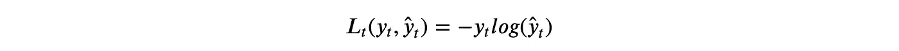***

***考虑到所有时间步骤，**总损失为**:***

***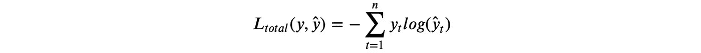***

***从视觉上，这可以看做:***

******

***给定损失函数，我们需要计算三个权重矩阵 *Wx、Wy、Wh、*的梯度，并用学习率η更新它们。类似于正常的反向传播，梯度给我们一种损失如何相对于每个权重参数变化的感觉。我们用下面的等式更新权重以最小化损失:***

***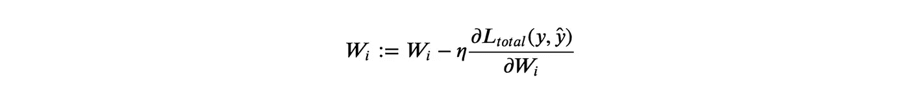***

***其中 i = x、y 和 h 是 3 个权重矩阵的简写***

***现在棘手的部分来了，计算 Wx，Wy 和 Wh 的梯度。我们将从计算 *Wy* 的梯度开始，因为这是最简单的。如前所述，权重对损失的影响会随着时间而变化。 *Wy* 的重量梯度如下:***

***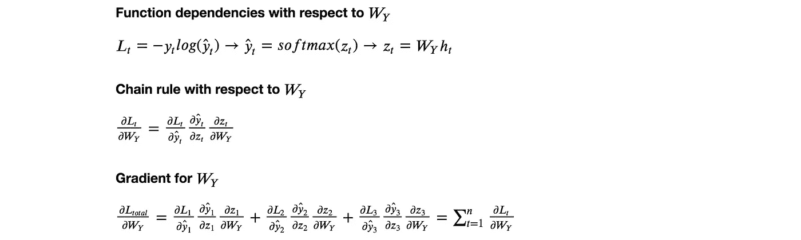***

***这就是 *Wy* 的渐变计算。希望如此，非常简单明了，**主要思想是链式法则，并考虑每个时间步的损失。*****

***权重矩阵 *Wx* 和 W *h* 彼此类似，因此我们将只查看 *Wx* 的梯度，并将 *Wh* 留给您。计算 *Wx* 最棘手的部分之一是对先前状态的递归依赖，如下图第(2)行所示。我们需要考虑当前误差相对于每个先前状态的导数，这在(3)中完成。最后，我们再次需要考虑每个时间步(4)的损失。***

***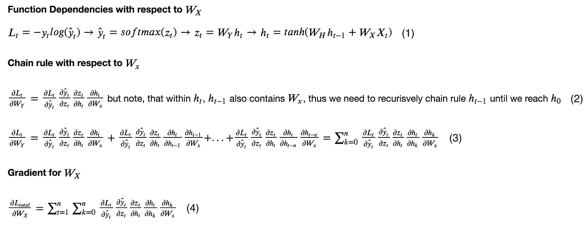***

***这就是反向传播！一旦我们有了 *Wx、Wh 和 Wy* 的梯度，我们照常更新它们，并继续反向传播工作流程。现在你知道了 rnn 是如何学习和预测的，让我们来看看一个主要的缺陷，然后结束这篇文章。***

# *****一个主要问题是:渐变消失*****

*****RNNs 面临的一个问题，也是其他深度神经网络普遍存在的问题，就是**消失梯度问题**。消失梯度使得模型难以学习长期依赖性。例如，如果给一个 RNN 人这样一句话:*****

*****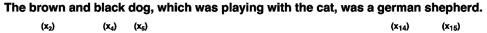*****

*****并且必须预测最后两个单词“german”和“shepherd”，RNN 需要考虑输入“brown”、“black”和“dog”，这是描述德国牧羊犬的名词和形容词。然而，“棕色”这个词与“牧羊人”这个词相差甚远从前面看到的 *Wx* 的梯度计算，我们可以把“shepherd”这个词的反向传播误差分解回“brown”，看看是什么样子的:*****

*****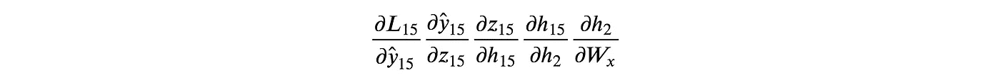*****

*****对应于输入“shepherd”的状态相对于状态“brown”的偏导数本身实际上是一个链式法则，导致:*****

*****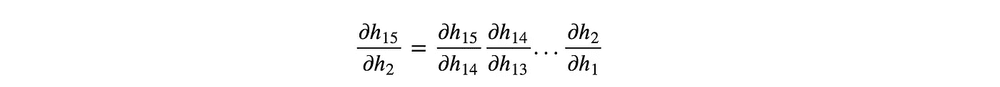*****

*****那可是一大堆链式法则啊！这些梯度链很麻烦，因为如果小于 1，它们会导致单词 shepherd 相对于单词 brown 的损失接近 0，从而*消失*。这使得权重很难考虑出现在长序列开头的单词。因此，当进行前向传播时，单词“brown”可能对“shepherd”的预测没有任何影响，因为权重由于消失梯度而没有更新。这是 RNNs 的主要缺点之一。*****

*****然而，在 rnn 方面已经取得了进展，例如门控循环单元(GRUs)和长短期记忆(LSTMs ),它们已经能够处理消失梯度的问题。我们不会在这篇博文中涉及它们，但在将来，我会写关于 GRUs 和 LSTMs 以及它们如何处理渐变消失的问题。*****

*****这篇博文到此为止。如果您有任何问题、意见或反馈，欢迎在下面评论。我希望你觉得这有用，感谢阅读！*****

# *****参考*****

*****[1]:吴恩达。*为什么序列模式*。[https://www . coursera . org/learn/NLP-sequence-models/lecture/0h7gT/why-sequence-models](https://www.coursera.org/learn/nlp-sequence-models/lecture/0h7gT/why-sequence-models)*****

*****[2]:陈刚。*带误差反向传播的递归神经网络温柔教程*。[https://arxiv.org/pdf/1610.02583.pdf](https://arxiv.org/pdf/1610.02583.pdf)*****