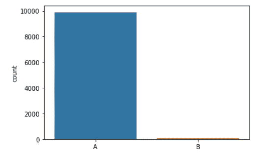
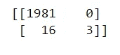
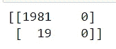

# 为什么准确度不是不平衡数据的好指标

> 原文：<https://pub.towardsai.net/why-accuracy-is-not-a-good-metric-for-imbalanced-data-bbc9cc3f90a2?source=collection_archive---------3----------------------->

机器学习中的分类是一种监督学习概念，其中数据点被分类到不同的类别中。例如，确定电子邮件是“垃圾邮件”还是“非垃圾邮件”以及确定患者的血型。

机器学习的分类一般分为三类:

*   二元分类
*   多类分类
*   多标签分类

## 什么是不平衡的类或数据？

不平衡数据指的是已知类之间的实例分布有偏差的问题(一个类比另一个类有更多的实例)。例如，一个类可能有 10000 个实例，而另一个类只有 100 个实例。


具有多数实例的类比具有少数实例的类权重更大——Google

在类的实例数量上，数据不平衡的范围从很小到很大。小的数据不平衡如 4:1，10:1 等。，不会对你的模型造成太大伤害，但是随着数据不平衡开始增加到 1000:1 和 5000:它会给你的机器学习模型造成问题。

具有许多实例的不平衡分类问题中的类被称为**多数类。**

在不平衡分类问题中很少有实例的类被称为**少数类。**

## 为什么不平衡的班级会产生问题？

当处理不平衡的数据时，少数类是我们最感兴趣的。就像检测“垃圾”邮件一样，与“非垃圾”邮件相比，它们的数量要多得多。因此，如果数据高度不平衡，机器学习算法会偏向较大的类，有时甚至会忽略较小的类。

机器学习算法旨在从训练数据中学习，以最小化损失并最大化准确性。让我们看看机器学习算法如何处理高度不平衡的数据。

## 一个例子

考虑这个例子，其中有 100 个类“A”的实例和 9900 个类“B”的实例。

```
x, y = make_classification(n_samples=10000, weights=[0.99], flip_y=0)
```

数据集的计数图可以用 [seaborn 库](https://seaborn.pydata.org/)创建

```
np.unique(y,return_counts=True)
y=np.where(y==0,'A','B')
sns.countplot(x=y)
```



数据集的计数图。

```
xtrain, xtest, ytrain, ytest = train_test_split(x, y, test_size=0.20, random_state=42)
print(np.unique(ytrain,return_counts=True))
print(np.unique(ytest,return_counts=True))
```

在使用测试规模为 20%的 [train_test_split](https://scikit-learn.org/stable/modules/generated/sklearn.model_selection.train_test_split.html) 将数据集分割成训练和测试数据之后，我们剩下 7919 个用于类“A”的训练示例和 81 个用于类“B”的训练示例。“A”级的测试示例为 1981，而“B”级的测试示例为 19。

先用我们的训练数据训练一个[逻辑回归](https://scikit-learn.org/stable/modules/generated/sklearn.linear_model.LogisticRegression.html)模型。

```
lr=LogisticRegression()
lr.fit(xtrain,ytrain)
lr.score(xtest,ytest)
```

现在，如果我们使用评分方法检查模型的准确性，它是 0.992。99.2%的准确率？它表现很好，对吗？让我们检查一下混淆矩阵。

```
pred_lr=lr.predict(xtest)
print(confusion_matrix(ytest,pred_lr))
```



逻辑回归的混淆矩阵

尽管类别“A”具有 100%的准确性，但是 19 个测试示例中只有 3 个被正确分类。这一定是个错误，对吗？

让我们在同一个数据集上使用[随机森林分类器](https://scikit-learn.org/stable/modules/generated/sklearn.ensemble.RandomForestClassifier.html)并检查发生了什么。

```
rfc=RandomForestClassifier()
rfc.fit(xtrain,ytrain)
rfc.score(xtest,ytest)
```

这次的准确率分数是 0.991，但是上次我们学到了什么？真实的结果隐藏在准确性的背后。让我们检查随机森林分类器预测的混淆矩阵。

```
pred_rfc=rfc.predict(xtest)
print(confusion_matrix(ytest,pred_rfc))
```


随机森林分类器的混淆矩阵

1981 个“A”类测试样本中只有 1 个分类错误，但 19 个“B”类测试样本中只有 2 个分类正确。

## 我们的机器学习模型在这里做什么？

正如我们之前讨论过的，机器学习模型试图最大限度地提高准确性，这就是这里正在发生的事情。由于类“A”的实例构成了 99%的数据，机器学习模型学习正确地对它们进行分类，并忽略或不学习太多关于类“B”的信息，因为将所有数据分类到类“A”将获得 99%的准确性。

您只需用 python 编写一条语句，就可以匹配这些模型的准确性。震惊？

```
pred=['A']*len(ytest)
```

该语句创建一个长度为 2000 的列表(因为总测试数据是 2000 或 10000 的 20%)，并用“A”填充它。由于 99%的样本只是一个类，所以我们使用[准确度分数](https://scikit-learn.org/stable/modules/generated/sklearn.metrics.accuracy_score.html)得到 99%的准确度。

```
accuracy_score(ytest,pred)
```



“pred”列表的混淆矩阵

## 如何处理不平衡的数据集？

有许多方法可以处理不平衡的数据集。有些要求你有领域知识，有些使用不同的算法来增加少数类的实例(过采样)和减少多数类的实例(欠采样)。

*   通过领域知识，您可以将多数类拆分成多个类，也可以将不同的少数类合并成一个具有多个实例的类。
*   [不平衡学习](https://imbalanced-learn.org/)是一个 python 库，它有不同的欠采样和过采样方法。
*   另一种方法是在创建机器学习模型对象时为不同的类设置权重。检查 class_weights 如何在 [StackOverflow](https://stackoverflow.com/questions/30972029/how-does-the-class-weight-parameter-in-scikit-learn-work) 上工作。
*   [不平衡学习](https://imbalanced-learn.org/)中的一些过采样方法有 [SMOTE](https://imbalanced-learn.org/stable/references/generated/imblearn.over_sampling.SMOTE.html?highlight=smote#imblearn.over_sampling.SMOTE) 、[randomversampler](https://imbalanced-learn.org/stable/references/generated/imblearn.over_sampling.RandomOverSampler.html)、[borderline mote](https://imbalanced-learn.org/stable/references/generated/imblearn.over_sampling.BorderlineSMOTE.html)、[kmeansmote](https://imbalanced-learn.org/stable/references/generated/imblearn.over_sampling.KMeansSMOTE.html)和 [ADASYN](https://imbalanced-learn.org/stable/references/generated/imblearn.over_sampling.ADASYN.html) 。
*   [不平衡学习](https://imbalanced-learn.org/)中的欠采样方法有 [ClusterCentroids](https://imbalanced-learn.org/stable/references/generated/imblearn.under_sampling.ClusterCentroids.html) 、[condensed nearest neighborhood](https://imbalanced-learn.org/stable/references/generated/imblearn.under_sampling.CondensedNearestNeighbour.html)、[edited nearest neighborhoods](https://imbalanced-learn.org/stable/references/generated/imblearn.under_sampling.EditedNearestNeighbours.html)、 [NearMiss](https://imbalanced-learn.org/stable/references/generated/imblearn.under_sampling.NearMiss.html) 、[单侧选择](https://imbalanced-learn.org/stable/references/generated/imblearn.under_sampling.OneSidedSelection.html)、 [RandomUnderSampler](https://imbalanced-learn.org/stable/references/generated/imblearn.under_sampling.RandomUnderSampler.html) 、[tomklinks](https://imbalanced-learn.org/stable/references/generated/imblearn.under_sampling.TomekLinks.html)和[邻域清洗规则](https://imbalanced-learn.org/stable/references/generated/imblearn.under_sampling.NeighbourhoodCleaningRule.html)