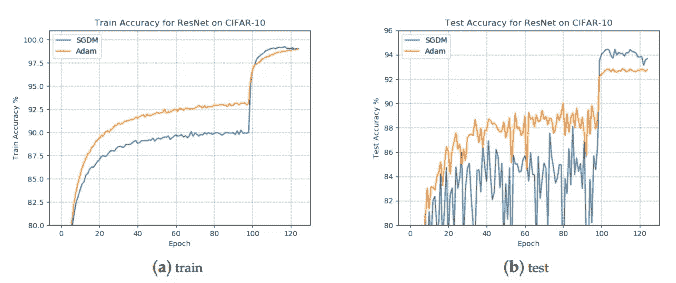

# 为什么 Adam Optimizer 不应该是默认的学习算法？

> 原文：<https://pub.towardsai.net/why-adam-optimizer-should-not-be-the-default-learning-algorithm-a2b8d019eaa0?source=collection_archive---------0----------------------->

由于训练时间快，越来越多的深度学习实践者正在用自适应梯度方法训练他们的模型。特别是 Adam，已经成为许多深度学习框架中使用的默认算法。尽管训练结果较好，但众所周知，与随机梯度下降(SGD)相比，Adam 和其他自适应优化方法的泛化能力较差。这些方法往往在训练数据上表现良好，但在测试数据上却优于 SGD。

最近，许多研究人员写下了实证研究，以思考自适应梯度方法的边际价值。让我们试着理解这些研究发现。

来源:自适应梯度方法的有界调度方法

## 亚当可能收敛得更快，但归纳能力很差！

为了充分理解这种说法，有必要简要观察一下流行的优化算法 Adam 和 SGD 的优缺点。

**梯度下降(vanilla)** 是优化深度学习网络最常用的方法。这项技术于 20 世纪 50 年代首次提出，它可以*更新模型的每个参数，观察变化如何影响目标函数，选择降低错误率的方向，并继续迭代，直到目标函数收敛到最小值。*要了解梯度下降的数学和功能，您可以阅读:

 [## 梯度下降算法背后的数学

### 注意:这篇文章是写给那些对 ML 设置有基本了解，并且对……

harjot-dadhwal.medium.com](https://harjot-dadhwal.medium.com/math-behind-the-gradient-descent-algorithm-8d6137d92e9) 

SGD 是梯度下降的变体。SGD 不是对整个数据集执行计算(这是多余且低效的),而是只对随机选择的数据示例的一个小子集进行计算。当学习速率较低时，SGD 产生与常规梯度下降相同的性能。

**亚当的优化** *方法根据梯度的一阶和二阶矩的估计值计算不同参数的个体自适应学习率。*它结合了均方根传播(RMSProp)和自适应梯度算法(AdaGrad)的优点，可以计算不同参数的个体自适应学习率。与 RMSProp 中基于平均一阶矩(平均值)调整参数学习率不同，Adam 还利用了梯度二阶矩的平均值(无中心方差)。要了解更多关于 Adam 的信息，请阅读[*Adam——深度学习优化的最新趋势。*](https://towardsdatascience.com/adam-latest-trends-in-deep-learning-optimization-6be9a291375c)

> 总的来说，Adam 肯定快速收敛到“尖锐的最小值”,而 SGD 计算量大，收敛到“平坦的最小值”,但在测试数据上表现良好。

## **为什么 ADAM 不应该是默认算法？**

文章发表于 2019 年 9 月， [*《自适应梯度方法的有界调度方法》*](https://pdfs.semanticscholar.org/255b/6f582b91838d6ad56b305dc47bdfc5b8075e.pdf?_ga=2.98574494.1480037159.1661030524-754637628.1661030524) 调查了导致 Adam 在训练复杂神经网络时性能不佳的因素。导致 Adam 经验泛化能力弱的关键因素总结如下:

*   ***梯度*** 的非均匀缩放会导致自适应梯度方法的泛化性能差。SGD 是统一缩放的，低训练误差将很好地概括
*   ***Adam 中使用的指数移动平均*** 不能使学习率单调下降，会导致其无法收敛到最优解，出现泛化性能差的问题。
*   Adam 学习到的学习率可能 ***在某些情况下太小*** 而无法有效收敛，这将使其无法找到正确的路径并收敛到次优点。
*   亚当可能 ***激进地增加学习率*** ，这对算法的整体性能是不利的。

## 到目前为止的故事…

尽管收敛速度更快，但自适应梯度算法的泛化性能通常比 SGD 差。具体来说，自适应梯度算法通常在训练阶段表现出较快的进展，但是它们的性能在测试数据上很快达到平稳状态。不同的是，SGD 通常会缓慢地提高模型性能，但可以获得更高的测试性能。对这种推广差距的一个经验解释是，自适应梯度算法倾向于收敛到尖锐的最小值，其局部流域具有大的曲率，并且通常推广较差，而 SGD 更喜欢找到平坦的最小值，因此推广得更好。

请记住，这并不否定自适应梯度方法在神经网络框架中学习参数的贡献。相反，它保证了 SGD 和其他非自适应梯度方法的实验。通过这篇文章，我试图在 ML 实验设置中探索非适应性梯度方法。盲目地将 Adam 设置为默认算法可能不是最好的方法。

如果你读到这里，我感谢你的耐心，希望这篇文章是你知识的引子，你正在找回一些有价值的东西。让我知道你对此的想法。

## **参考文献:**

*a)一种用于自适应梯度方法的有界调度方法*

*b)机器学习中自适应梯度方法的边际价值*

*c)通过从 Adam 切换到 SGD 来提高泛化性能*

*d)从理论上理解为什么 SGD 在深度学习方面比 ADAM 概括得更好*