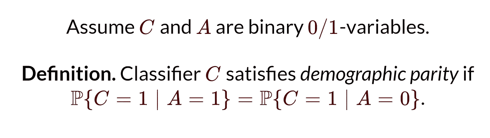
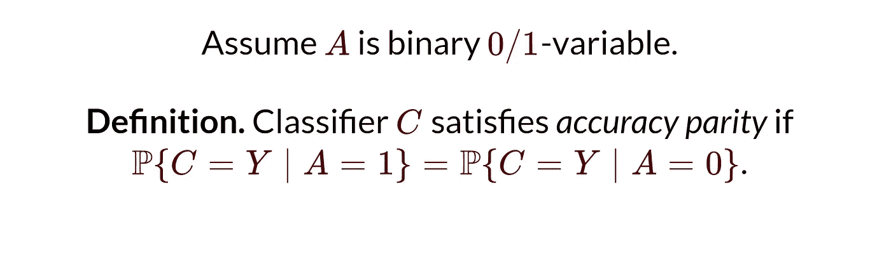
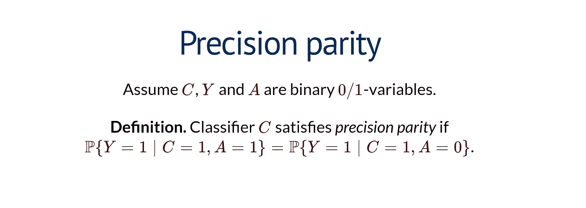
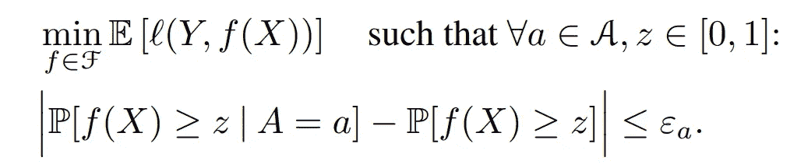
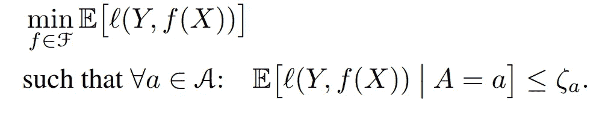

# 为什么 AI 公平性在电信个性化中很重要

> 原文：<https://pub.towardsai.net/why-ai-fairness-is-important-in-telecom-personalization-e6aa876a7d02?source=collection_archive---------0----------------------->

## 个性化是电信业的游戏名称

图片来自 [Pexel](https://www.pexels.com/photo/broadcast-tower-94844/)

在过去的两年里，我一直在巴基斯坦一家大型移动运营商的个性化和情境营销部门工作。对于不了解的人来说，个性化是根据个人的属性和偏好为他们设计产品、推荐和广告。

电信是一个寡头垄断市场，几乎没有产品差异。移动数据、分钟和短信可以被认为是商品。为客户和企业增加价值的一种方式是为群体或个人构建个性化产品。通过使用机器学习和统计分析等工具来实现个性化。然而，正如我将在这篇文章中解释的，如果不加以检查，个性化可能会对个人和整个社会产生不利影响。

# 你说的‘AI 公平’是什么意思？

与一些人认为的相反，人工智能或统计模型并没有摆脱偏见或做出歧视性预测或建议。所有模型都代表了基于一组变量的数据的统计近似值，作为建模者，我们认为这些变量可以预测我们感兴趣的事物。通过选择建模者认为具有预测性的属性，并测量他们认为合适的数据，建模者通常会做出反映他们信念的选择。此外，数据本身可能反映出对一个群体的历史特权或歧视。

AI 公平是研究算法如何对待人群。试图减少他们对一组受保护群体或性别、种族、原籍国和疾病等属性的掠夺性或歧视性。假设我们认为成为某个群体的一部分不会或不应该成为算法预测或做出导致不利结果的决定的基础。例如，与具有“相似”属性的白人相比，信用评分算法将较低的信用评分分配给黑人是“不公平的”。引号表示这取决于相似和公平的定义。

***喜欢这个故事吗？有一个数据科学问题，需要专家来解决？考虑招聘***[***me***](https://www.upwork.com/ab/flservices/workwith/naivebayesian)***！***

## 群体公平在数学上是如何定义的？

虽然有很多方法可以将公平定义为一个数学概念，但下面是一些最常见的方法，摘自 [CS 294:机器学习中的公平，加州大学伯克利分校，2017 年秋季](https://fairmlclass.github.io/)

**分类公平性:**

**人口均等:**

图片来自[公平类](https://fairmlclass.github.io/1.html#/23)

简单解释，人口统计奇偶校验是指当一个个体来自 A 组=0 或 A 组=1 时，某个分类算法预测真实(C=1)类的概率是相同的。其中 A 可以代表任意类型的保护组，如性别。

**精确度奇偶校验:**

图片来自[公平类](https://fairmlclass.github.io/1.html#/23)

直观上，当一个人的属性 a=0 或 a=1 时，分类器以相同的概率分配所有类别(由 Y 表示)时，它是精确奇偶公平的。例如，大学录取算法接受、拒绝或等待名单，每一项对于男性或女性都有相同的概率。

**精确奇偶校验**

图片来自[公平类](https://fairmlclass.github.io/1.html#/23)

假设分类器预测个体来自真实类，当个体来自真实类的概率时，分类器是精确奇偶公平的；对于属性 A=0 或 A=1 的个体是相同的。以决定预测一种罕见疾病的算法为例。医生只被允许给预计会患病的病人用药。如果我们希望这个算法在精确对等的情况下是公平的，那么在所有受保护的群体中，患有该疾病和被预测患有该疾病的人的比例应该是相同的。

对于分类问题，有许多新颖的和用例特定的公平性定义。上述定义包括一些最广为人知和最常用的定义。

**回归的公平性:**

**统计奇偶校验:**

图片来自[微软研究院](https://www.microsoft.com/en-us/research/uploads/prod/2019/11/agarwal19d.pdf)

对于回归问题，建模者试图最小化观测值分布(Y)和预测值分布(f(x))之间的预期损失。为了保持统计奇偶性，我们根据受保护属性 A 的条件 CDF 不偏离无条件 CDF 阈值ε的约束来最小化损失。

**有界群损失:**

图片来自[微软研究院](https://www.microsoft.com/en-us/research/uploads/prod/2019/11/agarwal19d.pdf)

有界群损失意味着对于每个受保护的属性 a，损失函数低于某个阈值。例如，我们可能需要一个回归来预测所有受保护群体(如种族)的房价至少有 2500 美元的 RMSE。

**你喜欢读这个故事吗？想要编码帮助？考虑成为赞助人！**

 [## 阿尔斯兰·沙希德|帕特里翁

www.patreon.com](https://www.patreon.com/user/membership?u=78117613) 

# 电信的个性化是什么意思？

考虑到 GSM 服务是商品，在电信中使用两大类来实现产品差异化:

1.  **价格差异**:你以不同于直接竞争对手的价格点向客户提供服务。如果你的服务更便宜&每个网络都有相同的服务质量，你就有可能赢得市场份额。
2.  **网络差异化:**一部分客户总是愿意为更好的质量支付更高的价格。在电信行业，质量完全取决于该地区的频谱分配和网络存在。例如，巴基斯坦的每个电信运营商都标出了他们提供最佳服务的区域。通常，从该地区覆盖最广的运营商那里购买服务是最有意义的。

个性化可以帮助电信公司在个人层面上通过价格或网络实现产品差异化。例如，您可以将不同的 GSM 产品捆绑在一起，就像您可以向更倾向于使用数据但不太使用电话或短信的客户提供“平均”捆绑价格，他们的数据有补贴，但语音收费更高。

# **个性化是如何实现的？**

以下是电信行业中用于实现个性化的一些技术和方法(并非详尽无遗)。

1.  **动态定价:** GSM 服务根据单个客户愿意支付的价格进行捆绑。差异化定价可以使客户获得基于其特定需求和预算的产品。

**2。产品推荐:**推荐引擎用于向客户提供现有的预包装产品

**3。折扣:**现有电信产品或服务的个性化折扣。通常基于一个衡量标准，即如果我们给予客户折扣，他们可以带来多少额外价值。

**4。地理位置/人口定价**:对于大多数运营商来说，每个地方的电信服务并不相同，网络质量也因基础设施和用户数量的不同而不同(每个基础设施的用户越多，服务质量就越低)。把你的服务质量作为一种手段，向有意愿的客户多收费，这是有道理的。

5.**网络个性化** : [沃达丰的网络个性化服务](https://www.vodafone.com/what-we-do/technology/network-as-platform-naap/personalising-network)就是一个很好的例子。这包括根据客户偏好进行的所有此类网络调整或服务。

# 将电信个性化与不公平联系起来

合并个性化时可能违反公平原则。

1.  **歧视性定价**:动态定价技术中的标准方法根据用户的使用情况向用户提供捆绑包，但是如果受保护的群体居住在网络已经拥塞的地区或地方，他们可能会面临价格歧视。由于网络拥塞，他们可能会使用较少的数据或语音，这将使动态定价算法向这些用户推荐昂贵的套餐。第三世界国家的欠发达地区比发达城市中心的人均基础设施更少，这使得他们更容易以更高的价格获得质量更差的服务。
2.  **不利产品推荐:**在电信行业，个性化推荐系统使用之前的购买历史、频率和货币价值作为关键指标来创建推荐。在创建推荐时，他们还可能包括网络数据、朋友和家庭圈子以及其他各种各样的因素。投资组合中的一些产品可能被认为是“掠夺性的”，因为它们可能向客户提供次优数量的资源；可能会有其他产品以更低的价格为客户提供更高的价值。
3.  **优惠网络服务:**网络个性化往往利用一个客户的消费习惯和他们对服务的满意度，在网络上给予他们优惠待遇。一些民族在历史上处于不利地位，经济也不太繁荣。一种网络个性化机制可以给已经富裕的群体提供良好的服务，并歧视经济上不太富裕的群体。

# **结论**

统计模型和人工智能系统的公平性正在成为每个行业和用例的关注点。电信个性化是为企业和客户增加价值的一个巨大途径。获得电信服务是经济繁荣的先决条件，因为许多服务需要可靠的互联网连接或移动电话。致力于实现电信个性化的人们需要让他们的模型“公平”。