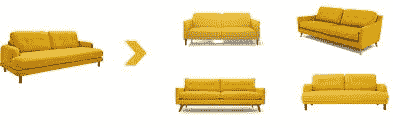
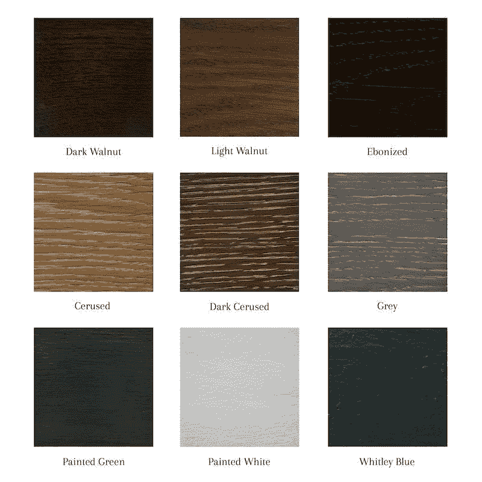

# 为什么人工智能不是魔杖

> 原文：<https://pub.towardsai.net/why-ai-is-not-a-magic-wand-ee172545cecf?source=collection_archive---------0----------------------->

## 推荐系统用例概念验证

# 任务:概念验证(谨慎对待)

我最近参与了一个 ML 项目，其中的任务是建立一个推荐系统(*记住，这是一个概念验证*)。一个推荐用户材料的系统最终也会根据他们的社交媒体数据(如 Pinterest、Instagram 等)来完成家具。目标用户群主要是 A & D 社区(建筑师和室内设计师)。

*基本用例:*用户上网，上传他们喜欢的材料的房间、家具或空间**的图像，并找到该公司提供的类似饰面。**

典型的家具推荐系统

啊，我多么希望这个问题像上面的图片一样简单。事实并非如此，因为需要推荐的不仅仅是家具，还有家具、墙壁、物品等表面的装饰。例如，上图中沙发顶部的“黄色材料”。

## 资源和时间表

> *交付物:原型*
> 
> *资源:1 名开发人员*
> 
> *时间表:3 周*

## 先决条件

要构建推荐模型，首先需要一个完美的数据集。客户拥有的数据层不是非常复杂，并且许多数据没有清楚地标记相关的特性和属性。

> 数据质量和完整性非常重要。毕竟，你的模型和你的数据一样好。

考虑到数据集、时间轴和手头的资源，人们对人工智能模型的期望将是，它在基于简单输入图像进行相似性搜索方面显示出一些前景。

## 初始原型

鉴于我是唯一的开发人员，构建概念证明是一个为期 3 周的考验，我决定使用 MLaaS(机器学习即服务)模型，而不是从头开始构建模型(废话！因为从头开始构建模型需要更长的时间)。考虑到输入类型的复杂性，这是一项繁琐的任务。

**输入类型:**

1.  材料/表面图像(典型的室内设计师、消费者)

2.房间或空间的情绪板(由多种饰面组成的一幅图像)

3.一间堆满了有材料/饰面的物品的房间

模型的工作流程——输入(x)被输入到一个模型中，该模型将运行图像识别，从图像中分离出【T14’n’个对象，然后将每个相应的对象图像(x’，x”)输入到另一个模型中，该模型将在数据库(由数千个成品组成)中运行视觉相似性搜索。输出将是基于相似性得分或准确性与输入图像匹配的所有饰面。

**AI——魔杖，不是吗？**

总的来说，客户对模型的结果很满意，说它很“聪明”。

然而，尽管警告他们该模型对于复杂的输入类型(如输入#3)会如何，他们仍然对该模型能够公正地处理这些输入抱有一些期望。即使知道他们提供的数据充满了看起来像输入#1 的图像。

## 构建人工智能产品的要点

1.  人工智能或机器学习驱动的模型**不是魔术棒**,你可以期望它们为定制场景提供良好的准确性
2.  推荐系统的数据集**应该被很好地润色，并且有在不同角度拍摄的每个产品的大量图像**，在这种情况下是光照条件&环境
3.  **为外卖#1 建立 ML 模型花费了大量的时间、计算资源和测试**以使产品接近生产就绪。首先要确保你有足够的资源来建造它
4.  我们需要**大幅降低我们对人工智能的期望**
5.  *最后，**如果我，作为一个人，不能理解输入#3** 和所需的输出(饰面/材料)可能是什么，那我们期望一个基本模型能做到这一点就太天真了。*

*如果您想了解更多关于我为这个原型设计和构建的工作流的信息，请随意在评论部分留下您的经历。*