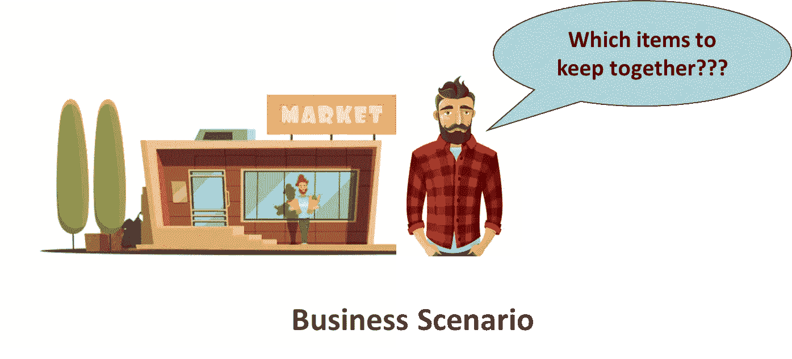
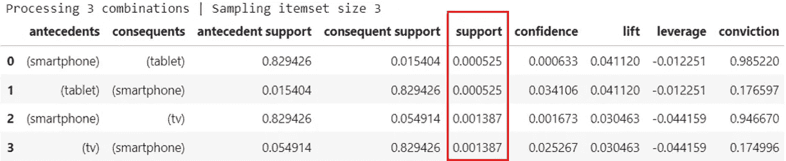
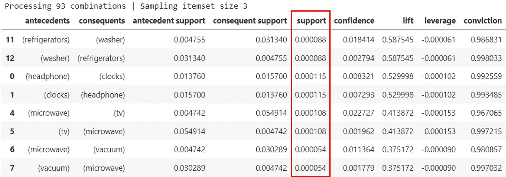
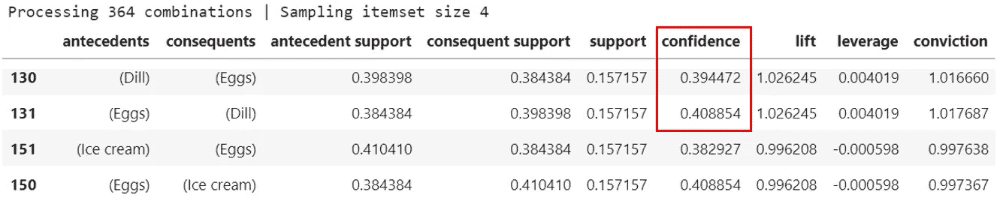
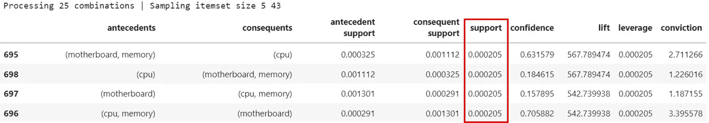

# 为什么 Apriori 算法不适用于所有类型的产品/店铺？

> 原文：<https://pub.towardsai.net/why-apriori-algorithm-is-not-applicable-for-all-types-of-products-stores-78d8ecab19c4?source=collection_archive---------2----------------------->

在进行购物篮分析时，Apriori 算法是最受欢迎的工具。但是，它并不适用于所有类型的产品或商店。

> 作者的说明
> 
> 亲爱的读者，在你阅读我们的文章之前，请注意，我们假设你对购物篮分析和 Apriori 算法有一个大致的了解。如果没有，我们建议你看看下面这篇由 [Eliana Grosof](https://medium.com/u/53b19b48ce18?source=post_page-----78d8ecab19c4--------------------------------) 撰写的 7 分钟快速文章。感谢您的时间和兴趣！

 [## Apriori 机器学习算法，讲解

### 用于生成推荐的强大而简单的 ML 算法

medium.com](https://medium.com/data-explained/apriori-machine-learning-algorithm-explained-a19453395905) 

图片来源:[https://intelli paat . com/blog/data-science-apriori-algorithm/](https://intellipaat.com/blog/data-science-apriori-algorithm/)

# 目的

我们开始这项研究的目的是寻找一些现成的关联规则。这种意图是由我们遇到的其他著名规则推动的，如[啤酒、尿布]或[啤酒、台扇]。然而，通过这项研究的过程，我们最终意识到 Apriori 并不适用于所有类型的数据集。我们还学到了一些惊人的概念和技术，可以使进行购物篮分析的过程变得相当容易。

# 使用的数据集

我们使用了包含电子商务电子平台的事件数据[查看、添加到购物车、购买]的数据集，包括所有电子品牌。目的是确定影响几种产品购买的不常见规则。由于三星和苹果合计占数据的 57%，我们只关注这些品牌的购买行为。

## 链接到数据集

**电子商务平台数据集:** [*来自多品类店铺的电子商务行为数据| Kaggle*](https://www.kaggle.com/datasets/mkechinov/ecommerce-behavior-data-from-multi-category-store?select=2019-Oct.csv)

**杂货店数据集(本文稍后介绍):** [购物篮分析数据| Kaggle](https://www.kaggle.com/datasets/ahmtcnbs/datasets-for-appiori)

# 本文的关键术语

“交易”是指购买一件或多件物品。每个“事务”都有一个唯一的用户会话 ID。

“购买”指的是仅购买该项目的一个数量。多个“购买”可以有一个公共的用户会话 ID。

# 旅行

在删除“view”和“add-to-cart”记录后，我们假设数据集中的每一行都与该商品的一次购买相关。这些单独的购买按用户会话 id 分组，导致不同的交易。

我们使用 python 上的 Apriori 算法分别对苹果和三星进行了购物篮分析。由于许多单项交易，我们不得不将指标阈值减少到小数点后几位。

用于为先验关联规则生成器定义函数的代码

对 Samsung 数据集运行 Apriori 算法的代码

使用较低支持阈值在 Samsung 数据集上运行 Apriori 算法的代码

结果，我们所有的度量值都非常低，我们无法在任何两个给定的项目之间找到任何重要的关联规则。为了验证我们的方法是正确的，我们在杂货店数据集上运行了相同的代码，特别是对于购物篮分析。

# 结果

我们知道信心是如何计算的，但我们无法摆脱这样一种感觉，即如果购买了商品 A，信心只是对商品 B 被购买的可能性的任意衡量。例如，我们发现如果先购买“莳萝”,则购买“鸡蛋”的置信度为 0.39。同时，如果首先购买“鸡蛋”，则购买“莳萝”的可能性大约为 0.41。

为杂货数据集生成关联规则的代码

因此，信心并不总是判断商品 B 被购买的机会是否依赖于商品 a 的购买的确定措施。此外，如果任何两个给定商品的 lift 值相同，则商品的购买顺序不应该有所不同。

为了便于改变结果，我们回到了原始数据集，并删除了所有的单个事务。这次我们包括了所有品牌的交易，而不仅仅是苹果或三星。

该算法返回具有大量提升值和显著置信度值的规则。令人惊讶的是，对于许多具有不同项目集的不同规则，支持度为 0.000205(仅供参考，所有规则中最高的支持度值)。我们意识到这些项目集只是相同购买的不同组合，代表相同的交易。在总共 58435 项交易中，只有 12 项交易的支持度为 0.000205，因此无法在这些项目之间建立重要的关联规则。

# 结论

我们的结论是，Apriori 算法并不适用于所有类型的数据集。它适用于有很大机会一起购买多种产品的地方，例如，在杂货店或运动器材商店或百货商店等。由于电子产品是非常昂贵的物品，所以很少有同时购买多种产品的交易。因此，在这种情况下，Apriori 对于发现重要的关联规则是没有用的。

此外，即使在先验适用的情况下，要考虑的最重要的度量是支持度，因为高支持度值表示给定产品组合的高交易数。然后，如果提升值大于 1，我们可以得出结论，关联规则是重要的，我们可以进一步探索这一点，以获得更大的收入。

要查看该项目的详细代码，请访问[OneByyTwo/A _ Apriori-Projec](https://github.com/OneByyTwo/A_Apriori-Project)t。

您可以在 LinkedIn 上通过[Vaibhav Gupta](https://www.linkedin.com/in/vgupta12/)&[Nishit Vyas](https://www.linkedin.com/in/nishit-vyas-454581122/)与我们联系，或者发送电子邮件至 [OnyByyTwo](http://onebyytwo@gmail.com/)