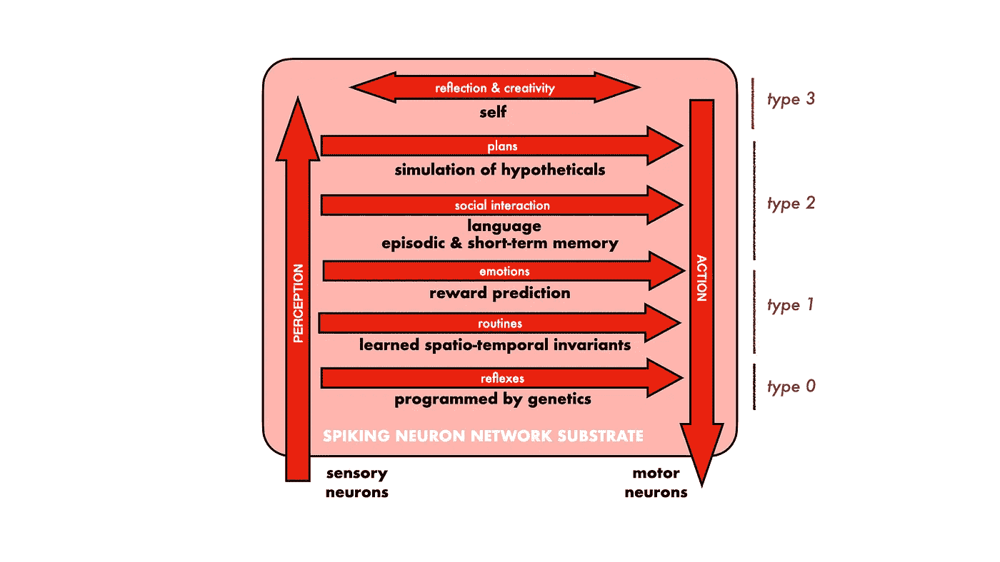
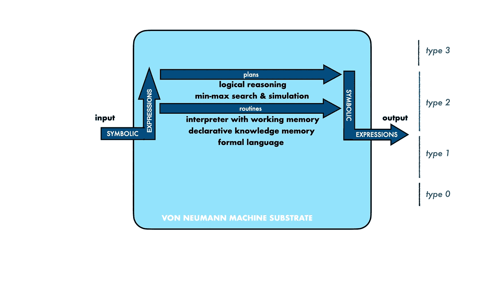
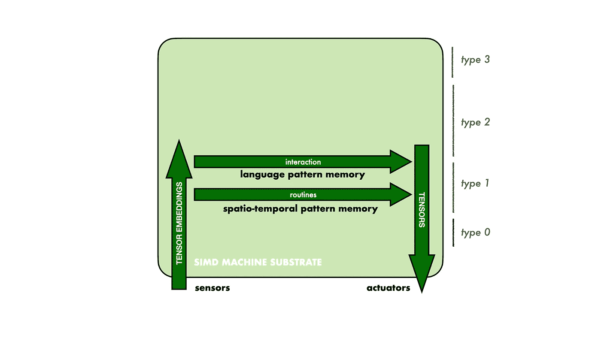
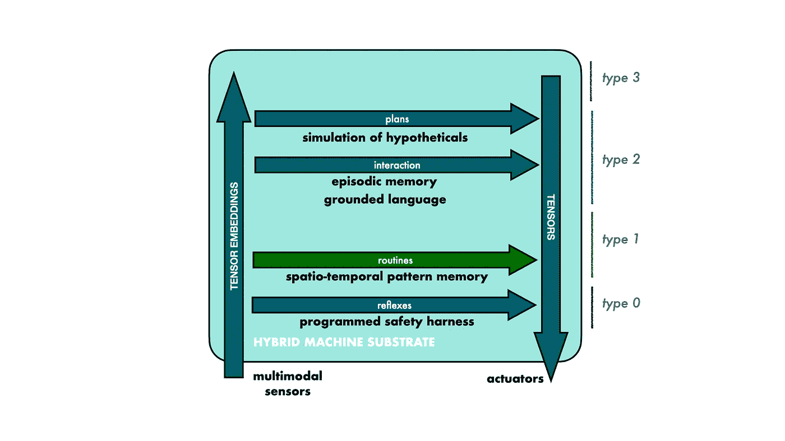

# 为什么我们如此害怕人工智能？

> 原文：<https://pub.towardsai.net/why-are-we-so-afraid-of-ai-5f9a60bdd27?source=collection_archive---------5----------------------->

## [意见](https://towardsai.net/p/category/opinion)

由[安德烈·木桐](https://unsplash.com/@andremouton?utm_source=medium&utm_medium=referral)在 [Unsplash](https://unsplash.com?utm_source=medium&utm_medium=referral) 上拍摄的照片

我们人类已经成为“我们”星球上的主导物种。我们害怕任何东西或任何人，太强大或与我们不同——新兴的人工通用智能(AGI)有多另类，我们如何可能避免或克服这样的威胁？

另一方面，我们本能的支配欲意味着我们人类的行为不考虑后果。我们制造核武器，我们耗尽并污染我们的环境，我们利用他人的弱点。我们都知道这一点，这让我们害怕自己的影子！AGI 会成为一个更强大甚至更可怕的我们吗？

第三个视角——人类社会正在变得更加和平、公平、公正和宽容。智能机器会帮助我们维持和平吗？它们会把我们从长途跋涉和贫困中解放出来吗？

最后——自从计算机早期被称为“电子大脑”以来，人工智能技术一直被过度宣传。我们是不是又经历了一个可以忽略的炒作周期？

为了弄清楚我们的立场，让我们首先反思一下作为智能生物机器的我们自己。有了这个基准，我们可以更好地了解自己，并与可能出现的机器智能进行比较。通过这样做，我们得出了惊人的结论！

图 1 —人类认知架构草图

# 人类智力

如图 1 所示，我们通过感觉神经元感知我们的环境(包括我们自己身体的状态)，我们通过运动神经元行动。我们的智力，或智力的缺乏，是当感知的感官信号被我们的生物神经网络处理，产生或多或少令人印象深刻的当前和未来行动时发生的事情。

我们可以区分经过数百万年进化发展的处理/思维水平。进化在很大程度上是一个保守的过程，当新的结构被覆盖时，似乎保留了更古老的结构。从最古老的地层开始，一直到我们现在的位置:

> 0 级— *在发育过程中，我们的基因会产生本能的反应。在我们的一生中，这些神经回路在功能上只有极小的改变。*
> 
> 第 1 级— *高度并行学习和利用对生存有预测能力的时空模式。这里的学习信号是期望和随后的基本事实的不匹配。这里也有激励我们的价值信号，我们以情感的形式体验。*
> 
> 第二层次*——*由表示实体、性质、数量、感觉、关系和过程的符号(能指)组成的表情的注意力集中处理。这使得人类成为一种强大的超级有机体，能够跨越时空在个体之间传递信息。**
> 
> *第三级— *我们能够在没有相应外部数据(扩展)的情况下，组合(想象)假设的实体、情境、过程和其他内涵。这使得自我参照思维成为可能，并使我们成为强大的个体创造引擎。**

**

*图 2——符号人工智能*

# *符号人工智能(专家系统)*

*布尔逻辑电路和存储寄存器是制造计算机的材料，是算术计算和其他符号运算的理想材料。符号人工智能是对这种计算基础进行编程的实践，以模拟遵循规则的符号重写系统的操作，如*谓词演算*和*产生式系统*。值得注意的是，相反，人类的计算基础(随机神经元和有限短期记忆的网络)对符号计算的模拟非常差。*

*在 20 世纪下半叶，人工智能一词被用来指以输入符号表达式的形式表示“知识”并对其进行处理以产生输出符号表达式的实践。这个*象征性的(好老式 AI)* 传统如图 2 所示。这里我们也用基准模型的 2 型思维来说明它。*

*人们发现，象征性人工智能存在严重缺陷，最终导致在世纪之交大约十年左右的时间里，研究资金受到抑制。发现的主要缺点是:*

> *基础化— *当符号语言的符号指的是感兴趣的世界的元素，并且它的陈述对应于那个世界的实际和潜在状态时，它就成为一种有用的工具。符号人工智能不提供这种所指实体、过程和语义解释的表示。**
> 
> *学习— *符号人工智能依赖于用正式语言表述的*知识库，而不是学习。对这样的知识库进行编码和验证的专家*的稀缺可用性被称为*知识获取瓶颈*。**

**

*图 3 —连接主义人工智能*

# *连接主义人工智能(神经网络)*

*连接主义者 AI 是上述象征传统的另一种选择。在这里，我们对计算机硬件的电路和存储单元进行编程(或以其他方式安排),以模拟神经元样元件网络的操作。自 20 世纪 40 年代以来，这种方法一直被专注的研究人员所追求。值得注意的是，传统的冯·诺依曼计算机不太适合有效地模拟生物神经系统。并且追求许多简化和替代。*

*术语*深度学习*和*深度神经网络(DNNs)* 经常被用来指连接主义人工智能范式的当前化身。这里强调三个关键原则:*

> *表示— *多维数字向量(张量)用于表示所有数据和状态。**
> 
> *处理— *部署了大量非线性神经元样元素层，以提高建模能力。**
> 
> *学习— *使用*反向传播*算法对数据中的模式进行统计学习，用于在网络的静态中嵌入长期记忆(权重)。**

*图 3 展示了与我们的基准架构相关的 DNN 功能。相对于符号人工智能，DNNs 是一种自下而上的 1 型技术，可以接受多模态感官输入(图像、音频、触摸等)。)和驱动致动器(扬声器、显示器、运动等)。)无需复杂的编码和解码。*

*DNNs 的应用正在启动一场新的工业革命，将机械动力和计算结合起来，生产出能够执行以前需要人类甚至超人努力才能完成的任务的自适应机器。巨大的经济机会正在推动研究和开发，以克服当前模型和实践的局限性。核心的、直接的问题和相关的机会是:*

> *语言— *语言和其他符号表达用于携带关于某个参考领域的信息。当前的连接主义体系结构不能利用这种关键能力。**
> 
> *情景记忆— *当前模型没有足够的机制来识别和表示数据中的非平稳性。**

**

*图 4 —未来的 AGI*

# *人工通用智能(AGI)*

*假设图 1 的参考图式是有意义的，很明显我们离复制类人思维还很远。也就是说，努力理解和设计智能是我们探索人类是谁和我们对未来有什么选择的旅程的一部分。*

*图 4 展示了一种可行的、有前景的自主机器架构，涵盖了 0 型、1 型和 2 型特征。我们可以期待安全、自主的机器，它们可以通过阅读指令来学习新技能，执行有用的工作，甚至娱乐我们。*

> *安全— *我们将纳入政策以确保安全决策和故障安全行为。即使在一些明显的失败之后，电传操纵飞机安全的经验表明，这种程序化的安全带是可行的。**
> 
> *语言— *为机器提供基于参考的自然语言可能是我们现在准备接受的最令人兴奋、回报最高的挑战。**
> 
> *情景记忆——*基于符号的数据表示将使记忆结构更有效、更有表现力，以应对世界的复杂性，世界的部分模型不断得到改进。**
> 
> *假设— *即使是机器也需要幻觉出可能的世界，并延迟“满足感”,以制定连贯协调行动的计划。**

*自主机器可以用来解放我们，也可以用来奴役和毁灭我们。这些机器本身没有议程，议程是由我们决定的。如果我们害怕，我们害怕的是我们自己！*

**

*图 5 —反射*

*图 5 所示的“智能的暗物质和暗能量”仍然相对于图 1 的人类基准。在“自我”、“动机”、“情绪”以及与之相关的“感觉”、“特质”、“觉知”和“意识”这些词背后隐藏着什么？我们似乎连回答这类问题所需的概念都没有。也许和人工智能一起，我们会发现一些答案？*