# 为什么选择随机森林而不是决策树

> 原文：<https://pub.towardsai.net/why-choose-random-forest-and-not-decision-trees-a28278daa5d?source=collection_archive---------0----------------------->

## [机器学习](https://towardsai.net/p/category/machine-learning)

## 决策树和随机森林简明指南。

***决策树*** 属于 ***家族的监督分类算法*** 。它们在*分类*问题上表现相当好，决策路径相对容易解释，算法快速简单。

**决策树的集合版本是随机森林。**

# 目录

1.  **决策树**

*   *决策树介绍。*
*   *决策树是如何工作的？*
*   *决策树从零开始实现。*
*   *决策树的优点&缺点。*

**2。随机森林**

*   *随机森林简介*
*   *随机森林是如何运作的？*
*   *随机森林的 Sci-kit 实施*
*   *优点&缺点随机森林。*

# 决策树

## 决策树介绍

决策树是由节点和分支组成的简单的**树状结构**。在每个节点上，数据根据任何输入要素进行分割，生成两个或更多分支作为输出。这个迭代过程增加了生成分支的数量，并对原始数据进行了分区。这种情况一直持续到生成一个节点，其中所有或几乎所有的数据都属于同一个类，并且不再可能进行进一步的拆分或分支。

这整个过程生成一个**树状结构。***第一个拆分节点*称为*根节点。*末端节点被称为叶子，并且与类别标签相关联。从根到叶的路径产生分类规则。

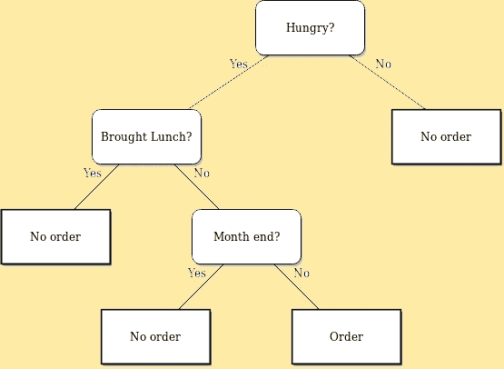

假设，你是一名员工，你想吃加工食品。

你的行动将取决于几种情况。

如果你不饿，你就不会在瘾君子身上花钱。但是如果你饿了，那么选择就会改变，你的下一步行动取决于你的下一个环境，也就是说，你有没有买午餐？

现在，如果你不吃午饭，你的行动将完全取决于你的下一次选择，即它是不是月底？如果是这个月的最后几天，你会考虑不吃饭，否则你不会把它作为一种偏好。

当做出任何决定涉及到几个选择时，决策树就发挥作用了。现在你必须做出相应的选择，以获得一个有利的结果。

基于树的学习算法被认为是最好的和最常用的**监督学习**方法之一。基于树的方法使预测模型合法化，具有更好的*准确性、稳定性和易于解释。*与同代人不同，他们也擅长处理非线性关系。决策树算法被称为 **CART** **(分类和回归树)**。

## 决策树是如何工作的？

决策树有两个组成部分:

*   **熵** —它被认为是系统的**随机性。它是节点纯度或杂质的度量。**

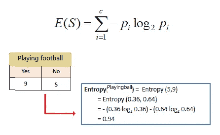

**当 p = 0.5 时熵最大，即两个结果具有相同的偏好。**

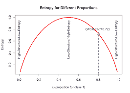

*   **信息增益—** 是熵的**减少。**是起始节点的不确定性和两个子节点的加权杂质之差。

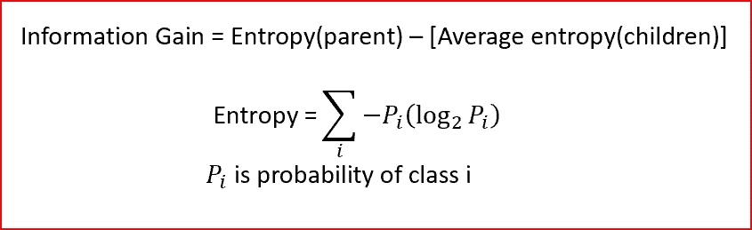

它帮助我们找到决策树的根节点，具有最大**信息增益的节点被视为根节点，因为它具有最大的不确定性。**

我们将首先分割具有**最高信息增益**的特征。这是一个递归过程，直到所有子节点都是纯的，或者直到信息增益为零。

> ***决策树的目标*** *:最大化信息增益，最小化熵*

假设我们有一个 60 名学生的样本，有三个变量*性别*(男孩/女孩)*班级* (XI/十二)，W *八* (50 到 100 公斤)。这 60 人中有 15 人在闲暇时间踢足球。现在，我们想创建一个模型来预测谁会在空闲时间踢足球？在这个问题中，我们需要根据三者之间的一个非常重要的输入变量来划分闲暇时间踢足球的学生。

这就是决策树发挥作用的地方，它将根据三个变量的所有值对学生进行分类，并确定变量，从而创建最佳的同质学生集。

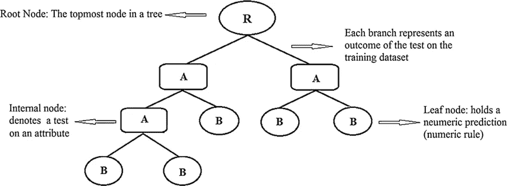

使用决策树，我们可以很容易地解决我们的问题，并根据学生的特点对他们进行分类，如他们是否喜欢在闲暇时间踢足球？

## 从零开始实现决策树

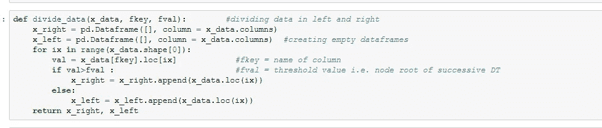

将数据分成不同的部分

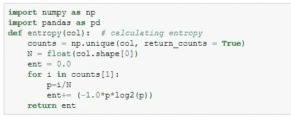

计算熵

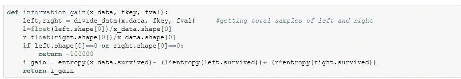

计算信息增益

**Sci-kit 学习实现**

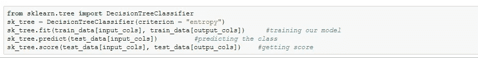

**可视化你的决策树**

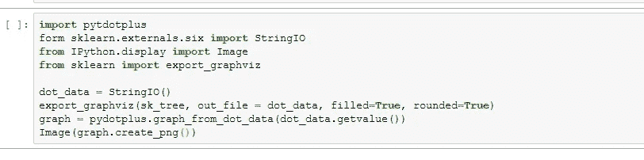

## 决策树的利与弊

**优点**

*   容易理解
*   很好地处理分类数据和连续数据。
*   适用于大型数据集。
*   对异常值不敏感。
*   本质上是非参数的。

**缺点**

*   这些容易过度拟合。
*   它可能非常大，因此需要修剪。
*   不能保证最优的树。
*   与其他机器学习算法相比，它对数据集的预测精度较低。
*   当有许多类变量时，计算会变得复杂。
*   高方差(模型会随着训练数据的变化而快速变化)

# 随机森林

## 随机森林简介

随机森林是另一种强大且最常用的**监督学习**算法。它允许从**超大型数据集中快速识别重要信息。**随机森林的最大优势是，它依靠**各种决策树的集合**来得出任何解决方案。

这是一个**集成算法**，其中考虑了一个以上相同或不同种类的分类算法的结果。

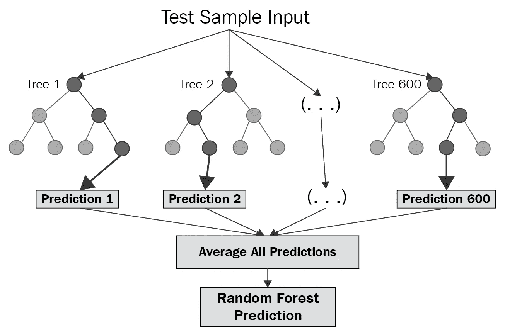

[随机森林，来源](https://www.oreilly.com/library/view/tensorflow-machine-learning/9781789132212/d3d388ea-3e0b-4095-b01e-a0fe8cb3e575.xhtml)

假设你想去度假，但对目的地感到困惑。所以你决定向你的朋友*拉克沙伊*寻求建议。拉克沙伊会问你上一次的假期，你是否喜欢，你在那里做了什么。为了得到精确的结果，他甚至会询问你的偏好，并根据你的评论向你提供建议。在这里，Lakshay 使用决策树技术为你提供基于你的回答的反馈。

但是你认为 Lakshay 的建议有点偏颇，你问了 Meghna(你的另一个朋友)，同样的问题。她也提出了建议，但你再次认为这是一个冒险的选择。你重复了这个过程，问了“n”个朋友，同样的问题，现在你到了朋友推荐的一些常见的地方。你收集所有的投票并汇总。你决定去票数最多的地方。这里，你使用了随机森林技术。

在决策树中，**你越深入，就越容易过度拟合，因为你对数据集越指定。因此，Random Forest 通过向您展示决策树通过随机性实现的简单性和准确性来解决这个问题。**

随机森林=决策树的简单性*随机性带来的准确性

## 随机森林是如何工作的？

假设我们的数据集中有“ *m* 特征:

1.  随机选择" *k"* 特征满足条件 *k* < *m.*
2.  在 *k* 个特征中，通过选择具有*最高信息增益的节点来计算根节点。*
3.  将节点拆分成子节点。
4.  重复前面的步骤 *n 次*。
5.  你最终会拥有一个由 n 棵树组成的森林。
6.  执行*引导*，即将所有决策树的结果组合在一起。

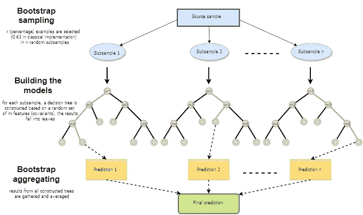

[来源](https://www.mql5.com/en/articles/3856)

## 随机森林的 Sci-kit 实现

## 随机森林的利与弊

**优点:**

*   对异常值稳健。
*   适用于非线性数据。
*   降低过度拟合的风险。
*   在大型数据集上高效运行。
*   比其他分类算法更准确。

**缺点:**

*   发现随机森林在处理分类变量时是有偏差的。
*   缓慢的训练。
*   不适合具有大量稀疏特征的线性方法

# 结论

希望这篇文章能帮助你以最好的方式理解决策树和随机森林，并帮助你实际使用它。

一如既往，非常感谢你的阅读，如果你觉得这篇文章有用，请分享！

请随意连接:

> *LinkedIn ~*[*https://www.linkedin.com/in/dakshtrehan/*](https://www.linkedin.com/in/dakshtrehan/)
> 
> *insta gram ~*[*https://www.instagram.com/_daksh_trehan_/*](https://www.instagram.com/_daksh_trehan_/)
> 
> *Github ~*[*https://github.com/dakshtrehan*](https://github.com/dakshtrehan)

关注更多机器学习/深度学习博客。

> *中等~*[*https://medium.com/@dakshtrehan*](https://medium.com/@dakshtrehan)

# 想了解更多？

[利用深度学习检测新冠肺炎](https://towardsdatascience.com/detecting-covid-19-using-deep-learning-262956b6f981)

[无法逃脱的人工智能算法:抖音](https://towardsdatascience.com/the-inescapable-ai-algorithm-tiktok-ad4c6fd981b8)

为什么你要为乔治·弗洛伊德的谋杀和德里的骚乱负责？

[聚类:它是什么？什么时候用？](https://medium.com/@dakshtrehan/clustering-what-it-is-when-to-use-it-a612bbe95881)

[从 k 个最近邻居开始你的 ML 之旅](https://medium.com/@dakshtrehan/start-off-your-ml-journey-with-k-nearest-neighbors-f72a122f428)

[朴素贝叶斯解释](https://medium.com/swlh/things-you-never-knew-about-naive-bayes-eb84b6ee039a)

[激活功能说明](https://medium.com/analytics-vidhya/activation-functions-explained-8690ea7bdec9)

[参数优化解释](https://towardsdatascience.com/parameters-optimization-explained-876561853de0)

[梯度下降解释](https://towardsdatascience.com/gradient-descent-explained-9b953fc0d2c)

[逻辑回归解释](https://towardsdatascience.com/logistic-regression-explained-ef1d816ea85a)

[线性回归解释](https://medium.com/towards-artificial-intelligence/linear-regression-explained-f5cc85ae2c5c)

[确定最适合您的 ML 模型](https://medium.com/datadriveninvestor/determining-perfect-fit-for-your-ml-model-339459eef670)

> *干杯！*