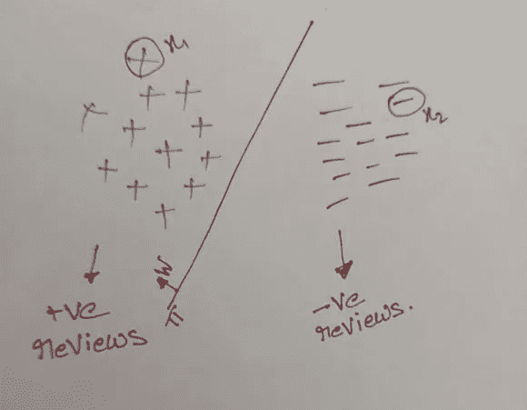
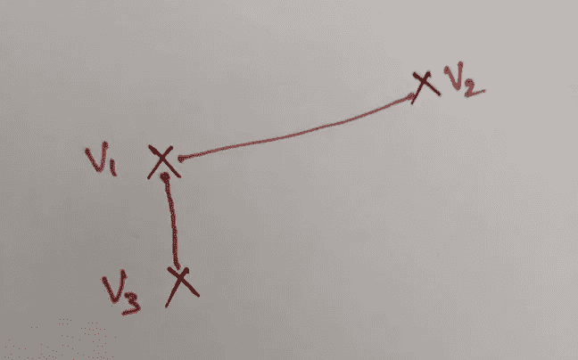

# 为什么要将文本转换成矢量？

> 原文：<https://pub.towardsai.net/why-convert-text-to-a-vector-8b69f714455d?source=collection_archive---------1----------------------->

## [数学](https://towardsai.net/p/category/mathematics)

如果你用某种方法把任何东西(文本)转换成矢量，我们就可以使用线性代数的力量。但是要考虑的主要问题是如何将文本转换成矢量？这样你就可以利用线性代数的力量来解决问题。

**如何将文本转换成矢量？**

这里的文本指的是单词和句子，向量指的是数字向量。例如，我们正在复习一篇课文，目的是把它转换成一个 d 维向量。

***图 1。d 维空间中评论的表示***

从上图可以看出

*+—d 维空间中的正面评论表征。*

*_—d 维空间中的负面评论表征。*

**继续看符号:**

*wTx —表示 w 转置 x ( w 上标 T 乘以 x)。*

*xi* —表示一个点( *x S* 下标 *i* )。

*ri* —表示审查(*r S*subscript*I*)。

*vi* —表示向量(*v S*subscript*I*)。

考虑所有正面和负面评论都在一个 d 维平面中，该平面被一个具有法线 *w* 的平面 *Pi* 分开。让我们假设我们可以找到一个这样的计划，使得所有的正面评论都在飞机的一侧，而所有的负面评论都在飞机的另一侧。通过这个，我们可以说我们找到了一个模型来解决假设的问题。

我们知道，给定平面法线方向上的任意一点 *x* ，那么该点 *x* 的 *wTx* 为正。让我们假设两个点 *x1* 和 *x2* 其中 *x1* 代表正点 *x2* 代表负点。然后

*WTx1* :当点位于平面的法线方向时，WTx1 为正。

*WTx2:* 将为负，因为该点位于法线平面的相反方向。

因此，根据我们的假设，如果我们所有的点都在 d 维空间中，并且如果我们找到一个平面*π*并且垂直于它 *w* 来划分正负点，那么我们可以说，

如果我的 wTxi 为 0，ri 为正，否则 ri 为负。

*在这里，ri 代表任何评论。*

所以，最后，我们把我们的文本转换成一个 d 维向量，并找到一个平面，根据它们的极性来分隔文本。问题是，我们能否以任何方式将文本转换到 d 维空间，或者，在将文本转换成 d 维向量时，有没有一套规则可以遵循。要遵循的最重要的属性(规则)如下:

假设我们有三个评论，即在 d 维空间(向量)中的 *r1、r2、r3* ，每个评论分别具有向量 *v1、v2、v3* 。其中 *r1* 和 *r3* 与 *r1* 和 *r2* 在语义上非常相似(SS)即，

*SS (r1，r3) > SS (r1，r2)*

那么矢量 *v1* 和 *v3* 之间的距离(d)小于矢量 *v1* 和 *v2* 之间的距离。

*d (v1，v3) < d (v1，v2)*

因此，如果评论 *r1、r3* 在语义上更加相似，则向量 *v1、v3* 必定彼此接近。

*图二。d 维空间中矢量的表示*

*SS (v1，v3) > SS (v1，v2)*

其中暗含*长度(v1- v3) <长度(v1- v2)*

也就是说相似的点更近。

这里出现了另一个问题，为什么我们需要我们的向量是封闭的，而不是更远，以断定它们是相似的？

**为什么更近而不是更远？**

让我们再次参考图 1，如果我们所有的正面评价与所有负面评价的距离相比都很近，反之亦然。那么我们就非常容易找到一个把两个评审分开的方案。因此，我们希望类似的审查更接近而不是更远。

因此，下一个问题是我们如何找到一种方法，将文本转换为 d 维向量，使得相似的文本必须彼此更接近(在几何上)。将文本转换为 d 维向量的一些技术或策略有:

1)词袋(BoW)。

2) Word2Vec (w2v)。

3)术语频率-逆文档频率(tf-idf)

4) tf-idf w2v。

5)平均 w2v。

我们将在接下来的博客中讨论这些策略。

谢谢你，快乐学习的人们。