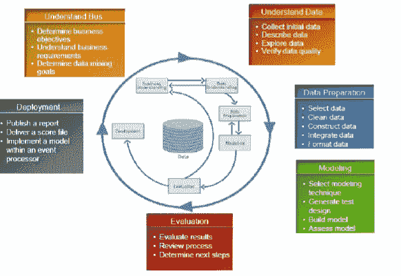
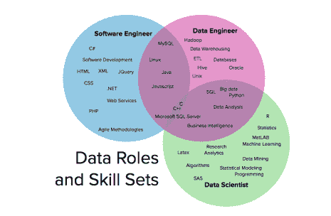

# 数据科学为何蓬勃发展？

> 原文：<https://pub.towardsai.net/why-data-science-is-booming-e240b1a64645?source=collection_archive---------2----------------------->

## [职业生涯](https://towardsai.net/p/category/careers)

## 对他们的企业和整个社会的宝贵贡献

[Towfiqu barbhuiya](https://unsplash.com/@towfiqu999999?utm_source=medium&utm_medium=referral) 在 [Unsplash](https://unsplash.com?utm_source=medium&utm_medium=referral) 上的照片

> ***为什么大家都在学数据科学？***

数据科学家的职位现在是一个很热门的职业。它在市场上具有持久的生命力，并为那些观察统计技术诀窍的人们提供了为他们的企业和整个社会做出宝贵贡献的可能性。

全世界最大的组织是统计技术推动的企业。观察谷歌、亚马逊和脸书。每家公司都使用统计技术来创建算法，以提高消费者满意度并实现利润最大化。

*   谷歌——对网页进行排名，以确保顶部链接能够回答任何问题。
*   亚马逊——主要根据消费者的行为历史和兴趣推荐商品。
*   脸书——有针对性的广告(它们认可你喜欢的体育活动、偏好的价格范围、你喜欢的食物等)促进市场成功

数据科学在大多数行业都有重要应用。大大小小的组织都需要数据科学来做出决策，分析市场趋势，将损失最小化，将利润最大化。

## 分析生命周期

图像[来源](https://www.researchgate.net/figure/Figura-2-Ciclo-das-fases-da-metodologia-CRISP-DM-CRISP-DM-1996_fig2_233843302)

对我们来说，它是一个非常方便(并且经常使用)的工具，可以帮助我们解释什么是数据科学以及我们做什么。

*   首先，它强调了数据科学家应该掌握的许多高级技能。这揭示了数据科学的基本交叉学科(我通常建议一个有效的数据科学家应该拥有大约 80%的这些技能，分散在所有 5 个蓝色气泡中)。这些技能通常可以通过获得前三个气泡之一的学位(重点是定量分析)，然后通过多学科工作和/或高级培训在其他气泡中在职学习来获得。
*   其次，它将数据科学家的个性特征描绘为地图中心的灰色标签。这些态度很难改变，但它们显示了一个数据科学家的世界观。
*   第三，该领域的历史显示在地图上:所有的技能都是在各自的领域创造的(如统计学或人工智能)。数据科学目前是这些人才(来自分析、工程和通信)的独特融合，旨在实现一个目标:从(所有类型的)数据中创造(企业和/或社会)价值。

图像[来源](https://www.researchgate.net/figure/The-definition-of-a-data-scientist-by-means-of-personal-qualities-grey-labels-and_fig1_333750598)

> ***数据科学角色&技能组合***

图像[来源](https://www.quora.com/What-are-some-suggestions-for-a-master%E2%80%99s-thesis-on-the-Semantic-Web)

## **软件工程师**

软件工程师构建包和结构。从设计到编写代码，再到检查和评估，开发人员可能会参与到这种方法的各个阶段。他们正在创造创造事实的产品。软件工程是这三个角色中最古老的，并且已经安装了方法和工具单元。工作包括:

*   前端和后端开发
*   网络应用
*   移动应用
*   运行小工具开发
*   软件布局

## **数据工程师**

数据工程师构建整合、存储和检索来自

通过软件程序工程师创建不同的程序和结构。

数据工程作为软件程序工程中的一个空白技能集出现了。40%的数据工程师曾经是软件程序工程师，这使得这成为数据工程师最常见的专业课程。工作包括:

*   高级数据结构
*   分布式计算
*   并发编程
*   了解新的和先进的工具:Hadoop、Spark、Kafka、Hive 等。
*   构建 ETL/数据管道

## **数据科学家**

数据科学家在数据的基础上构建评估。此外，这还可以通过对团队进行一次性评估的形式来实现，该团队希望更好地了解客户行为，或者让机器了解一组规则，然后通过软件工程师和数据工程师的方式将这些规则应用到代码库中。

工作包括:

*   数据建模
*   机器学习
*   算法
*   商业智能仪表板

> ***五步走如何胜任数据科学***

1.  对大数据充满热情
2.  拥抱实践学习
3.  学习语言，获得真知灼见
4.  向业内人士学习
5.  不断挑战自己

> ***数据科学管道—综述***

**数据分析的五个关键步骤:**

1.  获取:从许多来源获取信息，如 RDBMS 系统、NoSQL 和文档存储、网络搜集、数据湖、HDFS 等。
2.  探索和理解:理解您将要使用的信息以及收集信息的方式，这通常需要大量的探索
3.  争吵、争论和操纵:管道中最耗时且最重要的一步——信息很难达到分析所需的状态
4.  分析和建模:有趣的部分，信息科学家探索数据中变量之间的统计关系，并利用机器学习模型对预测模型进行聚类、分类和归类。
5.  沟通和实施:以引人注目的形式和结构再次提供数据—一次性报告、可扩展的 web 产品、交互式数据。

我希望你喜欢这篇文章。通过我的 [LinkedIn](https://www.linkedin.com/in/data-scientist-95040a1ab/) 和 [twitter](https://twitter.com/amitprius) 联系我。

# 推荐文章

1.[8 Python 的主动学习见解收集模块](/8-active-learning-insights-of-python-collection-module-6c9e0cc16f6b?source=friends_link&sk=4a5c9f9ad552005636ae720a658281b1)
2。 [NumPy:图像上的线性代数](/numpy-linear-algebra-on-images-ed3180978cdb?source=friends_link&sk=d9afa4a1206971f9b1f64862f6291ac0)3。[Python 中的异常处理概念](/exception-handling-concepts-in-python-4d5116decac3?source=friends_link&sk=a0ed49d9fdeaa67925eac34ecb55ea30)
4。[熊猫:处理分类数据](/pandas-dealing-with-categorical-data-7547305582ff?source=friends_link&sk=11c6809f6623dd4f6dd74d43727297cf)
5。[超参数:机器学习中的 RandomSeachCV 和 GridSearchCV](/hyper-parameters-randomseachcv-and-gridsearchcv-in-machine-learning-b7d091cf56f4?source=friends_link&sk=cab337083fb09601114a6e466ec59689)
6。[用 Python](https://medium.com/towards-artificial-intelligence/fully-explained-linear-regression-with-python-fe2b313f32f3?source=friends_link&sk=53c91a2a51347ec2d93f8222c0e06402)
7 全面讲解了线性回归。[用 Python](https://medium.com/towards-artificial-intelligence/fully-explained-logistic-regression-with-python-f4a16413ddcd?source=friends_link&sk=528181f15a44e48ea38fdd9579241a78)
充分解释了 Logistic 回归 8。[数据分发使用 Numpy 与 Python](/data-distribution-using-numpy-with-python-3b64aae6f9d6?source=friends_link&sk=809e75802cbd25ddceb5f0f6496c9803)
9。[机器学习中的决策树 vs 随机森林](/decision-trees-vs-random-forests-in-machine-learning-be56c093b0f?source=friends_link&sk=91377248a43b62fe7aeb89a69e590860)
10。[用 Python 实现数据预处理的标准化](/standardization-in-data-preprocessing-with-python-96ae89d2f658?source=friends_link&sk=f348435582e8fbb47407e9b359787e41)