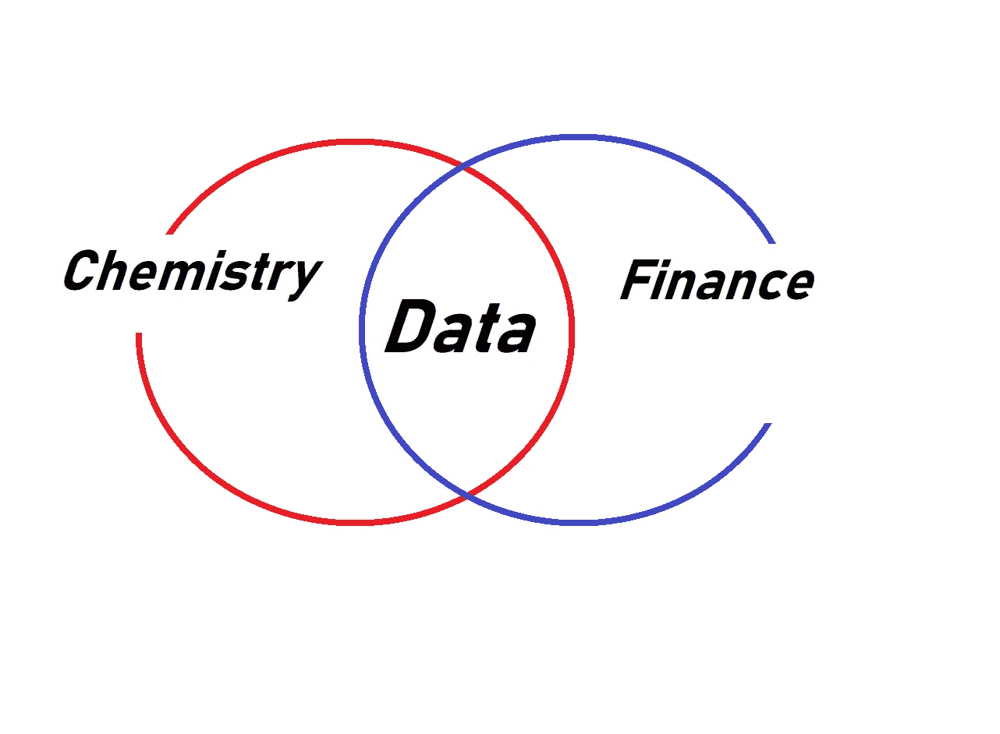
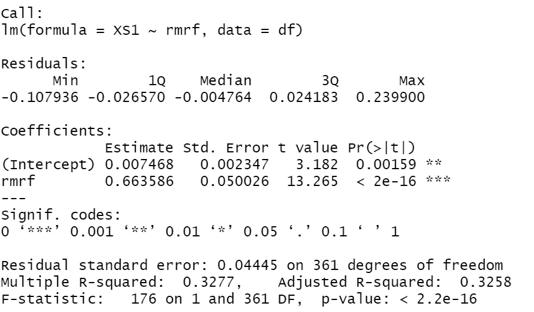

# 为什么到处都需要数据科学家？

> 原文：<https://pub.towardsai.net/why-data-scientists-are-needed-everywhere-fff07e821db5?source=collection_archive---------3----------------------->

## [职业生涯](https://towardsai.net/p/category/careers)

我一直在问自己，为什么数据科学是我们这个世纪最热门的工作之一？我在与一位化学博士研究员讨论线性回归时找到了这个问题的答案，他正在进行开发生物塑料的研究。所以答案在于统计学家使用的工具和技术的可扩展性。在我们的例子中，我将举一个线性回归及其威力的例子！！！

我会把这篇文章的标题改为**“化学和金融有什么共同点？”。**答案是数据！每个部门都有要研究的数据，这些数据是通过统计工具研究的。

# 化学科学家如何使用数据，金融分析师如何工作？

想象一下你想求出材料的反应温度，想通过加热温度更少，获得同样的结果来节约能量。你有你的相对观察。你运行你的统计软件(*通常是 R* )来绘制观察值，并画出 OLS ( *普通最小二乘法:是使观察数据和估计数据之间的误差最小化的线。*)。你发现回归是线性的，然后创建一个线性模型。然后你会发现，要达到同样的温度，可以接受的最低温度值是多少，这样你就可以用更少的能量。

另一个例子是用回归分析来找出什么变量触发了股票市场的超额收益。

求它的公式是 **Ri=α+βrm+e**
Ri-超额证券回报
α **-** 市场不波动时的回报(截距)
β-是市场波动率(斜率)
rm-解释变量(主要影响 Ri 的因素)
e-无法解释的回报(残差)

正极 B

这个例子展示了观察是如何构成的，以及变量对金融分析师的意义。

这是一个 R 生成代码的例子，我们在这里看到了在投资组合管理中使用的 CAPM 模型。我们有一个截击(阿尔法)。这是指市场不受任何波动的影响，是一种无风险区域。正阿尔法值对投资者有吸引力，正阿尔法值的证券被称为定价过低。
我们还有 rmrf(市场风险溢价=预期市场回报-无风险利率),这是我们的β值 0.66，是我们回归的斜率。对于投资者来说，这意味着当变量上升 1%时，我们将获得额外的 0.66%的回报，同样，当变量下降 1%时，我们将获得-0.66%的下降回报。

# 问题不同，但解决方案相似

所以最后，即使每个领域的问题完全不同，但是解决问题的工具是一样的。也许，这就是为什么数据科学家是 21 世纪最性感的工作。

*注意:我没有化学背景，无法检查一个博士提供的关于化学问题的信息的正确性。如果你认为应该修改，请在评论中告诉我。*