# 为什么我们需要神经网络中的激活函数？

> 原文：<https://pub.towardsai.net/why-do-we-need-activation-functions-in-neural-networks-4c7b0499365f?source=collection_archive---------0----------------------->

## [机器学习](https://towardsai.net/p/category/machine-learning)

## 由示例激发的激活功能

照片由[马里乌斯·马萨拉尔](https://unsplash.com/@marius?utm_source=unsplash&utm_medium=referral&utm_content=creditCopyText)在 [Unsplash](https://unsplash.com/s/photos/data?utm_source=unsplash&utm_medium=referral&utm_content=creditCopyText) 上拍摄

如果你正在读这篇文章，那么很可能你已经知道什么是神经网络，什么是激活函数，但是，一些关于机器学习的入门课程没有足够清楚地说明，为什么我们需要这些激活函数。我们需要它们吗？没有它们，神经网络还能工作吗？

让我们首先提醒自己一些关于神经网络的事情。它们通常在视觉上表示为类似图形的结构，如下所示:

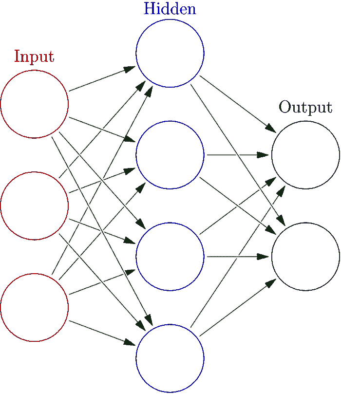

[图片](https://commons.wikimedia.org/wiki/File:Colored_neural_network.svg)由 Glosser.ca / CC BY-SA 在[维基共享](https://commons.wikimedia.org/)

上面表示为一个具有 3 层的神经网络:输入层、隐藏层和输出层，由 3、4 和 2 个神经元组成。
输入图层的结点数量与数据集的要素数量相同。对于隐藏层，您可以自由选择想要多少个节点，并且可以使用多个隐藏层。

除了输入层中的神经元之外，网络中的每个神经元都可以被认为是一个线性分类器，它将前一层中神经元的所有输出作为输入，并计算这些输出加上一个偏差项的加权和。然后，下一层中的神经元将把前一层线性分类器计算的值作为输入，然后计算这些值的加权和，等等。我们希望，通过以这种方式组合线性分类器，我们可以构建更复杂的分类器，这些分类器可以表示我们数据中的非线性模式。

让我们看一下下面的数据集示例:

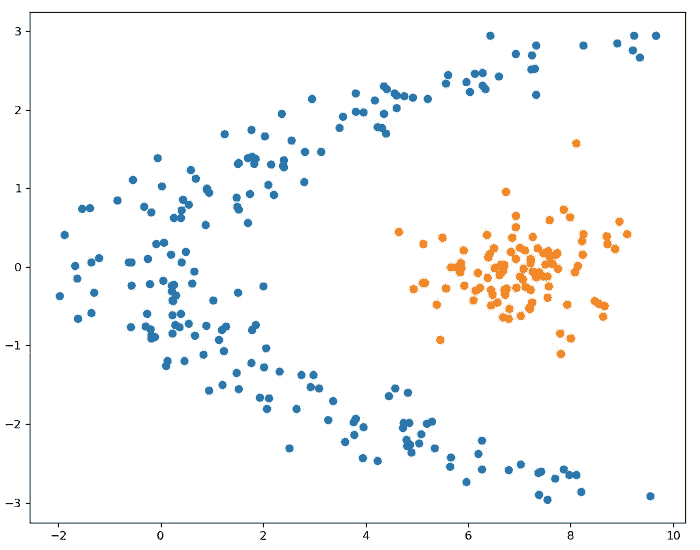

这个数据集不是线性可分的，我们不能用一条线将一个类与另一个类分开。但是我们可以通过使用 2 条线作为判定边界来进行这种分离。

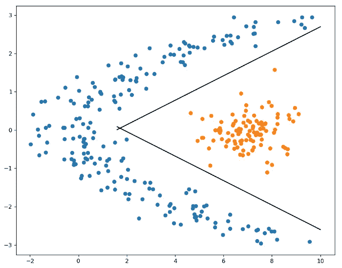

因此，我们可能认为两个中间神经元可以完成这项工作。这两个神经元将学习上图中的两条分隔线。然后，我们将需要一个输出神经元，它将把这两个先前的神经元作为输入，然后它将能够正确地进行分类。

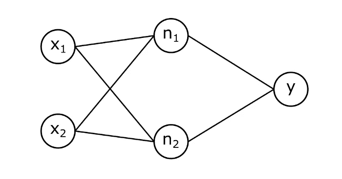

为了使最后一个神经元正确分类，如果我们将 n1 和 n2 个隐藏神经元绘制在 2d 平面上，则它们的输出需要是线性可分的。上面绘制的 2 条线具有以下等式:

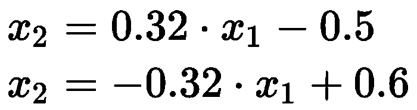

这意味着 2 个隐藏神经元正在计算输入 x1 和 x2 的以下线性组合:

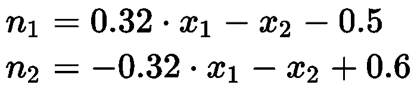

现在让我们画出 n1 和 n2，看看它们是否帮助了我们。

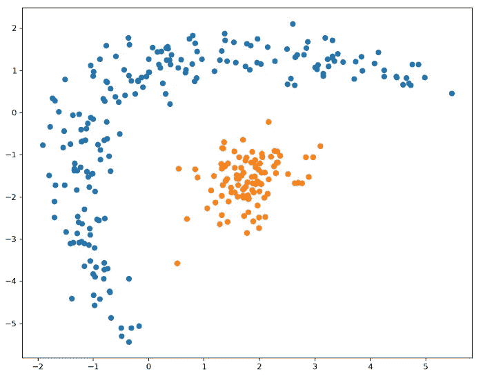

我们对我们小小的神经网络感到失望。n1 和 n2 的输出仍然不是线性可分的，因此输出神经元不能正确分类。那么，问题是什么呢？事情是这样的**任何线性函数的线性组合仍然是线性的**，在一张纸上说服自己这是真的并不困难。本文末尾有这一事实的证明。因此，*无论我们使用多少层或多少个神经元，按照我们迄今为止的方式，我们的神经网络仍然只是一个线性分类器。*

我们需要更多的东西。我们需要将每个神经元*计算出的加权和通过一个非线性函数*，然后将这个函数的输出视为那个神经元的输出。这些函数被称为**激活函数**，正如你将在本文中看到的，它们对于神经网络学习复杂的数据模式是必不可少的。

已经证明[1]具有 2 层(除了输入层)和非线性激活函数的神经网络可以逼近任何函数，只要它在那些层中具有足够大数量的神经元。那么，如果只有两层就足够了，为什么现在人们使用更深的网络呢？嗯，仅仅因为这些 2 层网络“能够”学习任何东西，并不意味着它们容易优化。在实践中，如果我们给我们的网络**过剩的容量**，他们会给我们足够好的解决方案，即使他们没有优化得尽可能好。

还有更多种类的激活函数，其中两种我们想在上面的例子中使用。它们是 ReLU(**Re**ctified**L**linear**U**nit)和 tanh(双曲正切)，如下所示。

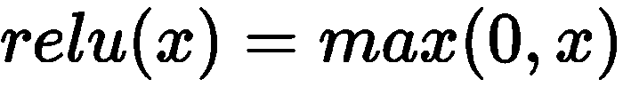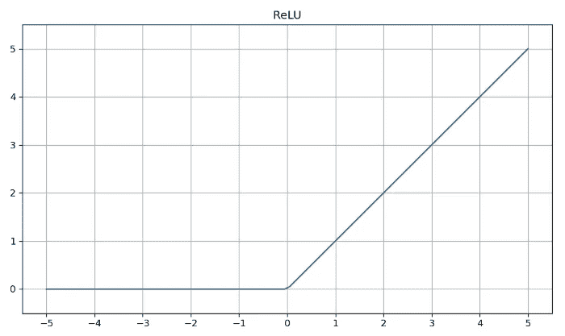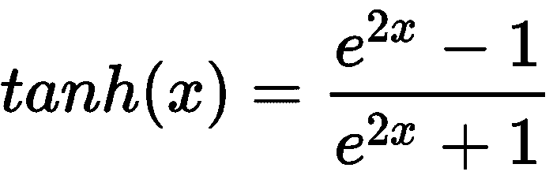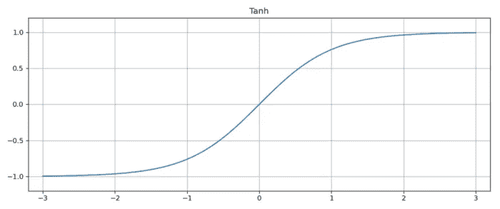

如果我们在例子中使用 ReLU 激活，会发生什么？下面绘制了施加 ReLU 激活后神经元 n1 和 n2 的输出。

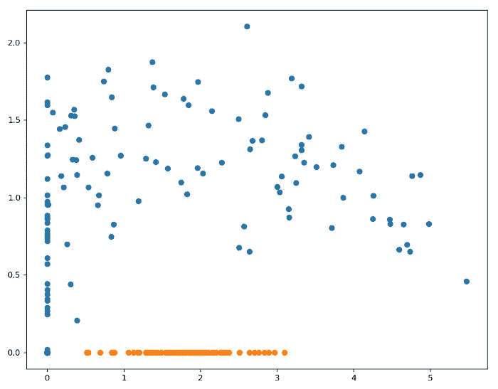

现在我们的两类点可以由一条线分开，因此输出神经元可以正确地对它们进行分类。

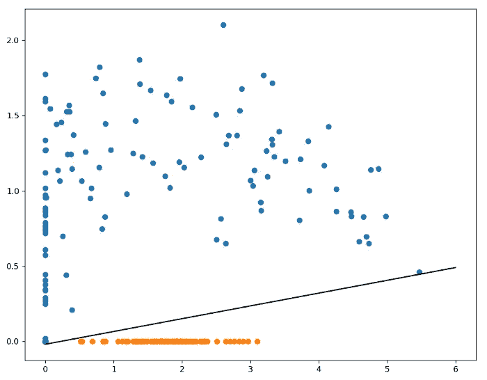

如果我们使用 tanh 激活，会发生类似的事情，但这次我们的点被更大的余量分开得更好。

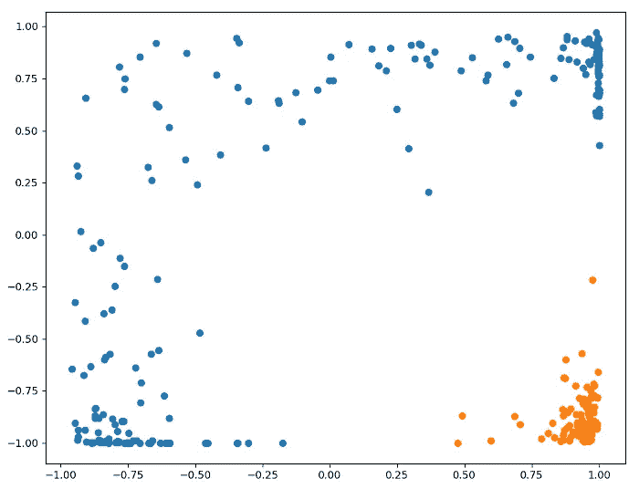

同样，输出神经元可以正确分类这些点。

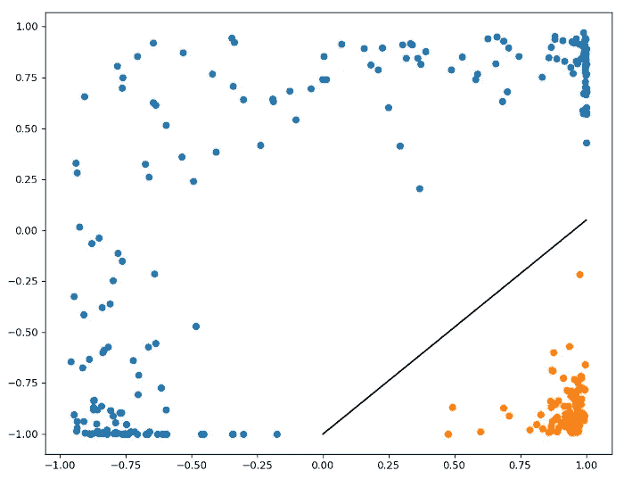

这里有一个简单的数学证明，证明了任何线性函数的线性组合仍然是线性的。

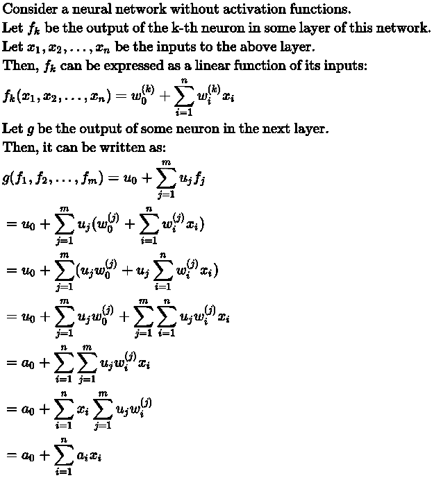

其中 a0，a1，…，an 是不依赖于输入 x1，…，xn 的常数。

## 参考

[1] Cybenko，G.V. (2006 年)。“通过叠加 s 形函数进行近似”。在范舒彭，简 h(编辑。).控制、信号和系统数学。斯普林格国际公司。第 303-314 页。

我希望这些信息对你有用，感谢你的阅读！

这篇文章也贴在我自己的网站[这里](https://www.nablasquared.com/why-do-we-need-activation-functions-in-neural-networks/)。随便看看吧！