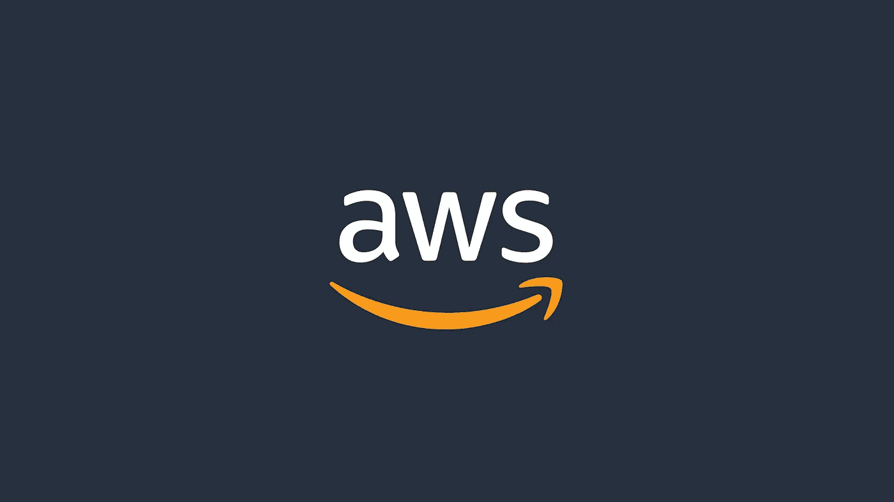
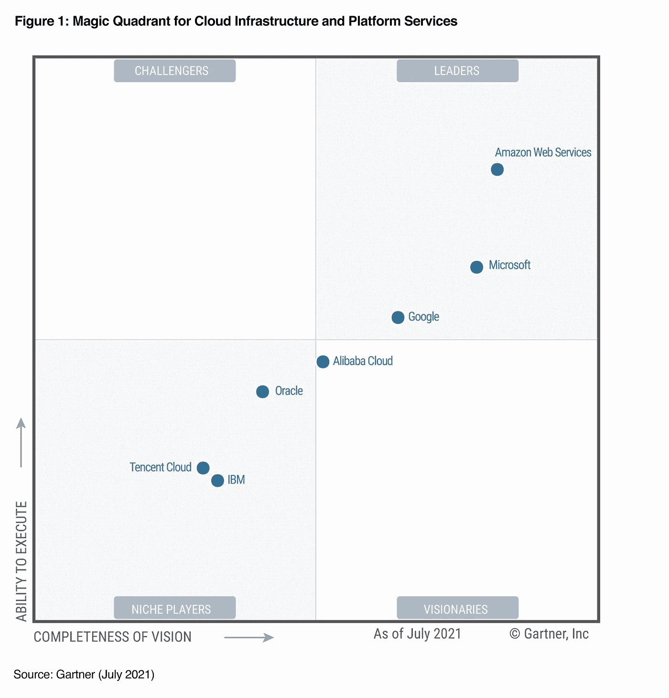

# 为什么我选择亚马逊网络服务(AWS)而不是其他云提供商

> 原文：<https://pub.towardsai.net/why-i-chose-amazon-web-services-aws-over-the-other-cloud-providers-ba6d1b010461?source=collection_archive---------1----------------------->

## [云计算](https://towardsai.net/p/category/cloud-computing)

## 你应该选择哪种云？

云是你在开发生涯中首先要做的选择之一，你真的不想出错。大部分时间不由你决定，你将要工作的每一个工作空间都可能有不同的选择。例如，我在安永(Ernst&Young)的部门部分使用微软 Azure，而我的前雇主使用谷歌云平台，而我的许多朋友使用甲骨文云基础设施。

> 加入我们在 discord 上的[免费编程社区，在 Python Kai 中结识其他程序员！](https://discord.com/invite/dG2D2zXeXB)

AWS 徽标

在两个不同的地方工作时，不太可能连续使用同一个云。然而，如果你是一名开发人员，并且仍然没有找到作为数据科学家的第一份正经工作，该怎么办？为了提高你的技能，让你的课程更有吸引力，你可以学习的最好的东西之一就是云。

## 有哪些选择？

以下是您可以选择的主要云选项:

*   亚马逊网络服务
*   谷歌云平台
*   微软 Azure
*   Oracle 云基础设施
*   IBM 云
*   阿里云
*   销售力量

当你选择云时，有几件事你可能要考虑。从长远来看，有了足够的经验，每一种云都有其利弊，但我主要考虑的是，如果你正在阅读这篇文章，你还没有下定决心。

## 价格

我想，你希望立即了解的关于云的最明智的特征是价格。要注册任何一家云提供商，你都必须使用信用卡，这样你甚至可以在开始之前就与自己和解。在缩放时，价格是一个更明智的论点，事实上，可能会有数百万的差异。当你很小，只需要运行几行代码来测试你的想法和项目的时候，云几乎没有区别。

然而，请记住，在任何云上的第一年，您可以从几个完全免费的服务中进行选择，直到您的免费积分过期。比如，AWS 会给你 750 小时免费运行一个虚拟机。

这些是您可能会尝试的服务:

*   数据库(SQL)
*   存储(NoSQL，文件)
*   虚拟机
*   建立工作关系网
*   无服务器计算

对于小型项目，您可能需要每月花费不到 1 美元来购买这些云。例如，我使用 EC2 实例(t2.nano)运行我自己的 discord bot 24/7，它每月花费我 4 美元，这是迄今为止我花费的最高值。

## 无代码接口

我写了几篇文章，完全反对无代码接口，因为我认为它们比原始编码复杂得多。当你必须为你的特定用途使用不同的软件时，这是真的(更不用说所有的注册和注册过程)。然而，云是不同的，主要是因为你同时拥有所有可用的服务。

这是 AWS 大放异彩的地方:例如，一个允许你直接在 AWS 上编码而不是从你的工作区发送代码的服务是 AWS Lambda。如果你有成千上万行代码，你必须使用包来发送你的代码，但是对于简单的实验来说，在 AWS 上编码使一切变得更容易。

只有当您扩展时，才需要编码来激活和管理云服务，无论您需要管理什么，都无法通过手动激活来完成。同样，如果你进行扩展，你可能会为你的项目花费数千甚至数百万美元，但事实并非如此。没有初学者通过原始代码开始与云交互，你不用担心。

## 它一直在进化

我们可以说每一朵云都在膨胀。这场竞赛现在将 AWS 视为领先者。微软已经对其云进行了大量投资，特别是改善其机器学习服务，但没有人知道这是否足以超越 AWS。

2021 年面向云提供商的 Gartner

尽管如此，Azure 仍然缺乏大多数让所有初学者都能使用 AWS 的无代码接口。随着时间的推移，特别是由于来自竞争的压力，每个云都在试图增加其规模，降低其价格，并在其服务包中包含更多的内容和服务。例如，几年前，文本识别 SAAS 被引入每个云中，只需点击几下鼠标就可以使用。

## 灵活性

哪种云最容易学？我会选择 AWS，不仅仅是因为它是我目前正在学习的云，比如相比谷歌云平台，它为你提供了非常直观的界面。

这是你要考虑的事情，以避免在学习新事物时经常感到沮丧。

# 结论

当您正在扩展并且需要花费数百万时，您可能有非常确切的理由选择哪种云，但是当您开始时，所有因素都可以将您指向同一个方向:选择最便宜和用户友好的云。