# 为什么相互作用的变量在线性模型中相乘

> 原文：<https://pub.towardsai.net/why-interacting-variables-are-multiplied-together-in-linear-models-69a54e18b47d?source=collection_archive---------2----------------------->

## [统计数据](https://towardsai.net/p/category/statistics)

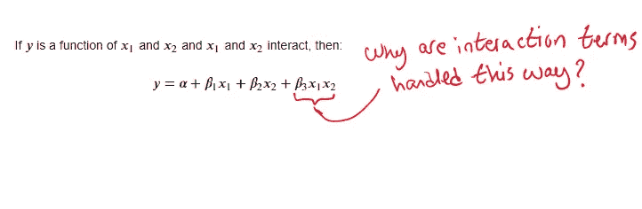

# 介绍

在本文中，我将解释为什么在建立线性模型时，如果我们认为变量 x₁和 x₂相互作用，我们会添加 x₁x₂项，并以添加相互作用项的原则方法结束。

本文内容基于[1]第八章。

我假设读者对线性模型的工作原理有一个基本的了解。

# 无交互模型

让我们从建立一个没有交互项的模型开始。

假设我们想将 y 建模为 x₁和 x₂.的函数然后，描述这种关系的线性模型是:

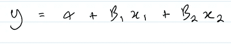

图 1:没有交互项的线性模型

我们分别称α为 x₁和 x₂的截距，β₁and β₂为斜率。

# 具有可变斜率的模型

假设我们认为 x₁的斜率实际上取决于 x₂.我们如何将这种信念融入到模型中？

由于我们使用的是线性模型，一种方法是将β₁建模为另一个线性模型，它是 x₂的函数，如下所示:

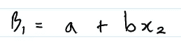

图 2:假设 x1 的斜率取决于 x2 的影响

将图 2 中的等式代入图 1，我们最终拟合出一个如下所示的模型:

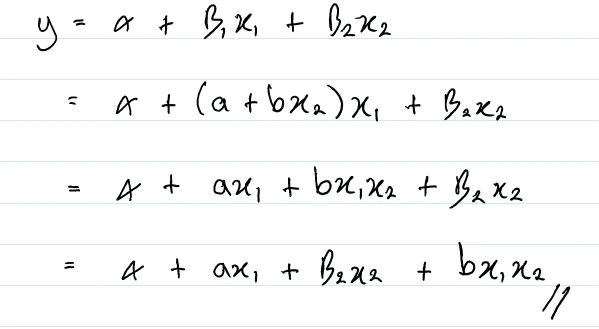

图 3:拟合一个假设 x₁效应取决于 x₂值的线性模型

图 3 中的模型与图 1 中的模型完全相同，只是多了一个术语，bx₁x₂.

这种建立线性模型的方式表明，相互作用项是假设 x₁对 y 的影响线性依赖于 x₂.的当前值的自然结果

# x₁依赖 x₂就像 x₂依赖 x₁一样

前一节建立在 x₁效应取决于 x₂.当前价值的假设上如果我们做了另一个方向的假设，即 x₂效应取决于 x₁的当前价值，会怎么样？

使用相同的方法，假设意味着:

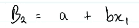

图 4:假设 x₂的斜率取决于 x₁

我们最终拟合出一个看起来像这样的模型:

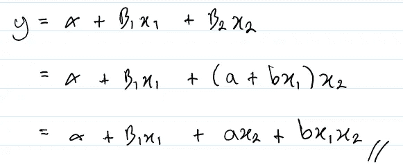

图 5:拟合一个假设 x₂效应依赖于 x₁值的线性模型

请注意，图 5 中的模型与图 4 中的模型相同(它们的不同之处仅在于分配给系数的名称)。

这是值得强调的一点，增加一个 x₁x₂术语并不能说明 x₁和 x₂.之间的因果关系

# 涉及两个以上变量的相互作用

这种添加交互项的方法表明，通过递归应用一个变量的斜率依赖于另一个变量的假设，可以得到涉及两个以上变量的交互。

例如，假设我们想要使用线性模型对 y 与 x₁、x₂和 x₃之间的关系进行建模。

现在，如果我们假设 x₁的斜率取决于 x₂，我们有:

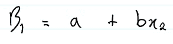

图 6:假设 x₁的斜率取决于 x₂

如果我们进一步假设图 6 中 x₂的斜率取决于 x₃，我们得到:

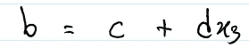

图 7:假设 x₂对`β₁ also depends on` x₃的影响

因此，鉴于:

图 8:将 y 建模为 x₁、x₂和 x₃的函数

我们最终会得到:

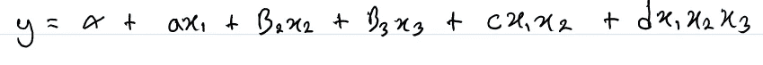

图 9:假设 x₁的影响取决于 x₂，而又取决于 x₃的模型

请注意图 9 中出现的三方交互术语(最右边的术语)。

如果我们假设一个不同的顺序，即 x₁的斜率依赖于 x₃，而依赖于 x₂，会怎么样？那么，鉴于:

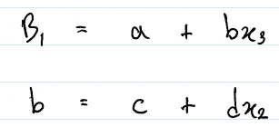

图 10:与图 8 相同的假设，除了顺序不同

我们将获得:

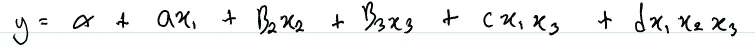

图 11:基于图 10 中假设的模型

注意，图 11 和图 9 中的模型是不同的。他们在第五学期有所不同。

# 结论

本文已经表明，相互作用项可以解释为一个假设，即一个特定变量的斜率依赖于另一个变量的值。

使用这种方法，我们有一个系统的方法来使用我们的领域知识来智能地添加交互项，而不是在我们的数据集中跟踪所有可能的变量组合。后一种方法可能导致模型过度拟合和/或给出错误的因果推断。

# 参考

[1]统计学再思考。麦克尔瑞斯。2020